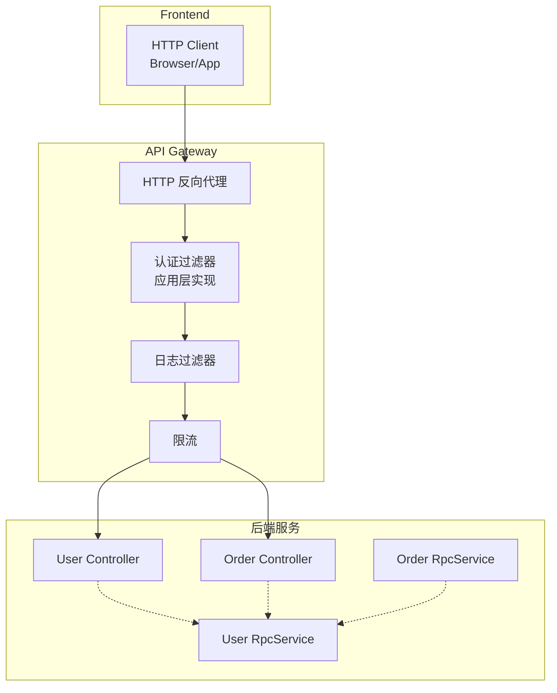
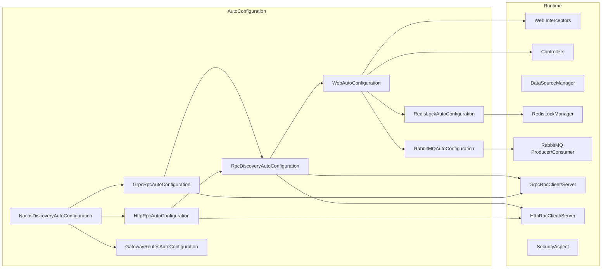

# AGENTS.md

本文件为编码类大模型（如 Codex）在本仓库中协作提供准确指引，内容与当前实现严格对齐。

## 项目概述

Nebula 是一个现代化的 Java 后端框架，基于 Spring Boot 3.x 与 Java 21 构建，提供企业级应用开发的完整解决方案。

## 技术栈

- `Java 21`
- `Spring Boot 3.5.8`
- `Maven`
- `MyBatis-Plus`
- `HikariCP` 连接池（数据持久化模块中使用）
- `Redis`（缓存与分布式锁）
- `RabbitMQ`（消息队列）
- `Elasticsearch`（搜索引擎）
- `MinIO` / `Aliyun OSS`（对象存储）
- `Nacos`（服务注册与发现）

## 架构层次

```
Nebula Framework
核心层 (Core)
  core/nebula-foundation          # 基础工具与异常处理
  core/nebula-security            # 安全认证与授权（JWT/RBAC）
基础设施层 (Infrastructure)
  data/                           # 数据访问
    nebula-data-persistence       # MyBatis-Plus 持久化
    nebula-data-mongodb           # MongoDB 支持（可选）
    nebula-data-cache             # 多级缓存
  messaging/
    nebula-messaging-core         # 消息抽象
    nebula-messaging-rabbitmq     # RabbitMQ 实现
  rpc/
    nebula-rpc-core               # RPC 抽象
    nebula-rpc-http               # HTTP RPC 实现
    nebula-rpc-grpc               # gRPC 实现
  discovery/
    nebula-discovery-core         # 服务发现核心
    nebula-discovery-nacos        # Nacos 实现
  storage/
    nebula-storage-core           # 存储抽象
    nebula-storage-minio          # MinIO 实现
    nebula-storage-aliyun-oss     # 阿里云 OSS 实现
  search/
    nebula-search-core            # 搜索抽象
    nebula-search-elasticsearch   # Elasticsearch 实现
  ai/
    nebula-ai-core                # AI 核心
    nebula-ai-spring              # Spring AI 集成
  lock/
    nebula-lock-core              # 锁抽象
    nebula-lock-redis             # 基于 Redis 的分布式锁
  gateway/
    nebula-gateway-core           # API网关核心（HTTP反向代理、日志、限流）
应用层 (Application)
  application/nebula-web          # Web 框架
  application/nebula-task         # 任务调度
自动配置层 (Auto-Configuration)
  autoconfigure/nebula-autoconfigure  # 统一自动配置
集成层 (Integration)
  integration/nebula-integration-payment     # 支付集成
  integration/nebula-integration-notification # 通知集成
启动器 (Starter)
  starter/nebula-starter-minimal   # 最小化 Starter（仅核心）
  starter/nebula-starter-web       # Web 应用 Starter
  starter/nebula-starter-service   # 微服务 Starter
  starter/nebula-starter-gateway   # API网关 Starter（HTTP反向代理）
  starter/nebula-starter-ai        # AI 应用 Starter
  starter/nebula-starter-all       # 完整 Starter（单体）
  starter/nebula-starter-api       # API 契约 Starter
```

## 开发命令

### 构建与安装
```bash
# 编译整个项目
mvn clean compile

# 安装所有模块到本地仓库（首次运行建议）
mvn install -DskipTests

# 仅编译特定模块（示例：foundation）
mvn clean compile -pl core/nebula-foundation

# 安装特定模块（示例：web）
mvn install -pl application/nebula-web -DskipTests
```

### 测试
```bash
# 运行全部测试
mvn test

# 运行特定模块测试（示例：nebula-web）
mvn test -pl application/nebula-web

# 运行单个测试类（示例：性能监控）
mvn test -Dtest=PerformanceMonitorTest -pl application/nebula-web

# 生成覆盖率报告（如需）
mvn test jacoco:report
```

### 运行与集成
仓库以框架组件为主，建议在你的业务应用中引入合适的 Starter（`nebula-starter-minimal/web/service/ai/all/api`）使用；配置入口与默认配置参考：
`autoconfigure/nebula-autoconfigure/src/main/resources/META-INF/spring/org.springframework.boot.autoconfigure.AutoConfiguration.imports`
`autoconfigure/nebula-autoconfigure/src/main/resources/application.yml`
```bash
# 确保所有模块安装到本地仓库
mvn install -DskipTests

# 在你的业务应用中运行（已引入 nebula-starter）
mvn spring-boot:run
```

## 模块依赖关系

### 依赖顺序建议
1. `core/nebula-foundation`
2. `core/nebula-security`
3. 基础设施模块（data/messaging/rpc/discovery/storage/search/ai/lock）
4. `application/nebula-web` 与 `application/nebula-task`
5. `autoconfigure/nebula-autoconfigure`
6. `starter/*`（根据场景选择 `nebula-starter-minimal`、`-web`、`-service`、`-ai`、`-all`、`-api`）

### 开发注意事项
- 通过 Maven 统一管理依赖，避免循环依赖
- 新功能优先在所属模块实现，保持接口向后兼容

## 配置管理

### 主要配置文件
- `application.yml`
- 自动配置入口：`META-INF/spring/org.springframework.boot.autoconfigure.AutoConfiguration.imports`
- 自动配置集中于 `autoconfigure/nebula-autoconfigure`

### 配置优先级
1. 命令行参数
2. 环境变量
3. 应用配置文件
4. Starter 默认值（`META-INF/nebula-defaults.properties`，由 `NebulaStarterDefaultsPostProcessor` 注入）
5. 框架默认配置

### 自动配置启用策略

框架采用三级启用策略（详见 `docs/nebula-framework-review.md` 第 10 章）：

| 级别 | matchIfMissing | 策略 | 适用范围 |
|------|---------------|------|---------|
| Level 1 | `true` | 默认启用 | Security（纯内存组件） |
| Level 2 | `false` | 默认禁用 | 需要外部服务（DB/Redis/MQ/ES） |
| Level 3 | `false` | 默认禁用 | 特定部署形态（RPC/Gateway/AI/Crawler） |

各 Starter 通过 `META-INF/nebula-defaults.properties` 为目标应用类型预置默认启用模块，
由 `NebulaStarterDefaultsPostProcessor`（`EnvironmentPostProcessor`）以最低优先级注入 Environment。
用户 `application.yml` 中的配置始终可以覆盖 Starter 默认值。

## 代码风格

### Java 代码规范
- 使用 4 空格缩进，类名 PascalCase，方法/变量 camelCase，常量 UPPER_SNAKE_CASE
- 推荐使用 Lombok 降低样板代码

### 包结构规范
```
io.nebula
  [模块]
    core          # 核心接口与抽象
    config        # 配置类
    service       # 服务实现
    repository    # 数据访问
    controller    # 控制器
    dto           # 传输对象
    entity        # 实体类
    exception     # 异常类
    util          # 工具类
```

## 调试与故障排除

### 常见问题
1. 依赖未安装：运行 `mvn install -DskipTests`
2. 端口冲突：检查 `8080` 端口占用
3. 数据库连接：确认数据库服务正常
4. 配置错误：核对 `application.yml` 格式

### 日志调试
```bash
# 启用详细日志
mvn spring-boot:run -Dlogging.level.io.nebula=DEBUG
```

## 部署与发布

### 版本管理
- 版本格式：`2.0.0-SNAPSHOT`
- 发布时移除 `-SNAPSHOT`
- 遵循语义化版本

### 发布到 Nexus
```bash
mvn clean deploy -P release     # 正式版本
mvn clean deploy                # 快照版本
```

## 扩展开发指南

### 添加新模块
1. 在父 `pom.xml` 中注册模块
2. 创建目录与基础结构
3. 实现核心接口与自动配置
4. 在 `autoconfigure` 中集中管理自动配置入口
5. 如需，对 `starter` 增加便捷依赖

### 集成第三方服务
1. 在相应基础设施模块中实现
2. 提供配置属性与自动配置
3. 添加健康检查与示例用法

## 监控与指标

- 性能监控拦截器：`application/nebula-web/src/main/java/io/nebula/web/interceptor/PerformanceMonitorInterceptor.java:15`
- 自动配置入口：`application/nebula-web/src/main/java/io/nebula/web/autoconfigure/WebAutoConfiguration.java:355`（性能监控器），`:373`（拦截器注册）
- 健康检查端点：`/health`, `/health/status`, `/health/component/{name}`, `/health/checkers`, `/health/last-results`, `/health/ping`, `/health/liveness`, `/health/readiness`
  - 参考：`application/nebula-web/src/main/java/io/nebula/web/controller/HealthController.java:31,57,72,89,103,111,123,136`
- 性能端点：`/performance/metrics`, `/performance/system`, `/performance/status`, `/performance/reset`
  - 参考：`application/nebula-web/src/main/java/io/nebula/web/controller/PerformanceController.java:37,66,96,131`
- 相关拦截器：限流拦截器注册 `application/nebula-web/src/main/java/io/nebula/web/autoconfigure/WebAutoConfiguration.java:214`，响应缓存拦截器注册 `:270`
- `Micrometer` 依赖已纳入 BOM，可在应用侧配合 Prometheus/Grafana；框架内置拦截器与端点满足常规监控需求。

## 安全最佳实践

- JWT 密钥（`nebula.security.jwt.secret`）**必须**由应用显式配置，长度不少于 32 字符，启动时校验
- `nebula-web` 模块中的 `JwtUtils` 已废弃（`@Deprecated`），请使用 `nebula-security` 模块的 `JwtService`
- CORS `allowedOrigins` 默认值为空数组，生产环境必须显式配置
- 爬虫模块 `trustAllCerts` 仅在非生产环境（dev/test/local profile）生效，生产环境自动忽略
- 密码哈希与敏感配置通过环境变量管理
- 启用 HTTPS 与依赖定期更新

## 模块核对提示词（LLM）

### Web 核心
- 打开 `WebAutoConfiguration`，确认限流、缓存、认证、数据脱敏、性能监控的 Bean 与拦截器在 `nebula.web.*` 配置条件下生效。
- 验证 `RateLimitInterceptor` 与 `MemoryRateLimiter` 的滑窗/阈值实现与键生成逻辑是否与文档一致。
- 验证 `ResponseCache`/`MemoryResponseCache` 是否仅对 `GET` 命中、TTL 管理正确、过滤器与拦截器顺序合理。
- 检查 `AuthInterceptor` 是否通过 `nebula.web.auth.*` 配置解析 JWT 并拦截未授权请求。
- 验证 `PerformanceMonitorInterceptor` 的忽略路径与慢请求阈值来源，以及端点返回字段。
- 核对健康与性能控制器的路由与响应格式。

### Messaging（RabbitMQ）
- 打开 `RabbitMQAutoConfiguration`，确认 ConnectionFactory、默认序列化器/路由器、交换机管理器、生产者/消费者 Bean 的启用条件与属性绑定。
- 在 `RabbitMQMessageConsumer` 验证 topic 交换机/队列绑定、手动 ack/nack 的行为、`subscribeWithTag` 使用 routing key 实现标签过滤。
- 验证延迟消息生产/消费的启用条件、属性注入与处理器注册。

### 服务发现（Nacos）
- 打开 `NacosDiscoveryAutoConfiguration`，确认使用 Binder 绑定 `nebula.discovery.nacos.*`，并在启用条件下创建发现与自动注册器。
- 在 `NacosServiceAutoRegistrar` 验证启动时注册、关闭时注销，并确认 `grpc.server.port` 写入 metadata。

### RPC（HTTP/gRPC）
- HTTP：在 `HttpRpcAutoConfiguration` 核对 RestTemplate 创建、超时设置、线程池执行器与客户端基地址；在 `HttpRpcClient` 检查类型转换与代理调用路径。
- gRPC：在 `GrpcRpcAutoConfiguration` 验证 `@AutoConfigureBefore` 优先序；在 `GrpcRpcClient` 查看 Channel 构建、负载均衡策略、请求超时与返回类型反序列化；在 `GrpcRpcServer` 验证 `@RpcService` 扫描与接口自动推导规则。

### RPC-发现整合
- 在 `RpcDiscoveryAutoConfiguration` 验证负载均衡策略选择与委托客户端优先级逻辑（使用 `@Primary` 的客户端：若 gRPC 启用则优先）。

### 分布式锁（Redis）
- 在 `RedisLockAutoConfiguration` 验证锁管理器与 `@Locked` 切面启用条件；在 `RedisLockManager` 检查公平锁/可重入锁选择与读写锁实现，`execute/tryExecute` 回调封装。

### 数据持久化（多数据源）
- 在 `DataSourceManager` 核对 Hikari 配置项、默认池参数、主数据源校验、连接测试与销毁逻辑。

### 基础响应
- 在 `Result` 验证 success/error 构造方法的代码与消息一致性、时间戳与请求 ID 字段。

### 安全
- 在 `SecurityAutoConfiguration` 核对注解切面 Bean 与启用条件，确保 `nebula.security.enabled` 生效。

### 存储服务（MinIO/OSS）
- 打开 `MinIOAutoConfiguration` 与 `AliyunOSSAutoConfiguration`，验证启用条件、客户端构建、连接测试与默认 Bucket 自动创建逻辑。
- 在 `StorageService` 核对统一接口方法覆盖：上传/下载/删除/复制/预签名URL/对象列表/桶管理/元数据/对象存在性。
- 在 `MinIOStorageService` 与 `AliyunOSSStorageService` 验证方法实现的异常封装与返回值字段。

### 搜索服务（Elasticsearch）
- 打开 `ElasticsearchAutoConfiguration`，验证 `RestClient`/`ElasticsearchClient` 创建、认证/连接池/SSL 配置，`SearchService` 注入。
- 在 `ElasticsearchSearchService` 检查索引管理、文档CRUD、分页/滚动查询、聚合与建议查询的实现与参数映射。

### AI 服务（Spring AI）
- 打开 `AIAutoConfiguration`，验证 OpenAI `ChatModel`/`EmbeddingModel`、`VectorStore`/`Chroma` 与 `ChatService`/`EmbeddingService`/`VectorStoreService` Bean 的启用条件与选项映射。
- 在 `SpringAIChatService` 与 `SpringAIEmbeddingService` 验证请求构造、响应解析、用量统计与异步接口；在 `SpringAIVectorStoreService` 验证批处理与重试逻辑。
- 核对 `SpringAIAutoConfigurationFilter` 排除默认 Spring AI 自动配置是否生效。

### 通知集成（SMS）
- 在 `NotificationProperties` 验证属性绑定；在 `SmsService` 核对短信发送与验证码接口；检查是否存在自动配置或需在应用侧自行装配实现。

### 任务调度
- 打开 `TaskAutoConfiguration`，验证 `TaskRegistry`/`TaskEngine` 注册；`TaskExecutorRegistryListener` 自动发现与注册 `TaskExecutor` 和带 `@TaskHandler` 的处理器；XXL-JOB 注册服务的启停条件。
- 在 `TimedTaskJobHandler` 与 `Every*Execute` 接口核对定时任务适配与 JobHandler 命名规范。

### API网关（Gateway）
- 打开 `GatewayRoutesAutoConfiguration`，验证 HTTP 代理路由自动配置、自定义路由配置、默认过滤器配置、CORS 配置。
- 在 `GatewayProperties` 核对配置结构：`LoggingConfig`、`RateLimitConfig`、`HttpProxyConfig`、`CorsConfig`。
- 在 `LoggingGlobalFilter` 验证 RequestId 生成、请求日志记录、慢请求标记逻辑。
- 在 `RateLimitKeyResolverConfig` 验证 IP/Path 限流策略的 KeyResolver 实现。
- 在 `GatewayRedisAutoConfiguration` 验证 Redis 限流连接工厂配置。
- **注意**：Gateway 基于微服务三原则优化，已移除 gRPC 桥接功能，仅保留 HTTP 反向代理能力。
- **认证说明**：JWT 认证已移至应用层实现，各应用应自行实现 `GlobalFilter` 进行 Token 验证。

### Starter（启动器）
- 各 Starter 通过 `META-INF/nebula-defaults.properties` 声明默认启用的模块，用户引入 Starter 即可开箱即用，无需重复声明 `enabled: true`。
- minimal：打开 `starter/nebula-starter-minimal/pom.xml`，确认仅包含 `nebula-foundation` 与 `nebula-autoconfigure`，以及基础 `spring-boot-starter`；不包含 web/rpc/messaging/discovery。无 defaults 文件。
- web：打开 `starter/nebula-starter-web/pom.xml`，确认依赖最小 Starter，并包含 `nebula-web`、`nebula-data-cache`，可选 `nebula-data-persistence`、`nebula-security`。默认启用：persistence, cache。
- service：打开 `starter/nebula-starter-service/pom.xml`，确认依赖 web Starter，并包含 `nebula-rpc-core/http/grpc(可选)`、`nebula-discovery-core/nacos(可选)`、`nebula-messaging-core/rabbitmq(可选)`、`nebula-lock-core/redis`、`nebula-task(可选)`。默认启用：persistence, cache, http-rpc, rpc-discovery, nacos, lock。
- gateway：打开 `starter/nebula-starter-gateway/pom.xml`，确认依赖 Spring Cloud Gateway 相关组件。默认启用：gateway, nacos。
- ai：打开 `starter/nebula-starter-ai/pom.xml`，确认依赖最小 Starter，并包含 `nebula-ai-core`、`nebula-ai-spring`、`nebula-data-cache`，以及可选 `spring-boot-starter-web/actuator`。默认启用：ai, cache。
- all：打开 `starter/nebula-starter-all/pom.xml`，确认几乎所有模块均已包含，并标识可选实现。默认启用：persistence, cache, http-rpc, rpc-discovery, nacos, lock, ai。
- api：打开 `starter/nebula-starter-api/pom.xml`，确认仅包含 `nebula-rpc-core`，并以 `provided` 方式引入 `spring-web` 与 `lombok`，同时包含 `jakarta.validation`。无 defaults 文件。

### 示例应用（examples）
- 所有示例统一位于 `examples/` 目录，使用 `${revision}` 引用框架版本。
- 打开 `examples/*-example/pom.xml`，核对父 `nebula-parent` 版本与 `relativePath`。
- 快速入门：
  - Web 示例：`mvn -q -f examples/starter-web-example spring-boot:run` 后访问 `http://localhost:8080/hello`
  - Service 示例：`mvn -q -f examples/starter-service-example spring-boot:run` 后访问 `http://localhost:8082/hello`
  - AI 示例：在 `application.yml` 设置 `nebula.ai.enabled=true` 与 `openai.api-key`，运行 `mvn -q -f examples/starter-ai-example spring-boot:run` 后访问 `http://localhost:8083/ai/echo?q=hello`
  - All 示例：`mvn -q -f examples/starter-all-example spring-boot:run` 后访问 `http://localhost:8084/hello`
  - Minimal 示例：`mvn -q -f examples/starter-minimal-example spring-boot:run`（无 Web 端点）
- 进阶示例：
  - 网关：`mvn -q -f examples/gateway-example spring-boot:run`（需 Nacos + Redis）
  - 异步 RPC：`examples/rpc-async-example/`（service + client 多模块）
  - 微服务：`examples/microservice-example/`（user-api/user-service/order-api/order-service 多模块）
  - 全功能：`examples/fullstack-example/`（展示所有模块综合用法）
  - OAuth：`examples/oauth-example/`（前后端分离，backend + frontend）

## 关键实现引用

- Web：
  - 限流拦截器定义 `application/nebula-web/src/main/java/io/nebula/web/interceptor/RateLimitInterceptor.java:22`
  - 内存限流器 `application/nebula-web/src/main/java/io/nebula/web/ratelimit/MemoryRateLimiter.java:14`
  - 响应缓存实现 `application/nebula-web/src/main/java/io/nebula/web/cache/MemoryResponseCache.java:16`
  - 认证拦截器定义 `application/nebula-web/src/main/java/io/nebula/web/interceptor/AuthInterceptor.java:25`
  - 性能监控拦截器定义 `application/nebula-web/src/main/java/io/nebula/web/interceptor/PerformanceMonitorInterceptor.java:15`
  - 性能监控器与拦截器注册 `application/nebula-web/src/main/java/io/nebula/web/autoconfigure/WebAutoConfiguration.java:355,373`
  - 健康端点 `application/nebula-web/src/main/java/io/nebula/web/controller/HealthController.java:57,72,89,103,111,123,136`
  - 性能端点 `application/nebula-web/src/main/java/io/nebula/web/controller/PerformanceController.java:37,66,96`
- Messaging（RabbitMQ）：
  - 自动配置入口 `autoconfigure/nebula-autoconfigure/src/main/java/io/nebula/autoconfigure/messaging/RabbitMQAutoConfiguration.java:35`
  - 默认序列化器/路由器 `.../RabbitMQAutoConfiguration.java:71,79`
  - 生产者/消费者 Bean 定义 `.../RabbitMQAutoConfiguration.java:109,117`
  - 延迟消息生产/消费 `.../RabbitMQAutoConfiguration.java:91,100`
  - 生产者类 `infrastructure/messaging/nebula-messaging-rabbitmq/src/main/java/io/nebula/messaging/rabbitmq/producer/RabbitMQMessageProducer.java:30`
  - 消费者类 `infrastructure/messaging/nebula-messaging-rabbitmq/src/main/java/io/nebula/messaging/rabbitmq/consumer/RabbitMQMessageConsumer.java:30`
- 服务发现（Nacos）：
  - 自动配置入口 `autoconfigure/nebula-autoconfigure/src/main/java/io/nebula/autoconfigure/discovery/NacosDiscoveryAutoConfiguration.java:27`
  - 发现实现 `infrastructure/discovery/nebula-discovery-nacos/src/main/java/io/nebula/discovery/nacos/NacosServiceDiscovery.java:28`
  - 自动注册器（含 gRPC 端口 metadata）`infrastructure/discovery/nebula-discovery-nacos/src/main/java/io/nebula/discovery/nacos/NacosServiceAutoRegistrar.java:86–90,30`
- RPC：
  - HTTP 自动配置 `autoconfigure/nebula-autoconfigure/src/main/java/io/nebula/autoconfigure/rpc/HttpRpcAutoConfiguration.java:41`
  - HTTP 客户端类 `infrastructure/rpc/nebula-rpc-http/src/main/java/io/nebula/rpc/http/client/HttpRpcClient.java:26`
  - gRPC 自动配置（优先）`autoconfigure/nebula-autoconfigure/src/main/java/io/nebula/autoconfigure/rpc/GrpcRpcAutoConfiguration.java:26`
  - gRPC 客户端/通道 `infrastructure/rpc/nebula-rpc-grpc/src/main/java/io/nebula/rpc/grpc/client/GrpcRpcClient.java:27,52–69`
  - gRPC 服务器/服务注册 `infrastructure/rpc/nebula-rpc-grpc/src/main/java/io/nebula/rpc/grpc/server/GrpcRpcServer.java:32,54–67,78–112`
  - RPC-发现整合 `autoconfigure/nebula-autoconfigure/src/main/java/io/nebula/autoconfigure/rpc/RpcDiscoveryAutoConfiguration.java:32,60–77`
- 分布式锁（Redis）：
  - 自动配置与切面 `autoconfigure/nebula-autoconfigure/src/main/java/io/nebula/autoconfigure/lock/RedisLockAutoConfiguration.java:26,41–46`
  - 锁管理器 `infrastructure/lock/nebula-lock-redis/src/main/java/io/nebula/lock/redis/RedisLockManager.java:23,45–55,63–71`
- 数据持久化：
  - 多数据源管理器 `infrastructure/data/nebula-data-persistence/src/main/java/io/nebula/data/persistence/datasource/DataSourceManager.java:24,70–85,90–123,160–169`
- 基础响应：
  - 统一响应 `core/nebula-foundation/src/main/java/io/nebula/core/common/result/Result.java:55–79,107–133,141–165`
- 安全：
  - 安全自动配置与切面 `core/nebula-security/src/main/java/io/nebula/security/config/SecurityAutoConfiguration.java:20,28–33`

- 存储：
  - MinIO 自动配置 `autoconfigure/nebula-autoconfigure/src/main/java/io/nebula/autoconfigure/storage/MinIOAutoConfiguration.java:44–79,81–101`
  - OSS 自动配置 `autoconfigure/nebula-autoconfigure/src/main/java/io/nebula/autoconfigure/storage/AliyunOSSAutoConfiguration.java:49–102,104–129,131–141`
  - 统一接口 `infrastructure/storage/nebula-storage-core/src/main/java/io/nebula/storage/core/StorageService.java:15–76,78–137`
  - MinIO 实现 `infrastructure/storage/nebula-storage-minio/src/main/java/io/nebula/storage/minio/MinIOStorageService.java:47–95,140–200,352–364`
  - OSS 实现 `infrastructure/storage/nebula-storage-aliyun-oss/src/main/java/io/nebula/storage/aliyun/oss/AliyunOSSStorageService.java:39–76,108–125,164–201,203–254`

- 搜索：
  - 自动配置 `autoconfigure/nebula-autoconfigure/src/main/java/io/nebula/autoconfigure/search/ElasticsearchAutoConfiguration.java:63–138,145–151,156–163,168–201`
  - 搜索服务实现 `infrastructure/search/nebula-search-elasticsearch/src/main/java/io/nebula/search/elasticsearch/service/ElasticsearchSearchService.java:45–60,62–81,83–110,111–120,343–375,497–530,581–599`

- AI：
  - 自动配置 `autoconfigure/nebula-autoconfigure/src/main/java/io/nebula/autoconfigure/ai/AIAutoConfiguration.java:75–89,95–117,123–139,145–177,182–214,219–236`
  - 自动配置过滤器 `autoconfigure/nebula-autoconfigure/src/main/java/io/nebula/autoconfigure/ai/SpringAIAutoConfigurationFilter.java:1–32`
  - 聊天服务 `infrastructure/ai/nebula-ai-spring/src/main/java/io/nebula/ai/spring/chat/SpringAIChatService.java:25,33–41,44–55,61–86,99–110`
  - 嵌入服务 `infrastructure/ai/nebula-ai-spring/src/main/java/io/nebula/ai/spring/embedding/SpringAIEmbeddingService.java:25,31–38,41–50,52–70,72–93,96–108,110–118`
  - 向量存储服务 `infrastructure/ai/nebula-ai-spring/src/main/java/io/nebula/ai/spring/vectorstore/SpringAIVectorStoreService.java:33–57,59–79,86–120`

- 集成：
  - 支付接口 `integration/nebula-integration-payment/src/main/java/io/nebula/integration/payment/core/PaymentService.java:11–82`
  - 支付自动配置 `integration/nebula-integration-payment/src/main/java/io/nebula/integration/payment/autoconfigure/PaymentAutoConfiguration.java:19–36`
  - 通知属性 `integration/nebula-integration-notification/src/main/java/io/nebula/notification/config/NotificationProperties.java:1–26`
  - 短信接口 `integration/nebula-integration-notification/src/main/java/io/nebula/notification/sms/SmsService.java:9–20`

- Gateway（API网关）：
  - 网关配置属性 `infrastructure/gateway/nebula-gateway-core/src/main/java/io/nebula/gateway/config/GatewayProperties.java`
  - 路由自动配置 `infrastructure/gateway/nebula-gateway-core/src/main/java/io/nebula/gateway/config/GatewayRoutesAutoConfiguration.java`
  - Redis限流自动配置 `infrastructure/gateway/nebula-gateway-core/src/main/java/io/nebula/gateway/config/GatewayRedisAutoConfiguration.java`
  - 限流Key解析器 `infrastructure/gateway/nebula-gateway-core/src/main/java/io/nebula/gateway/config/RateLimitKeyResolverConfig.java`
  - 日志过滤器 `infrastructure/gateway/nebula-gateway-core/src/main/java/io/nebula/gateway/filter/LoggingGlobalFilter.java`

- 自动配置环境后处理器：
  - Starter 默认值注入 `autoconfigure/nebula-autoconfigure/src/main/java/io/nebula/autoconfigure/env/NebulaStarterDefaultsPostProcessor.java`
  - 注册入口 `autoconfigure/nebula-autoconfigure/src/main/resources/META-INF/spring/org.springframework.boot.env.EnvironmentPostProcessor.imports`

- 启动器：
  - minimal `starter/nebula-starter-minimal/pom.xml:18–52`
  - web `starter/nebula-starter-web/pom.xml:18–55`，默认值 `starter/nebula-starter-web/src/main/resources/META-INF/nebula-defaults.properties`
  - service `starter/nebula-starter-service/pom.xml:18–94`，默认值 `starter/nebula-starter-service/src/main/resources/META-INF/nebula-defaults.properties`
  - gateway `starter/nebula-starter-gateway/pom.xml`，默认值 `starter/nebula-starter-gateway/src/main/resources/META-INF/nebula-defaults.properties`
  - ai `starter/nebula-starter-ai/pom.xml:18–68`，默认值 `starter/nebula-starter-ai/src/main/resources/META-INF/nebula-defaults.properties`
  - all `starter/nebula-starter-all/pom.xml:18–213`，默认值 `starter/nebula-starter-all/src/main/resources/META-INF/nebula-defaults.properties`
  - api `starter/nebula-starter-api/pom.xml:18–45`

- 示例应用：
  - minimal 示例 `examples/starter-minimal-example/pom.xml:7–17,20–26`
  - web 示例 `examples/starter-web-example/pom.xml:7–18,20–26`
  - service 示例 `examples/starter-service-example/pom.xml:7–18,20–26`
  - ai 示例 `examples/starter-ai-example/pom.xml:7–18,20–27`
  - all 示例 `examples/starter-all-example/pom.xml:7–18,20–26`
  - api 示例 `examples/starter-api-example/pom.xml:7–18,20–26`
## 验证执行顺序建议

1. 服务发现层（Nacos）
2. RPC 客户端（HTTP/gRPC）
3. RPC-发现整合与负载均衡
4. API 网关（Gateway - HTTP反向代理）
5. Web 核心（拦截器与控制器）
6. Messaging（RabbitMQ）
7. 分布式锁（Redis）
8. 数据持久化（多数据源）
9. 基础响应与安全
10. 存储服务（MinIO/OSS）
11. 搜索服务（Elasticsearch）
12. AI 服务（Spring AI）
13. 集成服务（支付/通知）

## 架构示意

### 微服务三原则

```
1. 前端接口通过 Controller 暴露（HTTP 代理）
2. 服务间接口通过 RpcClient 暴露（纯 RPC，无 HTTP 路径）
3. 服务间直接调用（不经过 Gateway）
```

### Gateway 架构



### 自动配置流程



## v2.0.1 关键变更（审查优化）

### API 兼容性变更
- `@io.nebula.messaging.core.annotation.MessageHandler` 已废弃，请使用 `@MessageListener`
- `@io.nebula.rpc.core.annotation.RpcClient`（注解）已废弃，请使用 `@RemoteService`
- `io.nebula.web.auth.JwtUtils` 已废弃，请使用 `io.nebula.security.jwt.JwtService`
- `nebula.security.jwt.secret` 不再有默认值，必须显式配置（>= 32 字符）
- CORS `allowedOrigins` 默认值从 `["*"]` 改为空数组

### Bug 修复
- RedisLock `lock()` 看门狗逻辑：启用看门狗时不再传入 leaseTime，确保 Redisson 自动续期生效
- RedisLock `tryLock()` 参数覆盖：调用方传入的 timeout 优先于 config
- `SpringAIChatService.chatStream(List/ChatRequest)` 不再丢弃 system/assistant 消息上下文
- `SpringAIChatService.isAvailable()` 不再发送真实 API 请求消耗 Token
- `SpringAIChatService.getCurrentModel()` 从配置读取而非硬编码
- `SpringAIVectorStoreService.count()` 改为抛出 `UnsupportedOperationException`
- `TaskAutoConfiguration` 移除冗余 `ObjectMapper` Bean 定义，避免与 Spring Boot 默认配置冲突

### 配置一致性
- Crawler（HTTP/Captcha）、Neo4jHealth 的 `matchIfMissing` 统一改为 `false`
- 新增 `nebula-starter-task`、`nebula-starter-mcp` 的 `nebula-defaults.properties`
- `nebula-starter-all` 的 defaults 补充 messaging、task、websocket

### 性能优化
- `MemoryRateLimiter` 改为 CAS 无锁化 + 自动定时清理过期条目
- `MinIOStorageService` 增加桶存在状态缓存，避免每次上传都调用 `bucketExists`
- `ProxyPool` 使用 `ThreadLocalRandom` 替代共享 `Random`
- `InMemoryCookieStore` 增加惰性过期清理机制

### 架构改进
- 实现类（MinIOStorageService、AliyunOSSStorageService、ElasticsearchSearchService、SpringAIChatService）移除冗余 `@Service` 注解，统一由 AutoConfiguration 管理
- 爬虫 `HttpCrawlerEngine` SSL trustAll 增加环境检查，生产环境自动拒绝
