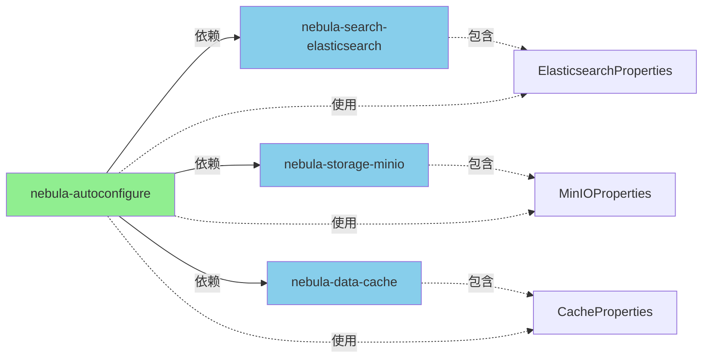

# Properties 类迁移总结

## 背景

在之前的架构设计中，我们将所有 AutoConfiguration 类和 Properties 类都迁移到了 `nebula-autoconfigure` 模块。然而，这导致了**循环依赖**问题：

```
nebula-autoconfigure (包含Properties) 
    ↓ 依赖
nebula-search-elasticsearch (使用Properties) 
    ↑ 被依赖
nebula-autoconfigure
```

## 解决方案

采用 **方案 A：Properties 类保留在各自模块中**

这是 Spring Boot 生态系统的标准做法，例如：
- `spring-boot-autoconfigure` 中的 `RedisAutoConfiguration` 使用 `spring-data-redis` 模块中的 `RedisProperties`
- AutoConfiguration 类统一管理在 `nebula-autoconfigure` 模块
- Properties 类保留在各自的功能模块中

## 迁移详情

### 1. Properties 类迁移

| Properties 类 | 原路径 | 新路径 |
|--------------|--------|--------|
| `ElasticsearchProperties` | `nebula-autoconfigure/...search/` | `nebula-search-elasticsearch/.../config/` |
| `MinIOProperties` | `nebula-autoconfigure/...storage/` | `nebula-storage-minio/.../config/` |
| `AliyunOSSProperties` | `nebula-autoconfigure/...storage/` | `nebula-storage-aliyun-oss/.../config/` |
| `CacheProperties` | `nebula-autoconfigure/...data/` | `nebula-data-cache/.../config/` |
| `RabbitMQProperties` | `nebula-autoconfigure/...messaging/` | `nebula-messaging-rabbitmq/.../config/` |

### 2. AutoConfiguration 类更新

所有 AutoConfiguration 类的 import 语句已更新，指向新的 Properties 类路径：

- `ElasticsearchAutoConfiguration` → 导入 `io.nebula.search.elasticsearch.config.ElasticsearchProperties`
- `MinIOAutoConfiguration` → 导入 `io.nebula.storage.minio.config.MinIOProperties`
- `AliyunOSSAutoConfiguration` → 导入 `io.nebula.storage.aliyun.oss.config.AliyunOSSProperties`
- `CacheAutoConfiguration` → 导入 `io.nebula.data.cache.config.CacheProperties`
- `RabbitMQAutoConfiguration` → 导入 `io.nebula.messaging.rabbitmq.config.RabbitMQProperties`

### 3. Service 类更新

相关的 Service 实现类也已更新：

- `ElasticsearchSearchService` → 导入 `io.nebula.search.elasticsearch.config.ElasticsearchProperties`

### 4. DataPersistenceAutoConfiguration 清理

移除了已迁移的 AutoConfiguration 类的 `@Import`：

```java
// 移除前
@Import({
    MyBatisPlusConfiguration.class,
    DataSourceManager.class,
    io.nebula.data.persistence.readwrite.autoconfigure.ReadWriteDataSourceAutoConfiguration.class,
    io.nebula.data.persistence.sharding.autoconfigure.ShardingSphereAutoConfiguration.class
})

// 移除后
@Import({
    MyBatisPlusConfiguration.class,
    DataSourceManager.class
})
```

这些 AutoConfiguration 类现在通过 Spring Boot 的自动配置机制自动加载。

## 架构优势

### ✅ 避免循环依赖
- AutoConfiguration 类在 `nebula-autoconfigure`
- Properties 类在各自的功能模块
- 功能模块的 Service 类可以直接使用本模块的 Properties

### ✅ 符合 Spring Boot 标准
- 遵循 Spring Boot 官方推荐的模块划分方式
- 易于理解和维护

### ✅ 模块职责清晰
- **nebula-autoconfigure**: 统一管理所有自动配置逻辑
- **功能模块**: 专注于核心功能实现，Properties 作为配置的一部分

### ✅ 依赖关系简洁


## 验证结果

✅ **nebula-autoconfigure 模块**：编译成功  
✅ **所有依赖模块**：编译成功  
✅ **nebula-example 应用**：编译成功  

## 下一步

1. **运行时验证**：启动 `nebula-example` 应用，验证自动配置工作正常
2. **功能测试**：
   - 验证 Discovery 功能（Nacos 服务注册）
   - 验证 RPC 功能（HTTP 和 gRPC 调用）
   - 验证 Data 功能（数据持久化、缓存）
   - 验证 Messaging 功能（RabbitMQ）
   - 验证 Storage 功能（MinIO、Aliyun OSS）
   - 验证 Search 功能（Elasticsearch）

## 文件更改统计

- **新增文件**: 5 个 Properties 类（在各自模块的 config 包下）
- **修改文件**: 6 个 AutoConfiguration 类（import 语句更新）
- **修改文件**: 1 个 Service 类（ElasticsearchSearchService）
- **修改文件**: 1 个 AutoConfiguration 类（DataPersistenceAutoConfiguration，移除 @Import）
- **删除文件**: 5 个 Properties 类（从 nebula-autoconfigure 中删除）

## 总结

通过将 Properties 类回退到各自的功能模块，我们成功解决了循环依赖问题，同时保持了架构的清晰性和可维护性。这种设计遵循了 Spring Boot 的最佳实践，为后续的功能扩展和维护奠定了良好的基础。

