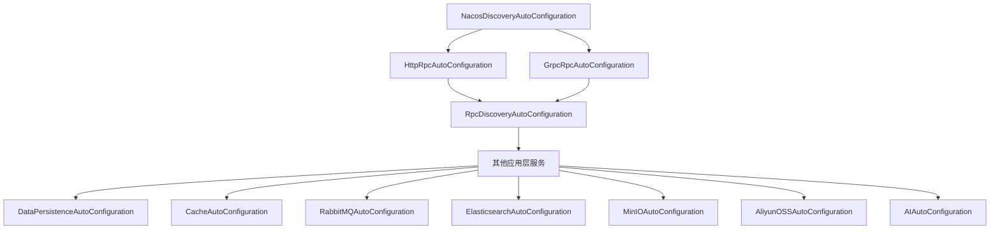

# Nebula AutoConfiguration 模块

##  模块简介

`nebula-autoconfigure` 是 Nebula 框架的统一自动配置模块，负责管理所有基础设施模块的 Spring Boot 自动配置通过集中管理自动配置类，实现了更清晰的依赖关系更可控的初始化顺序，以及更易于维护的架构

##  核心价值

### 统一配置管理
- **集中式配置**：所有自动配置类集中在一个模块中，便于统一管理和维护
- **明确的依赖关系**：通过 `@AutoConfigureAfter` 和 `@AutoConfigureBefore` 明确定义初始化顺序
- **避免循环依赖**：集中管理消除了模块间的循环依赖问题

### 更好的开发体验
- **零配置启动**：应用只需引入一个 `nebula-autoconfigure` 依赖即可自动配置所有功能
- **按需加载**：通过条件注解实现功能的按需自动配置
- **易于测试**：统一的配置模块使得集成测试更加简单

### 架构优势
- **模块解耦**：基础模块专注于核心功能实现，配置逻辑分离到独立模块
- **版本一致性**：统一管理所有自动配置，确保版本兼容性
- **易于扩展**：新增功能模块时，只需在此模块添加对应的自动配置类

## ️ 模块结构

```
nebula-autoconfigure/
 pom.xml                                  # 模块依赖定义
 README.md                                # 本文档
 MIGRATION_PLAN.md                        # 迁移计划文档
 IMPLEMENTATION_STATUS.md                 # 实施状态文档
 src/main/
     java/io/nebula/autoconfigure/
        discovery/                       # 服务发现自动配置
           NacosDiscoveryAutoConfiguration.java
        rpc/                             # RPC 自动配置
           RpcDiscoveryAutoConfiguration.java
           RpcDiscoveryProperties.java
           HttpRpcAutoConfiguration.java
           GrpcRpcAutoConfiguration.java
        data/                            # 数据访问自动配置
           DataPersistenceAutoConfiguration.java
           ReadWriteDataSourceAutoConfiguration.java
           ShardingSphereAutoConfiguration.java
           CacheAutoConfiguration.java
        messaging/                       # 消息传递自动配置
           RabbitMQAutoConfiguration.java
        search/                          # 搜索服务自动配置
           ElasticsearchAutoConfiguration.java
        storage/                         # 存储服务自动配置
           MinIOAutoConfiguration.java
           AliyunOSSAutoConfiguration.java
        ai/                              # AI 服务自动配置
            AIAutoConfiguration.java
     resources/META-INF/spring/
         org.springframework.boot.autoconfigure.AutoConfiguration.imports
```

##  快速开始

### 1. 添加依赖

在应用的 `pom.xml` 中添加依赖：

```xml
<dependency>
    <groupId>io.nebula</groupId>
    <artifactId>nebula-autoconfigure</artifactId>
    <version>2.0.1-SNAPSHOT</version>
</dependency>
```

### 2. 添加功能模块依赖

根据需要添加具体的功能模块依赖（自动配置会自动生效）：

```xml
<!-- 服务发现 -->
<dependency>
    <groupId>io.nebula</groupId>
    <artifactId>nebula-discovery-nacos</artifactId>
</dependency>

<!-- RPC 通信 -->
<dependency>
    <groupId>io.nebula</groupId>
    <artifactId>nebula-rpc-http</artifactId>
</dependency>

<!-- 数据持久化 -->
<dependency>
    <groupId>io.nebula</groupId>
    <artifactId>nebula-data-persistence</artifactId>
</dependency>

<!-- 其他模块... -->
```

### 3. 配置应用

在 `application.yml` 中配置所需功能：

```yaml
nebula:
  # 服务发现配置
  discovery:
    nacos:
      enabled: true
      server-addr: localhost:8848
      namespace: dev
      
  # RPC 配置
  rpc:
    http:
      enabled: true
    grpc:
      enabled: true
    discovery:
      enabled: true
      
  # 数据访问配置
  data:
    persistence:
      enabled: true
    cache:
      enabled: true
```

### 4. 启动应用

启动应用后，所有配置的功能模块将自动初始化并可用

##  初始化顺序

自动配置类按以下顺序初始化，确保依赖关系正确：



### 初始化层级说明

#### 第一层：服务发现（Discovery）
- **NacosDiscoveryAutoConfiguration** - 最先初始化，为其他服务提供服务发现能力

#### 第二层：RPC 客户端实现
- **HttpRpcAutoConfiguration** - HTTP RPC 客户端
- **GrpcRpcAutoConfiguration** - gRPC 客户端

#### 第三层：RPC 与发现集成
- **RpcDiscoveryAutoConfiguration** - 集成 RPC 客户端与服务发现，依赖前两层

#### 第四层：应用层服务
- **DataPersistenceAutoConfiguration** - 数据持久层
- **ReadWriteDataSourceAutoConfiguration** - 读写分离
- **ShardingSphereAutoConfiguration** - 分库分表
- **CacheAutoConfiguration** - 缓存服务
- **RabbitMQAutoConfiguration** - 消息队列
- **ElasticsearchAutoConfiguration** - 搜索服务
- **MinIOAutoConfiguration** - MinIO 对象存储
- **AliyunOSSAutoConfiguration** - 阿里云 OSS
- **AIAutoConfiguration** - AI 服务（聊天嵌入向量存储）

##  配置详解

### 1. Discovery 配置

```yaml
nebula:
  discovery:
    nacos:
      enabled: true                    # 启用 Nacos 服务发现
      server-addr: localhost:8848      # Nacos 服务器地址
      username: nacos                  # 用户名
      password: nacos                  # 密码
      namespace: dev                   # 命名空间
      group-name: DEFAULT_GROUP        # 分组名
      auto-register: true              # 自动注册服务
```

### 2. RPC 配置

```yaml
nebula:
  rpc:
    # HTTP RPC 配置
    http:
      enabled: true
      client:
        connect-timeout: 30000
        read-timeout: 60000
    
    # gRPC 配置
    grpc:
      enabled: true
      server:
        port: 9090
      client:
        target: localhost:9090
    
    # RPC 与 Discovery 集成
    discovery:
      enabled: true
      load-balance-strategy: ROUND_ROBIN
```

### 3. Data 配置

```yaml
nebula:
  data:
    # 数据持久化配置
    persistence:
      enabled: true
      sources:
        primary:
          type: mysql
          url: jdbc:mysql://localhost:3306/nebula
          username: root
          password: password
    
    # 缓存配置
    cache:
      enabled: true
      type: multi-level
      redis:
        host: localhost
        port: 6379
```

### 4. Messaging 配置

```yaml
nebula:
  messaging:
    rabbitmq:
      enabled: true
      host: localhost
      port: 5672
      username: guest
      password: guest
```

### 5. Search 配置

```yaml
nebula:
  search:
    elasticsearch:
      enabled: true
      uris:
        - http://localhost:9200
      username: elastic
      password: changeme
```

### 6. Storage 配置

```yaml
nebula:
  storage:
    # MinIO 配置
    minio:
      enabled: true
      endpoint: http://localhost:9000
      access-key: minioadmin
      secret-key: minioadmin
    
    # 阿里云 OSS 配置
    aliyun-oss:
      enabled: true
      endpoint: oss-cn-hangzhou.aliyuncs.com
      access-key-id: your-key
      access-key-secret: your-secret
```

### 7. AI 配置

```yaml
nebula:
  ai:
    enabled: true
    # 聊天配置
    chat:
      default-provider: openai
      providers:
        openai:
          api-key: ${OPENAI_API_KEY}
          model: gpt-3.5-turbo
          options:
            temperature: 0.7
            max-tokens: 1000
    
    # 嵌入配置
    embedding:
      default-provider: openai
      providers:
        openai:
          api-key: ${OPENAI_API_KEY}
          model: text-embedding-ada-002
    
    # 向量存储配置
    vector-store:
      default-provider: chroma
      providers:
        chroma:
          host: localhost
          port: 8000
          collection-name: nebula-docs
```

##  迁移指南

### 从早期版本迁移

如果您正在从 Nebula 2.0.0 或更早版本升级到 2.0.1+，请按照以下步骤操作：

#### 1. 更新依赖

**移除**：旧版本中各模块独立引入的依赖（如果有）
```xml
<!-- 不再需要单独引入基础模块 -->
<!-- <dependency>
    <groupId>io.nebula</groupId>
    <artifactId>nebula-discovery-nacos</artifactId>
</dependency> -->
```

**添加**：统一的自动配置模块
```xml
<!-- 新增统一自动配置依赖 -->
<dependency>
    <groupId>io.nebula</groupId>
    <artifactId>nebula-autoconfigure</artifactId>
    <version>2.0.1-SNAPSHOT</version>
</dependency>

<!-- 按需添加功能模块 -->
<dependency>
    <groupId>io.nebula</groupId>
    <artifactId>nebula-discovery-nacos</artifactId>
    <version>2.0.1-SNAPSHOT</version>
</dependency>
```

#### 2. 清理自定义配置

移除应用中手动创建的自动配置类（如果有）：

```java
// 旧版本：手动配置（不再需要）
// @Configuration
// public class NacosConfig {
//     @Bean
//     public ServiceDiscovery serviceDiscovery() {
//         // 手动配置...
//     }
// }
```

#### 3. 验证配置

确保 `application.yml` 中的配置项仍然有效大部分配置项保持不变，但建议查阅各模块的 README 确认

#### 4. 测试应用

启动应用并验证所有功能正常工作：
- 检查服务发现是否正常
- 测试 RPC 调用功能
- 验证数据访问功能
- 确认其他集成服务工作正常

##  常见问题

### Q1: 为什么需要统一的自动配置模块？

**A**: 统一自动配置模块带来以下好处：
1. **明确的初始化顺序**：避免了模块间的循环依赖和初始化顺序问题
2. **更好的维护性**：集中管理所有自动配置，便于版本升级和问题排查
3. **简化应用配置**：应用只需引入一个依赖即可获得所有自动配置能力

### Q2: 如何禁用某个自动配置？

**A**: 使用 Spring Boot 的标准方式禁用：

```yaml
spring:
  autoconfigure:
    exclude:
      - io.nebula.autoconfigure.rpc.GrpcRpcAutoConfiguration
```

或在启动类上：

```java
@SpringBootApplication(exclude = {GrpcRpcAutoConfiguration.class})
public class Application {
    // ...
}
```

### Q3: 如何自定义某个自动配置的行为？

**A**: 通过定义相同类型的 Bean 覆盖默认配置：

```java
@Configuration
public class CustomRpcConfig {
    
    @Bean
    @Primary
    public RpcClient customRpcClient() {
        // 自定义 RPC 客户端实现
        return new MyCustomRpcClient();
    }
}
```

### Q4: 自动配置失败如何排查？

**A**: 
1. 启用 Spring Boot 的自动配置报告：
   ```yaml
   logging:
     level:
       org.springframework.boot.autoconfigure: DEBUG
   ```

2. 检查启动日志中的 `Positive matches` 和 `Negative matches` 部分

3. 确认必要的依赖是否已添加

4. 验证配置文件中的配置项是否正确

### Q5: 可以选择性地使用某些功能吗？

**A**: 可以！自动配置采用条件注解实现：
- 只添加需要的功能模块依赖
- 只配置需要启用的功能（通过 `enabled` 属性）
- 未添加的模块不会被初始化

##  最佳实践

### 1. 按需引入功能模块

只引入应用实际需要的功能模块依赖，避免不必要的资源占用：

```xml
<!-- 只引入需要的模块 -->
<dependency>
    <groupId>io.nebula</groupId>
    <artifactId>nebula-autoconfigure</artifactId>
</dependency>
<dependency>
    <groupId>io.nebula</groupId>
    <artifactId>nebula-rpc-http</artifactId>
</dependency>
<dependency>
    <groupId>io.nebula</groupId>
    <artifactId>nebula-data-persistence</artifactId>
</dependency>
```

### 2. 使用环境特定配置

为不同环境使用不同的配置文件：

```
application.yml           # 通用配置
application-dev.yml       # 开发环境
application-test.yml      # 测试环境
application-prod.yml      # 生产环境
```

### 3. 启用健康检查

利用 Spring Boot Actuator 监控自动配置状态：

```yaml
management:
  endpoints:
    web:
      exposure:
        include: health,info,conditions
```

### 4. 日志配置

为关键模块配置适当的日志级别：

```yaml
logging:
  level:
    io.nebula.autoconfigure: INFO
    io.nebula.discovery: DEBUG      # 调试时启用
    io.nebula.rpc: DEBUG              # 调试时启用
```

##  相关文档

- [迁移计划文档](MIGRATION_PLAN.md)
- [实施状态文档](IMPLEMENTATION_STATUS.md)
- [Nebula 框架使用指南](../../docs/Nebula框架使用指南.md)
- [各功能模块 README](../../infrastructure/)
  - [Nacos Discovery](../../infrastructure/discovery/nebula-discovery-nacos/README.md)
  - [HTTP RPC](../../infrastructure/rpc/nebula-rpc-http/README.md)
  - [gRPC](../../infrastructure/rpc/nebula-rpc-grpc/README.md)
  - [Data Persistence](../../infrastructure/data/nebula-data-persistence/README.md)
  - [Data Cache](../../infrastructure/data/nebula-data-cache/README.md)
  - [Messaging RabbitMQ](../../infrastructure/messaging/nebula-messaging-rabbitmq/README.md)
  - [Search Elasticsearch](../../infrastructure/search/nebula-search-elasticsearch/README.md)

##  贡献指南

欢迎提交 Issue 和 Pull Request 来帮助改进这个模块

##  许可证

本项目基于 MIT 许可证开源

---

**版本**: 2.0.1-SNAPSHOT  
**最后更新**: 2025-01-11

