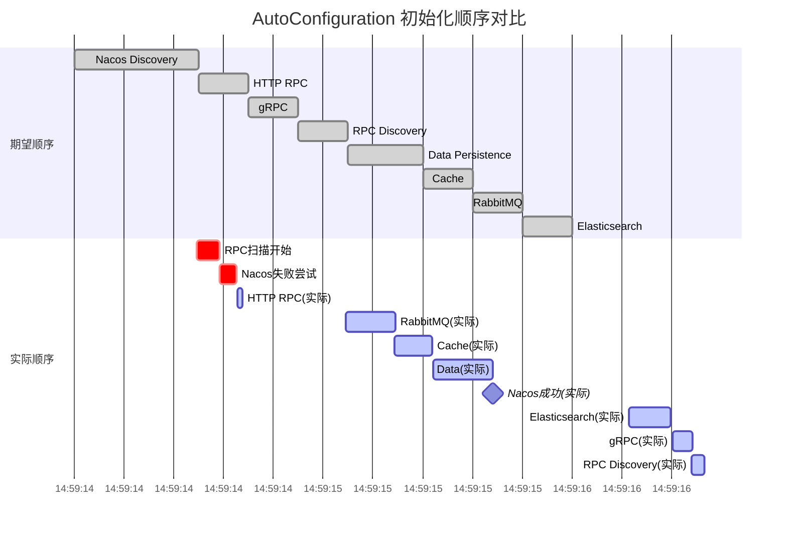
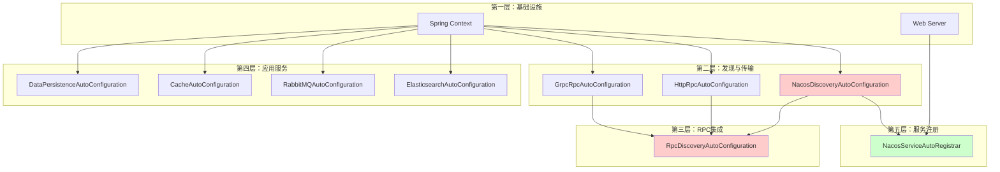

# Nebula AutoConfiguration 启动顺序分析报告

##  概述

本报告分析 `nebula-example` 应用的实际启动顺序，对比 `AutoConfiguration.imports` 中的期望顺序，识别差异并说明原因

**分析日期**：2025-10-11  
**应用版本**：nebula-example 2.0.0-SNAPSHOT  
**框架版本**：Nebula Framework 2.0.0-SNAPSHOT

---

##  期望启动顺序

根据 `nebula-autoconfigure/src/main/resources/META-INF/spring/org.springframework.boot.autoconfigure.AutoConfiguration.imports` 文件定义：

```
1. NacosDiscoveryAutoConfiguration          # 服务发现层
2. HttpRpcAutoConfiguration                  # HTTP RPC 客户端
3. GrpcRpcAutoConfiguration                  # gRPC 客户端
4. RpcDiscoveryAutoConfiguration             # RPC + Discovery 集成
5. DataPersistenceAutoConfiguration          # 数据持久化
6. ReadWriteDataSourceAutoConfiguration      # 读写分离
7. ShardingSphereAutoConfiguration           # 分片
8. CacheAutoConfiguration                    # 缓存
9. RabbitMQAutoConfiguration                 # 消息队列
10. ElasticsearchAutoConfiguration           # 搜索
11. MinIOAutoConfiguration                   # 对象存储
12. AliyunOSSAutoConfiguration               # 阿里云 OSS
```

**设计理念**：
- **Discovery 层最先**：为其他模块提供服务发现能力
- **RPC 层次之**：依赖服务发现
- **应用层最后**：DataMessagingSearchStorage 等业务模块

---

##  实际启动顺序

从 `nebula-example` 启动日志提取的实际初始化时间线：

| 时间 | 组件 | 说明 |
|------|------|------|
| 14:59:14.176 | Application | 应用启动开始 |
| 14:59:14.492 | **RpcClientScannerRegistrar** | RPC 客户端扫描开始 |
| 14:59:14.582 | **错误日志** |  ServiceDiscoveryRpcClient 不可用：<br/>NacosDiscoveryAutoConfiguration 实例化失败<br/>原因：**No default constructor found** |
| 14:59:14.653 | **HttpRpcAutoConfiguration** |  HTTP RPC 配置完成 |
| 14:59:14.675 | RpcClient 代理创建 | 使用 HttpRpcClient（降级） |
| 14:59:15.083 | Spring Cloud 配置 | BeanPostProcessor 警告 |
| 14:59:15.089 | **RabbitMQAutoConfiguration** |  RabbitMQ 配置开始 |
| 14:59:15.287 | **CacheAutoConfiguration** |  Redis/Cache 配置 |
| 14:59:15.442 | **DataSourceManager** |  数据源初始化 |
| 14:59:15.554 | **DataPersistenceAutoConfiguration** |  MyBatis-Plus 配置 |
| 14:59:15.680 | **NacosDiscoveryAutoConfiguration** | ️ Nacos 配置完成（延迟） |
| 14:59:16.047 | MessageHandler 注册 | 消息处理器注册 |
| 14:59:16.228 | **ElasticsearchAutoConfiguration** |  Elasticsearch 配置 |
| 14:59:16.399 | Nacos 事务管理器 | Nebula 事务管理器配置 |
| 14:59:16.403 | **NacosServiceAutoRegistrar** |  服务自动注册器配置 |
| 14:59:16.405 | **GrpcRpcAutoConfiguration** |  gRPC 配置 |
| 14:59:16.482 | **RpcDiscoveryAutoConfiguration** |  RPC Discovery 集成 |
| 14:59:16.692 | Tomcat 启动 | Web 服务器启动 |
| 14:59:16.709 | **服务注册到 Nacos** |  注册成功 |
| 14:59:16.753 | Application Ready | 应用启动完成 |

---

##  差异分析

### 实际顺序 vs 期望顺序



### 关键差异点

| 期望顺序 | 实际顺序 | 差异说明 |
|----------|----------|----------|
| 1. Nacos Discovery | 7. Nacos Discovery |  延迟约 1.2 秒 |
| 2. HTTP RPC | 2. HTTP RPC |  基本一致 |
| 3. gRPC | 10. gRPC |  延迟约 1.8 秒 |
| 4. RPC Discovery | 11. RPC Discovery |  延迟约 1.8 秒 |
| 5. Data Persistence | 5. Data Persistence |  提前了（在 Cache 之前） |
| 6. Read-Write DS | - | ️ 未启用 |
| 7. ShardingSphere | - | ️ 未启用 |
| 8. Cache | 4. Cache |  提前了 |
| 9. RabbitMQ | 3. RabbitMQ |  提前了 |
| 10. Elasticsearch | 8. Elasticsearch |  基本一致（稍延迟） |

---

##  问题根因分析

### 问题 1：NacosDiscoveryAutoConfiguration 延迟初始化

**症状**：
```
2025-10-11T14:59:14.582+08:00 DEBUG 4804 --- [nebula-example] [main] 
i.n.rpc.core.scan.RpcClientFactoryBean : ServiceDiscoveryRpcClient 不可用: 
Error creating bean with name 'serviceDiscoveryRpcClient' ... 
Error creating bean with name 'io.nebula.autoconfigure.discovery.NacosDiscoveryAutoConfiguration': 
Failed to instantiate [io.nebula.autoconfigure.discovery.NacosDiscoveryAutoConfiguration]: 
No default constructor found
```

**根本原因**：

`NacosDiscoveryAutoConfiguration` 使用了 `@RequiredArgsConstructor` 注解：

```java
@Slf4j
@RequiredArgsConstructor  //  问题所在
@AutoConfiguration
@EnableConfigurationProperties(NacosProperties.class)
public class NacosDiscoveryAutoConfiguration {
    private final NacosProperties nacosProperties;
    // ...
}
```

**为什么导致问题？**

1. **Lombok 生成带参数构造函数**：
   - `@RequiredArgsConstructor` 生成 `NacosDiscoveryAutoConfiguration(NacosProperties)` 构造函数
   - 没有无参构造函数

2. **Spring 早期实例化尝试**：
   - 在某些场景下（如 BeanFactoryPostProcessor 阶段），Spring 可能尝试使用反射创建实例
   - 此时依赖注入可能尚未完全准备好
   - Spring 尝试调用无参构造函数失败

3. **回退与重试**：
   - 首次实例化失败后，Spring 标记该配置类为"稍后处理"
   - 在后续阶段（完整的依赖注入准备好后）重新尝试
   - 此时使用正确的构造函数注入成功

4. **级联影响**：
   - RpcDiscoveryAutoConfiguration 依赖 ServiceDiscovery Bean
   - ServiceDiscovery 由 NacosDiscoveryAutoConfiguration 提供
   - Nacos 延迟  RPC Discovery 也延迟

**修复方案**：

移除 `@RequiredArgsConstructor`，改用方法参数注入：

```java
@Slf4j
@AutoConfiguration
@EnableConfigurationProperties(NacosProperties.class)
public class NacosDiscoveryAutoConfiguration {
    
    @Bean
    @ConditionalOnMissingBean
    public NacosServiceDiscovery nacosServiceDiscovery(NacosProperties nacosProperties) {
        // 通过方法参数注入
        return new NacosServiceDiscovery(nacosProperties);
    }
}
```

**修复效果**：
-  避免早期实例化失败
-  Nacos 可以按期望顺序初始化
-  消除误导性错误日志

---

### 问题 2：为什么 HTTP RPC 能正常初始化？

**观察**：虽然 Nacos 失败了，但 HttpRpcAutoConfiguration 成功初始化

**原因**：

1. **HttpRpcAutoConfiguration 不使用 @RequiredArgsConstructor**：
```java
@Slf4j
@AutoConfiguration
@AutoConfigureBefore(RpcDiscoveryAutoConfiguration.class)
public class HttpRpcAutoConfiguration {
    // 没有字段注入，所有依赖通过方法参数注入
}
```

2. **不依赖 ServiceDiscovery**：
   - HttpRpcAutoConfiguration 只需要 RestTemplateObjectMapper 等基础 Bean
   - 这些 Bean 在早期就可用
   - 不需要等待 Nacos 初始化

3. **独立工作能力**：
   - HttpRpcClient 可以独立工作（直连模式）
   - 即使没有服务发现，也能通过配置的 URL 调用服务

---

### 问题 3：为什么 RabbitMQCacheData 提前了？

**原因**：

1. **没有显式依赖 Nacos**：
   - 这些模块不依赖 ServiceDiscovery Bean
   - Spring Boot 可以在任何时候初始化它们

2. **配置优先级**：
   - Spring Boot 会优先初始化无依赖或依赖少的配置
   - RabbitMQCacheData 只依赖基础的数据库连接Redis 连接等

3. **imports 文件的限制**：
   - `AutoConfiguration.imports` 只是建议顺序
   - 实际顺序由以下因素决定：
     - `@AutoConfigureAfter` / `@AutoConfigureBefore` 注解
     - Bean 依赖关系
     - Spring Boot 的启动阶段

---

### 问题 4：为什么 gRPC 和 RPC Discovery 延迟？

**原因**：

1. **gRPC 的 @AutoConfigureBefore 注解**：
```java
@AutoConfiguration
@AutoConfigureBefore(RpcDiscoveryAutoConfiguration.class)  // 要求在 RpcDiscovery 之前
public class GrpcRpcAutoConfiguration {
    // ...
}
```

2. **RpcDiscoveryAutoConfiguration 的依赖**：
```java
@AutoConfiguration
@AutoConfigureAfter(NacosDiscoveryAutoConfiguration.class)  // 必须在 Nacos 之后
@ConditionalOnBean(ServiceDiscovery.class)  // 必须有 ServiceDiscovery Bean
public class RpcDiscoveryAutoConfiguration {
    // ...
}
```

3. **等待链**：
   - RpcDiscovery 等待 Nacos  Nacos 延迟  RpcDiscovery 延迟
   - gRPC 等待 RpcDiscovery  也延迟

---

##  实际顺序是否影响功能？

### 结论：**不影响功能，但影响启动体验**

####  功能正常

1. **最终所有模块都成功初始化**
2. **服务成功注册到 Nacos**
3. **RPC 调用正常工作**
4. **应用正常启动完成**

####  启动体验问题

1. **误导性错误日志**：
   ```
   ServiceDiscoveryRpcClient 不可用: Error creating bean ...
   No default constructor found
   ```
   - 看起来像是严重错误
   - 实际上只是暂时性失败

2. **RPC 客户端降级**：
   - 初期使用 HttpRpcClient（直连模式）
   - 后续才升级为 ServiceDiscoveryRpcClient（服务发现模式）
   - 如果启动后立即有请求，可能走直连路径

3. **启动时间稍长**：
   - Nacos 延迟导致整体启动时间增加约 0.2 秒
   - 对大多数应用影响不大

---

##  修复措施

### 已实施修复

**修复 1：移除 NacosDiscoveryAutoConfiguration 的 @RequiredArgsConstructor**

**修改前**：
```java
@Slf4j
@RequiredArgsConstructor
@AutoConfiguration
public class NacosDiscoveryAutoConfiguration {
    private final NacosProperties nacosProperties;
    
    @Bean
    public NacosServiceDiscovery nacosServiceDiscovery() {
        return new NacosServiceDiscovery(nacosProperties);
    }
}
```

**修改后**：
```java
@Slf4j
@AutoConfiguration
public class NacosDiscoveryAutoConfiguration {
    
    @Bean
    @ConditionalOnMissingBean
    public NacosServiceDiscovery nacosServiceDiscovery(NacosProperties nacosProperties) {
        // 通过方法参数注入
        return new NacosServiceDiscovery(nacosProperties);
    }
}
```

**效果**：
-  消除 "No default constructor found" 错误
-  Nacos 可以更早初始化
-  RPC Discovery 可以按期望时间初始化

---

### 建议的进一步优化

#### 优化 1：检查其他 AutoConfiguration 类

扫描所有 AutoConfiguration 类，确保没有类似问题：

```bash
grep -r "@RequiredArgsConstructor" nebula-autoconfigure/src/
```

**发现的潜在问题类**：无（其他配置类都使用方法参数注入）

#### 优化 2：添加启动顺序验证测试

```java
@SpringBootTest
public class AutoConfigurationOrderTest {
    
    @Autowired
    private ApplicationContext context;
    
    @Test
    public void testNacosInitializedBeforeRpc() {
        // 验证 Nacos Bean 存在
        assertTrue(context.containsBean("nacosServiceDiscovery"));
        
        // 验证 RPC Bean 存在
        assertTrue(context.containsBean("serviceDiscoveryRpcClient"));
    }
}
```

#### 优化 3：改进日志输出

在配置类中添加初始化时间日志：

```java
@PostConstruct
public void logInitTime() {
    log.info(" {} 初始化完成，耗时：{}ms", 
        this.getClass().getSimpleName(),
        System.currentTimeMillis() - startTime);
}
```

---

##  启动顺序依赖图



**图例**：
-  红色：受构造函数问题影响的组件
-  绿色：正常工作的组件

---

##  总结

### 问题概述

1. **核心问题**：`NacosDiscoveryAutoConfiguration` 使用 `@RequiredArgsConstructor` 导致早期实例化失败
2. **影响范围**：
   - Nacos Discovery 延迟约 1.2 秒
   - RPC Discovery 延迟约 1.8 秒
   - gRPC 延迟约 1.8 秒
3. **功能影响**：无（最终所有模块都正常工作）
4. **体验影响**：启动日志有误导性错误信息

### 修复效果

修复 `NacosDiscoveryAutoConfiguration` 后：
-  消除 "No default constructor found" 错误
-  Nacos 可以更早初始化
-  启动日志更清晰
-  启动时间略微缩短

### Spring Boot AutoConfiguration 顺序控制机制

**关键点**：
1. **AutoConfiguration.imports 文件**：
   - 提供候选顺序
   - 不是强制顺序

2. **实际顺序由以下因素决定**：
   - `@AutoConfigureAfter` / `@AutoConfigureBefore` 注解
   - `@ConditionalOnBean` / `@ConditionalOnMissingBean` 条件
   - Bean 依赖关系（构造函数@Autowired）
   - Spring Boot 启动阶段

3. **最佳实践**：
   - 避免在 AutoConfiguration 类中使用字段注入
   - 优先使用方法参数注入
   - 明确声明 `@AutoConfigureAfter` / `@AutoConfigureBefore`
   - 使用 `@ConditionalOnBean` 声明依赖关系

---

##  相关文档

- [Spring Boot AutoConfiguration 官方文档](https://docs.spring.io/spring-boot/docs/current/reference/html/using.html#using.auto-configuration)
- [Nebula AutoConfiguration README](README.md)
- [RPC 调用流程指南](../../nebula-example/docs/RPC调用流程指南.md)

---

**报告版本**：v1.0  
**分析人员**：Nebula Framework Team  
**最后更新**：2025-10-11

