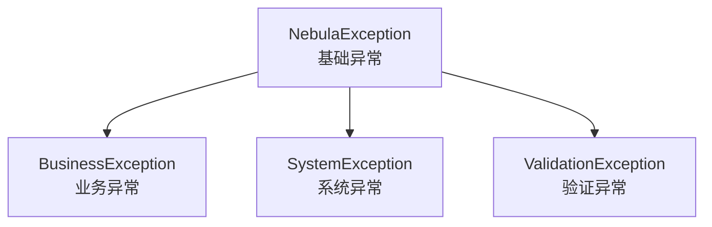

# Nebula Foundation

> Nebula 框架核心基础模块，提供常用工具类统一异常处理安全加密结果封装等基础功能

## 模块概述

`nebula-foundation` 是 Nebula 框架的最核心模块，为所有其他模块提供基础支持它提供了一套完整的工具类和通用组件，确保整个框架具有统一的编码风格和异常处理机制

## 核心功能

### 1. 统一结果封装

提供标准化的 API 响应结果封装

#### Result 类

```java
// 成功响应
Result<User> result = Result.success(user);
Result<User> result = Result.success(user, "用户创建成功");

// 失败响应
Result<Void> result = Result.error("USER_NOT_FOUND", "用户不存在");
Result<Void> result = Result.businessError("库存不足");
Result<Void> result = Result.validationError("用户名不能为空");

// 权限响应
Result<Void> result = Result.unauthorized("未登录");
Result<Void> result = Result.forbidden("无权限访问");

// 链路追踪
Result<User> result = Result.success(user).withRequestId(requestId);
```

#### 响应结构

```json
{
  "success": true,
  "code": "SUCCESS",
  "message": "操作成功",
  "data": {...},
  "timestamp": "2025-11-03T10:00:00",
  "requestId": "abc123"
}
```

### 2. 异常处理体系

提供完整的异常处理层次结构

#### 异常类型



#### 使用示例

```java
// 业务异常
throw BusinessException.of("用户不存在");
throw BusinessException.of("库存不足，剩余: %d", stock);
throw BusinessException.withCode("USER_NOT_FOUND", "用户ID: %d 不存在", userId);

// 系统异常
throw new SystemException("SYSTEM_ERROR", "数据库连接失败");

// 验证异常
throw new ValidationException("VALIDATION_ERROR", "用户名格式不正确");

// 获取格式化消息
try {
    // 业务逻辑
} catch (NebulaException e) {
    log.error("错误: {} - {}", e.getErrorCode(), e.getFormattedMessage());
}
```

### 3. ID 生成器

提供多种 ID 生成策略

#### UUID 生成

```java
// 标准 UUID: 550e8400-e29b-41d4-a716-446655440000
String uuid = IdGenerator.uuid();

// 无横线 UUID: 550e8400e29b41d4a716446655440000
String simpleUuid = IdGenerator.uuidSimple();

// 大写 UUID
String upperUuid = IdGenerator.uuidUpper();
```

#### 雪花算法 ID

```java
// 使用默认实例
long id = IdGenerator.snowflakeId();
String idStr = IdGenerator.snowflakeIdString();

// 自定义实例（分布式环境）
SnowflakeIdGenerator generator = IdGenerator.createSnowflake(
    workerId: 1,      // 机器ID (0-31)
    datacenterId: 1   // 数据中心ID (0-31)
);
long id = generator.nextId();

// 解析 ID
IdInfo info = generator.parseId(id);
System.out.println("时间戳: " + info.getTimestamp());
System.out.println("数据中心: " + info.getDatacenterId());
System.out.println("机器ID: " + info.getWorkerId());
System.out.println("序列号: " + info.getSequence());
```

#### 业务 ID 生成

```java
// 订单号: 20251103100000123456
String orderNo = IdGenerator.orderNo();

// 用户ID: A7k9Xm2p
String userId = IdGenerator.userId();

// 带前缀的 ID: ORDER-a8K9pL2m
String prefixedId = IdGenerator.prefixedId("ORDER-", 8);

// 数字ID: ORDER-12345678
String numericId = IdGenerator.prefixedNumericId("ORDER-", 8);

// 短ID (8位): aB3k9Xm2
String shortId = IdGenerator.shortId();

// 自定义长度短ID
String shortId10 = IdGenerator.shortId(10);
```

#### 其他 ID 类型

```java
// 时间戳 ID
long timestampId = IdGenerator.timestampId();
String timestampStr = IdGenerator.timestampIdString();

// 随机数字 ID (指定长度)
String numericId = IdGenerator.numericId(10);

// 字母数字 ID
String alphanumericId = IdGenerator.alphanumericId(12);

// 随机长整型 ID
long randomId = IdGenerator.randomLongId();
```

#### 序列号生成器

```java
// 创建序列号生成器 (0-999, 到达最大值后重置)
SequenceGenerator seqGen = new SequenceGenerator(0, 1000);

// 获取序列号
long seq1 = seqGen.nextValue();  // 0
long seq2 = seqGen.nextValue();  // 1
long seq3 = seqGen.nextValue();  // 2

// 获取当前值
long current = seqGen.currentValue();

// 重置
seqGen.reset();
```

### 4. JWT 工具

提供完整的 JWT token 生成解析和验证功能

#### 基本使用

```java
// 生成密钥
SecretKey key = JwtUtils.generateKey();
String base64Key = JwtUtils.keyToBase64(key);

// 从 Base64 恢复密钥
SecretKey restoredKey = JwtUtils.keyFromBase64(base64Key);
```

#### Token 生成

```java
// 简单 token
String token = JwtUtils.generateToken("userId123", key);

// 带自定义声明的 token
Map<String, Object> claims = new HashMap<>();
claims.put("username", "zhangsan");
claims.put("role", "ADMIN");
String token = JwtUtils.generateToken("userId123", claims, key);

// 指定过期时间
String token = JwtUtils.generateToken(
    "userId123", 
    claims, 
    Duration.ofHours(2),  // 2小时后过期
    key
);

// 指定签发者
String token = JwtUtils.generateToken(
    "userId123", 
    claims, 
    Duration.ofHours(24),
    key,
    "my-issuer"
);
```

#### Token 解析

```java
// 解析 token
JwtParseResult result = JwtUtils.parseToken(token, key);

if (result.isValid()) {
    String subject = result.getSubject();
    String username = result.getClaim("username", String.class);
    String role = result.getClaim("role", String.class);
    
    // 获取剩余有效时间
    Duration remaining = result.getRemainingTime();
    System.out.println("剩余有效期: " + remaining.toMinutes() + " 分钟");
} else if (result.isExpired()) {
    System.out.println("Token 已过期: " + result.getErrorMessage());
} else {
    System.out.println("Token 无效: " + result.getErrorMessage());
}
```

#### Token 验证

```java
// 验证 token 是否有效
boolean valid = JwtUtils.isTokenValid(token, key);

// 获取主题（用户ID）
String userId = JwtUtils.getSubject(token, key);

// 获取特定声明
String username = JwtUtils.getClaim(token, key, "username", String.class);

// 检查是否即将过期（1小时内过期）
boolean expiringSoon = JwtUtils.isTokenExpiringSoon(
    token, 
    key, 
    Duration.ofHours(1)
);
```

#### Token 刷新

```java
// 刷新 token（保持原有声明，延长有效期）
String newToken = JwtUtils.refreshToken(
    oldToken, 
    key, 
    Duration.ofHours(24)
);
```

### 5. 加密工具

提供常用的加密哈希和编码功能

#### 哈希函数

```java
// MD5 哈希
String md5 = CryptoUtils.md5("password123");

// SHA-1 哈希
String sha1 = CryptoUtils.sha1("data");

// SHA-256 哈希
String sha256 = CryptoUtils.sha256("data");

// 带盐的 SHA-256
String salt = CryptoUtils.generateSalt(16);
String hashed = CryptoUtils.sha256WithSalt("password", salt);
```

#### 密码加密

```java
// 加密密码（自动生成盐值）
String encryptedPassword = CryptoUtils.encrypt("myPassword123");
// 格式: salt:hashedPassword

// 验证密码
boolean matches = CryptoUtils.matches("myPassword123", encryptedPassword);

// 检查密码强度（需包含大小写字母数字和特殊字符，至少8位）
boolean strong = CryptoUtils.isStrongPassword("MyP@ssw0rd");
```

#### AES 对称加密

```java
// 生成 AES 密钥
String aesKey = CryptoUtils.generateAESKey();

// 加密
String plainText = "敏感数据";
String encrypted = CryptoUtils.aesEncrypt(plainText, aesKey);

// 解密
String decrypted = CryptoUtils.aesDecrypt(encrypted, aesKey);
```

#### Base64 编码

```java
// 标准 Base64 编码
String encoded = CryptoUtils.base64Encode("数据");
String decoded = CryptoUtils.base64Decode(encoded);

// URL 安全的 Base64 编码
String urlSafe = CryptoUtils.base64UrlEncode("数据");
String urlDecoded = CryptoUtils.base64UrlDecode(urlSafe);

// 字节数组编码
byte[] bytes = "数据".getBytes();
String encoded = CryptoUtils.base64Encode(bytes);
byte[] decoded = CryptoUtils.base64DecodeToBytes(encoded);
```

#### 安全工具

```java
// 生成随机字符串
String random = CryptoUtils.generateRandomString(32);

// 生成随机盐值
String salt = CryptoUtils.generateSalt(16);

// 安全比较（防止时序攻击）
boolean equals = CryptoUtils.secureEquals(str1, str2);
```

### 6. JSON 工具

提供完整的 JSON 序列化和反序列化功能

#### 序列化

```java
User user = new User("张三", 25);

// 序列化为 JSON 字符串
String json = JsonUtils.toJson(user);

// 美化输出
String prettyJson = JsonUtils.toPrettyJson(user);

// 序列化为字节数组
byte[] jsonBytes = JsonUtils.toJsonBytes(user);
```

#### 反序列化

```java
// 从 JSON 字符串反序列化
User user = JsonUtils.fromJson(json, User.class);

// 使用 TypeReference 处理泛型
List<User> users = JsonUtils.fromJson(json, new TypeReference<List<User>>() {});

// 从字节数组反序列化
User user = JsonUtils.fromJsonBytes(jsonBytes, User.class);

// 从输入流反序列化
User user = JsonUtils.fromJson(inputStream, User.class);
```

#### 特殊类型转换

```java
// JSON 字符串转 Map
Map<String, Object> map = JsonUtils.toMap(jsonString);

// JSON 字符串转 List
List<User> users = JsonUtils.toList(jsonString, User.class);

// 对象转 Map
Map<String, Object> map = JsonUtils.objectToMap(user);

// Map 转对象
User user = JsonUtils.mapToObject(map, User.class);
```

#### JSON 节点操作

```java
// 解析为 JsonNode
JsonNode node = JsonUtils.parseJson(jsonString);

// 获取嵌套字段值
String name = JsonUtils.getValue(node, "user.profile.name");
Integer age = JsonUtils.getValue(node, "user.age", Integer.class);
```

#### 验证和判断

```java
// 检查是否为有效 JSON
boolean valid = JsonUtils.isValidJson(jsonString);

// 检查是否为 JSON 对象
boolean isObject = JsonUtils.isJsonObject(jsonString);

// 检查是否为 JSON 数组
boolean isArray = JsonUtils.isJsonArray(jsonString);
```

#### JSON 操作

```java
// 合并两个 JSON（后者覆盖前者）
String merged = JsonUtils.mergeJson(json1, json2);

// 深拷贝对象
User clonedUser = JsonUtils.deepCopy(user, User.class);

// 格式化 JSON
String formatted = JsonUtils.formatJson(compactJson);
```

#### 自定义 ObjectMapper

```java
// 获取默认 ObjectMapper
ObjectMapper mapper = JsonUtils.getMapper();

// 获取美化输出的 ObjectMapper
ObjectMapper prettyMapper = JsonUtils.getPrettyMapper();
```

### 7. 日期时间工具

提供 Java 8 日期时间 API 的便捷操作

#### 当前时间

```java
// 当前日期
LocalDate today = DateUtils.now();

// 当前日期时间
LocalDateTime now = DateUtils.nowDateTime();

// 当前时间戳（秒）
long timestamp = DateUtils.nowTimestamp();

// 当前时间戳（毫秒）
long timestampMillis = DateUtils.nowTimestampMillis();
```

#### 格式化

```java
LocalDate date = LocalDate.of(2025, 11, 3);
LocalDateTime dateTime = LocalDateTime.of(2025, 11, 3, 10, 30, 0);

// 默认格式化
String dateStr = DateUtils.formatDate(date);          // 2025-11-03
String dateTimeStr = DateUtils.formatDateTime(dateTime); // 2025-11-03 10:30:00

// 自定义格式
String custom = DateUtils.formatDate(date, "yyyy年MM月dd日");
String custom = DateUtils.formatDateTime(dateTime, "yyyy-MM-dd HH:mm");
```

#### 解析

```java
// 默认格式解析
LocalDate date = DateUtils.parseDate("2025-11-03");
LocalDateTime dateTime = DateUtils.parseDateTime("2025-11-03 10:30:00");

// 自定义格式解析
LocalDate date = DateUtils.parseDate("2025年11月03日", "yyyy年MM月dd日");
LocalDateTime dateTime = DateUtils.parseDateTime("20251103103000", "yyyyMMddHHmmss");
```

#### 日期计算

```java
LocalDate date = LocalDate.now();
LocalDateTime dateTime = LocalDateTime.now();

// 增加天数
LocalDate tomorrow = DateUtils.plusDays(date, 1);
LocalDate yesterday = DateUtils.plusDays(date, -1);

// 增加月份
LocalDate nextMonth = DateUtils.plusMonths(date, 1);

// 增加年份
LocalDate nextYear = DateUtils.plusYears(date, 1);

// 增加小时
LocalDateTime later = DateUtils.plusHours(dateTime, 2);

// 增加分钟
LocalDateTime later = DateUtils.plusMinutes(dateTime, 30);

// 增加秒
LocalDateTime later = DateUtils.plusSeconds(dateTime, 60);
```

#### 日期比较

```java
LocalDate start = LocalDate.of(2025, 1, 1);
LocalDate end = LocalDate.of(2025, 12, 31);
LocalDate check = LocalDate.of(2025, 6, 15);

// 检查是否在范围内
boolean inRange = DateUtils.isBetween(check, start, end);

// 计算天数差
long days = DateUtils.daysBetween(start, end);  // 364

// 计算小时差
LocalDateTime dt1 = LocalDateTime.of(2025, 11, 3, 10, 0);
LocalDateTime dt2 = LocalDateTime.of(2025, 11, 3, 14, 0);
long hours = DateUtils.hoursBetween(dt1, dt2);  // 4

// 计算分钟差
long minutes = DateUtils.minutesBetween(dt1, dt2);  // 240
```

#### 特殊日期

```java
LocalDate date = LocalDate.of(2025, 6, 15);

// 月初月末
LocalDate monthStart = DateUtils.startOfMonth(date);  // 2025-06-01
LocalDate monthEnd = DateUtils.endOfMonth(date);      // 2025-06-30

// 年初年末
LocalDate yearStart = DateUtils.startOfYear(date);    // 2025-01-01
LocalDate yearEnd = DateUtils.endOfYear(date);        // 2025-12-31

// 一天的开始和结束
LocalDateTime dayStart = DateUtils.startOfDay(date);  // 2025-06-15 00:00:00
LocalDateTime dayEnd = DateUtils.endOfDay(date);      // 2025-06-15 23:59:59.999999999
```

#### 时区转换

```java
LocalDateTime dateTime = LocalDateTime.now();

// LocalDateTime 转时间戳
long timestamp = DateUtils.toTimestamp(dateTime, ZoneId.systemDefault());
long timestampMillis = DateUtils.toTimestampMillis(dateTime, ZoneId.systemDefault());

// 时间戳转 LocalDateTime
LocalDateTime dt = DateUtils.fromTimestamp(timestamp, ZoneId.systemDefault());
LocalDateTime dt = DateUtils.fromTimestampMillis(timestampMillis, ZoneId.systemDefault());
```

#### Date 类型转换（兼容性）

```java
Date date = new Date();
LocalDate localDate = LocalDate.now();
LocalDateTime localDateTime = LocalDateTime.now();

// Date 转 LocalDate/LocalDateTime
LocalDate ld = DateUtils.toLocalDate(date);
LocalDateTime ldt = DateUtils.toLocalDateTime(date);

// LocalDate/LocalDateTime 转 Date
Date d1 = DateUtils.toDate(localDate);
Date d2 = DateUtils.toDate(localDateTime);
```

#### 常用格式化器

```java
// 预定义的格式化器
DateTimeFormatter dateFormatter = DateUtils.DATE_FORMATTER;           // yyyy-MM-dd
DateTimeFormatter dateTimeFormatter = DateUtils.DATETIME_FORMATTER;   // yyyy-MM-dd HH:mm:ss
DateTimeFormatter timeFormatter = DateUtils.TIME_FORMATTER;           // HH:mm:ss
DateTimeFormatter isoFormatter = DateUtils.ISO_FORMATTER;             // ISO 8601
DateTimeFormatter compactDateFormatter = DateUtils.COMPACT_DATE_FORMATTER; // yyyyMMdd
DateTimeFormatter compactDateTimeFormatter = DateUtils.COMPACT_DATETIME_FORMATTER; // yyyyMMddHHmmss
```

### 8. 其他工具类

#### Strings 工具

```java
// 字符串判空
boolean blank = Strings.isBlank(" ");  // true
boolean notBlank = Strings.isNotBlank("text");  // true

// 更多功能...
```

#### Collections 工具

```java
// 集合操作工具
// 详见源码
```

#### Beans 工具

```java
// Bean 操作工具
// 详见源码
```

## 分页结果

### PageResult 类

```java
// 创建分页结果
List<User> users = userService.findUsers(page, size);
long total = userService.countUsers();

PageResult<User> pageResult = PageResult.<User>builder()
    .items(users)
    .total(total)
    .page(page)
    .size(size)
    .build();

// 响应结构
{
  "items": [...],
  "total": 100,
  "page": 1,
  "size": 20,
  "totalPages": 5,
  "hasNext": true,
  "hasPrevious": false
}
```

## 枚举基类

### EnumBase 接口

```java
public enum UserStatus implements EnumBase<String> {
    ACTIVE("active", "激活"),
    INACTIVE("inactive", "未激活"),
    LOCKED("locked", "锁定");
    
    private final String code;
    private final String description;
    
    UserStatus(String code, String description) {
        this.code = code;
        this.description = description;
    }
    
    @Override
    public String getCode() {
        return code;
    }
    
    @Override
    public String getDescription() {
        return description;
    }
}

// 使用
UserStatus status = UserStatus.ACTIVE;
String code = status.getCode();          // "active"
String desc = status.getDescription();    // "激活"
```

## 依赖说明

```xml
<dependencies>
    <!-- Spring Boot -->
    <dependency>
        <groupId>org.springframework.boot</groupId>
        <artifactId>spring-boot-starter</artifactId>
    </dependency>
    
    <!-- JSON 处理 -->
    <dependency>
        <groupId>com.fasterxml.jackson.core</groupId>
        <artifactId>jackson-databind</artifactId>
    </dependency>
    
    <!-- JWT -->
    <dependency>
        <groupId>io.jsonwebtoken</groupId>
        <artifactId>jjwt-api</artifactId>
        <version>0.12.3</version>
    </dependency>
    
    <!-- 工具库 -->
    <dependency>
        <groupId>com.google.guava</groupId>
        <artifactId>guava</artifactId>
    </dependency>
    <dependency>
        <groupId>org.apache.commons</groupId>
        <artifactId>commons-lang3</artifactId>
    </dependency>
    <dependency>
        <groupId>commons-codec</groupId>
        <artifactId>commons-codec</artifactId>
    </dependency>
</dependencies>
```

## 最佳实践

### 1. 统一异常处理

```java
@RestControllerAdvice
public class GlobalExceptionHandler {
    
    @ExceptionHandler(BusinessException.class)
    public Result<Void> handleBusinessException(BusinessException e) {
        return Result.error(e.getErrorCode(), e.getFormattedMessage());
    }
    
    @ExceptionHandler(ValidationException.class)
    public Result<Void> handleValidationException(ValidationException e) {
        return Result.validationError(e.getFormattedMessage());
    }
    
    @ExceptionHandler(Exception.class)
    public Result<Void> handleException(Exception e) {
        log.error("系统异常", e);
        return Result.systemError("系统内部错误");
    }
}
```

### 2. 统一响应格式

```java
@RestController
@RequestMapping("/api/users")
public class UserController {
    
    @GetMapping("/{id}")
    public Result<User> getUser(@PathVariable Long id) {
        User user = userService.findById(id);
        if (user == null) {
            return Result.notFound("用户不存在");
        }
        return Result.success(user);
    }
    
    @PostMapping
    public Result<User> createUser(@RequestBody @Valid CreateUserRequest request) {
        User user = userService.create(request);
        return Result.success(user, "用户创建成功");
    }
    
    @GetMapping
    public PageResult<User>> listUsers(
            @RequestParam(defaultValue = "1") int page,
            @RequestParam(defaultValue = "20") int size) {
        PageResult<User> pageResult = userService.findUsers(page, size);
        return Result.success(pageResult);
    }
}
```

### 3. 安全最佳实践

```java
@Service
public class AuthService {
    
    // 配置文件或环境变量中的密钥
    @Value("${security.jwt.secret}")
    private String jwtSecret;
    
    @Value("${security.aes.key}")
    private String aesKey;
    
    private SecretKey jwtKey;
    
    @PostConstruct
    public void init() {
        this.jwtKey = JwtUtils.keyFromBase64(jwtSecret);
    }
    
    // 登录
    public String login(String username, String password) {
        User user = userRepository.findByUsername(username)
            .orElseThrow(() -> BusinessException.of("用户不存在"));
        
        // 验证密码
        if (!CryptoUtils.matches(password, user.getPassword())) {
            throw BusinessException.of("密码错误");
        }
        
        // 生成 token
        Map<String, Object> claims = new HashMap<>();
        claims.put("username", user.getUsername());
        claims.put("role", user.getRole());
        
        return JwtUtils.generateToken(
            user.getId().toString(),
            claims,
            Duration.ofHours(24),
            jwtKey
        );
    }
    
    // 注册
    public void register(String username, String password) {
        // 检查密码强度
        if (!CryptoUtils.isStrongPassword(password)) {
            throw ValidationException.of("密码强度不足");
        }
        
        // 加密密码
        String encryptedPassword = CryptoUtils.encrypt(password);
        
        // 保存用户
        User user = new User();
        user.setUsername(username);
        user.setPassword(encryptedPassword);
        userRepository.save(user);
    }
    
    // 加密敏感数据
    public String encryptSensitiveData(String data) {
        return CryptoUtils.aesEncrypt(data, aesKey);
    }
    
    // 解密敏感数据
    public String decryptSensitiveData(String encryptedData) {
        return CryptoUtils.aesDecrypt(encryptedData, aesKey);
    }
}
```

### 4. 日志记录规范

```java
@Slf4j
@Service
public class OrderService {
    
    public Order createOrder(CreateOrderRequest request) {
        // 生成订单号
        String orderNo = IdGenerator.orderNo();
        log.info("创建订单: orderNo={}, userId={}", orderNo, request.getUserId());
        
        try {
            Order order = new Order();
            order.setOrderNo(orderNo);
            order.setUserId(request.getUserId());
            order.setCreateTime(DateUtils.nowDateTime());
            
            orderRepository.save(order);
            
            log.info("订单创建成功: orderNo={}, orderId={}", orderNo, order.getId());
            return order;
            
        } catch (Exception e) {
            log.error("订单创建失败: orderNo={}, error={}", orderNo, e.getMessage(), e);
            throw BusinessException.of("订单创建失败");
        }
    }
}
```

## 注意事项

1. **异常处理**
   - 业务逻辑错误使用 `BusinessException`
   - 系统错误使用 `SystemException`
   - 参数验证错误使用 `ValidationException`
   - 避免捕获异常后不处理

2. **安全性**
   - 密钥和盐值应从配置文件或环境变量读取，不要硬编码
   - 敏感数据加密存储
   - 使用强密码策略
   - JWT token 设置合理的过期时间

3. **性能**
   - ID 生成器使用单例模式
   - JSON 序列化避免频繁创建 ObjectMapper
   - 日期时间操作优先使用 Java 8 API

4. **线程安全**
   - 所有工具类都是线程安全的
   - 雪花算法生成器内部有同步机制

## 版本要求

- Java 21+
- Spring Boot 3.x
- Maven 3.6+

## 许可证

Apache License 2.0

---

**Nebula Foundation** - 构建高质量应用的基石


## 🧪 测试

本模块提供完整的单元测试文档和示例，详见 [TESTING.md](./TESTING.md)

