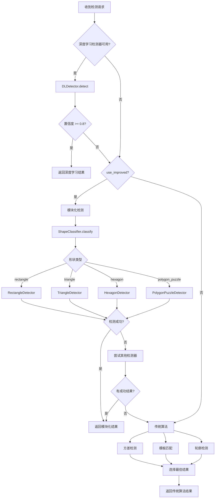

# OpenCV 验证码识别服务

## 1. 概述

OpenCV 验证码识别服务是一个基于 Flask 的 Web 服务，提供滑块验证码缺口检测和旋转验证码角度识别功能。

## 2. 架构设计

```
                            +------------------+
                            |   API 端点       |
                            | /slider/detect   |
                            | /rotate/detect   |
                            +--------+---------+
                                     |
                +--------------------+--------------------+
                |                    |                    |
        +-------v-------+    +-------v-------+    +-------v-------+
        | 深度学习检测器 |    | 模块化检测    |    | 传统算法      |
        | (DLDetector)  |    | (Modular)     |    | (Legacy)      |
        +---------------+    +-------+-------+    +---------------+
                                     |
             +-----------------------+-----------------------+
             |                       |                       |
     +-------v-------+       +-------v-------+       +-------v-------+
     | 形状分类器    |       | 形状检测器    |       | 其他检测器    |
     | (Classifier)  |       | (Detectors)   |       |               |
     +---------------+       +-------+-------+       +---------------+
                                     |
         +----------+----------+----------+----------+
         |          |          |          |          |
    +----v----+ +---v----+ +---v----+ +---v--------+
    |Rectangle| |Triangle| |Hexagon | |PolygonPuzzle|
    +---------+ +--------+ +--------+ +-------------+
```

## 3. 检测策略

### 3.1 策略优先级

```
1. 深度学习检测器 (DLDetector)     - 置信度阈值: 0.8
2. 模块化检测 (detect_gap_modular) - 基于规则的分类检测
3. 传统算法 (Legacy)               - 回退策略
```

### 3.2 深度学习检测器 (DLDetector)

基于 ONNX 模型进行实例分割，检测滑块缺口位置。

**特点**：
- 高准确率（92%+ 置信度）
- 泛化能力强
- 支持矩形、六边形、三角形等多种形状

**模型文件**：`models/slider.onnx`

**检测流程**：
1. 图像预处理（resize, normalize）
2. ONNX 模型推理
3. 后处理（NMS, 边界框提取）
4. 返回缺口位置和置信度

### 3.3 模块化检测 (Modular Detection)

基于规则的分类检测，包含以下组件：

#### 3.3.1 形状分类器 (ShapeClassifier)

分析背景图特征，判断验证码类型：

| 类型 | 描述 | 特征 |
|------|------|------|
| rectangle | 矩形缺口 | 4个顶点，接近正方形 |
| triangle | 三角形缺口 | 3个顶点 |
| hexagon | 六边形/八边形缺口 | 5-10个顶点 |
| polygon_puzzle | 多边形拼图 | 两个形状，需配对 |

#### 3.3.2 矩形检测器 (RectangleDetector)

**检测策略**：
1. 多边形轮廓检测（4边形）
2. 垂直边缘检测（霍夫变换）
3. 梯度分析

#### 3.3.3 三角形检测器 (TriangleDetector)

**检测策略**：
1. 边缘检测 + 三角形轮廓
2. 暗色区域检测

#### 3.3.4 六边形检测器 (HexagonDetector)

**检测策略**：
1. 边缘检测 + 多边形轮廓 (5-10边)
2. 暗色区域检测
3. 梯度分析

#### 3.3.5 多边形拼图检测器 (PolygonPuzzleDetector)

**检测策略**：
1. 检测图中的多个形状
2. 找到左侧目标位置（暗色填充区域）
3. 计算滑动距离

### 3.4 传统算法 (Legacy)

作为最后的回退策略，包含：

| 方法 | 描述 |
|------|------|
| 方差检测 | 通过列标准差峰值定位缺口 |
| 模板匹配 | 使用滑块图进行模板匹配（如果提供） |
| 轮廓检测 | 基于 Canny 边缘检测的轮廓分析 |

## 4. API 接口

### 4.1 滑块验证码检测

```
POST /slider/detect

参数:
  - background: Base64编码的背景图 (必填)
  - slider: Base64编码的滑块图 (可选)
  - target_width: 目标显示宽度 (可选，用于坐标缩放)
  - use_improved: 是否使用改进算法 (可选，默认true)

返回:
  - success: 是否成功
  - offset: 缺口左边缘 X 坐标 (缩放后)
  - original_offset: 原始图片上的偏移量
  - scaled_gap_center: 缺口中心 X 坐标 (缩放后)
  - gap_width: 缺口宽度
  - confidence: 置信度
  - method: 使用的检测方法
  - shape_type: 检测到的形状类型
```

### 4.2 旋转验证码检测

```
POST /rotate/detect

参数:
  - image: Base64编码的图片 (必填)

返回:
  - success: 是否成功
  - angle: 旋转角度
  - confidence: 置信度
```

### 4.3 健康检查

```
GET /ping

返回:
  - status: ok
  - service: captcha-opencv
  - version: 2.0.0
```

## 5. 检测流程图



## 6. 部署

### 6.1 Docker 部署

```bash
# 构建镜像
docker build -t captcha-opencv:latest .

# 运行容器
docker run -d -p 8080:8080 --name captcha-opencv captcha-opencv:latest
```

### 6.2 环境变量

| 变量 | 描述 | 默认值 |
|------|------|--------|
| PORT | 服务端口 | 8080 |
| DEBUG | 调试模式 | false |

## 7. 版本历史

| 版本 | 日期 | 描述 |
|------|------|------|
| 2.0.0 | 2026-01 | 重构架构，支持多种形状的分类检测 |
| 1.1.0 | 2025-12 | 改进缺口检测算法，支持目标宽度缩放 |
| 1.0.0 | 2025-11 | 初始版本 |

## 8. 参考资料

- [captcha-recognizer](https://github.com/chenwei-zhao/captcha-recognizer) - 深度学习模型来源
- OpenCV 官方文档
- Flask 官方文档
