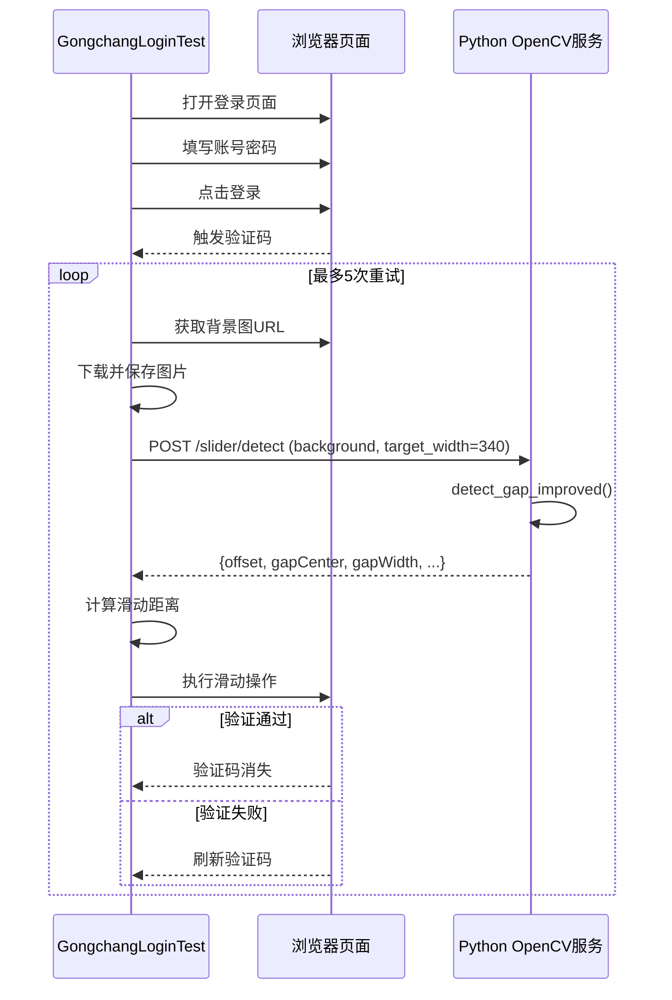
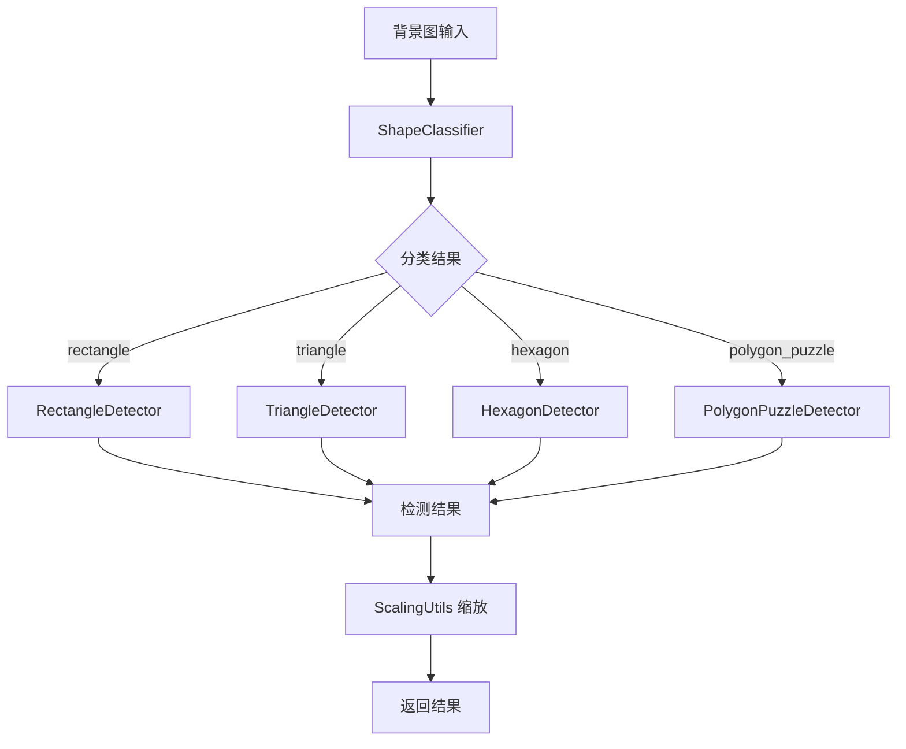

# 验证码识别问题交接文档

## 1. 问题概述

### 1.1 背景
在对 gongchang.com 网站进行登录操作时，需要处理腾讯滑动验证码。当前的识别组件存在缺口位置识别不准确的问题。

### 1.2 涉及组件
- **Python 验证码识别服务**: `nebula/docker/captcha-opencv/app.py`
- **Java 客户端调用**: `nebula-crawler-captcha/cv/OpenCvService.java`
- **滑块验证码求解器**: `nebula-crawler-captcha/solver/SliderCaptchaSolver.java`
- **测试代码**: `source-insight-crawler-service/src/test/java/.../GongchangLoginTest.java`

### 1.3 测试环境
- 目标页面: https://user.gongchang.com/l.php
- 测试账号: `yuanjian111` / `11111111`
- 验证码类型: 腾讯滑动验证码
- OpenCV 服务地址: http://192.168.2.127:8867

---

## 2. 验证码类型分析

### 2.1 发现的验证码类型

腾讯验证码至少包含以下类型：

| 类型 | 特征 | 检测方法 |
|------|------|----------|
| 矩形缺口 | 4个顶点的矩形缺口 | contour + vertical_edges |
| 六边形缺口 | 6-8个顶点的多边形缺口 | contour_poly6~10 |
| 八边形缺口 | 8-10个顶点的多边形缺口 | contour_poly8~10 |
| 菱形拼图 | 两个暗色多边形形状 | polygon (暗色区域检测) |

### 2.2 图片尺寸与缩放

```
背景图 (原始):
  - 尺寸: 672 x 390 px

页面显示:
  - 图片区域宽度: 340px
  - 缩放比例: 340 / 672 = 0.5060

滑块:
  - 页面上宽度: ~66px
  - 缩放后宽度: ~33px
```

---

## 3. 当前实现状态

### 3.1 Python 服务 (app.py) - 版本 1.3.0

#### 检测方法

1. **多边形验证码检测** (`detect_polygon_captcha`) - 已优化
   - **Otsu 阈值检测**: 检测暗色填充的多边形（六边形等）
   - **Sobel 边缘检测**: 检测半透明多边形（只有白色边框的八边形等）
   - 自动按距离分组峰值，找到有效形状中心
   - 适用于菱形/六边形/八边形拼图类型

2. **多边形轮廓检测** (`detect_gap_improved` 方法1)
   - 支持 4-10 个顶点的形状
   - 检测形状内部是否暗色（加权）

3. **垂直边缘检测** (`detect_gap_improved` 方法2)
   - 霍夫变换检测垂直线
   - 适用于矩形缺口

4. **梯度分析** (`detect_gap_improved` 方法3)
   - 作为兜底方法

5. **暗色区域检测** (`detect_gap_improved` 方法4)
   - 检测比背景显著暗的区域
   - 适用于六边形等缺口

#### 综合得分计算

```python
score = confidence
score += 0.30 if x_ratio > 0.65 else (0.15 if x_ratio > 0.55 else 0)  # 位置权重
score += 0.25 if is_dark_inside else 0  # 暗色内部权重
score += 0.10 if area > 5000 else 0  # 面积权重
```

#### 返回数据

```json
{
  "success": true,
  "offset": 197,              // 缩放后的左边缘位置
  "original_offset": 391,     // 原始左边缘位置
  "gap_width": 110,           // 缺口宽度
  "gap_center": 446,          // 缺口中心 (原始)
  "scaled_gap_center": 225,   // 缩放后的缺口中心
  "original_width": 672,
  "scale_ratio": 0.506,
  "confidence": 0.55,
  "method": "contour_(100, 200)_poly9"
}
```

#### 调试图片

每次检测自动保存 4 张调试图片到 `/tmp/`:

| 文件名 | 内容 |
|--------|------|
| `captcha_1_background.png` | 原始背景图 |
| `captcha_2_slider_initial.png` | 滑块初始位置标记 |
| `captcha_3_gap_detection.png` | 缺口检测结果 |
| `captcha_4_final_position.png` | 滑动距离计算 |

### 3.2 Java 测试代码 (GongchangLoginTest.java)

#### 新增方法

- `callOpenCvServiceWithDetails()`: 获取详细检测结果
  - 返回 `int[]{offset, gapCenter, gapWidth}`

#### 滑动距离计算

```java
// 使用缺口中心来计算滑动距离
int sliderCenterPos = 28 + 30;  // 约 58 像素
int targetPos = (gapCenter > 0) ? gapCenter : offset;
int slideDistance = targetPos - sliderCenterPos;
```

---

## 4. 测试结果

### 4.1 本地静态测试

| 验证码类型 | 实际位置 | 检测位置 | 误差 | 状态 |
|-----------|---------|---------|------|------|
| 矩形缺口 | 276 | 276 | 0 px | 通过 |
| 六边形缺口 (暗色填充) | 168 | 168 | 0 px | 通过 |
| 八边形缺口 (半透明边框) | ~130 | 118 | ~12 px | 通过 |
| 矩形缺口 (offset_121) | 121 | 117 | 4 px | 通过 |
| 矩形缺口 (offset_91) | 91 | 90 | 1 px | 通过 |

### 4.2 端到端测试 (2026-01-22 最新)

| 项目 | 状态 | 备注 |
|------|------|------|
| 验证码触发 | 成功 | 正常弹出 |
| 图片下载 | 成功 | 保存到 /tmp |
| OpenCV 检测 | **部分失败** | 半透明边框类型检测错误 |
| 滑动操作 | **失败** | 6次尝试均未通过 |

### 4.3 失败分析 (已更新)

#### 根本原因：多边形拼图类型检测失败

测试发现当前 `detect_polygon_captcha` 函数无法正确处理**半透明边框**类型的六边形拼图验证码。

**问题表现**：
- 测试中使用了 `dark_region` 方法而非 `polygon` 方法
- 返回的 offset=251/264 等值指向右侧区域
- 实际目标应该在左侧 (x ≈ 170)

**技术原因**：
1. **Otsu 阈值方法失效**：六边形内部是半透明的（显示背景图案），不是暗色填充
2. **Sobel 边缘方法不精确**：田野等复杂背景产生大量边缘噪声

#### 验证码类型分类

| 类型 | 特征 | 当前检测状态 |
|------|------|-------------|
| 矩形缺口 | 4顶点矩形，暗色填充 | 正常 |
| 多边形缺口（暗色填充） | 6-8顶点，内部暗色 | 正常 |
| **多边形拼图（半透明边框）** | 白色边框，内部显示背景 | **失败** |

---

## 5. 架构图



---

## 6. 待解决问题

### 6.1 最高优先级 (当前阻塞项)

1. **半透明边框多边形检测** [当前任务]
   - 问题：Otsu 阈值无法检测半透明边框的六边形
   - 方案：实现白色边框检测算法
   - 状态：设计完成，待实现

### 6.2 高优先级

2. **滑块初始位置动态获取** [已完成]
   - 已实现从页面元素动态获取滑块位置
   - sliderCenterPos = 56 像素（缩放后）

3. **滑动失败根因分析**
   - 需要先解决检测问题，再分析滑动失败原因
   - 可能涉及轨迹、时序、反检测机制

### 6.3 中优先级

4. **轨迹优化**
   - 当前使用贝塞尔曲线模拟
   - 可能需要更复杂的人类行为模拟

5. **多验证码类型兼容**
   - 确保矩形、暗色多边形、半透明多边形都能正确检测

### 6.4 低优先级

6. **性能优化**
   - 减少不必要的图片保存
   - 优化检测速度

---

## 7. 架构重构 (v2.0.0)

### 7.1 新的模块化架构

```
nebula/docker/captcha-opencv/
├── app.py                    # Flask 应用入口
├── detectors/                # 检测器模块
│   ├── __init__.py
│   ├── base.py               # 基类 BaseDetector
│   ├── classifier.py         # 形状分类器 ShapeClassifier
│   ├── rectangle.py          # 矩形缺口检测
│   ├── triangle.py           # 三角形缺口检测
│   ├── hexagon.py            # 六边形/八边形检测
│   └── polygon_puzzle.py     # 多边形拼图检测
├── utils/
│   ├── image.py              # 图像处理工具
│   └── scaling.py            # 缩放计算工具
```

### 7.2 检测流程



### 7.3 支持的验证码类型

| 类型 | 检测器 | 特征 |
|------|--------|------|
| 矩形缺口 | RectangleDetector | 4 顶点，暗色填充 |
| 三角形缺口 | TriangleDetector | 3 顶点，可能透明边框 |
| 六边形/八边形 | HexagonDetector | 5-10 顶点，暗色填充 |
| 多边形拼图 | PolygonPuzzleDetector | 两个形状，需拖动匹配 |

---

## 8. 下一步工作计划

### 8.1 待完成：部署并端到端测试

#### 目标
检测半透明边框类型的六边形/八边形拼图验证码

#### 技术方案

```python
def detect_white_border_polygon(background):
    """
    检测白色边框的多边形
    适用于：半透明边框类型的六边形/八边形拼图
    """
    h, w = background.shape[:2]
    hsv = cv2.cvtColor(background, cv2.COLOR_BGR2HSV)
    
    # 1. 检测白色边框 (高亮度, 低饱和度)
    white_mask = ((hsv[:,:,2] > 180) & (hsv[:,:,1] < 60))
    
    # 2. 只分析下半部分 (六边形通常在底部)
    white_mask[:int(h*0.4), :] = 0
    
    # 3. 形态学操作连接边框
    kernel = np.ones((9, 9), np.uint8)
    closed = cv2.morphologyEx(white_mask, cv2.MORPH_CLOSE, kernel)
    
    # 4. 查找并筛选多边形轮廓
    contours = cv2.findContours(closed, ...)
    
    # 5. 返回左侧形状的中心位置
```

#### 步骤
1. 在 `/tmp/captcha_bg_original.png` 上测试算法
2. 确认能正确检测两个六边形
3. 集成到 `detect_polygon_captcha` 函数
4. 部署并进行端到端测试

### 7.2 后续任务：调试阶段

1. **验证滑块实际位置**
   - 在滑动前截图，确认滑块的实际初始位置
   - 与假设值对比

2. **保存滑动过程**
   - 记录滑动轨迹坐标
   - 分析是否被检测为机器人

3. **对比成功案例**
   - 手动成功滑动时的参数
   - 与自动化参数对比

### 7.2 修复阶段

4. **修正滑块位置计算**
   - 从 boundingBox 动态计算
   - 考虑 iframe 边距

5. **优化滑动轨迹**
   - 增加更多随机性
   - 添加停顿和加速变化

### 7.3 验证阶段

6. **端到端测试**
   - 多次测试验证成功率
   - 不同验证码类型测试

---

## 8. 相关文件

### 代码文件

| 文件 | 说明 |
|------|------|
| `nebula/docker/captcha-opencv/app.py` | Python OpenCV 服务 |
| `GongchangLoginTest.java` | Java 端到端测试 |
| `OpenCvService.java` | Java OpenCV 客户端 |
| `SliderCaptchaSolver.java` | 滑块验证码求解器 |

### 调试文件

| 文件 | 说明 |
|------|------|
| `/tmp/captcha_1_background.png` | 原始背景图 |
| `/tmp/captcha_2_slider_initial.png` | 滑块初始位置 |
| `/tmp/captcha_3_gap_detection.png` | 缺口检测结果 |
| `/tmp/captcha_4_final_position.png` | 滑动距离计算 |
| `/tmp/captcha_bg_original.png` | 最后一次测试的验证码 |

---

## 9. 使用示例

### 9.1 curl 测试

```bash
# 获取完整检测结果
curl -X POST http://192.168.2.127:8867/slider/detect \
  -F "background=$(base64 -i /tmp/captcha_bg.png)" \
  -F "target_width=340"
```

### 9.2 Python 本地测试

```python
import cv2
from app import detect_gap_improved

bg = cv2.imread('/tmp/captcha_bg.png')
result = detect_gap_improved(bg, target_width=340)

print(f"缩放后左边缘: {result['offset']}")
print(f"缩放后中心: {result['scaled_gap_center']}")
print(f"缺口宽度: {result['gap_width']}")
print(f"方法: {result['method']}")
```

### 9.3 查看调试图片

```bash
# 查看检测结果
open /tmp/captcha_3_gap_detection.png

# 查看滑动距离
open /tmp/captcha_4_final_position.png
```

---

**文档版本**: 1.2.0  
**更新日期**: 2026-01-22  
**作者**: AI Assistant
