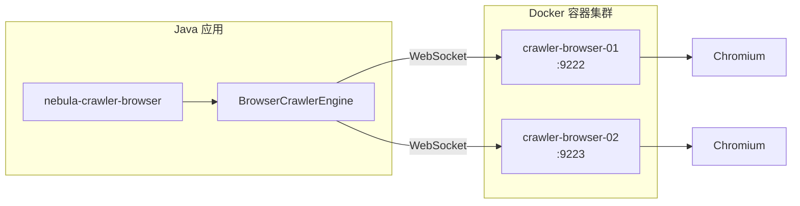

# Crawler Browser 服务

## 概述

Crawler Browser 是 Nebula 爬虫模块组的浏览器服务组件，基于 Playwright Server 构建，为 `nebula-crawler-browser` 模块提供远程浏览器连接能力。

该服务将浏览器实例容器化部署，Java 应用通过 WebSocket 协议连接远程浏览器，实现：
- 动态页面渲染（JavaScript 执行）
- 分布式浏览器集群
- 资源隔离与弹性伸缩

## 架构



## 环境要求

| 组件 | 版本要求 |
|------|---------|
| Docker | 20.10+ |
| Docker Compose | 2.0+ |
| 内存 | 每实例 2GB+ |
| 端口 | 9222, 9223（可配置） |

## 快速开始

### 1. 启动服务

```bash
cd nebula/docker/crawler-browser

# 使用启动脚本
./start.sh

# 或直接使用 docker-compose
docker-compose up -d
```

启动成功后输出：
```
==========================================
  浏览器服务已就绪！
==========================================

CDP 端点: http://localhost:9222
WebSocket: ws://localhost:9222

查看状态: docker-compose logs -f
停止服务: docker-compose down

浏览器信息:
{
    "Browser": "Chrome/XXX",
    "Protocol-Version": "1.3",
    "webSocketDebuggerUrl": "ws://localhost:9222"
}
```

### 2. 验证服务

```bash
# 检查服务状态
docker-compose ps

# 查看服务日志
docker-compose logs -f

# 测试连接
curl http://localhost:9222/json/version
```

### 3. 停止服务

```bash
./stop.sh

# 或
docker-compose down
```

## 配置说明

### Docker Compose 配置

`docker-compose.yml` 默认启动两个实例：

| 服务 | 端口 | 说明 |
|------|------|------|
| crawler-browser-01 | 9222 | 主实例 |
| crawler-browser-02 | 9223 | 备用实例 |

### 关键配置项

```yaml
services:
  crawler-browser-01:
    image: harbor.vocoor.com.cn/ci/curlawler-browser:1.0.0
    ports:
      - "9222:9222"
    shm_size: '2gb'           # 共享内存，防止浏览器崩溃
    security_opt:
      - seccomp:unconfined    # 安全配置，允许 Chromium 运行
    restart: unless-stopped   # 自动重启
```

### 配置调整

#### 调整实例数量

复制服务配置，修改端口：

```yaml
  crawler-browser-03:
    image: harbor.vocoor.com.cn/ci/curlawler-browser:1.0.0
    container_name: crawler-browser-03
    ports:
      - "9224:9222"
    shm_size: '2gb'
    security_opt:
      - seccomp:unconfined
    restart: unless-stopped
    networks:
      - crawler-network
```

#### 调整内存

根据页面复杂度调整共享内存：

```yaml
shm_size: '4gb'  # 复杂页面建议 4GB
```

## 与 Nebula 框架集成

### 1. 添加依赖

```xml
<dependency>
    <groupId>io.nebula</groupId>
    <artifactId>nebula-crawler-browser</artifactId>
</dependency>
```

### 2. 配置应用

```yaml
nebula:
  crawler:
    enabled: true
    browser:
      enabled: true
      mode: REMOTE                     # 使用远程模式
      pool-size: 5
      page-timeout: 30000
      remote:
        endpoints:                     # 配置远程端点
          - ws://localhost:9222
          - ws://localhost:9223
        load-balance-strategy: ROUND_ROBIN
        health-check-interval: 30000
        max-retries: 3
```

### 3. 使用示例

```java
@Service
public class PageCrawler {
    
    @Autowired
    private BrowserCrawlerEngine browserEngine;
    
    public String crawlDynamicPage(String url) {
        CrawlerRequest request = CrawlerRequest.renderPage(url)
            .waitSelector(".content")
            .waitTimeout(5000)
            .build();
            
        CrawlerResponse response = browserEngine.crawl(request);
        return response.getContent();
    }
}
```

## 镜像构建

如需自定义镜像或更新 Playwright 版本：

```bash
# 构建镜像
docker build -t curlawler-browser:1.0.0 .

# 推送到私有仓库
docker tag curlawler-browser:1.0.0 harbor.vocoor.com.cn/ci/curlawler-browser:1.0.0
docker push harbor.vocoor.com.cn/ci/curlawler-browser:1.0.0
```

### Dockerfile 说明

```dockerfile
FROM node:20-slim

# 安装 Chromium 依赖
RUN apt-get update && apt-get install -y \
    libnss3 libnspr4 libdbus-1-3 ...

# 安装 Playwright（版本必须与 Java 客户端匹配）
RUN npm install playwright@1.41.0 && \
    npx playwright install chromium

# 启动 Playwright Server
CMD ["npx", "playwright", "run-server", "--port", "9222", "--host", "0.0.0.0"]
```

> **版本匹配**：Playwright Server 版本必须与 `nebula-crawler-browser` 使用的客户端版本一致，当前版本为 `1.41.0`。

## Kubernetes 部署

### Deployment 示例

```yaml
apiVersion: apps/v1
kind: Deployment
metadata:
  name: crawler-browser
spec:
  replicas: 3
  selector:
    matchLabels:
      app: crawler-browser
  template:
    metadata:
      labels:
        app: crawler-browser
    spec:
      containers:
      - name: browser
        image: harbor.vocoor.com.cn/ci/curlawler-browser:1.0.0
        ports:
        - containerPort: 9222
        resources:
          requests:
            memory: "2Gi"
            cpu: "500m"
          limits:
            memory: "4Gi"
            cpu: "2"
        livenessProbe:
          httpGet:
            path: /json/version
            port: 9222
          initialDelaySeconds: 10
          periodSeconds: 30
        readinessProbe:
          httpGet:
            path: /json/version
            port: 9222
          initialDelaySeconds: 5
          periodSeconds: 10
        securityContext:
          seccompProfile:
            type: Unconfined
        volumeMounts:
        - name: shm
          mountPath: /dev/shm
      volumes:
      - name: shm
        emptyDir:
          medium: Memory
          sizeLimit: 2Gi
---
apiVersion: v1
kind: Service
metadata:
  name: crawler-browser
spec:
  selector:
    app: crawler-browser
  ports:
  - port: 9222
    targetPort: 9222
  type: ClusterIP
```

### 应用配置（K8s 环境）

```yaml
nebula:
  crawler:
    browser:
      mode: REMOTE
      remote:
        endpoints:
          - ws://crawler-browser:9222
```

## 故障排查

### 常见问题

#### 1. 服务启动失败

```bash
# 检查端口占用
lsof -i :9222

# 查看详细日志
docker-compose logs crawler-browser-01
```

#### 2. 浏览器崩溃

通常是共享内存不足导致：

```yaml
shm_size: '4gb'  # 增大共享内存
```

#### 3. 连接超时

```bash
# 检查网络连通性
curl -v http://localhost:9222/json/version

# 检查防火墙
telnet localhost 9222
```

#### 4. 版本不匹配

错误信息：`Browser version mismatch`

确保 Playwright Server 版本与 Java 客户端版本一致：

```xml
<!-- pom.xml 中的版本 -->
<playwright.version>1.41.0</playwright.version>
```

### 健康检查

服务提供 HTTP 健康检查端点：

| 端点 | 说明 |
|------|------|
| `http://localhost:9222/` | 基础存活检查 |
| `http://localhost:9222/json/version` | 详细版本信息 |
| `http://localhost:9222/json/list` | 活动页面列表 |

## 性能调优

### 资源配置建议

| 场景 | 实例数 | 内存/实例 | CPU/实例 |
|------|--------|----------|---------|
| 开发测试 | 1-2 | 2GB | 1核 |
| 生产环境 | 3-5 | 4GB | 2核 |
| 高并发 | 5+ | 4GB | 2核 |

### 页面优化

在 Java 应用中配置禁用不必要的资源：

```yaml
nebula:
  crawler:
    browser:
      disable-images: true   # 禁用图片
      disable-css: false     # 保留 CSS（某些选择器依赖）
```

## 相关文档

- [Nebula 框架使用指南](../../docs/Nebula框架使用指南.md)
- [Nebula 框架配置说明](../../docs/Nebula框架配置说明.md)
- [爬虫模块设计文档](../../infrastructure/crawler/DESIGN.md)
- [Playwright 官方文档](https://playwright.dev/)
