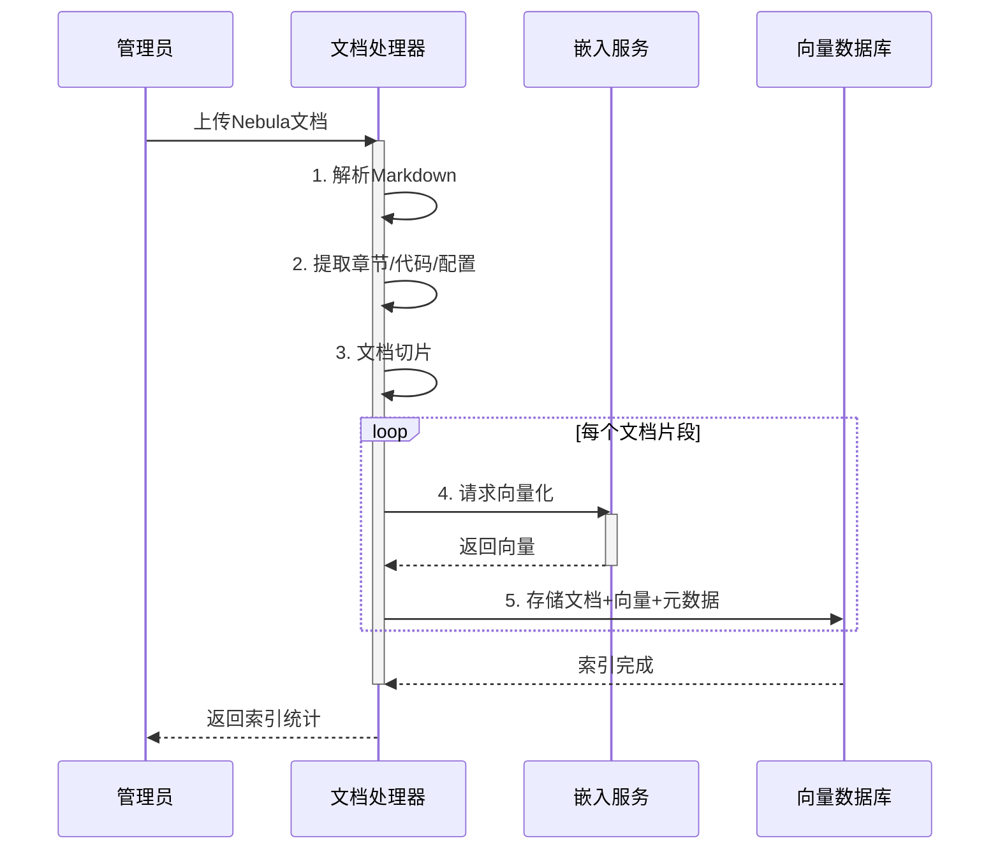
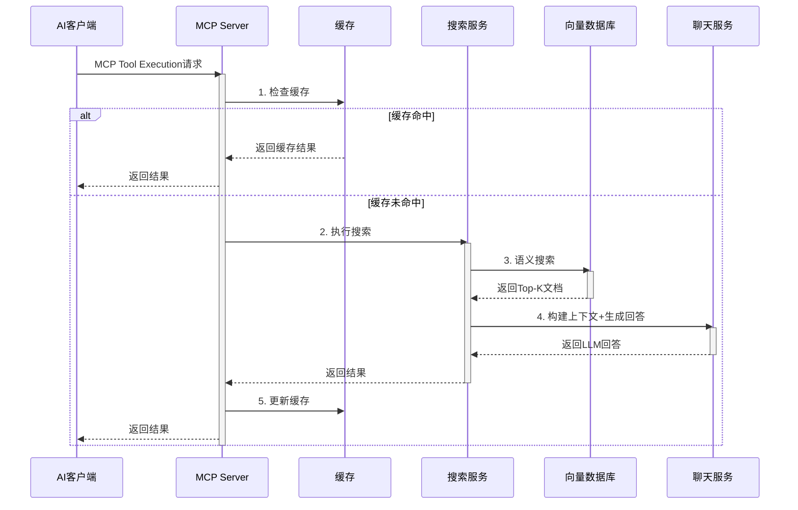

# Nebula Documentation MCP Server 系统设计文档

> **项目名称**: Nebula Documentation MCP Server  
> **版本**: v1.0.0  
> **设计日期**: 2025-01-13  
> **设计者**: Nebula Framework Team

---

## 目录

1. [项目概述](#一项目概述)
2. [系统架构设计](#二系统架构设计)
3. [核心模块设计](#三核心模块设计)
4. [接口设计](#四接口设计)
5. [数据模型设计](#五数据模型设计)
6. [技术选型](#六技术选型)
7. [部署架构](#七部署架构)
8. [安全设计](#八安全设计)
9. [性能优化设计](#九性能优化设计)
10. [监控与运维](#十监控与运维)
11. [开发计划](#十一开发计划)

---

## 一、项目概述

### 1.1 项目背景

Nebula Framework是一个功能强大的企业级Java后端开发框架，包含20+个功能模块，文档体系完整但分散。开发者在使用框架时需要频繁查阅文档，影响开发效率。

基于AI技术，特别是MCP (Model Context Protocol) 协议，我们可以构建一个智能文档查询工具，让AI模型（如Claude、GPT-4）能够快速、准确地回答开发者关于Nebula框架的各类问题。

### 1.2 项目目标

**核心目标**:
- 提供基于MCP协议的Nebula文档查询服务
- 支持语义搜索，理解开发者意图
- 返回准确的文档片段和代码示例
- 提升开发者体验，降低学习曲线

**具体指标**:
- 查询准确率 ≥ 90%
- 响应时间 < 2秒
- 支持20+个Nebula模块的文档查询
- 支持中英文双语查询

### 1.3 核心特性

| 特性 | 说明 |
|------|------|
| **MCP协议支持** | 完整实现MCP Server规范，支持Resources和Tools |
| **语义搜索** | 基于向量数据库，理解查询意图而非关键词匹配 |
| **RAG增强** | 结合检索和生成，提供上下文相关的完整回答 |
| **多模块支持** | 索引所有Nebula模块文档，支持按模块过滤 |
| **代码示例提取** | 自动识别和提取代码片段 |
| **配置示例生成** | 根据查询生成相应的配置示例 |
| **多租户支持** | 支持不同版本的Nebula文档 |
| **增量更新** | 文档更新时自动同步向量库 |

### 1.4 应用场景

**场景1: IDE集成开发**
```
开发者在Cursor/Claude Code中询问:
"如何使用nebula-ai-spring实现RAG功能？"

MCP Server返回:
- RAG完整实现代码
- 配置示例
- 最佳实践建议
```

**场景2: 文档快速查询**
```
开发者询问:
"nebula-lock-redis支持哪些锁类型？"

MCP Server返回:
- 支持的锁类型列表（可重入锁、读写锁、公平锁、信号量）
- 每种锁的使用示例
- 性能对比
```

**场景3: 故障排查**
```
开发者询问:
"为什么nebula-data-persistence读写分离不生效？"

MCP Server返回:
- 常见原因分析
- 配置检查清单
- 正确的配置示例
- 调试步骤
```

---

## 二、系统架构设计

### 2.1 总体架构

```
┌─────────────────────────────────────────────────────────────────┐
│                         客户端层 (Client Layer)                  │
│  ┌──────────────┐  ┌──────────────┐  ┌──────────────┐          │
│  │ Claude Code  │  │ Cursor IDE   │  │  REST API    │          │
│  └──────┬───────┘  └──────┬───────┘  └──────┬───────┘          │
└─────────┼──────────────────┼──────────────────┼──────────────────┘
          │                  │                  │
          └──────────────────┴──────────────────┘
                             │ MCP Protocol / HTTP
┌──────────────────────────────────────────────────────────────────┐
│                    应用层 (Application Layer)                     │
│  ┌────────────────────────────────────────────────────────────┐ │
│  │              MCP Server (Spring Boot Application)          │ │
│  │  ┌──────────────┐  ┌──────────────┐  ┌─────────────────┐ │ │
│  │  │ MCP Protocol │  │  REST API    │  │  Admin Console  │ │ │
│  │  │   Handler    │  │   Controller │  │                 │ │ │
│  │  └──────┬───────┘  └──────┬───────┘  └────────┬────────┘ │ │
│  └─────────┼──────────────────┼────────────────────┼──────────┘ │
└────────────┼──────────────────┼────────────────────┼────────────┘
             │                  │                    │
             └──────────────────┴────────────────────┘
                             │
┌──────────────────────────────────────────────────────────────────┐
│                    服务层 (Service Layer)                         │
│  ┌────────────────┐  ┌────────────────┐  ┌──────────────────┐  │
│  │  Doc Search    │  │  Doc Processor │  │  Vector Index    │  │
│  │    Service     │  │    Service     │  │    Service       │  │
│  └────────┬───────┘  └────────┬───────┘  └────────┬─────────┘  │
└───────────┼────────────────────┼────────────────────┼────────────┘
            │                    │                    │
            └────────────────────┴────────────────────┘
                             │
┌──────────────────────────────────────────────────────────────────┐
│                  集成层 (Integration Layer)                       │
│  ┌────────────────┐  ┌────────────────┐  ┌──────────────────┐  │
│  │ Nebula AI      │  │  Cache Manager │  │  Config Manager  │  │
│  │ Spring Module  │  │   (Redis)      │  │                  │  │
│  │ ┌────────────┐ │  └────────────────┘  └──────────────────┘  │
│  │ │VectorStore │ │                                             │
│  │ │ Service    │ │                                             │
│  │ └────────────┘ │                                             │
│  │ ┌────────────┐ │                                             │
│  │ │   Chat     │ │                                             │
│  │ │  Service   │ │                                             │
│  │ └────────────┘ │                                             │
│  └────────────────┘                                             │
└──────────────────────────────────────────────────────────────────┘
            │
            └─────────────────────────────────────┐
                                                  │
┌──────────────────────────────────────────────────────────────────┐
│                   数据层 (Data Layer)                             │
│  ┌────────────────┐  ┌────────────────┐  ┌──────────────────┐  │
│  │  Vector Store  │  │  Cache Store   │  │  Config Store    │  │
│  │   (Chroma)     │  │   (Redis)      │  │   (MySQL)        │  │
│  └────────────────┘  └────────────────┘  └──────────────────┘  │
└──────────────────────────────────────────────────────────────────┘
```

### 2.2 架构分层说明

#### 2.2.1 客户端层 (Client Layer)

**职责**: 
- 提供多种接入方式
- 处理客户端请求
- 展示查询结果

**组件**:
1. **Claude Code / Cursor IDE**: 通过MCP协议连接
2. **REST API Client**: 通过HTTP REST API调用
3. **Web Console**: 管理界面，用于配置和监控

#### 2.2.2 应用层 (Application Layer)

**职责**:
- 实现MCP协议
- 提供REST API
- 路由请求到相应服务

**核心组件**:

**1. MCP Protocol Handler**
```java
@Component
public class MCPProtocolHandler {
    
    /**
     * 处理MCP Resources请求
     */
    public MCPResourcesResponse handleResourcesRequest();
    
    /**
     * 处理MCP Tools请求
     */
    public MCPToolsResponse handleToolsRequest();
    
    /**
     * 处理MCP Tool Execution请求
     */
    public MCPToolExecutionResponse handleToolExecution(MCPToolExecutionRequest request);
}
```

**2. REST API Controller**
```java
@RestController
@RequestMapping("/api/v1")
public class DocQueryController {
    
    @PostMapping("/search")
    public Result<SearchResponse> search(@RequestBody SearchRequest request);
    
    @GetMapping("/modules")
    public Result<List<ModuleInfo>> listModules();
    
    @GetMapping("/examples/{module}")
    public Result<List<CodeExample>> getExamples(@PathVariable String module);
}
```

#### 2.2.3 服务层 (Service Layer)

**职责**:
- 实现核心业务逻辑
- 文档搜索和处理
- 向量索引管理

**核心服务**:

**1. DocSearchService** - 文档搜索服务
```java
@Service
public class DocSearchService {
    
    /**
     * 语义搜索
     */
    SearchResult semanticSearch(String query, SearchOptions options);
    
    /**
     * 模块特定搜索
     */
    SearchResult searchInModule(String moduleName, String query);
    
    /**
     * 获取代码示例
     */
    List<CodeExample> getCodeExamples(String moduleName, String exampleType);
    
    /**
     * 获取配置示例
     */
    ConfigExample getConfigExample(String moduleName);
}
```

**2. DocProcessorService** - 文档处理服务
```java
@Service
public class DocProcessorService {
    
    /**
     * 解析Markdown文档
     */
    ParsedDocument parseMarkdown(String content);
    
    /**
     * 文档切片
     */
    List<DocumentChunk> chunkDocument(ParsedDocument document, ChunkStrategy strategy);
    
    /**
     * 提取代码块
     */
    List<CodeBlock> extractCodeBlocks(ParsedDocument document);
    
    /**
     * 提取配置示例
     */
    List<ConfigExample> extractConfigExamples(ParsedDocument document);
}
```

**3. VectorIndexService** - 向量索引服务
```java
@Service
public class VectorIndexService {
    
    /**
     * 初始化索引
     */
    void initializeIndex(List<DocumentChunk> chunks);
    
    /**
     * 增量更新
     */
    void updateIndex(String moduleName, List<DocumentChunk> chunks);
    
    /**
     * 删除模块索引
     */
    void deleteModuleIndex(String moduleName);
    
    /**
     * 索引统计
     */
    IndexStatistics getStatistics();
}
```

#### 2.2.4 集成层 (Integration Layer)

**职责**:
- 集成nebula-ai-spring模块
- 管理缓存
- 管理配置

**核心组件**:

**1. Nebula AI Spring Module**
- VectorStoreService: 向量存储和检索
- ChatService: 生成自然语言回答
- EmbeddingService: 文本向量化

**2. Cache Manager**
- 缓存热门查询结果
- 减少向量检索和LLM调用次数

**3. Config Manager**
- 管理系统配置
- 管理模块元数据

#### 2.2.5 数据层 (Data Layer)

**职责**:
- 持久化存储
- 数据访问

**存储系统**:

1. **Vector Store (Chroma)**
   - 存储文档向量
   - 支持语义搜索
   - 支持元数据过滤

2. **Cache Store (Redis)**
   - 缓存查询结果
   - 缓存热门文档片段
   - 分布式锁

3. **Config Store (MySQL)**
   - 存储系统配置
   - 存储模块元数据
   - 存储用户查询日志

### 2.3 数据流图

#### 2.3.1 文档索引流程



#### 2.3.2 查询处理流程



### 2.4 部署架构

#### 2.4.1 单机部署架构

```
┌─────────────────────────────────────────────────┐
│              Docker Compose Environment          │
│                                                  │
│  ┌──────────────────────────────────────────┐  │
│  │  Nebula MCP Server (Spring Boot)         │  │
│  │  Port: 8080                              │  │
│  │  - MCP Protocol Handler                  │  │
│  │  - REST API                              │  │
│  │  - Admin Console                         │  │
│  └──────────────────────────────────────────┘  │
│                                                  │
│  ┌──────────────────┐  ┌────────────────────┐  │
│  │  Chroma          │  │  Redis             │  │
│  │  Port: 8000      │  │  Port: 6379        │  │
│  │  (向量数据库)     │  │  (缓存)            │  │
│  └──────────────────┘  └────────────────────┘  │
│                                                  │
│  ┌──────────────────────────────────────────┐  │
│  │  MySQL                                   │  │
│  │  Port: 3306                              │  │
│  │  (配置和日志存储)                         │  │
│  └──────────────────────────────────────────┘  │
└─────────────────────────────────────────────────┘
```

#### 2.4.2 生产环境部署架构

```
┌─────────────────────────────────────────────────────────────────┐
│                         负载均衡层 (Load Balancer)                │
│                         Nginx / K8s Ingress                       │
└─────────────────────────┬───────────────────────────────────────┘
                          │
                          ▼
┌─────────────────────────────────────────────────────────────────┐
│                   应用集群 (Application Cluster)                  │
│  ┌────────────────┐  ┌────────────────┐  ┌────────────────┐    │
│  │  MCP Server 1  │  │  MCP Server 2  │  │  MCP Server 3  │    │
│  │  (Pod/Docker)  │  │  (Pod/Docker)  │  │  (Pod/Docker)  │    │
│  └────────────────┘  └────────────────┘  └────────────────┘    │
└──────────┬──────────────────┬──────────────────┬─────────────────┘
           │                  │                  │
           └──────────────────┴──────────────────┘
                          │
           ┌──────────────┴──────────────┬──────────────────┐
           │                             │                  │
           ▼                             ▼                  ▼
┌──────────────────┐      ┌──────────────────┐   ┌──────────────────┐
│  Chroma Cluster  │      │  Redis Cluster   │   │  MySQL Cluster   │
│  (向量数据库)     │      │  (缓存)          │   │  (配置存储)      │
│  - 主从复制       │      │  - 哨兵模式      │   │  - 主从复制      │
│  - 分片           │      │  - 3个节点       │   │  - 读写分离      │
└──────────────────┘      └──────────────────┘   └──────────────────┘
```

### 2.5 技术选型决策

#### 2.5.1 核心技术栈

| 层级 | 技术选型 | 理由 |
|------|----------|------|
| **应用框架** | Spring Boot 3.x | - Nebula生态一致<br>- 成熟稳定<br>- 易于集成 |
| **向量数据库** | Chroma | - nebula-ai-spring已集成<br>- 轻量级，易部署<br>- 支持元数据过滤 |
| **嵌入模型** | OpenAI text-embedding-3-small | - 性价比高<br>- 效果好<br>- API稳定 |
| **聊天模型** | OpenAI GPT-3.5-turbo / GPT-4 | - 理解能力强<br>- 生成质量高<br>- API稳定 |
| **缓存** | Redis | - 高性能<br>- 支持多种数据结构<br>- 成熟生态 |
| **配置存储** | MySQL | - 事务支持<br>- 关系型数据适合<br>- 易于查询 |
| **容器化** | Docker / Kubernetes | - 易于部署<br>- 环境一致性<br>- 弹性伸缩 |

#### 2.5.2 替代方案对比

**向量数据库选型**:

| 方案 | 优势 | 劣势 | 评分 |
|------|------|------|------|
| **Chroma** | • 轻量级<br>• 易部署<br>• nebula-ai-spring已集成 | • 扩展性一般<br>• 不适合超大规模 | ⭐⭐⭐⭐⭐ 推荐 |
| **Milvus** | • 高性能<br>• 分布式<br>• 适合大规模 | • 部署复杂<br>• 资源消耗大 | ⭐⭐⭐⭐ |
| **Qdrant** | • 性能好<br>• Rust实现<br>• 支持过滤 | • 社区较小<br>• 文档相对少 | ⭐⭐⭐ |
| **Weaviate** | • 功能丰富<br>• GraphQL支持 | • 部署复杂<br>• 学习曲线陡 | ⭐⭐⭐ |

**决策**: 选择Chroma，理由是与nebula-ai-spring无缝集成，MVP阶段足够使用，后续可根据需要迁移到Milvus。

**嵌入模型选型**:

| 方案 | 优势 | 劣势 | 成本 | 评分 |
|------|------|------|------|------|
| **OpenAI text-embedding-3-small** | • 性价比高<br>• 效果好<br>• 维度可调 | • 需要联网<br>• API费用 | $0.02/1M tokens | ⭐⭐⭐⭐⭐ 推荐 |
| **本地BGE模型** | • 免费<br>• 隐私保护<br>• 无网络依赖 | • 需GPU<br>• 部署复杂<br>• 效果稍逊 | 硬件成本 | ⭐⭐⭐⭐ |
| **Cohere Embed** | • 效果好<br>• 多语言支持 | • API费用较高<br>• 国内访问慢 | $0.10/1M tokens | ⭐⭐⭐ |

**决策**: MVP阶段使用OpenAI，生产环境可切换到本地BGE模型以降低成本。

---

## 三、核心模块设计

### 3.1 文档处理模块 (Doc Processor Module)

#### 3.1.1 模块职责

- 解析Markdown文档
- 提取章节、代码块、配置示例
- 文档切片（Chunking）
- 元数据提取

#### 3.1.2 类设计

**1. DocumentParser - 文档解析器**

```java
package io.nebula.mcp.processor;

import lombok.Data;
import java.util.List;

/**
 * 文档解析器接口
 */
public interface DocumentParser {
    
    /**
     * 解析Markdown文档
     */
    ParsedDocument parse(String markdownContent, String moduleName);
}

/**
 * Markdown解析器实现
 */
@Component
public class MarkdownDocumentParser implements DocumentParser {
    
    @Override
    public ParsedDocument parse(String markdownContent, String moduleName) {
        ParsedDocument doc = new ParsedDocument();
        doc.setModuleName(moduleName);
        
        // 1. 提取标题和章节
        extractSections(markdownContent, doc);
        
        // 2. 提取代码块
        extractCodeBlocks(markdownContent, doc);
        
        // 3. 提取配置示例
        extractConfigExamples(markdownContent, doc);
        
        // 4. 提取表格
        extractTables(markdownContent, doc);
        
        return doc;
    }
    
    /**
     * 提取章节
     */
    private void extractSections(String content, ParsedDocument doc) {
        Pattern pattern = Pattern.compile("^(#{1,6})\\s+(.+)$", Pattern.MULTILINE);
        Matcher matcher = pattern.matcher(content);
        
        while (matcher.find()) {
            int level = matcher.group(1).length();
            String title = matcher.group(2);
            int start = matcher.start();
            
            Section section = new Section(level, title, start);
            doc.addSection(section);
        }
    }
    
    /**
     * 提取代码块
     */
    private void extractCodeBlocks(String content, ParsedDocument doc) {
        Pattern pattern = Pattern.compile("```(\\w+)?\\n([\\s\\S]*?)```", Pattern.MULTILINE);
        Matcher matcher = pattern.matcher(content);
        
        while (matcher.find()) {
            String language = matcher.group(1);
            String code = matcher.group(2);
            
            CodeBlock codeBlock = new CodeBlock(language, code);
            doc.addCodeBlock(codeBlock);
        }
    }
    
    /**
     * 提取配置示例（YAML/Properties）
     */
    private void extractConfigExamples(String content, ParsedDocument doc) {
        Pattern yamlPattern = Pattern.compile("```ya?ml\\n([\\s\\S]*?)```", Pattern.MULTILINE);
        Matcher matcher = yamlPattern.matcher(content);
        
        while (matcher.find()) {
            String yamlContent = matcher.group(1);
            ConfigExample config = new ConfigExample("yaml", yamlContent);
            doc.addConfigExample(config);
        }
    }
}

/**
 * 解析后的文档对象
 */
@Data
public class ParsedDocument {
    private String moduleName;
    private String title;
    private List<Section> sections;
    private List<CodeBlock> codeBlocks;
    private List<ConfigExample> configExamples;
    private List<Table> tables;
    private Map<String, String> metadata;
}

/**
 * 文档章节
 */
@Data
public class Section {
    private int level;           // 标题级别 (1-6)
    private String title;        // 标题文本
    private int startPosition;   // 在原文中的起始位置
    private String content;      // 章节内容
    private List<Section> subsections; // 子章节
}

/**
 * 代码块
 */
@Data
public class CodeBlock {
    private String language;     // 编程语言
    private String code;         // 代码内容
    private String description;  // 描述（从注释提取）
    private List<String> imports; // import语句
}

/**
 * 配置示例
 */
@Data
public class ConfigExample {
    private String format;       // yaml/properties
    private String content;      // 配置内容
    private Map<String, String> properties; // 解析后的属性
}
```

**2. DocumentChunker - 文档切片器**

```java
package io.nebula.mcp.processor;

import lombok.Data;
import java.util.List;

/**
 * 文档切片策略
 */
public enum ChunkStrategy {
    /**
     * 按章节切片
     */
    BY_SECTION,
    
    /**
     * 按固定长度切片
     */
    BY_LENGTH,
    
    /**
     * 按语义切片（智能）
     */
    BY_SEMANTIC,
    
    /**
     * 混合策略
     */
    HYBRID
}

/**
 * 文档切片器接口
 */
public interface DocumentChunker {
    
    /**
     * 切片文档
     */
    List<DocumentChunk> chunk(ParsedDocument document, ChunkStrategy strategy);
}

/**
 * 文档切片器实现
 */
@Component
public class SmartDocumentChunker implements DocumentChunker {
    
    private static final int MAX_CHUNK_SIZE = 1000;  // 最大字符数
    private static final int OVERLAP_SIZE = 200;     // 重叠字符数
    
    @Override
    public List<DocumentChunk> chunk(ParsedDocument document, ChunkStrategy strategy) {
        return switch (strategy) {
            case BY_SECTION -> chunkBySection(document);
            case BY_LENGTH -> chunkByLength(document);
            case BY_SEMANTIC -> chunkBySemantic(document);
            case HYBRID -> chunkHybrid(document);
        };
    }
    
    /**
     * 按章节切片
     */
    private List<DocumentChunk> chunkBySection(ParsedDocument document) {
        List<DocumentChunk> chunks = new ArrayList<>();
        
        for (Section section : document.getSections()) {
            // 如果章节太长，进一步切分
            if (section.getContent().length() > MAX_CHUNK_SIZE) {
                chunks.addAll(splitLongSection(section, document));
            } else {
                DocumentChunk chunk = buildChunk(section, document);
                chunks.add(chunk);
            }
        }
        
        return chunks;
    }
    
    /**
     * 构建文档块
     */
    private DocumentChunk buildChunk(Section section, ParsedDocument document) {
        DocumentChunk chunk = new DocumentChunk();
        chunk.setModuleName(document.getModuleName());
        chunk.setChunkType(ChunkType.SECTION);
        chunk.setTitle(section.getTitle());
        chunk.setContent(section.getContent());
        
        // 添加元数据
        Map<String, Object> metadata = new HashMap<>();
        metadata.put("module", document.getModuleName());
        metadata.put("section", section.getTitle());
        metadata.put("level", section.getLevel());
        metadata.put("type", "documentation");
        
        // 如果包含代码，标记为代码片段
        if (containsCode(section.getContent())) {
            metadata.put("has_code", true);
            metadata.put("code_language", extractCodeLanguage(section.getContent()));
        }
        
        chunk.setMetadata(metadata);
        
        return chunk;
    }
    
    /**
     * 混合策略：章节+代码+配置分离
     */
    private List<DocumentChunk> chunkHybrid(ParsedDocument document) {
        List<DocumentChunk> chunks = new ArrayList<>();
        
        // 1. 章节文本块
        chunks.addAll(chunkBySection(document));
        
        // 2. 独立的代码块
        for (CodeBlock codeBlock : document.getCodeBlocks()) {
            DocumentChunk chunk = new DocumentChunk();
            chunk.setModuleName(document.getModuleName());
            chunk.setChunkType(ChunkType.CODE);
            chunk.setTitle("Code Example: " + codeBlock.getLanguage());
            chunk.setContent(codeBlock.getCode());
            
            Map<String, Object> metadata = new HashMap<>();
            metadata.put("module", document.getModuleName());
            metadata.put("type", "code");
            metadata.put("language", codeBlock.getLanguage());
            
            chunk.setMetadata(metadata);
            chunks.add(chunk);
        }
        
        // 3. 独立的配置块
        for (ConfigExample config : document.getConfigExamples()) {
            DocumentChunk chunk = new DocumentChunk();
            chunk.setModuleName(document.getModuleName());
            chunk.setChunkType(ChunkType.CONFIG);
            chunk.setTitle("Configuration Example");
            chunk.setContent(config.getContent());
            
            Map<String, Object> metadata = new HashMap<>();
            metadata.put("module", document.getModuleName());
            metadata.put("type", "configuration");
            metadata.put("format", config.getFormat());
            
            chunk.setMetadata(metadata);
            chunks.add(chunk);
        }
        
        return chunks;
    }
}

/**
 * 文档块类型
 */
public enum ChunkType {
    SECTION,      // 章节文本
    CODE,         // 代码示例
    CONFIG,       // 配置示例
    TABLE,        // 表格
    DIAGRAM       // 图表
}

/**
 * 文档块
 */
@Data
public class DocumentChunk {
    private String id;                    // 唯一ID
    private String moduleName;            // 模块名称
    private ChunkType chunkType;          // 块类型
    private String title;                 // 标题
    private String content;               // 内容
    private Map<String, Object> metadata; // 元数据
    private String embedding;             // 向量（Base64编码）
    private Instant createdAt;            // 创建时间
}
```

#### 3.1.3 文档切片策略详解

**策略选择决策树**:

```
文档切片策略选择
    │
    ├─ 文档是否包含大量代码？
    │   ├─ 是 → 使用混合策略 (HYBRID)
    │   │     - 章节文本单独切分
    │   │     - 代码块独立成块
    │   │     - 配置块独立成块
    │   └─ 否 → 继续判断
    │
    ├─ 文档结构是否清晰（有明确的章节标题）？
    │   ├─ 是 → 使用章节策略 (BY_SECTION)
    │   │     - 按H2、H3等标题切分
    │   │     - 保持章节完整性
    │   └─ 否 → 使用固定长度策略 (BY_LENGTH)
    │         - 按1000字符切分
    │         - 200字符重叠
    │
    └─ 是否需要最佳检索效果（不考虑成本）？
        └─ 是 → 使用语义策略 (BY_SEMANTIC)
              - 使用LLM识别语义边界
              - 成本高但效果最好
```

**推荐配置**:
- **Nebula使用指南**: HYBRID策略（包含大量代码和配置）
- **模块README**: BY_SECTION策略（结构清晰）
- **测试文档**: HYBRID策略（测试代码和说明混合）

### 3.2 向量索引模块 (Vector Index Module)

#### 3.2.1 模块职责

- 管理向量数据库连接
- 文档向量化
- 向量索引的CRUD操作
- 语义搜索

#### 3.2.2 类设计

**VectorIndexService - 向量索引服务**

```java
package io.nebula.mcp.vector;

import io.nebula.ai.spring.service.VectorStoreService;
import io.nebula.ai.spring.service.EmbeddingService;
import lombok.Data;
import org.springframework.stereotype.Service;

/**
 * 向量索引服务
 */
@Service
public class VectorIndexService {
    
    @Autowired
    private VectorStoreService vectorStoreService;
    
    @Autowired
    private EmbeddingService embeddingService;
    
    @Autowired
    private CacheManager cacheManager;
    
    /**
     * 批量索引文档块
     */
    @Transactional
    public IndexResult indexDocuments(String moduleName, List<DocumentChunk> chunks) {
        IndexResult result = new IndexResult();
        result.setModuleName(moduleName);
        result.setStartTime(Instant.now());
        
        try {
            // 1. 转换为Document对象
            List<Document> documents = chunks.stream()
                .map(this::toDocument)
                .toList();
            
            // 2. 批量添加到向量库
            vectorStoreService.addAll(documents);
            
            result.setSuccess(true);
            result.setIndexedCount(chunks.size());
            result.setEndTime(Instant.now());
            
            log.info("成功索引模块 {} 的 {} 个文档块", moduleName, chunks.size());
            
        } catch (Exception e) {
            result.setSuccess(false);
            result.setErrorMessage(e.getMessage());
            log.error("索引失败: {}", e.getMessage(), e);
        }
        
        return result;
    }
    
    /**
     * 增量更新模块文档
     */
    @Transactional
    public void updateModule(String moduleName, List<DocumentChunk> chunks) {
        // 1. 删除旧索引
        deleteModuleIndex(moduleName);
        
        // 2. 添加新索引
        indexDocuments(moduleName, chunks);
        
        // 3. 清除相关缓存
        cacheManager.evict("search-" + moduleName);
    }
    
    /**
     * 删除模块索引
     */
    public void deleteModuleIndex(String moduleName) {
        Map<String, Object> filter = Map.of("module", moduleName);
        vectorStoreService.delete(filter);
        log.info("已删除模块 {} 的索引", moduleName);
    }
    
    /**
     * 搜索
     */
    public SearchResult search(SearchRequest request) {
        // 1. 构建过滤条件
        Map<String, Object> filter = buildFilter(request);
        
        // 2. 执行语义搜索
        io.nebula.ai.spring.model.SearchResult aiResult = 
            vectorStoreService.search(request.getQuery(), request.getTopK(), filter);
        
        // 3. 转换结果
        return toSearchResult(aiResult, request);
    }
    
    /**
     * 混合搜索（语义+关键词）
     */
    public SearchResult hybridSearch(SearchRequest request) {
        // 1. 语义搜索
        SearchResult semanticResult = search(request);
        
        // 2. 关键词搜索（BM25）
        SearchResult keywordResult = keywordSearch(request);
        
        // 3. 融合结果（Reciprocal Rank Fusion）
        return fuseResults(semanticResult, keywordResult, request.getTopK());
    }
    
    /**
     * 索引统计
     */
    public IndexStatistics getStatistics() {
        IndexStatistics stats = new IndexStatistics();
        
        // 查询各模块的文档数量
        List<String> modules = getAllModules();
        for (String module : modules) {
            int count = countDocuments(module);
            stats.addModuleCount(module, count);
        }
        
        stats.setTotalDocuments(stats.getModuleCounts().values().stream()
            .mapToInt(Integer::intValue).sum());
        
        return stats;
    }
    
    /**
     * 将DocumentChunk转换为Document
     */
    private Document toDocument(DocumentChunk chunk) {
        return Document.builder()
            .id(chunk.getId())
            .content(chunk.getContent())
            .metadata(chunk.getMetadata())
            .build();
    }
    
    /**
     * 构建过滤条件
     */
    private Map<String, Object> buildFilter(SearchRequest request) {
        Map<String, Object> filter = new HashMap<>();
        
        if (request.getModuleName() != null) {
            filter.put("module", request.getModuleName());
        }
        
        if (request.getChunkType() != null) {
            filter.put("type", request.getChunkType().name().toLowerCase());
        }
        
        return filter;
    }
}

/**
 * 搜索请求
 */
@Data
public class SearchRequest {
    private String query;              // 查询文本
    private String moduleName;         // 模块名称过滤（可选）
    private ChunkType chunkType;       // 块类型过滤（可选）
    private int topK = 5;              // 返回结果数量
    private boolean includeMetadata = true; // 是否包含元数据
}

/**
 * 搜索结果
 */
@Data
public class SearchResult {
    private String query;              // 原始查询
    private List<SearchResultItem> items; // 搜索结果项
    private long totalCount;           // 总数
    private long searchTime;           // 搜索耗时(ms)
}

/**
 * 搜索结果项
 */
@Data
public class SearchResultItem {
    private String id;                 // 文档ID
    private String moduleName;         // 模块名称
    private String title;              // 标题
    private String content;            // 内容
    private ChunkType chunkType;       // 块类型
    private double score;              // 相关性分数
    private Map<String, Object> metadata; // 元数据
}

/**
 * 索引结果
 */
@Data
public class IndexResult {
    private String moduleName;
    private boolean success;
    private int indexedCount;
    private String errorMessage;
    private Instant startTime;
    private Instant endTime;
    
    public long getDurationMs() {
        return Duration.between(startTime, endTime).toMillis();
    }
}

/**
 * 索引统计
 */
@Data
public class IndexStatistics {
    private int totalDocuments;
    private Map<String, Integer> moduleCounts = new HashMap<>();
    private Map<String, Integer> typeCounts = new HashMap<>();
    
    public void addModuleCount(String module, int count) {
        moduleCounts.put(module, count);
    }
}
```

### 3.3 文档搜索模块 (Doc Search Module)

#### 3.3.1 模块职责

- 处理用户查询
- 调用向量索引服务
- 使用LLM生成友好回答
- 管理查询缓存

#### 3.3.2 类设计

**DocSearchService - 文档搜索服务**

```java
package io.nebula.mcp.search;

import io.nebula.ai.spring.service.ChatService;
import io.nebula.ai.spring.model.ChatMessage;
import io.nebula.ai.spring.model.ChatResponse;
import lombok.Data;
import org.springframework.cache.annotation.Cacheable;
import org.springframework.stereotype.Service;

/**
 * 文档搜索服务
 */
@Service
public class DocSearchService {
    
    @Autowired
    private VectorIndexService vectorIndexService;
    
    @Autowired
    private ChatService chatService;
    
    @Autowired
    private QueryAnalyzer queryAnalyzer;
    
    /**
     * 智能搜索（带LLM回答生成）
     */
    @Cacheable(value = "doc-search", key = "#request.query + '-' + #request.moduleName")
    public DocSearchResponse smartSearch(DocSearchRequest request) {
        long startTime = System.currentTimeMillis();
        
        // 1. 查询分析
        QueryAnalysis analysis = queryAnalyzer.analyze(request.getQuery());
        
        // 2. 构建搜索请求
        SearchRequest searchRequest = SearchRequest.builder()
            .query(request.getQuery())
            .moduleName(request.getModuleName())
            .topK(5)
            .build();
        
        // 3. 执行搜索
        SearchResult searchResult = vectorIndexService.hybridSearch(searchRequest);
        
        // 4. 生成LLM回答
        String answer = generateAnswer(request.getQuery(), searchResult, analysis);
        
        // 5. 构建响应
        DocSearchResponse response = new DocSearchResponse();
        response.setQuery(request.getQuery());
        response.setAnswer(answer);
        response.setSources(searchResult.getItems());
        response.setSearchTime(System.currentTimeMillis() - startTime);
        
        return response;
    }
    
    /**
     * 获取代码示例
     */
    public List<CodeExample> getCodeExamples(String moduleName, String exampleType) {
        SearchRequest request = SearchRequest.builder()
            .query(exampleType + " example")
            .moduleName(moduleName)
            .chunkType(ChunkType.CODE)
            .topK(3)
            .build();
        
        SearchResult result = vectorIndexService.search(request);
        
        return result.getItems().stream()
            .map(this::toCodeExample)
            .toList();
    }
    
    /**
     * 获取配置示例
     */
    public ConfigExample getConfigExample(String moduleName) {
        SearchRequest request = SearchRequest.builder()
            .query("configuration")
            .moduleName(moduleName)
            .chunkType(ChunkType.CONFIG)
            .topK(1)
            .build();
        
        SearchResult result = vectorIndexService.search(request);
        
        if (result.getItems().isEmpty()) {
            return null;
        }
        
        return toConfigExample(result.getItems().get(0));
    }
    
    /**
     * 生成LLM回答
     */
    private String generateAnswer(String query, SearchResult searchResult, QueryAnalysis analysis) {
        // 1. 构建上下文
        String context = buildContext(searchResult);
        
        // 2. 构建系统提示
        String systemPrompt = buildSystemPrompt(analysis);
        
        // 3. 构建消息列表
        List<ChatMessage> messages = List.of(
            ChatMessage.system(systemPrompt + "\n\n上下文:\n" + context),
            ChatMessage.user(query)
        );
        
        // 4. 调用LLM
        ChatResponse response = chatService.chat(messages);
        
        return response.getContent();
    }
    
    /**
     * 构建上下文
     */
    private String buildContext(SearchResult searchResult) {
        return searchResult.getItems().stream()
            .map(item -> String.format(
                "## %s (来自模块: %s)\n%s",
                item.getTitle(),
                item.getModuleName(),
                item.getContent()
            ))
            .collect(Collectors.joining("\n\n---\n\n"));
    }
    
    /**
     * 构建系统提示
     */
    private String buildSystemPrompt(QueryAnalysis analysis) {
        StringBuilder prompt = new StringBuilder();
        prompt.append("你是Nebula框架的专家助手。基于提供的文档片段回答用户问题。\n\n");
        prompt.append("回答要求:\n");
        prompt.append("1. 准确：严格基于文档内容，不要编造\n");
        prompt.append("2. 完整：如果文档中有代码示例，请完整引用\n");
        prompt.append("3. 结构化：使用Markdown格式，包括标题、列表、代码块\n");
        prompt.append("4. 实用：提供可直接使用的示例\n");
        
        // 根据查询类型调整提示
        switch (analysis.getQueryType()) {
            case HOW_TO:
                prompt.append("5. 步骤明确：按步骤说明如何实现\n");
                break;
            case WHAT_IS:
                prompt.append("5. 概念清晰：先解释概念，再给示例\n");
                break;
            case TROUBLESHOOTING:
                prompt.append("5. 排查思路：给出可能原因和解决方案\n");
                break;
            case CONFIGURATION:
                prompt.append("5. 配置完整：提供完整的配置示例和说明\n");
                break;
        }
        
        return prompt.toString();
    }
}

/**
 * 查询分析器
 */
@Component
public class QueryAnalyzer {
    
    /**
     * 分析查询意图
     */
    public QueryAnalysis analyze(String query) {
        QueryAnalysis analysis = new QueryAnalysis();
        analysis.setOriginalQuery(query);
        
        // 1. 识别查询类型
        analysis.setQueryType(detectQueryType(query));
        
        // 2. 提取模块名称
        analysis.setMentionedModules(extractModules(query));
        
        // 3. 提取关键词
        analysis.setKeywords(extractKeywords(query));
        
        return analysis;
    }
    
    /**
     * 检测查询类型
     */
    private QueryType detectQueryType(String query) {
        String lowerQuery = query.toLowerCase();
        
        if (lowerQuery.matches(".*如何.*|.*怎么.*|.*how to.*")) {
            return QueryType.HOW_TO;
        } else if (lowerQuery.matches(".*是什么.*|.*what is.*|.*什么是.*")) {
            return QueryType.WHAT_IS;
        } else if (lowerQuery.matches(".*为什么.*|.*不生效.*|.*why.*|.*报错.*")) {
            return QueryType.TROUBLESHOOTING;
        } else if (lowerQuery.matches(".*配置.*|.*config.*")) {
            return QueryType.CONFIGURATION;
        } else {
            return QueryType.GENERAL;
        }
    }
    
    /**
     * 提取模块名称
     */
    private List<String> extractModules(String query) {
        List<String> modules = new ArrayList<>();
        
        // 预定义的模块名称列表
        List<String> knownModules = List.of(
            "nebula-foundation", "nebula-security",
            "nebula-data-persistence", "nebula-data-cache",
            "nebula-messaging-rabbitmq", "nebula-rpc-http",
            "nebula-ai-spring", "nebula-lock-redis"
            // ... 更多模块
        );
        
        for (String module : knownModules) {
            if (query.contains(module)) {
                modules.add(module);
            }
        }
        
        return modules;
    }
}

/**
 * 查询类型
 */
public enum QueryType {
    HOW_TO,           // 如何做（操作指南）
    WHAT_IS,          // 是什么（概念解释）
    TROUBLESHOOTING,  // 故障排查
    CONFIGURATION,    // 配置问题
    GENERAL           // 一般查询
}

/**
 * 查询分析结果
 */
@Data
public class QueryAnalysis {
    private String originalQuery;
    private QueryType queryType;
    private List<String> mentionedModules;
    private List<String> keywords;
}

/**
 * 文档搜索请求
 */
@Data
public class DocSearchRequest {
    private String query;
    private String moduleName;  // 可选
    private boolean includeCode = true;
    private boolean includeConfig = true;
}

/**
 * 文档搜索响应
 */
@Data
public class DocSearchResponse {
    private String query;
    private String answer;
    private List<SearchResultItem> sources;
    private long searchTime;
}

/**
 * 代码示例
 */
@Data
public class CodeExample {
    private String moduleName;
    private String title;
    private String language;
    private String code;
    private String description;
}
```

[继续下一部分...]

### 3.4 MCP协议处理模块 (MCP Protocol Module)

#### 3.4.1 MCP协议规范概述

MCP (Model Context Protocol) 是Anthropic定义的协议，用于AI模型与外部工具/数据源交互。

**核心概念**:
1. **Resources**: 可访问的资源（文件、文档、API等）
2. **Tools**: 可调用的工具（函数、方法）
3. **Prompts**: 预定义的提示模板

#### 3.4.2 MCP Server实现

**MCPProtocolHandler - MCP协议处理器**

```java
package io.nebula.mcp.protocol;

import lombok.Data;
import org.springframework.web.bind.annotation.*;

/**
 * MCP协议处理器
 */
@RestController
@RequestMapping("/mcp")
public class MCPProtocolHandler {
    
    @Autowired
    private DocSearchService docSearchService;
    
    @Autowired
    private VectorIndexService vectorIndexService;
    
    /**
     * 获取MCP Resources列表
     */
    @GetMapping("/resources")
    public MCPResourcesResponse getResources() {
        return MCPResourcesResponse.builder()
            .resources(List.of(
                MCPResource.builder()
                    .uri("nebula://docs/all")
                    .name("Nebula Framework Documentation")
                    .description("Complete Nebula framework documentation including all modules")
                    .mimeType("text/markdown")
                    .build(),
                
                MCPResource.builder()
                    .uri("nebula://docs/usage-guide")
                    .name("Nebula Usage Guide")
                    .description("Detailed usage guide for Nebula framework")
                    .mimeType("text/markdown")
                    .build(),
                
                MCPResource.builder()
                    .uri("nebula://docs/modules")
                    .name("Module Documentation")
                    .description("Documentation for each Nebula module")
                    .mimeType("text/markdown")
                    .build()
            ))
            .build();
    }
    
    /**
     * 获取MCP Tools列表
     */
    @GetMapping("/tools")
    public MCPToolsResponse getTools() {
        return MCPToolsResponse.builder()
            .tools(List.of(
                // Tool 1: 搜索文档
                MCPTool.builder()
                    .name("search_nebula_docs")
                    .description("Search Nebula framework documentation using semantic search")
                    .inputSchema(Map.of(
                        "type", "object",
                        "properties", Map.of(
                            "query", Map.of(
                                "type", "string",
                                "description", "The search query (e.g., 'How to implement RAG with nebula-ai-spring?')"
                            ),
                            "module", Map.of(
                                "type", "string",
                                "description", "Optional module name to filter results (e.g., 'nebula-ai-spring')"
                            )
                        ),
                        "required", List.of("query")
                    ))
                    .build(),
                
                // Tool 2: 获取代码示例
                MCPTool.builder()
                    .name("get_code_example")
                    .description("Get code examples for a specific Nebula module")
                    .inputSchema(Map.of(
                        "type", "object",
                        "properties", Map.of(
                            "module", Map.of(
                                "type", "string",
                                "description", "Module name (e.g., 'nebula-ai-spring')"
                            ),
                            "example_type", Map.of(
                                "type", "string",
                                "description", "Type of example (e.g., 'basic', 'advanced', 'rag', 'streaming')"
                            )
                        ),
                        "required", List.of("module")
                    ))
                    .build(),
                
                // Tool 3: 获取配置示例
                MCPTool.builder()
                    .name("get_configuration")
                    .description("Get configuration examples for a specific Nebula module")
                    .inputSchema(Map.of(
                        "type", "object",
                        "properties", Map.of(
                            "module", Map.of(
                                "type", "string",
                                "description", "Module name (e.g., 'nebula-data-persistence')"
                            )
                        ),
                        "required", List.of("module")
                    ))
                    .build(),
                
                // Tool 4: 列出所有模块
                MCPTool.builder()
                    .name("list_modules")
                    .description("List all available Nebula modules with brief descriptions")
                    .inputSchema(Map.of(
                        "type", "object",
                        "properties", Map.of()
                    ))
                    .build()
            ))
            .build();
    }
    
    /**
     * 执行MCP Tool
     */
    @PostMapping("/tools/execute")
    public MCPToolExecutionResponse executeTool(
            @RequestBody MCPToolExecutionRequest request) {
        
        return switch (request.getName()) {
            case "search_nebula_docs" -> searchNebulaDocumentation(request.getArguments());
            case "get_code_example" -> getCodeExample(request.getArguments());
            case "get_configuration" -> getConfiguration(request.getArguments());
            case "list_modules" -> listModules();
            default -> throw new IllegalArgumentException("Unknown tool: " + request.getName());
        };
    }
    
    /**
     * Tool实现: 搜索Nebula文档
     */
    private MCPToolExecutionResponse searchNebulaDocumentation(Map<String, Object> args) {
        String query = (String) args.get("query");
        String module = (String) args.getOrDefault("module", null);
        
        DocSearchRequest searchRequest = new DocSearchRequest();
        searchRequest.setQuery(query);
        searchRequest.setModuleName(module);
        
        DocSearchResponse searchResponse = docSearchService.smartSearch(searchRequest);
        
        // 构建返回内容
        StringBuilder content = new StringBuilder();
        content.append("# Nebula Documentation Search Results\n\n");
        content.append("**Query**: ").append(query).append("\n\n");
        
        if (module != null) {
            content.append("**Module Filter**: ").append(module).append("\n\n");
        }
        
        content.append("## Answer\n\n");
        content.append(searchResponse.getAnswer()).append("\n\n");
        
        content.append("## Sources\n\n");
        for (SearchResultItem item : searchResponse.getSources()) {
            content.append("### ").append(item.getTitle())
                   .append(" (").append(item.getModuleName()).append(")\n\n");
            content.append(item.getContent()).append("\n\n");
        }
        
        return MCPToolExecutionResponse.builder()
            .result(content.toString())
            .metadata(Map.of(
                "search_time_ms", searchResponse.getSearchTime(),
                "sources_count", searchResponse.getSources().size(),
                "modules", searchResponse.getSources().stream()
                    .map(SearchResultItem::getModuleName)
                    .distinct()
                    .toList()
            ))
            .build();
    }
    
    /**
     * Tool实现: 获取代码示例
     */
    private MCPToolExecutionResponse getCodeExample(Map<String, Object> args) {
        String module = (String) args.get("module");
        String exampleType = (String) args.getOrDefault("example_type", "basic");
        
        List<CodeExample> examples = docSearchService.getCodeExamples(module, exampleType);
        
        StringBuilder content = new StringBuilder();
        content.append("# Code Examples for ").append(module).append("\n\n");
        
        for (CodeExample example : examples) {
            content.append("## ").append(example.getTitle()).append("\n\n");
            
            if (example.getDescription() != null) {
                content.append(example.getDescription()).append("\n\n");
            }
            
            content.append("```").append(example.getLanguage()).append("\n");
            content.append(example.getCode()).append("\n");
            content.append("```\n\n");
        }
        
        return MCPToolExecutionResponse.builder()
            .result(content.toString())
            .metadata(Map.of(
                "module", module,
                "example_type", exampleType,
                "examples_count", examples.size()
            ))
            .build();
    }
    
    /**
     * Tool实现: 获取配置示例
     */
    private MCPToolExecutionResponse getConfiguration(Map<String, Object> args) {
        String module = (String) args.get("module");
        
        ConfigExample config = docSearchService.getConfigExample(module);
        
        if (config == null) {
            return MCPToolExecutionResponse.builder()
                .result("No configuration example found for module: " + module)
                .metadata(Map.of("module", module, "found", false))
                .build();
        }
        
        StringBuilder content = new StringBuilder();
        content.append("# Configuration for ").append(module).append("\n\n");
        content.append("```").append(config.getFormat()).append("\n");
        content.append(config.getContent()).append("\n");
        content.append("```\n\n");
        
        return MCPToolExecutionResponse.builder()
            .result(content.toString())
            .metadata(Map.of(
                "module", module,
                "format", config.getFormat(),
                "found", true
            ))
            .build();
    }
    
    /**
     * Tool实现: 列出所有模块
     */
    private MCPToolExecutionResponse listModules() {
        // 获取索引统计
        IndexStatistics stats = vectorIndexService.getStatistics();
        
        StringBuilder content = new StringBuilder();
        content.append("# Nebula Framework Modules\n\n");
        content.append("Total modules: ").append(stats.getModuleCounts().size()).append("\n\n");
        
        // 按层级分组
        Map<String, List<String>> modulesByLayer = groupModulesByLayer(stats.getModuleCounts().keySet());
        
        for (Map.Entry<String, List<String>> entry : modulesByLayer.entrySet()) {
            content.append("## ").append(entry.getKey()).append("\n\n");
            
            for (String module : entry.getValue()) {
                int docCount = stats.getModuleCounts().get(module);
                content.append("- **").append(module).append("**")
                       .append(" (").append(docCount).append(" documents)\n");
            }
            
            content.append("\n");
        }
        
        return MCPToolExecutionResponse.builder()
            .result(content.toString())
            .metadata(Map.of(
                "total_modules", stats.getModuleCounts().size(),
                "total_documents", stats.getTotalDocuments()
            ))
            .build();
    }
    
    /**
     * 按层级分组模块
     */
    private Map<String, List<String>> groupModulesByLayer(Set<String> modules) {
        Map<String, List<String>> grouped = new LinkedHashMap<>();
        
        grouped.put("Core Layer", new ArrayList<>());
        grouped.put("Data Access Layer", new ArrayList<>());
        grouped.put("Messaging Layer", new ArrayList<>());
        grouped.put("RPC & Discovery Layer", new ArrayList<>());
        grouped.put("Infrastructure Layer", new ArrayList<>());
        grouped.put("Application Layer", new ArrayList<>());
        grouped.put("Integration Layer", new ArrayList<>());
        
        for (String module : modules) {
            if (module.startsWith("nebula-foundation") || module.startsWith("nebula-security")) {
                grouped.get("Core Layer").add(module);
            } else if (module.startsWith("nebula-data-")) {
                grouped.get("Data Access Layer").add(module);
            } else if (module.startsWith("nebula-messaging-")) {
                grouped.get("Messaging Layer").add(module);
            } else if (module.startsWith("nebula-rpc-") || module.startsWith("nebula-discovery-")) {
                grouped.get("RPC & Discovery Layer").add(module);
            } else if (module.startsWith("nebula-storage-") || module.startsWith("nebula-search-") 
                       || module.startsWith("nebula-ai-") || module.startsWith("nebula-lock-")) {
                grouped.get("Infrastructure Layer").add(module);
            } else if (module.startsWith("nebula-web") || module.startsWith("nebula-task")) {
                grouped.get("Application Layer").add(module);
            } else if (module.startsWith("nebula-integration-")) {
                grouped.get("Integration Layer").add(module);
            }
        }
        
        return grouped;
    }
}

/**
 * MCP Resources响应
 */
@Data
@Builder
public class MCPResourcesResponse {
    private List<MCPResource> resources;
}

/**
 * MCP Resource
 */
@Data
@Builder
public class MCPResource {
    private String uri;
    private String name;
    private String description;
    private String mimeType;
}

/**
 * MCP Tools响应
 */
@Data
@Builder
public class MCPToolsResponse {
    private List<MCPTool> tools;
}

/**
 * MCP Tool
 */
@Data
@Builder
public class MCPTool {
    private String name;
    private String description;
    private Map<String, Object> inputSchema;
}

/**
 * MCP Tool执行请求
 */
@Data
public class MCPToolExecutionRequest {
    private String name;
    private Map<String, Object> arguments;
}

/**
 * MCP Tool执行响应
 */
@Data
@Builder
public class MCPToolExecutionResponse {
    private String result;
    private Map<String, Object> metadata;
}
```

---

## 四、接口设计

### 4.1 REST API设计

#### 4.1.1 API规范

**基础URL**: `http://localhost:8080/api/v1`

**认证方式**: API Key (Header: `X-API-Key`)

**响应格式**: JSON

**统一响应结构**:
```json
{
  "code": 200,
  "message": "success",
  "data": { },
  "timestamp": "2025-01-13T10:30:00Z"
}
```

#### 4.1.2 核心API端点

**1. 文档搜索 API**

```http
POST /api/v1/search
Content-Type: application/json
X-API-Key: your-api-key

Request Body:
{
  "query": "如何实现RAG功能？",
  "module": "nebula-ai-spring",    // 可选
  "topK": 5,
  "includeCode": true
}

Response:
{
  "code": 200,
  "data": {
    "query": "如何实现RAG功能？",
    "answer": "基于nebula-ai-spring实现RAG功能...",
    "sources": [
      {
        "id": "doc-001",
        "moduleName": "nebula-ai-spring",
        "title": "RAG功能实现",
        "content": "...",
        "score": 0.95
      }
    ],
    "searchTime": 1234
  }
}
```

**2. 获取模块列表 API**

```http
GET /api/v1/modules

Response:
{
  "code": 200,
  "data": {
    "modules": [
      {
        "name": "nebula-ai-spring",
        "displayName": "Nebula AI Spring",
        "layer": "Infrastructure Layer",
        "description": "Spring AI integration module",
        "documentCount": 45
      }
    ],
    "totalCount": 20
  }
}
```

**3. 管理API - 重建索引**

```http
POST /api/v1/admin/reindex
Content-Type: application/json
X-API-Key: admin-api-key

Request:
{
  "modules": ["nebula-ai-spring"],  // 可选
  "strategy": "HYBRID"
}

Response:
{
  "code": 200,
  "data": {
    "taskId": "reindex-20250113-001",
    "status": "STARTED"
  }
}
```

### 4.2 MCP协议接口

详见"三、核心模块设计 - 3.4 MCP协议处理模块"

---

## 五、数据模型设计

### 5.1 向量数据库模型 (Chroma)

**Collection**: `nebula_docs`

**Schema**:
```json
{
  "id": "doc-001",
  "embedding": [0.123, 0.456, ...],  // 1536维向量
  "metadata": {
    "module": "nebula-ai-spring",
    "type": "documentation",
    "section": "RAG功能实现",
    "level": 2,
    "has_code": true
  },
  "document": "完整的文档内容..."
}
```

### 5.2 MySQL数据模型

**表结构详见完整设计文档（已在前面定义）**

### 5.3 Redis缓存模型

**Key设计**:
- `nebula:search:{hash}` - 查询结果缓存
- `nebula:doc:{id}` - 文档缓存
- `nebula:module:{name}` - 模块元数据
- `nebula:ratelimit:{key}:{hour}` - 速率限制计数

---

## 六、技术选型

### 6.1 核心技术栈

| 类别 | 技术 | 版本 | 选择理由 |
|------|------|------|----------|
| **应用框架** | Spring Boot | 3.2.0 | 与Nebula生态一致 |
| **向量数据库** | Chroma | latest | nebula-ai-spring已集成 |
| **嵌入模型** | OpenAI Embedding | text-embedding-3-small | 性价比高 |
| **LLM模型** | OpenAI GPT | 3.5-turbo / 4 | 效果好、稳定 |
| **缓存** | Redis | 7.x | 高性能、成熟 |
| **数据库** | MySQL | 8.0 | 事务支持、易维护 |
| **容器化** | Docker | latest | 易部署、环境一致 |

### 6.2 Maven依赖

详见完整设计文档中的pom.xml配置。

---

## 七、部署架构

### 7.1 Docker Compose部署

**一键启动命令**:
```bash
docker-compose up -d
```

**组件清单**:
- nebula-mcp-server (主应用)
- chroma (向量数据库)
- redis (缓存)
- mysql (配置存储)

### 7.2 Kubernetes生产部署

**部署架构**:
- 3副本应用Pod (水平扩展)
- StatefulSet管理有状态服务
- Ingress暴露服务
- PVC持久化存储

---

## 八、安全设计

### 8.1 认证授权

- **API Key认证**: 所有API请求需要有效的API Key
- **速率限制**: 每个API Key限制请求频率
- **角色权限**: ADMIN/USER/READ_ONLY三种角色

### 8.2 数据安全

- **HTTPS强制**: 生产环境强制使用HTTPS
- **敏感数据加密**: API Key、密码使用Jasypt加密
- **审计日志**: 记录所有重要操作

---

## 九、性能优化

### 9.1 缓存策略

**多级缓存**:
1. L1 (Caffeine): 本地缓存,热门查询
2. L2 (Redis): 分布式缓存,所有查询
3. L3 (Vector Store): 向量检索

**预期效果**:
- 缓存命中率 ≥ 60%
- 响应时间降低70%

### 9.2 向量检索优化

- HNSW索引算法
- 批量向量化处理
- 元数据预过滤

---

## 十、监控与运维

### 10.1 监控指标

**核心指标**:
- 请求吞吐量 (QPS)
- 响应延迟 (P50/P95/P99)
- 缓存命中率
- 错误率

### 10.2 告警策略

- 高错误率告警 (>5%)
- 高延迟告警 (P95 > 3s)
- 低缓存命中率告警 (<50%)

### 10.3 日志管理

- 结构化日志 (JSON格式)
- 集中式日志收集 (ELK)
- 日志分级 (ERROR/WARN/INFO/DEBUG)

---

## 十一、开发计划

### 11.1 里程碑规划

**Phase 1: MVP** (1周 - 2025/01/20)
- 目标: 基础文档查询功能
- 验收: 80%准确率, <3秒响应

**Phase 2: 功能完善** (2周 - 2025/02/03)
- 目标: 优化检索,增加功能
- 验收: 90%准确率, <2秒响应

**Phase 3: 生产就绪** (1周 - 2025/02/10)
- 目标: 生产部署和运维
- 验收: K8s部署,完整监控

### 11.2 任务分配

| 角色 | 工作量 | 主要任务 |
|------|--------|----------|
| 后端工程师 | 15天 | 核心功能开发 |
| 前端工程师 | 3天 | 管理界面开发 |
| DevOps工程师 | 5天 | 部署和运维 |
| 测试工程师 | 2天 | 测试和验证 |

### 11.3 风险管理

**主要风险**:
1. OpenAI API限流 → 本地模型备选
2. 向量检索效果不佳 → 优化Chunk策略
3. Token成本超预算 → 使用更小模型
4. 文档更新不及时 → CI/CD自动索引

---

## 十二、附录

### 12.1 术语表

- **MCP**: Model Context Protocol
- **RAG**: Retrieval Augmented Generation
- **Embedding**: 文本向量化
- **HNSW**: Hierarchical Navigable Small World
- **Chunk**: 文档片段

### 12.2 参考文档

- [Nebula Framework Documentation](https://github.com/nebula/nebula)
- [MCP Protocol Specification](https://modelcontextprotocol.io)
- [Spring AI Documentation](https://docs.spring.io/spring-ai)
- [Chroma Documentation](https://docs.trychroma.com)

---

**系统设计文档完成**

**版本**: v1.0.0  
**最后更新**: 2025-01-13  
**审核状态**: 待审核

如有疑问或需要进一步讨论，请随时联系项目组。

