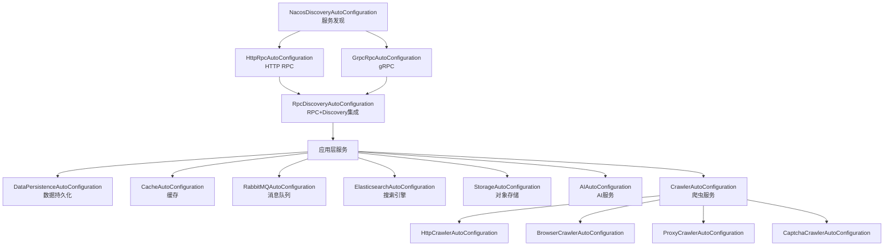
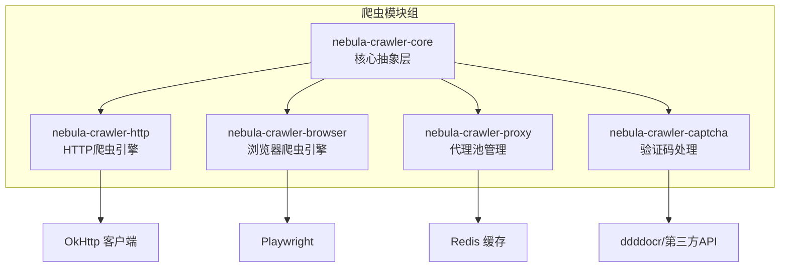

# Nebula 框架使用指南

## 概述

Nebula 是基于 Spring Boot 3.x 和 Java 21 的现代化企业级Java后端框架，采用分层DDD架构设计，提供完整的基础设施支持和开箱即用的企业级功能

## ️ 架构概览

### 模块分层结构
```
nebula/
 core/                    # 核心组件
    nebula-foundation/   # 基础组件
 infrastructure/          # 基础设施层
    data/                # 数据访问
    messaging/           # 消息传递
    rpc/                 # 远程调用
    discovery/           # 服务发现
    storage/             # 对象存储
    search/              # 搜索引擎
    integration/         # 第三方集成
    ai/                  # 人工智能
    crawler/             # 网页爬虫
       nebula-crawler-core/     # 核心抽象层
       nebula-crawler-http/     # HTTP爬虫引擎
       nebula-crawler-browser/  # 浏览器爬虫引擎
       nebula-crawler-proxy/    # 代理池管理
       nebula-crawler-captcha/  # 验证码处理
 application/             # 应用层
    nebula-web/          # Web应用框架
    nebula-task/         # 任务调度框架
 autoconfigure/           # 自动配置
    nebula-autoconfigure/ # 统一自动配置模块
 starter/                 # 启动器
    nebula-starter/      # 便捷启动器（依赖 autoconfigure）
 nebula-example/          # 示例应用
```

##  自动配置架构

### 统一自动配置模块

所有基础设施模块的自动配置类都集中管理在 `nebula-autoconfigure` 模块中，带来以下优势：

#### 核心优势

1. **集中式配置管理**
   - 所有自动配置类集中在一个模块中
   - 更清晰的依赖关系和初始化顺序
   - 避免了模块间的循环依赖问题

2. **更好的开发体验**
   - 应用只需引入 `nebula-autoconfigure` 依赖
   - 零配置启动，按需自动加载功能模块
   - 明确的配置顺序和依赖关系

3. **架构解耦**
   - 基础模块专注于核心功能实现
   - 配置逻辑分离到独立模块
   - 易于扩展和维护

#### 自动配置初始化顺序



#### 快速开始

**1. 添加自动配置依赖**

```xml
<!-- 统一自动配置模块 -->
<dependency>
    <groupId>io.nebula</groupId>
    <artifactId>nebula-autoconfigure</artifactId>
    <version>2.0.1-SNAPSHOT</version>
</dependency>

<!-- 按需添加功能模块 -->
<dependency>
    <groupId>io.nebula</groupId>
    <artifactId>nebula-discovery-nacos</artifactId>
</dependency>
<dependency>
    <groupId>io.nebula</groupId>
    <artifactId>nebula-rpc-http</artifactId>
</dependency>
<dependency>
    <groupId>io.nebula</groupId>
    <artifactId>nebula-data-persistence</artifactId>
</dependency>
<!-- 其他模块... -->
```

**2. 配置应用**

```yaml
spring:
  application:
    name: my-nebula-app

nebula:
  # 服务发现配置
  discovery:
    nacos:
      enabled: true
      server-addr: localhost:8848
      namespace: dev
  
  # RPC 配置
  rpc:
    http:
      enabled: true
    discovery:
      enabled: true
  
  # 数据访问配置
  data:
    persistence:
      enabled: true
    cache:
      enabled: true
```

**3. 启动应用**

所有配置的功能模块将自动初始化并可用，无需手动配置


##  核心模块详解

<!-- ### 1. 数据访问层 (Data Access Layer)

#### nebula-data-access
**核心抽象层，提供统一的数据访问接口**
```java
// 统一Repository接口
@Repository
public class UserRepository extends AbstractRepository<User, Long> {
    
    @Override
    protected Class<User> getEntityClass() {
        return User.class;
    }
}

// 查询构建器
QueryBuilder query = DefaultQueryBuilder.create()
    .eq("status", "ACTIVE")
    .like("name", "张%")
    .gt("createTime", lastWeek)
    .build();
``` -->

#### nebula-data-persistence (MyBatis-Plus集成)
**关系型数据库持久化支持**
```yaml
nebula:
  data:
    persistence:
      # 读写分离配置
      read-write-separation:
        enabled: true
        master:
          url: jdbc:mysql://master:3306/nebula
          username: root
          password: password
        slave:
          url: jdbc:mysql://slave:3306/nebula
          username: reader
          password: password
      # 分库分表配置  
      sharding:
        enabled: true
        tables:
          user:
            actual-data-nodes: ds_${0..1}.user_${0..3}
            table-strategy:
              inline:
                sharding-column: id
                algorithm-expression: user_${id % 4}
```

<!-- #### nebula-data-mongodb (NoSQL支持)
**MongoDB集成支持**
```java
@Service
public class DocumentService {
    
    @Autowired
    private MongoRepository mongoRepository;
    
    public void saveDocument(Document doc) {
        mongoRepository.save(doc);
    }
    
    public List<Document> findByCategory(String category) {
        return mongoRepository.findByCategory(category);
    }
}
``` -->

#### nebula-data-cache (缓存支持)
**多级缓存管理**
```yaml
nebula:
  data:
    cache:
      # 多级缓存配置
      multi-level:
        enabled: true
        local:
          type: caffeine
          max-size: 10000
          expire-after-write: 5m
        remote:
          type: redis
          expire-after-write: 1h
          key-prefix: "nebula:"
```

### 2. 消息传递层 (Messaging Layer)

#### nebula-messaging-core & nebula-messaging-rabbitmq
**消息队列抽象和RabbitMQ实现**
```java
@Service
public class NotificationService {
    
    @Autowired
    private MessageManager messageManager;
    
    public void sendNotification(String userId, String message) {
        Message<String> msg = Message.<String>builder()
            .topic("user-notifications")
            .payload(message)
            .build();
            
        messageManager.getProducer().send("user-notifications", msg);
    }
    
    @MessageHandler("user-notifications")
    public void handleNotification(Message<String> message) {
        // 处理通知消息
        log.info("处理通知: {}", message.getPayload());
    }
}
```

### 3. 服务发现与RPC层

#### nebula-discovery-core & nebula-discovery-nacos
**服务注册发现**
```yaml
nebula:
  discovery:
    nacos:
      enabled: true
      server-addr: localhost:8848
      namespace: nebula-dev
      group: DEFAULT_GROUP
```

#### nebula-rpc-core & nebula-rpc-http  
**远程调用支持**

**RPC 接口定义（API 模块）：**
```java
/**
 * RPC 接口设计原则：
 * - 参数使用具体类型
 * - 返回值使用业务对象
 * - 不使用 HTTP 路径注解（框架自动处理）
 * - 错误通过 BusinessException 抛出
 */
@RpcClient("user-service")
public interface UserRpcClient {
    
    @RpcCall
    User getUserById(Long id);
    
    @RpcCall
    User createUser(CreateUserRequest request);
    
    @RpcCall
    List<User> listUsers();
}
```

**API 模块自动配置（推荐）：**
```java
// UserApiAutoConfiguration.java
@AutoConfiguration
@EnableRpcClients(basePackages = "io.nebula.example.api")
public class UserApiAutoConfiguration {
}
```

配合 `META-INF/spring/org.springframework.boot.autoconfigure.AutoConfiguration.imports` 文件：
```
io.nebula.example.api.UserApiAutoConfiguration
```

**服务消费方使用：**
```java
// 只需添加 API 模块依赖，无需其他配置
@Service
public class OrderService {
    @Autowired
    private UserRpcClient userRpcClient;  // 自动注入
    
    public Order createOrder(Long userId) {
        User user = userRpcClient.getUserById(userId);  // 透明调用
        // ...
    }
}
```

#### nebula-rpc-async
**异步RPC执行支持（解决长时间RPC调用超时问题）**

对于耗时的RPC操作（如数据抓取、批量处理），使用 `@AsyncRpc` 注解避免超时。

**接口定义方式（推荐）：**

```java
// 1. 服务端接口（纯业务，同步方法）
public interface DataProcessService {
    ProcessResult processData(ProcessRequest request);
}

// 2. 客户端RPC接口（继承 + 异步增强）
@RpcClient("data-service")
public interface DataProcessRpcClient extends DataProcessService {
    
    // 继承同步方法：processData()
    
    // 异步方法：框架自动映射到 processData()
    @AsyncRpc(timeout = 600)  // 10分钟超时
    AsyncRpcResult<ProcessResult> processDataAsync(ProcessRequest request);
}

// 3. 服务端实现（只需实现同步接口）
@RpcService(DataProcessRpcClient.class)
public class DataProcessServiceImpl implements DataProcessService {
    @Override
    public ProcessResult processData(ProcessRequest request) {
        // 只需实现同步逻辑
        return doProcess(request);
    }
}
```

**方法映射规则：** 异步方法名以 `Async` 结尾时，框架自动调用去掉后缀的同步方法。
- `processDataAsync()` -> `processData()`
- `batchProcessAsync()` -> `batchProcess()`

**使用场景：**
- 长时间数据抓取（5分钟以上）
- 批量数据处理
- 大文件上传/下载
- 复杂计算任务

**客户端调用：**
```java
@Service
public class DataService {
    @Autowired
    private DataProcessRpcClient rpcClient;
    
    @Autowired
    private AsyncRpcExecutionManager executionManager;
    
    public String submitTask(Request req) {
        // 1. 提交异步执行，立即返回
        AsyncRpcResult<ProcessResult> result = 
            rpcClient.processDataAsync(req);
        
        // 2. 返回执行ID给客户端
        return result.getExecutionId(); // "abc123def456"
    }
    
    public ProcessResult getTaskResult(String executionId) {
        // 3. 查询执行状态
        AsyncRpcExecution execution = 
            executionManager.getExecution(executionId);
        
        if (execution == null) {
            return null; // 不存在
        }
        
        switch (execution.getStatus()) {
            case SUCCESS:
                // 任务完成，返回结果
                return objectMapper.readValue(
                    execution.getResult(), ProcessResult.class);
            case FAILED:
                throw new BusinessException(execution.getErrorMessage());
            case RUNNING:
            case PENDING:
                return null; // 仍在执行中
            default:
                return null;
        }
    }
}
```

**执行状态：**
- `PENDING` - 已提交，等待执行
- `RUNNING` - 正在执行
- `SUCCESS` - 执行成功
- `FAILED` - 执行失败
- `CANCELLED` - 已取消
- `TIMEOUT` - 超时

**配置（可选，默认零配置）：**
```yaml
nebula:
  rpc:
    async:
      enabled: true                    # 默认启用
      storage:
        type: nacos                    # 存储类型：nacos(默认)/redis/database
      executor:
        core-pool-size: 10             # 核心线程数
        max-pool-size: 50              # 最大线程数
```

**框架优势：**
- ✅ **零配置** - 默认使用Nacos，复用已有连接
- ✅ **协议无关** - HTTP和gRPC自动支持
- ✅ **声明式** - @AsyncRpc注解即可
- ✅ **方法映射** - 异步方法自动映射同步方法，服务端无需感知
- ✅ **完整追踪** - 状态、参数、结果全记录
- ✅ **优雅降级** - 异步组件不可用时自动降级同步

**示例项目：** 完整的异步RPC示例请参考 [nebula-example/nebula-rpc-async](../nebula-example/nebula-rpc-async/)

详细架构说明请参考 [rpc/ARCHITECTURE.md](rpc/ARCHITECTURE.md) 异步RPC章节。

### 4. 对象存储层 (Storage Layer)

#### nebula-storage-core, nebula-storage-minio, nebula-storage-aliyun-oss
**统一对象存储接口**
```java
@Service
public class FileService {
    
    @Autowired
    private StorageService storageService;
    
    public String uploadFile(MultipartFile file) {
        ObjectMetadata metadata = ObjectMetadata.builder()
            .contentType(file.getContentType())
            .contentLength(file.getSize())
            .build();
            
        StorageResult result = storageService.upload(
            "documents/" + file.getOriginalFilename(),
            file.getInputStream(),
            metadata
        );
        
        return result.getUrl();
    }
}
```

**配置示例:**
```yaml
nebula:
  storage:
    # MinIO配置
    minio:
      enabled: true
      endpoint: http://localhost:9000
      access-key: minioadmin
      secret-key: minioadmin
      default-bucket: nebula-files
    
    # 阿里云OSS配置  
    aliyun:
      oss:
        enabled: false
        endpoint: https://oss-cn-hangzhou.aliyuncs.com
        access-key-id: ${ALIYUN_ACCESS_KEY}
        access-key-secret: ${ALIYUN_SECRET_KEY}
        default-bucket: nebula-oss
```

### 5. 搜索引擎层 (Search Layer)

#### nebula-search-core & nebula-search-elasticsearch
**全文搜索支持**
```java
@Service
public class ProductSearchService {
    
    @Autowired
    private SearchService searchService;
    
    public void indexProduct(Product product) {
        SearchDocument document = SearchDocument.builder()
            .id(product.getId().toString())
            .content(product.getName() + " " + product.getDescription())
            .metadata(Map.of(
                "category", product.getCategory(),
                "price", product.getPrice(),
                "brand", product.getBrand()
            ))
            .build();
            
        searchService.index("products", document);
    }
    
    public SearchResult searchProducts(String query, String category) {
        SearchQuery searchQuery = SearchQuery.builder()
            .query(query)
            .filter("category", category)
            .size(20)
            .build();
            
        return searchService.search("products", searchQuery);
    }
}
```

### 6. 第三方集成层 (Integration Layer)

#### nebula-integration-payment
**支付集成抽象**
```java
@Service
public class OrderService {
    
    @Autowired
    private PaymentService paymentService;
    
    public PaymentResponse createPayment(Order order) {
        PaymentRequest request = PaymentRequest.builder()
            .orderNo(order.getOrderNo())
            .amount(order.getTotalAmount())
            .currency("CNY")
            .subject(order.getTitle())
            .buyerInfo(BuyerInfo.builder()
                .buyerId(order.getUserId().toString())
                .buyerName(order.getUserName())
                .build())
            .build();
            
        return paymentService.createPayment(request);
    }
}
```

**配置示例:**
```yaml
nebula:
  payment:
    # Mock支付（开发测试）
    mock:
      enabled: true
      auto-success-delay: 60
    
    # 支付宝配置
    alipay:
      enabled: false
      app-id: ${ALIPAY_APP_ID}
      private-key: ${ALIPAY_PRIVATE_KEY}
      public-key: ${ALIPAY_PUBLIC_KEY}
    
    # 微信支付配置
    wechat-pay:
      enabled: false
      app-id: ${WECHAT_APP_ID}
      mch-id: ${WECHAT_MCH_ID}
      mch-key: ${WECHAT_MCH_KEY}
```

### 7. 人工智能层 (AI Layer)

#### nebula-ai-core & nebula-ai-spring
**AI能力集成 (基于Spring AI)**
```java
@Service
public class AIService {
    
    @Autowired
    private ChatService chatService;
    
    @Autowired
    private EmbeddingService embeddingService;
    
    @Autowired
    private VectorStoreService vectorStoreService;
    
    // 智能聊天
    public String chat(String message) {
        ChatResponse response = chatService.chat(message);
        return response.getContent();
    }
    
    // 文档智能问答 (RAG)
    public String intelligentQA(String question) {
        // 1. 搜索相关文档
        SearchResult searchResult = vectorStoreService.search(question, 3);
        
        // 2. 构建上下文
        String context = searchResult.getContents()
            .stream()
            .collect(Collectors.joining("\n"));
        
        // 3. 生成回答
        List<ChatMessage> messages = List.of(
            ChatMessage.system("基于以下上下文回答问题:\n" + context),
            ChatMessage.user(question)
        );
        
        return chatService.chat(messages).getContent();
    }
}
```

**配置示例:**
```yaml
nebula:
  ai:
    enabled: true
    # 聊天配置
    chat:
      default-provider: openai
      providers:
        openai:
          api-key: ${OPENAI_API_KEY}
          model: gpt-3.5-turbo
          options:
            temperature: 0.7
            max-tokens: 1000
    
    # 嵌入配置
    embedding:
      default-provider: openai
      providers:
        openai:
          api-key: ${OPENAI_API_KEY}
          model: text-embedding-ada-002
    
    # 向量存储配置        
    vector-store:
      default-provider: chroma
      providers:
        chroma:
          host: localhost
          port: 8000
          collection-name: nebula-docs
```

### 8. 网页爬虫层 (Crawler Layer)

Nebula Crawler 是一套完整的网页数据采集模块组，支持 HTTP 和浏览器两种采集模式，提供代理池管理和验证码处理能力。

#### 模块架构



#### nebula-crawler-core (核心抽象层)
**统一的爬虫引擎接口和请求/响应模型**

```java
// 爬虫引擎接口
public interface CrawlerEngine {
    String getType();                                        // 引擎类型
    CrawlerResponse crawl(CrawlerRequest request);          // 同步爬取
    CompletableFuture<CrawlerResponse> crawlAsync(CrawlerRequest request); // 异步爬取
    List<CrawlerResponse> crawlBatch(List<CrawlerRequest> requests);       // 批量爬取
    void shutdown();                                         // 关闭引擎
    boolean isHealthy();                                     // 健康检查
}
```

```java
// 构建请求
CrawlerRequest request = CrawlerRequest.get("https://example.com")
    .header("Accept", "text/html")
    .timeout(30000)
    .build();

// 浏览器渲染请求
CrawlerRequest jsRequest = CrawlerRequest.renderPage("https://spa-app.com")
    .waitSelector("#content")
    .waitTimeout(5000)
    .screenshot(true)
    .build();
```

```java
// 处理响应
CrawlerResponse response = engine.crawl(request);
if (response.isSuccess()) {
    // 解析为 Jsoup Document
    Document doc = response.asDocument();
    String title = doc.select("title").text();
    
    // 或解析为 JSON
    Map<String, Object> data = response.asMap();
}
```

#### nebula-crawler-http (HTTP爬虫引擎)
**基于 OkHttp 的高性能 HTTP 爬虫**

```java
@Service
public class DataCrawlerService {
    
    @Autowired
    private HttpCrawlerEngine httpEngine;
    
    public String fetchPage(String url) {
        CrawlerRequest request = CrawlerRequest.get(url)
            .header("User-Agent", "Mozilla/5.0...")
            .retryCount(3)
            .build();
            
        CrawlerResponse response = httpEngine.crawl(request);
        
        if (response.isSuccess()) {
            return response.getContent();
        } else {
            log.error("爬取失败: {}, 错误: {}", url, response.getErrorMessage());
            return null;
        }
    }
    
    // 批量爬取
    public List<String> fetchPages(List<String> urls) {
        List<CrawlerRequest> requests = urls.stream()
            .map(CrawlerRequest::get)
            .collect(Collectors.toList());
            
        return httpEngine.crawlBatch(requests).stream()
            .filter(CrawlerResponse::isSuccess)
            .map(CrawlerResponse::getContent)
            .collect(Collectors.toList());
    }
}
```

**特性：**
- 连接池管理（可配置最大连接数、保活时间）
- User-Agent 轮换
- QPS 限流
- 自动重试
- 代理支持

#### nebula-crawler-browser (浏览器爬虫引擎)
**基于 Playwright 的浏览器自动化引擎**

```java
@Service
public class DynamicPageCrawler {
    
    @Autowired
    private BrowserCrawlerEngine browserEngine;
    
    public String crawlDynamicPage(String url) {
        CrawlerRequest request = CrawlerRequest.renderPage(url)
            .waitSelector(".content-loaded")     // 等待元素出现
            .waitTimeout(10000)                  // 等待超时
            .screenshot(true)                    // 截图
            .build();
            
        CrawlerResponse response = browserEngine.crawl(request);
        
        if (response.isSuccess()) {
            // 获取渲染后的 HTML
            String html = response.getContent();
            
            // 获取截图
            byte[] screenshot = response.getScreenshot();
            
            return html;
        }
        return null;
    }
}
```

**运行模式：**
- `LOCAL`：本地启动浏览器实例，适合开发调试
- `REMOTE`：连接远程 Playwright Server，支持 Docker/K8s 部署

**远程模式配置：**
```yaml
nebula:
  crawler:
    browser:
      enabled: true
      mode: REMOTE
      remote:
        endpoints:
          - ws://playwright-server-01:9222
          - ws://playwright-server-02:9222
        load-balance-strategy: ROUND_ROBIN
```

#### nebula-crawler-proxy (代理池管理)
**统一的代理IP管理和轮换**

```java
@Service
public class ProxyCrawlerService {
    
    @Autowired
    private HttpCrawlerEngine engine;
    
    @Autowired
    private ProxyProvider proxyProvider;
    
    public String crawlWithProxy(String url) {
        // 获取可用代理
        Proxy proxy = proxyProvider.getProxy();
        
        CrawlerRequest request = CrawlerRequest.get(url)
            .proxy(proxy)
            .build();
            
        CrawlerResponse response = engine.crawl(request);
        
        // 上报代理使用结果
        if (response.isSuccess()) {
            proxyProvider.reportSuccess(proxy);
        } else {
            proxyProvider.reportFailure(proxy);
        }
        
        return response.getContent();
    }
}
```

**代理源配置：**
```yaml
nebula:
  crawler:
    proxy:
      enabled: true
      min-available: 10
      check-url: https://www.baidu.com
      # 静态代理
      static-proxies:
        - http://proxy1:8080
        - socks5://proxy2:1080
      # API代理源
      api-sources:
        - name: provider1
          url: http://api.proxy-provider.com/get
          format: json
```

**特性：**
- 多代理源支持（静态配置、API获取）
- 自动健康检查和失效剔除
- 智能轮换策略
- Redis 持久化存储

#### nebula-crawler-captcha (验证码处理)
**多类型验证码识别和处理**

```java
@Service
public class CaptchaCrawler {
    
    @Autowired
    private CaptchaManager captchaManager;
    
    public String solveCaptcha(byte[] imageData, CaptchaType type) {
        switch (type) {
            case IMAGE:
                // 图片验证码识别
                return captchaManager.solveImage(imageData);
                
            case SLIDER:
                // 滑块验证码 - 返回滑动距离
                return captchaManager.solveSlider(backgroundImage, sliderImage);
                
            case CLICK:
                // 点选验证码 - 返回点击坐标
                return captchaManager.solveClick(imageData, targetText);
                
            default:
                throw new UnsupportedOperationException("不支持的验证码类型");
        }
    }
}
```

**支持的验证码类型：**
- 图片验证码（本地 ddddocr 识别）
- 滑块验证码（OpenCV 计算滑动距离）
- 点选验证码
- 旋转验证码
- 第三方平台（2Captcha、Anti-Captcha）

**配置示例：**
```yaml
nebula:
  crawler:
    captcha:
      enabled: true
      local-ocr-enabled: true
      ddddocr-url: http://ddddocr-service:8866
      opencv-url: http://opencv-service:8867
      providers:
        - name: 2captcha
          api-key: ${CAPTCHA_API_KEY}
          enabled: true
          priority: 1
```

#### Maven 依赖

```xml
<!-- 完整爬虫功能 -->
<dependency>
    <groupId>io.nebula</groupId>
    <artifactId>nebula-crawler-core</artifactId>
</dependency>
<dependency>
    <groupId>io.nebula</groupId>
    <artifactId>nebula-crawler-http</artifactId>
</dependency>
<dependency>
    <groupId>io.nebula</groupId>
    <artifactId>nebula-crawler-browser</artifactId>
</dependency>
<dependency>
    <groupId>io.nebula</groupId>
    <artifactId>nebula-crawler-proxy</artifactId>
</dependency>
<dependency>
    <groupId>io.nebula</groupId>
    <artifactId>nebula-crawler-captcha</artifactId>
</dependency>
```

#### 完整使用示例

```java
@Service
@Slf4j
public class SupplierDataCrawler {
    
    @Autowired
    private HttpCrawlerEngine httpEngine;
    
    @Autowired
    private BrowserCrawlerEngine browserEngine;
    
    @Autowired
    private ProxyProvider proxyProvider;
    
    @Autowired
    private CaptchaManager captchaManager;
    
    /**
     * 采集供应商数据
     */
    public SupplierData crawlSupplier(String companyName) {
        // 1. 静态页面采集（使用HTTP引擎）
        CrawlerRequest listRequest = CrawlerRequest.get("https://example.com/search")
            .param("keyword", companyName)
            .build();
            
        CrawlerResponse listResponse = httpEngine.crawl(listRequest);
        String detailUrl = parseDetailUrl(listResponse);
        
        // 2. 动态页面采集（使用浏览器引擎）
        CrawlerRequest detailRequest = CrawlerRequest.renderPage(detailUrl)
            .waitSelector(".company-info")
            .proxy(proxyProvider.getProxy())
            .build();
            
        CrawlerResponse detailResponse = browserEngine.crawl(detailRequest);
        
        // 3. 解析数据
        Document doc = detailResponse.asDocument();
        return parseSupplierData(doc);
    }
}
```

##  快速开始

Nebula 提供两种使用方式，根据需求选择：

### 方式一：使用 nebula-starter（推荐）

适合需要完整功能快速开始的应用

#### 1. 添加依赖
```xml
<dependency>
    <groupId>io.nebula</groupId>
    <artifactId>nebula-starter</artifactId>
    <version>2.0.1-SNAPSHOT</version>
</dependency>
```

### 方式二：使用 nebula-autoconfigure

适合需要精确控制依赖的应用

#### 1. 添加依赖
```xml
<!-- 统一自动配置 -->
<dependency>
    <groupId>io.nebula</groupId>
    <artifactId>nebula-autoconfigure</artifactId>
    <version>2.0.1-SNAPSHOT</version>
</dependency>

<!-- 按需添加功能模块 -->
<dependency>
    <groupId>io.nebula</groupId>
    <artifactId>nebula-discovery-nacos</artifactId>
    <version>2.0.1-SNAPSHOT</version>
</dependency>

<dependency>
    <groupId>io.nebula</groupId>
    <artifactId>nebula-rpc-http</artifactId>
    <version>2.0.1-SNAPSHOT</version>
</dependency>

<dependency>
    <groupId>io.nebula</groupId>
    <artifactId>nebula-data-persistence</artifactId>
    <version>2.0.1-SNAPSHOT</version>
</dependency>
<!-- 其他模块... -->
```

### 2. 应用配置（两种方式通用）
```yaml
spring:
  application:
    name: my-nebula-app
  
nebula:
  # 启用需要的模块
  data:
    persistence:
      enabled: true
    cache:
      enabled: true
  messaging:
    rabbitmq:
      enabled: true
  storage:
    minio:
      enabled: true
  search:
    elasticsearch:
      enabled: true
  ai:
    enabled: true
  # 爬虫模块（可选）
  crawler:
    enabled: true
    http:
      enabled: true
    browser:
      enabled: true
      mode: REMOTE
      remote:
        endpoints:
          - ws://playwright-server:9222
```

### 3. 启动类
```java
@SpringBootApplication
public class MyNebulaApplication {
    public static void main(String[] args) {
        SpringApplication.run(MyNebulaApplication.class, args);
    }
}
```

**说明**：
- v2.0.1+ 不再需要 `@EnableNebula` 注解
- 所有功能通过自动配置自动启用
- 使用配置文件中的 `enabled` 属性控制功能开关

##  开发指南

### 自定义Repository
```java
public interface UserRepository extends BaseRepository<User, Long> {
    
    @Query("SELECT * FROM users WHERE status = #{status}")
    List<User> findByStatus(String status);
    
    @Cacheable(value = "users", key = "#email")
    User findByEmail(String email);
}
```

### 消息处理器
```java
@Component
public class OrderEventHandler {
    
    @MessageHandler("order.created")
    public void handleOrderCreated(Message<Order> message) {
        Order order = message.getPayload();
        // 处理订单创建事件
    }
    
    @MessageHandler("order.cancelled") 
    public void handleOrderCancelled(Message<String> message) {
        String orderId = message.getPayload();
        // 处理订单取消事件
    }
}
```

### Web控制器
```java
@RestController
@RequestMapping("/api/products")
public class ProductController {
    
    @Autowired
    private ProductService productService;
    
    @GetMapping
    public Page<Product> getProducts(
            @RequestParam(defaultValue = "0") int page,
            @RequestParam(defaultValue = "20") int size,
            @RequestParam(required = false) String keyword) {
        return productService.searchProducts(keyword, page, size);
    }
    
    @PostMapping
    public Product createProduct(@Valid @RequestBody CreateProductRequest request) {
        return productService.createProduct(request);
    }
}
```

##  部署指南

### Docker Compose 示例
```yaml
version: '3.8'
services:
  app:
    image: my-nebula-app:latest
    ports:
      - "8080:8080"
    environment:
      - SPRING_PROFILES_ACTIVE=prod
      - MYSQL_HOST=mysql
      - REDIS_HOST=redis
      - RABBITMQ_HOST=rabbitmq
      - MINIO_ENDPOINT=http://minio:9000
      - ELASTICSEARCH_URIS=http://elasticsearch:9200
      - OPENAI_API_KEY=${OPENAI_API_KEY}
    depends_on:
      - mysql
      - redis
      - rabbitmq
      - minio
      - elasticsearch
      - chroma

  mysql:
    image: mysql:8.0
    environment:
      MYSQL_DATABASE: nebula
      MYSQL_ROOT_PASSWORD: password
    volumes:
      - mysql_data:/var/lib/mysql

  redis:
    image: redis:7-alpine
    volumes:
      - redis_data:/data

  rabbitmq:
    image: rabbitmq:3-management-alpine
    environment:
      RABBITMQ_DEFAULT_USER: nebula
      RABBITMQ_DEFAULT_PASS: password
    volumes:
      - rabbitmq_data:/var/lib/rabbitmq

  minio:
    image: minio/minio:latest
    command: server /data --console-address ":9001"
    environment:
      MINIO_ROOT_USER: minioadmin
      MINIO_ROOT_PASSWORD: minioadmin
    volumes:
      - minio_data:/data

  elasticsearch:
    image: elasticsearch:8.11.0
    environment:
      - discovery.type=single-node
      - xpack.security.enabled=false
    volumes:
      - es_data:/usr/share/elasticsearch/data

  chroma:
    image: chromadb/chroma:latest
    ports:
      - "8000:8000"
    volumes:
      - chroma_data:/chroma/chroma

  # Playwright Server（浏览器爬虫）
  playwright-server:
    image: harbor.vocoor.com.cn/ci/curlawler-browser:1.0.0
    ports:
      - "9222:9222"
    shm_size: '2gb'
    security_opt:
      - seccomp:unconfined
    healthcheck:
      test: ["CMD", "curl", "-f", "http://localhost:9222/json/version"]
      interval: 30s
      timeout: 10s
      retries: 3

volumes:
  mysql_data:
  redis_data:
  rabbitmq_data:
  minio_data:
  es_data:
  chroma_data:
```

##  测试指南

### 单元测试
```java
@SpringBootTest
@TestConfiguration
class ProductServiceTest {
    
    @Autowired
    private ProductService productService;
    
    @MockBean
    private ProductRepository productRepository;
    
    @Test
    void shouldCreateProduct() {
        CreateProductRequest request = CreateProductRequest.builder()
            .name("测试商品")
            .price(BigDecimal.valueOf(99.99))
            .build();
            
        Product result = productService.createProduct(request);
        
        assertThat(result.getName()).isEqualTo("测试商品");
        assertThat(result.getPrice()).isEqualTo(BigDecimal.valueOf(99.99));
    }
}
```

### 集成测试
```java
@SpringBootTest(webEnvironment = SpringBootTest.WebEnvironment.RANDOM_PORT)
@TestPropertySource(locations = "classpath:test.properties")
class ProductIntegrationTest {
    
    @Autowired
    private TestRestTemplate restTemplate;
    
    @Test
    void shouldCreateAndRetrieveProduct() {
        // 创建商品
        CreateProductRequest request = new CreateProductRequest("测试商品", BigDecimal.valueOf(99.99));
        ResponseEntity<Product> createResponse = restTemplate.postForEntity(
            "/api/products", request, Product.class);
            
        assertThat(createResponse.getStatusCode()).isEqualTo(HttpStatus.CREATED);
        
        // 查询商品
        Long productId = createResponse.getBody().getId();
        ResponseEntity<Product> getResponse = restTemplate.getForEntity(
            "/api/products/" + productId, Product.class);
            
        assertThat(getResponse.getStatusCode()).isEqualTo(HttpStatus.OK);
        assertThat(getResponse.getBody().getName()).isEqualTo("测试商品");
    }
}
```

##  监控与运维

### 应用指标
```yaml
management:
  endpoints:
    web:
      exposure:
        include: health,info,metrics,prometheus
  metrics:
    export:
      prometheus:
        enabled: true
        
nebula:
  monitoring:
    enabled: true
    metrics:
      # 自动收集各模块指标
      data-access: true
      messaging: true
      storage: true
      search: true
      ai: true
```

### 健康检查
```java
@Component
public class CustomHealthIndicator implements HealthIndicator {
    
    @Autowired
    private PaymentService paymentService;
    
    @Override
    public Health health() {
        if (paymentService.isAvailable()) {
            return Health.up()
                .withDetail("payment", "服务正常")
                .build();
        } else {
            return Health.down()
                .withDetail("payment", "服务不可用")
                .build();
        }
    }
}
```

##  最佳实践

### 1. 配置管理
- 使用环境变量管理敏感配置
- 不同环境使用不同的配置文件
- 合理使用配置优先级

### 2. 异常处理
```java
@RestControllerAdvice
public class GlobalExceptionHandler {
    
    @ExceptionHandler(BusinessException.class)
    public ResponseEntity<ErrorResponse> handleBusinessException(BusinessException e) {
        return ResponseEntity.badRequest()
            .body(ErrorResponse.builder()
                .code(e.getErrorCode())
                .message(e.getMessage())
                .build());
    }
}
```

### 3. 日志规范
```java
@Slf4j
@Service
public class UserService {
    
    public User createUser(CreateUserRequest request) {
        log.info("开始创建用户: email={}", request.getEmail());
        
        try {
            User user = userRepository.save(convertToEntity(request));
            log.info("用户创建成功: id={}, email={}", user.getId(), user.getEmail());
            return user;
        } catch (Exception e) {
            log.error("用户创建失败: email={}, error={}", request.getEmail(), e.getMessage(), e);
            throw e;
        }
    }
}
```

### 4. 缓存策略
```java
@Service
public class UserService {
    
    @Cacheable(value = "users", key = "#id")
    public User getUserById(Long id) {
        return userRepository.findById(id);
    }
    
    @CacheEvict(value = "users", key = "#user.id")
    public User updateUser(User user) {
        return userRepository.save(user);
    }
}
```

##  相关链接

- **GitHub 仓库**: [nebula-framework](https://github.com/your-org/nebula-framework)
- **官方文档**: [https://nebula.docs.your-domain.com](https://nebula.docs.your-domain.com)
- **API文档**: [https://nebula.api.your-domain.com](https://nebula.api.your-domain.com)
- **问题反馈**: [GitHub Issues](https://github.com/your-org/nebula-framework/issues)

##  许可证

Nebula 框架基于 MIT 许可证开源详见 [LICENSE](../LICENSE) 文件

---

**Nebula框架 - 现代化的企业级Java后端框架** 
