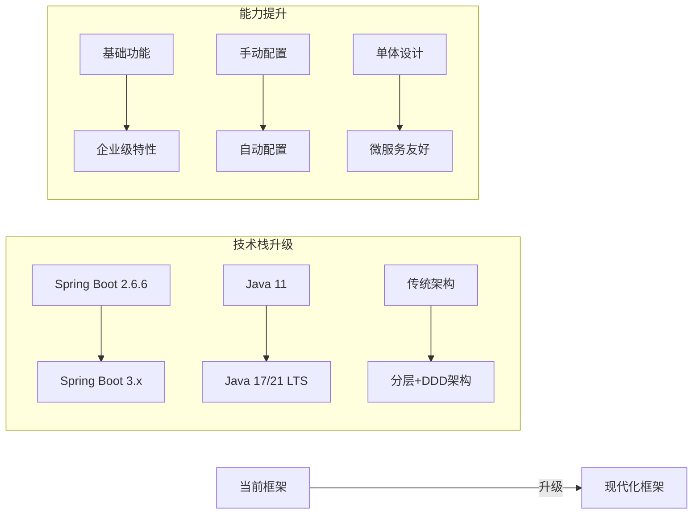
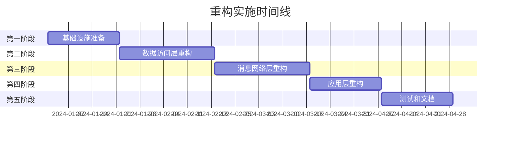
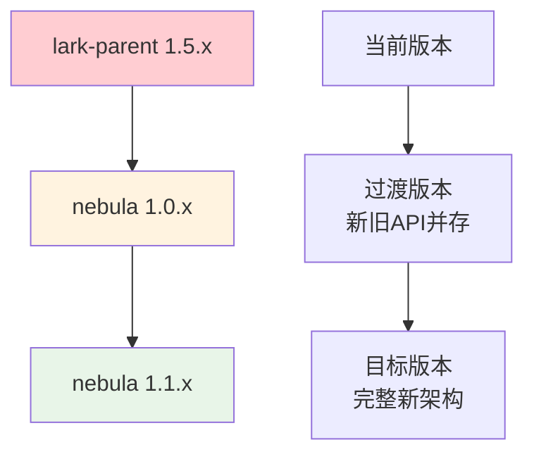

# Nebula 重构文档

欢迎来到 Nebula 框架重构文档中心。本文档详细描述了对nebula Java后端框架的全面重构规划，包括技术架构、实施计划、风险管理等各个方面。

## 文档导航

### 📋 总体规划
- **[重构总体规划](./重构总体规划.md)** - 完整的重构概述、目标和架构设计
  - 项目现状分析
  - 发现的主要问题
  - 重构目标和预期效果
  - 新架构概览

### 🏗️ 架构设计
- **[新架构设计详解](./新架构设计详解.md)** - 详细的技术架构设计文档
  - 架构设计原则
  - 分层架构详解
  - 核心模块设计
  - 接口和实现规范

### 📅 实施计划
- **[重构实施计划](./重构实施计划.md)** - 分阶段的详细实施计划
  - 5个阶段的时间规划
  - 每个阶段的具体任务
  - 交付物和验收标准
  - 质量保证措施

### ⚠️ 风险管理
- **[风险管理与兼容性策略](./风险管理与兼容性策略.md)** - 风险识别和应对策略
  - 风险识别与评估
  - 向后兼容性保证
  - 应急响应预案
  - 监控和预警机制

## 重构概述

### 当前状况
- **技术栈**：Spring Boot 2.6.6 + Java 11
- **架构模式**：传统分层架构，11个子模块
- **主要问题**：技术债务积累、模块耦合度高、缺乏现代化特性

### 重构目标

### 新架构亮点

#### 🎯 分层清晰
- **应用层**：Web、调度、批处理框架
- **基础设施层**：数据访问、消息传递、网络通讯
- **核心层**：通用组件、配置管理、监控指标
- **扩展层**：对象存储、搜索引擎、第三方集成

#### 🔧 现代化技术栈
- Spring Boot 3.x + Java 17/21
- 响应式编程支持
- 云原生特性
- 虚拟线程支持

#### 📊 企业级特性
- 统一监控和指标收集
- 完善的错误处理和重试机制
- 服务治理（熔断、限流、负载均衡）
- 配置中心化管理

#### 🛡️ 质量保证
- 80%以上测试覆盖率
- 自动化代码质量检查
- 性能基准测试
- 完整的文档和示例

## 实施时间线

**总计时间**：12-16周

## 技术收益预期

### 性能提升
- 🚀 响应时间提升 **20%**
- 📈 吞吐量提升 **30%**
- 💾 内存使用降低 **15%**
- ⚡ 启动时间减少 **40%**

### 开发体验
- 📝 学习成本降低 **50%**
- ⚙️ 开发效率提升 **30%**
- 🐛 维护成本降低 **40%**
- 📚 文档完整性 **100%**

### 质量指标
- ✅ 测试覆盖率 **80%+**
- 📊 代码复杂度降低 **30%**
- 🎯 Bug数量减少 **50%**
- 🏆 用户满意度 **95%+**

## 兼容性保证

### 渐进式升级策略

### 迁移支持
- 🔧 **自动迁移工具**：配置文件和代码自动迁移
- 📖 **详细迁移指南**：分步骤的迁移说明
- 🆘 **技术支持**：迁移过程中的技术支持
- 🔄 **回滚机制**：完整的回滚和应急预案

## 风险控制

### 多重保障
- ⚡ **功能开关**：新旧功能平滑切换
- 🔄 **灰度发布**：逐步推广新版本
- 📊 **实时监控**：关键指标实时监控
- 🚨 **自动告警**：异常情况自动通知

### 质量门禁
- 🧪 **自动化测试**：完整的测试流水线
- 📈 **性能基准**：性能不能退化
- 🔍 **代码审查**：所有代码必须review
- 🛡️ **安全扫描**：依赖和代码安全检查

## 如何使用本文档

### 👥 项目干系人
- **项目经理**：重点关注 [重构总体规划](./重构总体规划.md) 和 [重构实施计划](./重构实施计划.md)
- **架构师**：详细阅读 [新架构设计详解](./新架构设计详解.md)
- **开发人员**：关注实施计划中的技术细节和接口设计
- **测试人员**：重点关注测试策略和质量保证措施
- **运维人员**：重点关注监控、部署和运维相关内容

### 📚 阅读建议
1. **首次阅读**：按照文档顺序完整阅读，建立全局认知
2. **深入了解**：根据角色关注重点章节，深入理解细节
3. **实施参考**：在重构过程中作为参考文档使用
4. **持续更新**：根据实施过程中的发现持续更新文档

## 后续计划

### 📋 待补充文档
- **详细API设计文档**：各模块的具体API设计
- **数据迁移指南**：数据库和配置的迁移步骤
- **性能调优指南**：性能优化的最佳实践
- **故障排查手册**：常见问题的诊断和解决方案

### 🔄 文档维护
- **实施过程中更新**：根据实际实施情况调整文档
- **用户反馈收集**：收集使用者的反馈和建议
- **最佳实践总结**：总结重构过程中的经验和教训
- **社区贡献**：鼓励社区参与文档的完善

## 联系我们

如果您对重构计划有任何疑问或建议，请通过以下方式联系我们：

- **项目组邮箱**：lark-team@company.com
- **技术讨论群**：加入钉钉群或企业微信群
- **Issue反馈**：在项目仓库中提交Issue
- **技术评审**：参加定期的技术评审会议

---

> **重要提醒**：本重构计划是一个重大技术决策，涉及整个框架的架构调整。请在充分理解文档内容的基础上，结合实际项目情况进行评估和决策。

**让我们一起构建一个更现代、更强大、更易用的Nebula框架！** 🚀
