# Nebula RAG 框架优化系统设计

> 状态：系统设计稿（v2，2026-08-29，待评审）
> v2 变更：按 Codex 独立设计审查（2026-08-29，判定「需修订后接受」，15 条发现全部核实采纳、零反驳，见 §10 审查记录）修订——兼容策略去除锁步例外、构造器兼容方案落地、索引双写一致性重设计、多查询融合契约补全、引用/流式端口修正、最小索引治理前移 R2、假设清单扩至 J16
> 层级：本文是 P1-P7 全景的**系统设计**；每个实施阶段开工前另出详细设计
> 前置结论：`docs/design/rag-example-design.md` v2 附录 A（路线图与业界对标）
> 顺序（用户决策）：框架优化先行，rag-example 示例后置（启动门见 §8）

## 1. 目标与非目标

### 1.1 目标

把 `nebula-ai-rag` 从「生产可用的检索融合骨架」提升为「可度量、可调优、可治理的 RAG 框架」，补齐七个能力面：

| 编号 | 能力面 | 一句话 |
|---|---|---|
| P1 | 评测 | 金标集 + recall@k / MRR / nDCG，让一切调优有度量 |
| P2 | 索引治理 | 文档生命周期：增量同步、删除对齐、换 embedding 模型的版本化重灌 |
| P3 | 切分改进 | 两段式结构切分：解析器与装箱器分离、原子单元保护、面包屑、多格式（MD 增强 / HTML / XML / JSON / JSONL） |
| P4 | 通用 BM25 路 | 架在 `nebula-search` 上的开箱关键词检索器（含 ES mapping/analyzer 下发的补齐，见 P4） |
| P5 | 查询改写 | 管线预处理端口化：改写 / 扩展 / 多查询，默认直通 |
| P6 | 重排实用化 | cross-encoder HTTP 批量重排接入 |
| P7 | 生成可信与观测 | 行内引用、检索内容防注入、流式输出、Micrometer 指标 |

### 1.2 非目标

- 不引入 LangChain4j、LlamaIndex 移植或任何第三方 RAG 框架；新增第三方依赖仅限 jsoup（HTML 解析，optional）与 micrometer-core（指标，optional）。
- 不做语义切分与父子分层块 + 检索期自动合并（业界实验位，进 backlog）。
- 不做记录型 JSON 的文本改写模板（业务责任；框架只固化「文本供召回、metadata 供过滤」双表示约定）。
- 不改 `nebula-ai-core` 的 Chat/Embedding/VectorStore 契约。
- 不建评测平台/UI；P1 只做库与报告对象。

## 2. 铁律清单（硬约束，每条有出处）

| ID | 约束 | 出处 |
|---|---|---|
| Y1 | **SIA 生产在线消费 `2.1.1-SNAPSHOT` 且 CI 带 `-U`**：框架**每次提交必须二进制向后兼容**——只允许新增重载、default 方法、新类与可选 Bean；**不设「锁步破坏」例外**（跨仓时间窗内任何 SIA 构建都会拾取新 SNAPSHOT，锁步窗口不成立，审查发现 1）。确需破坏 API 时发布独立版本坐标（如 2.2.0-SNAPSHOT），SIA 显式升级 | 记忆 sia-ci-snapshot-and-branch-deploy-traps；审查发现 1 |
| Y2 | **默认行为不变**：SIA 的 347 个测试与生产 yml 零改动照跑；新能力一律新键默认关/默认 Noop。「不变」的验证口径为**稳定字段特征测试**（内容、顺序、标题、metadata），随机 ID 与时间戳字段单独验证生成策略（`DocumentChunk` 构造器含 `UUID.randomUUID()` 与 `Instant.now()`，逐字节口径不可测，审查发现 10） | `DocumentChunk.java:52-56`；审查发现 10 |
| Y3 | `nebula-ai-rag` 未进任何 Central 正式版；但因 Y1，实际兼容红线是 **SIA 的 API 消费面基线**——已知：SIA `VectorRetriever` **继承**具体类 `VectorStoreRetriever`、实现 `Retriever`/`Reranker` 接口、注入 `RagPipeline` 与 `HybridRetrievalEngine` Bean。详细设计前先产出完整 API 基线清单（J6） | SIA `VectorRetriever.java`（继承关系）；本文 J6 |
| Y4 | 模块规约：自动配置集中登记、外部服务能力默认关、Starter 默认键必须被条件读取、四类条件测试 + 组件摘要、`@ConditionalOnMissingBean` 可替换 | `AUTO_CONFIGURATION_GUIDE.md:3-76` |
| Y5 | 依赖方向：`nebula-ai-rag` 编译期依赖限 `nebula-ai-core` + spring-boot 装配注解 + SLF4J（现状即如此）；`nebula-search-core`、jsoup、micrometer 一律 `optional` + `@ConditionalOnClass` 隔离；**供应商 SDK（如 QdrantClient）不得进入 `nebula-ai-rag`**——供应商适配放 `nebula-ai-spring` 与 autoconfigure（审查发现 11） | `nebula-ai-rag/pom.xml`；审查发现 11 |
| Y6 | 各向量库能力不一致：无按过滤批删、Chroma 无别名而 Qdrant 有——增量与蓝绿以「按 ID 精确操作」为最低公分母；`nebula-ai-rag` 内只放中立 `CollectionSwitcher` 端口 | `SpringAIVectorStoreService.java:283`；审查发现 11 |
| Y7 | **ES `createIndex` 现状不读取 `IndexMapping`**（只写分片/副本数）——analyzer/mapping 下发是待补实现而非既有能力（原假设 J1 已被代码证伪，转为确认事实，审查发现 8） | `ElasticsearchSearchService.java:55-66` |
| Y8 | 重排延迟教训：批量、独立超时、失败直通融合原序，三条缺一不可 | SIA `application.yml` 调参实证；记忆 sia-roadshow-precision-done |
| Y9 | 中文注释、无 emoji、4 空格缩进；测试桩不得比真实实现宽松 | 仓库规约；记忆 test-double-must-not-be-laxer |

## 3. 假设清单（详细设计期逐项验证后才可依赖）

J1 已证伪转入 Y7。现存假设（J6-J16 来自审查补充，全部采纳）：

| ID | 假设 | 验证方式 / 备注 |
|---|---|---|
| J2 | Qdrant collection alias 可经现有 `QdrantClient` Bean 调用 | qdrant-client API 核对（R3 详细设计） |
| J3 | 内置中文语料足以让 P3 各项改进产生可测的 recall 差异 | R1 实施时先验证区分度 |
| J4 | jsoup 与 Boot 4.1 依赖树无冲突 | 依赖树门禁 |
| J5 | TEI 风格 `/rerank` 接口覆盖主流 cross-encoder 服务端 | R4 详细设计对三家 wire 格式实测 |
| J6 | SIA 对 `nebula-ai-rag` 的完整 API 消费面（继承/实现/Bean 注入/构造调用） | R1 详细设计第一步：SIA 源码检索出 API 基线清单，作为兼容门禁输入 |
| J7 | `DocumentSource` 提供完整一致快照（含 tombstone）而非增量事件；否则删除不可推导 | R2 详细设计定契约 |
| J8 | 各 `IndexSink` 对重复 upsert、删除不存在、部分批量成功有可判定且幂等的语义 | R2 逐 sink 实测 |
| J9 | 向量集合与 BM25 索引能以同一 generation 原子切换；否则读侧跨版本混读 | R3 设计切换协议时验证 |
| J10 | 框架索引管线写 Qdrant 时 id-mapping 已启用（默认关闭时 `<docId>#<chunkIdx>` 裸写 Qdrant 必失败）——写侧必须启动期校验 ID 形态与后端约束 | `AIProperties` id-mapping 默认 false；R2 设计启动校验 |
| J11 | 查询改写的最大变体数、去重、总超时、执行器与取消传播受控 | R2 的 P5 详细设计定死 |
| J12 | BM25 索引字段/内容字段/metadata 字段及过滤操作存在统一约定 | R2 的 `RagSearchDocument` DTO 定义即此约定 |
| J13 | 引用只指向实际进入上下文预算的内容，清洗/截断后编号稳定 | P7 的 `ContextAssembly` 结构保证（§5 P7） |
| J14 | 流式生成复用应用自定义生成路由，取消/背压/中途失败/终态语义已定义 | P7 的 `StreamingAnswerGenerator` 端口（§5 P7），细节 R4 详细设计 |
| J15 | XML 解析禁用外部实体与 DTD；HTML/JSON/XML 解析设输入大小/深度/元素数上限 | P3 解析器安全要求，R1 详细设计落条款 |
| J16 | 指标经 `MeterRegistry`/Actuator 暴露（`/performance` 现只读自研 `PerformanceMonitor`，不读 MeterRegistry） | `PerformanceController.java:38`；R4 验收口径据此定 |

## 4. 总体架构

读写两条管线 + 一个度量面，全部端口化；粗体为本设计新增：

```mermaid
flowchart TB
    subgraph write["写侧：索引管线（P2/P3）"]
        DS["**DocumentSource**<br/>完整快照(含tombstone)"] --> SP["**StructureParser**<br/>MD增强/HTML/XML/JSON/JSONL<br/>→ 元素流(类型+面包屑)"]
        SP --> CP["**ChunkPacker**<br/>递归分隔符降级+原子保护<br/>+按边界overlap+长度度量端口"]
        CP --> IP["**IndexPlanner**<br/>与状态库差分 → 计划"]
        IP --> SK["**IndexSink[]**<br/>逐sink逐generation状态推进"]
        SK --> W1["VectorStoreService"]
        SK --> W2["SearchService(可选)"]
    end
    subgraph read["读侧：查询管线（现有骨架 + 插槽）"]
        Q["RagQuery"] --> QT["**QueryTransformer**<br/>默认直通(P5)"]
        QT --> HE["HybridRetrievalEngine<br/>+ 变体重载 + **SearchServiceRetriever**(P4)"]
        HE --> FU["RrfFusionStrategy<br/>检索器权重×变体权重"]
        FU --> RR["Reranker<br/>+ **HttpCrossEncoderReranker**(P6)"]
        RR --> SA["**RetrievedContentSanitizer**<br/>默认Noop(P7)"]
        SA --> CA["ContextAssembler<br/>→ **ContextAssembly**(含入选清单+引用映射)"]
        CA --> AG["AnswerGenerator / **StreamingAnswerGenerator**"]
        AG --> CI["**CitationPostProcessor**<br/>默认Noop(P7)"]
        CI --> A["RagAnswer / Flux&lt;RagStreamEvent&gt;"]
    end
    subgraph measure["度量面"]
        EV["**RetrievalEvaluator**(P1)"] -.评测.-> HE
        MT["指标适配器(P7, 内部实现<br/>经 MeterRegistry 暴露)"] -.观测.-> read
    end
```

架构决策（系统级定死，详细设计不得反转）：

1. **不新建 Maven 模块**：能力落 `nebula-ai-rag` 新增包；但**供应商适配（Qdrant alias 等）放 `nebula-ai-spring` 与 autoconfigure**，`nebula-ai-rag` 只持中立端口（Y5/Y6）。
2. **构造器兼容方案（审查发现 2 的落地）**：`DefaultRagPipeline` 现有 6 参数构造器**原样保留（JVM 描述符不变）**，委托到新增完整构造器并固定注入直通 `QueryTransformer`、Noop `Sanitizer`/`CitationPostProcessor`、无操作指标适配器；同规则适用于 `VectorStoreRetriever` 等被 SIA 继承/构造的类。R1 起引入 **API 二进制兼容检查**（japicmp 或等价 Maven 插件）作为构建门禁 + 旧构造器特征测试。
3. **插槽默认等价现状**：每个新端口的默认实现行为等价于现状（Y2 口径）；`ContextAssembler` 旧 `assemble(List)` 方法保留，新增返回 `ContextAssembly`（context + includedReferences + citationMap）的新方法（审查发现 6）。
4. **写侧管线是新增物**：`IndexSink` 为写目标抽象，状态库记录**每文档 × 每 sink × 每 generation** 的期望版本与完成状态，全部 sink 完成才推进活动版本（审查发现 3）；幂等语义（重复 upsert、删除不存在、部分批量成功）逐 sink 定义并测试（J8）。
5. **评测独立于管线**；指标不设公开 `RagMetrics` 端口——内部适配器直用 Micrometer（单实现不开抽象，审查发现 15）。

## 5. 分项系统设计

### P1 评测（包 `io.nebula.ai.rag.eval`）

- 核心类型：`GoldenSet`、`RetrievalEvaluator`（输入金标集与检索函数）、`EvalReport`（recall@k / MRR / nDCG@k + 逐条明细 + 运行时配置快照——两次报告对比即调优闭环）。
- **前置依赖：确定性块 ID**（审查发现 14）——金标按 ID 前缀判中，而现 `DocumentChunk` 默认随机 UUID；R1 先落 `ChunkIdStrategy`（默认保留随机以守 Y2，索引管线与评测显式使用确定性策略 `<docId>#<chunkIdx>`）。
- 验收阈值分子集（审查发现 14）：语料按表格/代码/标题面包屑/JSON 分子集，P3 各项改进要求**目标子集指标改善**且**非目标子集回退不超过明确阈值**，不用「整体不低于」这类无改进也能过的口径。
- 纯库、无 Spring 依赖、不提供 HTTP 端点。

### P2 索引治理（包 `io.nebula.ai.rag.index`）

- 端口：`DocumentSource`（完整快照 + tombstone，J7）、`IndexSink`（写目标抽象：向量库 / 搜索索引各一实现）、`IndexStateRepository`（记录文档 × sink × generation 的 hash、块 ID 清单与完成状态，含 schemaVersion）。
- `IndexPlanner` 差分出计划；`IndexingPipeline` 执行并逐 sink 推进状态，失败按文档粒度记账、可重入续跑；**全部必需 sink 完成才推进活动 generation**（审查发现 3）。
- **内存版 `IndexStateRepository` 仅限测试与单次任务，不自动装配**；启用持续增量/删除同步而无持久化实现时启动快速失败（审查发现 12）。持久化实现归业务（框架不假设数据库）。
- 写 Qdrant 前启动期校验 ID 形态与 id-mapping 配置（J10）。
- 蓝绿切换：`nebula-ai-rag` 只定义 `CollectionSwitcher` 中立端口；Qdrant alias 适配实现在 `nebula-ai-spring`（J2/J9，R3 范围）。

### P3 切分改进（包 `chunking.parse` / `chunking.pack`）

- `StructureParser`（每格式一实现，输出统一 `DocElement` 流：类型 + 面包屑 + 原文位置）：Markdown 增强（表格/列表原子化、`ChunkType.TABLE` 补产出、标题路径）、HTML（jsoup，optional）、XML（元素子树，与 HTML 共享装箱；**禁 DTD/外部实体**，J15）、JSON 递归键路径 / JSONL 按行（全解析器设输入大小/深度/元素数上限，J15）。
- `ChunkPacker`（格式无关）：沿元素边界装箱；分隔符层级递归降级作段内兜底；原子单元宁超限不切、表格超限按行切并重复表头；overlap 按整句/整行；`LengthMeasure` 端口（默认字符数）。
- 兼容（审查发现 10 落地）：旧 `TextChunker` / `DocumentChunker` 构造器固定走 **LegacyChunkingStrategy**（现算法原样封存），新行为经新类型或新构造器显式选择；特征测试比较稳定字段（内容/顺序/标题/metadata），ID 与时间策略单独测试。面包屑写入 `DocumentChunk.metadata`，`ContextAssembler` 增可选模板变量（默认模板不变）。

### P4 通用 BM25 检索路

- 范围修正（Y7）：不止「新增一个 Retriever 类」——包含 **ES `createIndex` 的 `IndexMapping` properties/settings 转换实现**（改动落 `nebula-search-elasticsearch`）与真实 ES 集成测试；analyzer（IK 等）经 mapping 下发。
- `SearchServiceRetriever implements Retriever`：消费 `SearchService.search(SearchQuery, ...)`；**固定索引 DTO `RagSearchDocument`**（id / content / metadata 字段约定即 J12 的答案）；`Retriever.filter` 到 `SearchQuery` 的转换显式定义允许的操作集，**不支持的过滤条件快速失败，不静默忽略**（审查发现 9）。
- 装配：隔离的嵌套自动配置 + `@ConditionalOnClass(SearchService)` + 显式配索引名才创建 Bean；补「缺 SearchService 类」条件测试。

### P5 查询改写（包 `transform`）

- 端口：`QueryTransformer { List<QueryVariant> transform(String query) }`，`QueryVariant{text, weight}`；默认返回单元素直通。
- **三种查询文本的用途契约定死**（审查发现 5）：原始文本用于提示词；trim 文本用于默认检索与重排（现状语义）；变体仅扩展检索。逐字段回归测试覆盖前后空白 / Noop / 关闭生成的组合。
- **引擎新增变体重载**（审查发现 4）：`retrieve(List<QueryVariant>, topK, filter)`——融合权重 = 检索器权重 × 变体权重，跨变体按 ID 去重、原查询保底；旧单查询方法委托单元素变体。变体数上限、总超时、执行器与取消传播在详细设计冻结（J11）。
- 参考实现 `LlmQueryRewriter`（超时与失败直通原查询），默认不装配。

### P6 重排实用化（包 `rerank.http`）

- `HttpCrossEncoderReranker`：TEI 风格 `/rerank` 批量打分（J5），独立超时、批大小、失败直通融合原序（Y8）。
- 显式配 URL 才装配；与现有 Reranker 同槽互斥（既有 `@ConditionalOnMissingBean` 机制）。

### P7 生成可信与观测（包 `guard` + pipeline 扩展）

- `RetrievedContentSanitizer` 端口（上下文组装前清洗）：默认 Noop；`PatternSanitizer` 参考实现移植 SIA 整值替换手法。
- **`ContextAssembly` 结果结构**（审查发现 6）：`context` + `includedReferences`（实际进入预算的引用）+ `citationMap`（编号 ↔ 引用）；`CitationPostProcessor` 只消费该结构，不自行推导编号；`RagAnswer.references` 语义相应明确为「入选引用」（新字段/新语义走新键开关，旧默认不变）。
- **流式不旁路生成端口**（审查发现 7）：新增 `StreamingAnswerGenerator` 端口 + 基于 `ReactiveChatService` 的默认适配器；`RagPipeline.queryStream` 的 default 实现于端口缺席时明确返回「暂不支持」错误，**不得直接调用容器中的 `ReactiveChatService`**（保住 SIA 场景路由类自定义生成器的语义）。取消、背压、中途失败与终态事件语义在 R4 详细设计冻结（J14）。
- 指标：**不设公开端口**（审查发现 15）——内部适配器直用 Micrometer `MeterRegistry`（optional 依赖，缺席时 Noop）；验收从 `MeterRegistry`/Actuator 读取（J16），不动 `/performance` 体系（要进入则另立 web 模块变更）。

## 6. 兼容性与发布策略

- 每阶段合入前四层验证：nebula 全量测试（基线 1040）+ 特征测试（稳定字段口径）+ **API 二进制兼容检查（新增门禁）** + SIA 编译与 347 测试本机联动。
- 只允许兼容增量（Y1 修订后无例外）；确需破坏 API → 独立版本坐标 + SIA 显式升级，另行评审。
- 行为演进一律新键默认关；配置键随详细设计冻结（Y4）。
- 每阶段一组 Conventional Commits 推 main（即发布），release note 记录新增键与能力。

## 7. 与 SIA 的关系（收益回流路径）

| 优化项 | SIA 可回流动作（均为可选后续，不在本设计范围） |
|---|---|
| P1 | RAG 检索质量首次可度量；确定性块 ID 策略与 SIA 现有 docId 体系天然对齐 |
| P3 | 知识域灌库切分升级（当前 500/100 定长） |
| P4 | `KnowledgeEsService` 自建检索路可评估替换 |
| P5 | `RagPipelineImpl` 查询改写 TODO 补上 |
| P6 | 生产重排从关停恢复为 cross-encoder 批量（gpu-01 可部署服务端） |
| P7 | 分路指标接入监控；防注入从 agent 层下沉到 RAG 层 |

## 8. 分阶段实施计划（估算口径：独立开发者人周；审查发现 8/13 已计入范围调整）

| 阶段 | 内容 | 估算 | 验收要点 |
|---|---|---|---|
| R1 | P1 评测（含确定性块 ID 策略 + 分子集阈值）+ P3 切分 + API 基线清单（J6）与二进制兼容门禁 | 约 3.5 人周 | 分子集前后对比报告达标；稳定字段特征测试全过；兼容门禁上线；SIA 347 照跑 |
| R2 | **最小 P2**（`IndexSink` + 块 ID 规约 + 状态库接口与幂等语义 + 双写）+ P4（含 ES mapping 转换与集成测试）+ P5（变体重载与三文本契约） | 约 3 人周 | 双写对账测试；缺类/坏配条件矩阵；变体融合等价性与上限测试 |
| R3 | P2 其余（差分计划、断点续跑、`CollectionSwitcher` + Qdrant alias 适配、持久化缺席快速失败） | 约 1.5 人周 | 增/改/删对账；续跑测试；alias 切换实测（J2/J9） |
| R4 | P6 重排 + P7 可信/流式/指标 | 约 2 人周 | 重排失败直通与批量延迟实测；流式事件契约测试（含取消）；指标经 MeterRegistry 读取验证 |
| — | **rag-example 启动门：R1 验收通过后即可开工**（依赖 P1/P3 与确定性 ID） | 示例 1 至 1.5 人日 | 按 rag-example-design v2（其金标判中口径同步改为确定性 ID） |

合计约 10 人周。每阶段：详细设计（评审）→ 派 opus 子代理实现 → 总控四层验证 → 请批提交推送。

## 9. 待拍板决策（可只答「是 / 否」）

| ID | 决策 | 推荐 |
|---|---|---|
| DS1 | 不新建 Maven 模块；供应商适配落 `nebula-ai-spring`/autoconfigure，`nebula-ai-rag` 只持中立端口 | 是 |
| DS2 | 兼容红线取修订后 Y1/Y2（无锁步例外；稳定字段特征测试口径；新增二进制兼容门禁） | 是 |
| DS3 | 分四期 R1→R4（最小 P2 前移 R2）；每期先出详细设计再实施 | 是 |
| DS4 | 示例在 R1 验收后启动 | 是 |
| DS5 | P3 含 XML 解析器（含 J15 安全条款） | 是 |
| DS6 | 内存 `IndexStateRepository` 仅测试用不自动装配；持续增量缺持久化实现启动快速失败 | 是 |
| DS7 | 批准后先出 R1 详细设计供评审 | 是 |

## 附录 B：与 Spring AI 2.0 RAG 能力的对比（2026-08-30 经 context7 核对官方文档）

Spring AI 2.0 有 `spring-ai-rag`（模块化 RAG：`RetrievalAugmentationAdvisor` + Rewrite/Compression/Translation `QueryTransformer` + `MultiQueryExpander` + `VectorStoreDocumentRetriever` + `DocumentJoiner` + `DocumentPostProcessor` 插槽 + `ContextualQueryAugmenter`）与 ETL 管线（Tika/Json/Markdown 读取器 + `TokenTextSplitter`）。对比结论：

1. **互补大于重叠**：它无加权 RRF 多路融合、无单路超时与降级契约、无 BM25 实现、无结构化切分（仅 token 定长）、无评测、无增量索引治理——本设计 P1/P2/P3 与融合骨架均无对应物，不构成重复建设。P5 查询改写与其高度同构，是唯一实质重叠。
2. **契约层归属的决策（2026-08-30 复核修正）**：初版结论「检索绑进 ChatClient 调用链」只对顶层 `RetrievalAugmentationAdvisor` 成立——`org.springframework.ai.rag.*` 的组件接口（`DocumentRetriever`/`QueryTransformer`/`DocumentJoiner` 等）可脱离 Advisor 独立使用，「以其为契约层封装」技术上可行。仍选择契约自有的三条理由：其一，nebula AI 层的一贯屏蔽模式（`ChatService` 等契约自有、实现层包 Spring AI），Spring AI 1.x→2.0 的 API 迁移（G0/G4 实证）已证明该模式的价值——契约用上游的，下次大版本震荡直接打穿业务实现类；其二，语义盈余装不进其类型系统：`DocumentRetriever` 无权重与单路超时，`DocumentJoiner` 输入维度是按查询而非按检索器，**多检索器加权融合无处安放**，降级契约在 Advisor 流无归宿；其三，边际收益已被适配器捕获（改写器家族），而契约切换需 SIA 五个实现/继承类重写 + 独立版本坐标显式升级（修订后 Y1）。如实记录：此决策四分之三源于「SIA 已在生产消费现有契约」的既成事实——绿地场景下采用其契约层是体面选择。
3. **借用两处**：R2 的 P5 详细设计增加决策点——在 `nebula-ai-spring` 提供适配器包装其 `RewriteQueryTransformer`/`MultiQueryExpander` 为本框架 `QueryTransformer` 实现（领域包不引 Spring AI 类型，守 Y5）；PDF/docx 解析不自研，未来经 `TikaDocumentReader` 作为 `DocumentSource` 前端接入（backlog）。

## 10. 审查记录

- 2026-08-29 Codex 独立设计审查（只读静态核对，未运行构建）：总体判定「需修订后接受」；3 blocker（Y1 自相矛盾、构造器兼容无方案、双写一致性缺失）+ 11 major + 1 minor + 补充假设 J6-J16。
- 主协调逐条核对处置：**15 条全部核实成立并采纳**（其中两条关键事实主张——`DocumentChunk` 随机 UUID/时间戳、ES `createIndex` 忽略 mapping——经代码抽验逐字属实），零反驳；J1 由「待验证假设」转为已证伪事实（Y7）。v2 全部落笔，对应关系已在正文逐处标注「审查发现 N」。
