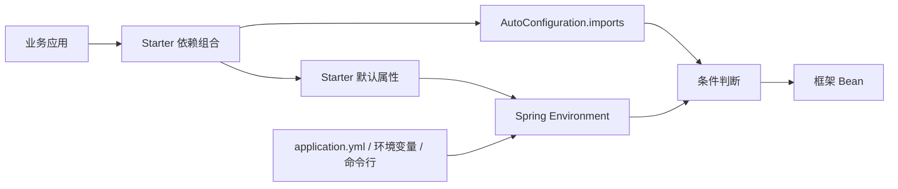
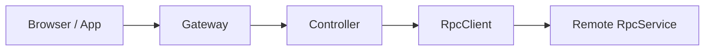

# Nebula 架构说明

Nebula `2.1.0-SNAPSHOT` 基于 Java 21、Spring Boot 4.1 和 Spring Framework 7。
框架按能力拆分模块，通过 Starter 组合依赖，通过自动配置决定运行时是否激活。

## 模块结构

```text
core
  nebula-foundation       通用结果、异常、工具和诊断摘要
  nebula-security         JWT、RBAC 和安全注解

infrastructure
  data                    持久化、缓存、Neo4j
  messaging               RabbitMQ、RocketMQ、Redis 消息
  websocket               Spring WebSocket、Netty WebSocket
  rpc                     HTTP、gRPC、异步 RPC
  discovery               Nacos 注册与发现
  storage                 MinIO、阿里云 OSS
  search                  Elasticsearch
  ai                      Spring AI、RAG、MCP
  crawler                 HTTP、浏览器、代理、验证码
  lock                    Redis 分布式锁
  gateway                 HTTP 反向代理、限流和日志

application
  nebula-web              Web 通用能力
  nebula-task             任务调度

autoconfigure
  nebula-autoconfigure    跨模块自动配置入口

starter                   面向应用类型的依赖组合和默认值
examples                  可运行的接入示例
```

依赖方向保持从上层组合指向下层能力：Starter 依赖应用层和基础设施层，自动配置依赖
需要装配的接口与实现，基础模块不得反向依赖 Starter。

## 运行链路



Starter 默认属性使用最低优先级，业务配置始终可以覆盖。外部服务模块在没有 Starter
默认值或显式 `enabled=true` 时不得启动。

## 微服务调用原则

1. 浏览器和 App 通过 Gateway 访问后端 Controller。
2. 服务间接口通过 `RpcClient` 调用，不经过 Gateway。
3. API 契约模块只放接口、DTO、校验注解和 RPC 注解，不放服务实现。
4. Gateway 只负责 HTTP 反向代理、流量治理和应用自定义认证，不承担 gRPC 桥接。



## JSON 边界

框架主链路使用 Jackson 3 的 `tools.jackson.*`。HTTP RPC、gRPC、异步 RPC、Redis
消息、Nacos 异步存储和任务模块优先复用应用提供的 `ObjectMapper`，只有上下文中没有
该 Bean 时才创建 `JsonMapper` 兜底，确保业务注册的模块和序列化规则不会失效。

保留 Jackson 2 的场景仅限尚未迁移的第三方库边界，例如 JJWT 的
`jjwt-jackson`。边界对象不得泄漏到框架公共 API。

## 安全边界

- JWT 密钥必须显式配置，长度不少于 32 个字符。
- 登录服务和鉴权过滤器统一使用 `JwtService`；旧 `io.nebula.web.auth.JwtUtils` 仅保留兼容构造入口。
- gRPC 服务端启用令牌校验时，客户端通过 `nebula.rpc.grpc.client.auth-token` 发送同一令牌。
- CORS 来源默认留空，生产环境需要显式列出允许来源。
- Elasticsearch 和 HTTP 爬虫只有在活动 Profile 全部属于 `dev`、`test`、`local` 时才允许跳过证书校验。
- 未配置活动 Profile，或同时存在生产与开发 Profile 时，证书校验保持开启。

## 资源生命周期

连接池、线程池、Channel 和客户端必须由 Spring Bean 生命周期管理：

- HTTP RPC 的 Apache `CloseableHttpClient` 是可关闭 Bean，并清理过期、空闲连接。
- gRPC `ManagedChannel` 在客户端关闭时释放。
- 各存储、搜索、消息和发现客户端由对应自动配置声明销毁方法或实现关闭接口。
- 不在自动配置方法内部创建无法访问、无法关闭的长期资源。

## 扩展约束

新增模块时遵循以下顺序：

1. 在所属基础设施模块定义接口、配置属性和实现。
2. 在 `nebula-autoconfigure` 或模块自己的自动配置中声明 Bean。
3. 为外部服务模块设置默认关闭的顶层开关。
4. 按应用场景把依赖和最低优先级默认值加入 Starter。
5. 增加条件测试、序列化往返测试和至少一个真实调用链测试。
6. 更新文档索引、Starter 指南和配置说明，不复制一份独立示例工程到文档目录。
