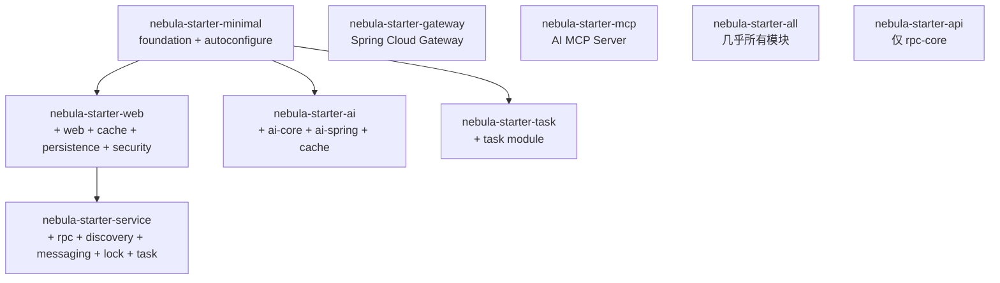

# Nebula Framework 全面审查报告

> 审查版本: 2.0.1-SNAPSHOT
> 审查日期: 2026-04-15
> 审查人: 架构审查 AI

---

## 1. 框架概述

### 1.1 基本信息

| 项目 | 信息 |
|------|------|
| 名称 | Nebula Framework |
| 版本 | 2.0.1-SNAPSHOT |
| 基础框架 | Spring Boot 3.5.8 |
| JDK | Java 21（启用 preview 特性） |
| 构建工具 | Maven（CI-Friendly 版本管理） |
| 包名空间 | `io.nebula` |
| Spring Cloud | 2025.0.0 |
| 许可证 | 未声明 |

### 1.2 架构层次

```
Nebula Framework 2.x
|
+-- 核心层 (Core)
|   +-- nebula-foundation          # 基础工具与异常处理
|   +-- nebula-security            # JWT/RBAC 安全认证
|
+-- 基础设施层 (Infrastructure)
|   +-- data/                      # 数据访问
|   |   +-- nebula-data-persistence  # MyBatis-Plus 持久化 + 读写分离 + 分库分表
|   |   +-- nebula-data-cache        # Caffeine/Redis 多级缓存
|   |   +-- nebula-data-neo4j        # Neo4j 图数据库
|   +-- messaging/                 # 消息传递
|   |   +-- nebula-messaging-core    # 消息抽象层
|   |   +-- nebula-messaging-rabbitmq # RabbitMQ 实现（含延迟消息）
|   |   +-- nebula-messaging-redis   # Redis Pub/Sub + Stream 实现
|   +-- websocket/                 # WebSocket
|   |   +-- nebula-websocket-core    # WebSocket 抽象层
|   |   +-- nebula-websocket-spring  # Spring WebSocket 实现
|   |   +-- nebula-websocket-netty   # Netty WebSocket 实现
|   +-- rpc/                       # 远程过程调用
|   |   +-- nebula-rpc-core          # RPC 抽象层（@RpcClient/@RpcService）
|   |   +-- nebula-rpc-http          # HTTP RPC 实现
|   |   +-- nebula-rpc-grpc          # gRPC 实现
|   |   +-- nebula-rpc-async         # 异步 RPC
|   +-- discovery/                 # 服务发现
|   |   +-- nebula-discovery-core    # 发现抽象层
|   |   +-- nebula-discovery-nacos   # Nacos 实现
|   +-- storage/                   # 对象存储
|   |   +-- nebula-storage-core      # 存储抽象层
|   |   +-- nebula-storage-minio     # MinIO 实现
|   |   +-- nebula-storage-aliyun-oss # 阿里云 OSS 实现
|   +-- search/                    # 搜索引擎
|   |   +-- nebula-search-core       # 搜索抽象层
|   |   +-- nebula-search-elasticsearch # Elasticsearch 实现
|   +-- lock/                      # 分布式锁
|   |   +-- nebula-lock-core         # 锁抽象层
|   |   +-- nebula-lock-redis        # Redis 锁实现（Redisson）
|   +-- gateway/                   # API 网关
|   |   +-- nebula-gateway-core      # Spring Cloud Gateway
|   +-- ai/                        # AI 模块
|   |   +-- nebula-ai-core           # AI 抽象层（Chat/Embedding/VectorStore/MCP）
|   |   +-- nebula-ai-spring         # Spring AI 集成 + RAG
|   +-- crawler/                   # 爬虫引擎
|       +-- nebula-crawler-core      # 爬虫抽象层
|       +-- nebula-crawler-http      # OkHttp 爬虫引擎
|       +-- nebula-crawler-browser   # Playwright 浏览器引擎
|       +-- nebula-crawler-proxy     # 代理 IP 池管理
|       +-- nebula-crawler-captcha   # 验证码识别（OCR/OpenCV/滑块）
|
+-- 应用层 (Application)
|   +-- nebula-web                 # Web 框架（拦截器/异常/限流/缓存/脱敏/监控）
|   +-- nebula-task                # 任务调度（XXL-JOB 集成）
|
+-- 集成层 (Integration)
|   +-- nebula-integration-payment      # 支付集成
|   +-- nebula-integration-notification # 通知集成（短信）
|
+-- 自动配置层 (Auto-Configuration)
|   +-- nebula-autoconfigure       # 统一自动配置入口
|
+-- 启动器 (Starter)
    +-- nebula-starter-minimal     # 最小化（仅 foundation + autoconfigure）
    +-- nebula-starter-web         # Web 应用（+ web + cache + persistence + security）
    +-- nebula-starter-service     # 微服务（+ rpc + discovery + messaging + lock + task）
    +-- nebula-starter-gateway     # API 网关
    +-- nebula-starter-ai          # AI 应用
    +-- nebula-starter-mcp         # MCP 服务
    +-- nebula-starter-task        # 任务调度
    +-- nebula-starter-all         # 全功能（单体应用）
    +-- nebula-starter-api         # API 契约（仅 rpc-core）
```

### 1.3 模块数量统计

| 层级 | 模块数 |
|------|--------|
| 核心层 | 2 |
| 基础设施层 | 22 |
| 应用层 | 2 |
| 集成层 | 2 |
| 自动配置层 | 1 |
| 启动器 | 9 |
| **总计** | **38** |

---

## 2. 核心模块审查

### 2.1 nebula-foundation

**职责**: 提供基础工具类、统一结果封装、异常体系、ID 生成器等。

**文件清单** (19 个 Java 文件):
- `Result<T>` - 统一响应封装（success/code/message/data/timestamp/requestId）
- `PageResult<T>` - 分页结果封装
- `BusinessException` / `SystemException` / `ValidationException` - 三层异常体系
- `ResultCode` - 响应码枚举
- `EnumBase` - 枚举基类
- `IdGenerator` - ID 生成器
- `JwtUtils` / `CryptoUtils` - 安全工具
- `JsonUtils` / `DateUtils` / `Strings` / `Collections` / `Beans` - 通用工具

**审查结论**:

| 维度 | 评分 | 说明 |
|------|------|------|
| 设计 | A | 职责清晰，接口完整 |
| 实现 | A- | Result 使用 `@Builder` 但未提供 `@NoArgsConstructor`，反序列化可能出问题 |
| 测试 | B- | 未发现单元测试文件 |

**发现的问题**:

1. **[中] Result 反序列化风险**: `Result` 类使用 `@Builder` 注解但缺少 `@NoArgsConstructor` 和 `@AllArgsConstructor`，Jackson 反序列化时可能失败（尤其在 RPC 场景中接收方反序列化）。
2. **[低] code 字段类型**: `Result.code` 为 `String` 类型（如 `"SUCCESS"`），与 `BusinessException.getErrorCode()` 返回值需保持一致，目前接口定义和实际用法存在轻微不匹配（GlobalExceptionHandler 中 `e.getErrorCode()` 直接作为 code 传入）。
3. **[低] JwtUtils 与 nebula-security 中的 JwtService 功能重叠**: `foundation` 和 `security` 都提供 JWT 处理能力，`nebula-web` 中还有独立的 `JwtUtils`，共三处 JWT 实现。

---

### 2.2 nebula-security

**职责**: JWT 认证、RBAC 授权、安全上下文管理。

**文件清单** (14 个 Java 文件):
- `@RequiresAuthentication` / `@RequiresRole` / `@RequiresPermission` - 安全注解
- `SecurityContext` / `UserPrincipal` / `Authentication` - 安全上下文
- `JwtService` / `DefaultJwtService` - JWT 服务
- `SecurityAspect` - AOP 切面
- `SecurityProperties` - 配置属性

**审查结论**:

| 维度 | 评分 | 说明 |
|------|------|------|
| 设计 | A | 轻量级安全框架，不依赖 Spring Security，适合内部系统 |
| 实现 | A | 注解 + AOP 切面方式灵活 |
| 配置 | A | 通过 `nebula.security.enabled` 控制 |

**发现的问题**:

1. **[中] JWT 实现分散**: `foundation.JwtUtils`、`security.JwtService`、`web.auth.JwtUtils` 三处 JWT 实现，应统一收敛到 `nebula-security` 模块。
2. **[低] SecurityContext 线程安全**: 基于 `ThreadLocal` 实现，在异步场景（如 `@Async`、WebSocket handler）中需注意上下文传递。

---

### 2.3 nebula-web

**职责**: Web 应用核心能力，包括认证拦截器、限流、响应缓存、性能监控、数据脱敏、健康检查、全局异常处理。

**文件清单** (53 个 Java 文件):

| 功能 | 关键类 | 配置前缀 |
|------|--------|---------|
| 认证 | `AuthInterceptor` / `AuthService` / `AuthContext` | `nebula.web.auth.*` |
| 限流 | `RateLimitInterceptor` / `MemoryRateLimiter` | `nebula.web.rate-limit.*` |
| 响应缓存 | `ResponseCacheInterceptor` / `MemoryResponseCache` | `nebula.web.cache.*` |
| 性能监控 | `PerformanceMonitorInterceptor` / `DefaultPerformanceMonitor` | `nebula.web.performance.*` |
| 数据脱敏 | `@SensitiveData` / `SensitiveDataSerializer` | 注解驱动 |
| 健康检查 | `HealthController` / `HealthCheckService` | 内置端点 |
| 全局异常 | `GlobalExceptionHandler` | 自动注册 |
| 请求日志 | `RequestLoggingFilter` / `RequestLoggingInterceptor` | `nebula.web.logging.*` |
| Jackson | `JacksonConfig` | 自动注册 |

**审查结论**:

| 维度 | 评分 | 说明 |
|------|------|------|
| 设计 | A | 功能全面，开关控制灵活 |
| 实现 | A- | 限流器仅有内存实现，分布式场景需扩展 |
| 脱敏 | A | 8 种脱敏策略覆盖常见场景 |

**发现的问题**:

1. **[中] 限流仅内存实现**: `MemoryRateLimiter` 基于 ConcurrentHashMap + 滑动窗口，单机有效但不支持分布式。Proud Day 如果多实例部署需考虑。
2. **[中] 响应缓存仅内存实现**: `MemoryResponseCache` 同上，不支持多实例共享缓存。
3. **[低] GlobalExceptionHandler 中 `Logger` 未使用**: 代码第 8 行导入了 `Logger`/`LoggerFactory`，但实际使用 `@Slf4j`（Lombok），存在 dead import。

---

### 2.4 nebula-data-persistence

**职责**: 数据持久化，基于 MyBatis-Plus，支持读写分离、分库分表。

**文件清单** (18 个 Java 文件 + 3 个测试文件):

| 功能 | 关键类 |
|------|--------|
| 基础配置 | `MyBatisPlusConfiguration` / `DataPersistenceAutoConfiguration` |
| 多数据源 | `DataSourceManager`（HikariCP 连接池管理） |
| 读写分离 | `DynamicDataSource` / `ReadWriteDataSourceAspect` / `@ReadDataSource` / `@WriteDataSource` |
| 分库分表 | `ShardingSphereManager` / `ShardingConfig` |
| 元数据填充 | `DefaultMetaObjectHandler`（自动填充 createTime/updateTime） |
| 事务管理 | `TransactionManager` / `DefaultTransactionManager` |
| 基类 | `BaseMapper` / `IService` / `ServiceImpl` |

**审查结论**:

| 维度 | 评分 | 说明 |
|------|------|------|
| 设计 | A | 功能完整，抽象合理 |
| 实现 | A | HikariCP 配置合理，DataSourceManager 有连接测试和销毁逻辑 |
| 测试 | B+ | 有 DataSourcePriority、ServiceImpl、ShardingSphere 测试 |

**发现的问题**:

1. **[低] MyBatis-Plus 版本**: 使用 3.5.9，建议关注新版更新（当前最新 3.5.x 系列稳定）。

---

### 2.5 nebula-data-cache

**职责**: 多级缓存（Caffeine 本地缓存 + Redis 分布式缓存）。

**文件清单** (7 个 Java 文件 + 1 个测试):
- `CacheManager` 接口
- `LocalCacheManager`（Caffeine）
- `DefaultCacheManager`（Redis）
- `MultiLevelCacheManager`（多级缓存组合）
- `MultiLevelCacheConfig` - 缓存配置

**审查结论**:

| 维度 | 评分 | 说明 |
|------|------|------|
| 设计 | A | 多级缓存架构合理 |
| 实现 | A- | 有 LocalCacheManager 测试 |
| 配置 | B+ | 配置属性类完整 |

---

### 2.6 nebula-websocket

**职责**: WebSocket 通信能力，支持 Spring WebSocket 和 Netty 两种实现。

**模块结构**:
- `nebula-websocket-core`: 抽象接口（`WebSocketMessageService`/`SessionRegistry`/`WebSocketMessage`）
- `nebula-websocket-spring`: Spring WebSocket 实现 + Redis 集群消息代理
- `nebula-websocket-netty`: Netty 高性能实现

**WebSocketMessageService 能力**:
- `sendToSession` / `sendToUser` / `sendToUsers` / `broadcast` - 多种发送模式
- `sendToTopic` - 发布/订阅模式
- `closeSession` / `closeUserSessions` - 会话管理
- `getOnlineSessionCount` / `getOnlineUserCount` / `isUserOnline` - 状态查询

**审查结论**:

| 维度 | 评分 | 说明 |
|------|------|------|
| 设计 | A | 核心 + 多实现架构，接口丰富 |
| 集群 | A | Redis 集群消息代理支持多实例广播 |
| 自动配置 | A | `nebula.websocket.enabled` 控制，支持 SockJS |

**发现的问题**:

1. **[中] WebSocket 不在 starter-web 中**: `nebula-starter-web` 未包含 WebSocket 依赖，使用时需额外引入。这对 Proud Day 项目有影响。
2. **[低] WebSocket 自动配置注册方式**: WebSocket 的 `AutoConfiguration` 在各自模块内声明，而非统一在 `nebula-autoconfigure` 中，与其他模块风格不一致。

---

### 2.7 nebula-lock (分布式锁)

**职责**: 基于 Redisson 的分布式锁。

**文件清单** (18 个 Java 文件 + 2 个测试):
- 核心接口: `LockManager` / `Lock` / `ReadWriteLock` / `LockCallback`
- 配置: `LockConfig` / `LockType`（REENTRANT / FAIR）/ `LockMode`
- Redis 实现: `RedisLockManager` / `RedisLock` / `RedisReadWriteLock`
- AOP: `LockedAspect` / `@Locked` 注解

**RedisLockManager 能力**:
- `getLock(key)` / `getLock(key, config)` - 获取锁（支持公平锁/可重入锁）
- `getReadWriteLock` - 读写锁
- `execute(key, callback)` - 锁回调执行
- `tryExecute(key, callback)` - 尝试锁回调
- `getRedLock` - 红锁支持

**审查结论**:

| 维度 | 评分 | 说明 |
|------|------|------|
| 设计 | A | 抽象清晰，回调模式易用 |
| 实现 | A- | 支持多种锁类型，红锁支持 |
| 测试 | B+ | 有 RedisLock 和 RedisLockManager 测试 |

**发现的问题**:

1. **[中] execute/tryExecute 方法未在接口中声明**: `execute` 和 `tryExecute` 是 `RedisLockManager` 类的方法，未在 `LockManager` 接口中声明。如果业务代码依赖接口编程，无法直接使用这两个便利方法。
2. **[低] lockCache 未实际使用**: `RedisLockManager` 中的 `lockCache` 字段在 `getLock` 方法中未进行缓存存储（每次创建新实例），但 `releaseLock` 方法尝试从中移除，逻辑不一致。

---

### 2.8 nebula-task (任务调度)

**职责**: 基于 XXL-JOB 的任务调度框架。

**文件清单** (18 个 Java 文件 + 5 个测试):
- 核心: `TaskEngine` / `TaskRegistry` / `TaskExecutor` / `@TaskHandler`
- 定时任务接口: `EveryMinuteExecute` / `EveryFiveMinuteExecute` / `EveryHourExecute` / `EveryDayExecute`
- XXL-JOB 集成: `XxlJobRegistryService` / `XxlJobTaskService` / `TimedTaskJobHandler`
- 自动配置: `TaskAutoConfiguration` / `XxlJobAutoConfiguration`

**审查结论**:

| 维度 | 评分 | 说明 |
|------|------|------|
| 设计 | A | 注解驱动，自动发现并注册 TaskExecutor |
| 实现 | A | XXL-JOB 集成完整，含注册服务 |
| 测试 | A- | 有 TaskEngine、TaskContext、ScheduledTask 等测试 |

---

### 2.9 nebula-messaging (消息队列)

**职责**: 消息队列抽象与实现。

**模块结构**:
- `nebula-messaging-core`: 抽象接口（`MessageProducer`/`MessageConsumer`/`MessageRouter`/`MessageSerializer`）
- `nebula-messaging-rabbitmq`: RabbitMQ 实现（含延迟消息 `DelayMessageProducer`/`DelayMessageConsumer`）
- `nebula-messaging-redis`: Redis Pub/Sub + Stream 实现

**审查结论**:

| 维度 | 评分 | 说明 |
|------|------|------|
| 设计 | A | 核心抽象 + 多实现，支持延迟消息 |
| 实现 | A | RabbitMQ 手动 ACK/NACK，Redis Stream 实现 |
| 注解 | A | `@MessageHandler` 注解驱动消费 |
| 测试 | B+ | RabbitMQ 模块有 5 个测试文件 |

---

### 2.10 nebula-rpc (远程过程调用)

**职责**: 服务间 RPC 通信。

**模块结构**:
- `nebula-rpc-core`: 核心注解（`@RpcClient`/`@RpcService`/`@RpcCall`/`@EnableRpcClients`）+ 动态代理扫描注册
- `nebula-rpc-http`: HTTP RPC 实现（基于 RestTemplate）
- `nebula-rpc-grpc`: gRPC 实现（基于 grpc-spring-boot-starter）
- `nebula-rpc-async`: 异步 RPC 执行

**审查结论**:

| 维度 | 评分 | 说明 |
|------|------|------|
| 设计 | A | 统一 RPC 接口定义，多协议透明切换 |
| 实现 | A- | HTTP/gRPC 双实现 |
| 服务发现集成 | A | `RpcDiscoveryAutoConfiguration` 整合 Nacos |
| 测试 | B+ | gRPC 模块有客户端/服务端/消息转换测试 |

**发现的问题**:

1. **[中] HTTP RPC 基于 RestTemplate**: Spring 官方推荐 `WebClient`（WebFlux）或 `RestClient`（Spring 6.1+），RestTemplate 在维护模式中。

---

### 2.11 nebula-storage (对象存储)

**职责**: 统一对象存储接口。

**StorageService 接口能力**: 上传/下载/删除/复制/预签名URL/对象列表/桶管理/元数据/对象存在性。

**审查结论**:

| 维度 | 评分 | 说明 |
|------|------|------|
| 设计 | A | 统一接口，实现可切换 |
| MinIO 实现 | A | 功能完整，有 6 个测试文件 |
| OSS 实现 | A | 阿里云 OSS 实现完整 |

---

### 2.12 nebula-discovery (服务发现)

**职责**: 基于 Nacos 的服务注册与发现。

**审查结论**:

| 维度 | 评分 | 说明 |
|------|------|------|
| 实现 | A | 启动注册 + 关闭注销，gRPC 端口写入 metadata |
| 自动配置 | A | Binder 绑定 `nebula.discovery.nacos.*` |

---

### 2.13 nebula-gateway (API 网关)

**职责**: 基于 Spring Cloud Gateway 的 HTTP 反向代理网关。

**文件清单** (6 个 Java 文件):
- `GatewayRoutesAutoConfiguration` - 路由自动配置
- `GatewayRedisAutoConfiguration` - Redis 限流配置
- `GatewayProperties` - 配置属性（日志/限流/HTTP代理/CORS）
- `LoggingGlobalFilter` - 请求日志过滤器（RequestId/慢请求标记）
- `RateLimitKeyResolverConfig` - IP/Path 限流策略
- `GatewayHealthController` - 健康检查

**审查结论**:

| 维度 | 评分 | 说明 |
|------|------|------|
| 设计 | A | 遵循微服务三原则，HTTP 反向代理 |
| 实现 | B+ | 功能完整但文件较少，JWT 认证已移至应用层 |

---

### 2.14 nebula-ai (AI 模块)

**职责**: 基于 Spring AI 的智能服务。

**模块结构**:
- `nebula-ai-core`: 抽象接口（`ChatService`/`EmbeddingService`/`VectorStoreService`/`McpClientService`/`McpServerService`）
- `nebula-ai-spring`: Spring AI 集成实现 + RAG 文档处理（Parser/Chunker）

**审查结论**:

| 维度 | 评分 | 说明 |
|------|------|------|
| 设计 | A | AI + MCP 双重支持 |
| 实现 | A | Spring AI 1.1.0 集成，含 RAG 处理链 |
| 测试 | B+ | Chat/Embedding/VectorStore/RAG 测试 |

---

### 2.15 nebula-crawler (爬虫引擎)

**职责**: 网页抓取/数据采集框架。

**模块结构** (5 个子模块):
- `nebula-crawler-core`: 抽象层（`CrawlerEngine`/`CrawlerRequest`/`CrawlerResponse`/`DataExtractor`/`ProxyProvider`/`CrawlerRateLimiter`/`CookieManager`）
- `nebula-crawler-http`: OkHttp 爬虫引擎（日志/重试/UA 拦截器）
- `nebula-crawler-browser`: Playwright 浏览器引擎（反爬 Stealth/验证码检测处理）
- `nebula-crawler-proxy`: 代理 IP 池（API/静态代理源/代理检查器/代理池）
- `nebula-crawler-captcha`: 验证码识别（OCR/OpenCV 滑块/2Captcha/腾讯验证码）

**审查结论**:

| 维度 | 评分 | 说明 |
|------|------|------|
| 设计 | A | 多引擎架构，抽象到位 |
| 反爬 | A | StealthHelper + 验证码自动处理 |
| 代理 | A | 代理池 + 代理校验 + 多源支持 |
| 验证码 | A | 5 种验证码类型（图片/滑块/点选/旋转/手势） |

**发现的问题**:

1. **[低] OpenCV 本地依赖**: `OpenCvService` 需要本地安装 OpenCV 库，部署时需确保容器镜像包含。Docker 目录下已有 `captcha-opencv/` 配置文件。

---

## 3. 自动配置体系审查

### 3.1 AutoConfiguration.imports 注册顺序

```
Discovery -> RPC (HTTP/gRPC) -> RpcDiscovery -> AsyncRpc
-> DataPersistence -> ReadWrite -> Sharding -> Cache
-> Security -> Lock -> Messaging -> Search
-> Storage (MinIO/OSS) -> Gateway -> AI/MCP -> Crawler -> Task
```

**评价**: 顺序合理，遵循了依赖关系。服务发现最先初始化，RPC 依赖服务发现，数据层独立，其余按需加载。

### 3.2 条件化加载

所有自动配置均使用 `@ConditionalOnClass` / `@ConditionalOnProperty` 控制，确保：
- 未引入模块不会报错
- 可通过配置开关禁用
- 按需加载，不浪费资源

### 3.3 WebSocket 自动配置特殊性

WebSocket 模块的自动配置（`WebSocketAutoConfiguration`）在各自模块内声明（`nebula-websocket-spring`/`nebula-websocket-netty`），而非在 `nebula-autoconfigure` 中统一管理。这是因为 WebSocket 的 `@EnableWebSocket` 注解和 `WebSocketConfigurer` 实现需要与具体实现类紧密耦合。

**发现的问题**:

1. **[低] 自动配置风格不统一**: 大部分模块的自动配置在 `nebula-autoconfigure` 中声明，但 WebSocket、Redis Lock 和 Task 在各自模块内声明。虽然功能正确，但增加了维护成本。

---

## 4. Starter 体系审查

### 4.1 Starter 依赖关系



### 4.2 各 Starter 适用场景

| Starter | 适用场景 | Proud Day 适用性 |
|---------|---------|-----------------|
| `nebula-starter-minimal` | CLI 工具、无 Web 应用 | 不适用 |
| `nebula-starter-web` | 单体 Web 应用 | **主要依赖** |
| `nebula-starter-service` | 微服务应用 | 不需要 |
| `nebula-starter-gateway` | API 网关 | 不需要 |
| `nebula-starter-ai` | AI 应用 | 不需要 |
| `nebula-starter-task` | 独立任务调度 | 需额外引入 |
| `nebula-starter-all` | 全功能单体 | 可选，但引入过多 |
| `nebula-starter-api` | API 契约定义 | 不需要 |

### 4.3 Proud Day 项目推荐依赖组合

```xml
<!-- 主 Starter: Web 应用 -->
<dependency>
    <groupId>io.nebula</groupId>
    <artifactId>nebula-starter-web</artifactId>
</dependency>

<!-- WebSocket: 游戏/抽奖实时通信 -->
<dependency>
    <groupId>io.nebula</groupId>
    <artifactId>nebula-websocket-spring</artifactId>
</dependency>

<!-- 分布式锁: 加入房间/抽奖防超发 -->
<dependency>
    <groupId>io.nebula</groupId>
    <artifactId>nebula-lock-redis</artifactId>
</dependency>

<!-- 任务调度: 抽奖轮次定时开启/关闭 -->
<dependency>
    <groupId>io.nebula</groupId>
    <artifactId>nebula-task</artifactId>
</dependency>

<!-- 对象存储: 头像/活动图片 -->
<dependency>
    <groupId>io.nebula</groupId>
    <artifactId>nebula-storage-minio</artifactId>
</dependency>

<!-- 消息队列(可选): 勋章触发/异步通知 -->
<dependency>
    <groupId>io.nebula</groupId>
    <artifactId>nebula-messaging-rabbitmq</artifactId>
</dependency>
```

---

## 5. 发现的问题和风险

### 5.1 问题汇总

| 编号 | 严重度 | 模块 | 问题描述 |
|------|--------|------|---------|
| P01 | 高 | foundation | `Result` 类缺少无参构造函数，可能导致 JSON 反序列化失败 |
| P02 | 中 | security/web | JWT 实现分散在 3 个模块中，维护困难 |
| P03 | 中 | web | `MemoryRateLimiter` 不支持分布式，多实例部署时限流失效 |
| P04 | 中 | web | `MemoryResponseCache` 不支持分布式，多实例缓存不一致 |
| P05 | 中 | lock | `execute`/`tryExecute` 未在 `LockManager` 接口声明 |
| P06 | 中 | lock | `lockCache` 字段使用逻辑不一致（写入与读取不对称） |
| P07 | 中 | rpc | HTTP RPC 基于 RestTemplate，已处于维护模式 |
| P08 | 中 | starter | `nebula-starter-web` 未包含 WebSocket，项目需额外引入 |
| P09 | 低 | autoconfigure | 自动配置注册风格不统一（集中式 vs 模块内） |
| P10 | 低 | web | `GlobalExceptionHandler` 有未使用的 import |
| P11 | 低 | crawler | OpenCV 需要本地库依赖 |
| P12 | 低 | 全局 | 框架版本 2.0.1-SNAPSHOT，尚未正式发布 |

### 5.2 风险评估

**对 Proud Day 项目的影响**:

| 风险 | 影响程度 | 应对措施 |
|------|---------|---------|
| P01 Result 反序列化 | **高** - 前后端交互核心 | 建议给 Result 类添加 `@NoArgsConstructor` `@AllArgsConstructor` |
| P03/P04 单机限流/缓存 | **低** - Proud Day 初期单实例 | 暂不影响，后期多实例需扩展 |
| P05 LockManager 接口 | **中** - 影响代码规范 | 业务代码直接注入 `RedisLockManager` 使用 |
| P08 WebSocket 未含 | **低** - 已知需额外引入 | 在 pom.xml 显式引入 |

---

## 6. 框架与 Proud Day 项目匹配度分析

### 6.1 需求覆盖矩阵

| 业务需求 | 框架模块 | 覆盖度 | 说明 |
|---------|---------|--------|------|
| JWT 认证（员工编码+验证码） | nebula-security + nebula-web (AuthInterceptor) | 完全覆盖 | 开箱即用 |
| 数据持久化（25+ 表） | nebula-data-persistence (MyBatis-Plus) | 完全覆盖 | BaseMapper + IService |
| 缓存（会议信息/排行榜） | nebula-data-cache (Caffeine + Redis) | 完全覆盖 | 多级缓存 |
| WebSocket（游戏/抽奖实时通信） | nebula-websocket-spring | 完全覆盖 | sendToTopic + broadcast |
| 分布式锁（加入房间/抽奖防超发） | nebula-lock-redis | 完全覆盖 | execute + tryExecute |
| 定时任务（抽奖轮次管理） | nebula-task (XXL-JOB) | 完全覆盖 | EveryMinuteExecute |
| 文件上传（头像/奖品图片） | nebula-storage-minio | 完全覆盖 | 预签名 URL |
| 消息队列（异步勋章/通知） | nebula-messaging-rabbitmq | 完全覆盖 | 可选 |
| 统一响应封装 | nebula-foundation (Result) | 完全覆盖 | 直接使用 |
| 全局异常处理 | nebula-web (GlobalExceptionHandler) | 完全覆盖 | 自动注册 |
| 数据脱敏（手机号等） | nebula-web (@SensitiveData) | 完全覆盖 | 注解驱动 |
| 健康检查 | nebula-web (HealthController) | 完全覆盖 | 内置端点 |
| 点赞并发控制 | nebula-lock-redis + DB 唯一索引 | 完全覆盖 | 双重保障 |
| 投票排行榜 | nebula-data-cache (Redis) | 部分覆盖 | Redis Sorted Set 需业务层实现 |

### 6.2 覆盖率评估

- **直接可用**: 13/14 = **93%**
- **需业务层补充**: 排行榜需基于 Redis Sorted Set 自行实现

### 6.3 不需要的模块

以下模块在 Proud Day 项目中**不需要引入**:
- `nebula-rpc-*` - 单体应用，无需 RPC
- `nebula-discovery-*` - 无需服务发现
- `nebula-gateway-*` - 无需 API 网关
- `nebula-ai-*` - 无 AI 需求
- `nebula-search-*` - 无搜索需求
- `nebula-crawler-*` - 无爬虫需求
- `nebula-data-neo4j` - 无图数据库需求

---

## 7. 优化建议

### 7.1 架构优化

1. **统一 JWT 实现**: 将 `foundation.JwtUtils` 和 `web.auth.JwtUtils` 移除或标记为 `@Deprecated`，统一使用 `nebula-security` 模块的 `JwtService`。
2. **补充 Starter**: 考虑创建 `nebula-starter-event`（面向活动类项目：web + websocket + lock + task + storage），简化类似 Proud Day 项目的依赖配置。
3. **限流器扩展**: 为 `RateLimiter` 接口增加 Redis 实现（`RedisRateLimiter`），支持分布式限流。

### 7.2 代码改进

1. **修复 Result 类**: 添加 `@NoArgsConstructor` 和 `@AllArgsConstructor` 确保 JSON 框架兼容。
2. **LockManager 接口补全**: 将 `execute`/`tryExecute` 方法声明到 `LockManager` 接口中。
3. **修复 lockCache 逻辑**: 在 `getLock` 方法中使用 `computeIfAbsent` 缓存锁实例，或移除无效的缓存字段。
4. **升级 HTTP RPC**: 考虑将 `RestTemplate` 替换为 `RestClient`（Spring 6.1+）。

### 7.3 文档完善

1. **模块使用指南**: 为每个模块补充独立的 README.md，包含快速上手示例。
2. **配置参考手册**: 整理所有 `nebula.*` 配置项，生成统一的配置参考文档。
3. **版本发布**: 建议在 Proud Day 项目启动前将框架版本从 SNAPSHOT 切换为正式版本。

---

## 8. 附录

### 8.1 完整配置前缀清单

| 配置前缀 | 模块 | 说明 |
|---------|------|------|
| `nebula.web.auth.*` | nebula-web | 认证配置 |
| `nebula.web.rate-limit.*` | nebula-web | 限流配置 |
| `nebula.web.cache.*` | nebula-web | 响应缓存配置 |
| `nebula.web.performance.*` | nebula-web | 性能监控配置 |
| `nebula.web.logging.*` | nebula-web | 请求日志配置 |
| `nebula.security.*` | nebula-security | 安全配置 |
| `nebula.data.persistence.*` | nebula-data-persistence | 持久化配置 |
| `nebula.data.cache.*` | nebula-data-cache | 缓存配置 |
| `nebula.websocket.*` | nebula-websocket-spring | WebSocket 配置 |
| `nebula.lock.redis.*` | nebula-lock-redis | Redis 锁配置 |
| `nebula.messaging.rabbitmq.*` | nebula-messaging-rabbitmq | RabbitMQ 配置 |
| `nebula.messaging.redis.*` | nebula-messaging-redis | Redis 消息配置 |
| `nebula.storage.minio.*` | nebula-storage-minio | MinIO 配置 |
| `nebula.storage.aliyun-oss.*` | nebula-storage-aliyun-oss | 阿里云 OSS 配置 |
| `nebula.search.elasticsearch.*` | nebula-search-elasticsearch | ES 配置 |
| `nebula.discovery.nacos.*` | nebula-discovery-nacos | Nacos 配置 |
| `nebula.rpc.http.*` | nebula-rpc-http | HTTP RPC 配置 |
| `nebula.rpc.grpc.*` | nebula-rpc-grpc | gRPC 配置 |
| `nebula.task.*` | nebula-task | 任务调度配置 |
| `nebula.ai.*` | nebula-ai-spring | AI 配置 |
| `nebula.gateway.*` | nebula-gateway-core | 网关配置 |
| `nebula.crawler.*` | nebula-crawler-* | 爬虫配置 |

### 8.2 技术栈版本清单

| 技术 | 版本 | 说明 |
|------|------|------|
| Spring Boot | 3.5.8 | 核心框架 |
| Spring Cloud | 2025.0.0 | 微服务框架 |
| Spring AI | 1.1.0 | AI 集成 |
| Java | 21 | 语言版本 |
| MyBatis-Plus | 3.5.9 | ORM |
| MySQL Connector | 9.1.0 | 数据库驱动 |
| Redisson | 3.39.0 | Redis 客户端 |
| RabbitMQ Client | 5.20.0 | MQ 客户端 |
| MinIO | 8.5.7 | 对象存储 |
| Nacos | 2.5.1 | 服务发现 |
| XXL-JOB | 3.2.0 | 任务调度 |
| gRPC | 1.68.1 | RPC 框架 |
| Elasticsearch | 8.11.1 | 搜索引擎 |
| JJWT | 0.12.3 | JWT 库 |
| Guava | 33.3.1-jre | 工具库 |
| JUnit | 5.11.3 | 测试框架 |

---

## 9. 优化路线图（已修复 & 待跟进）

### 9.1 已修复项（v2.0.1）

| 编号 | 问题 | 修复方式 | 涉及文件 |
|------|------|---------|---------|
| F-01 | Result 反序列化风险 | 添加 `@NoArgsConstructor` + `@AllArgsConstructor` | `nebula-foundation / Result.java` |
| F-02 | JWT 实现分散 | 对 `foundation.JwtUtils`、`web.auth.JwtUtils` 标记 `@Deprecated(forRemoval=true)`，引导迁移至 `nebula-security.JwtService` | `nebula-foundation / JwtUtils.java`、`nebula-web / JwtUtils.java` |
| F-03 | GlobalExceptionHandler 死导入 | 移除未使用的 `org.slf4j.Logger/LoggerFactory` | `nebula-web / GlobalExceptionHandler.java` |
| F-04 | LockManager 接口不完整 | 在 `LockManager` 接口补充 `execute`/`tryExecute` 及其重载 | `nebula-lock-core / LockManager.java` |
| F-05 | lockCache 逻辑不一致 | 移除无效的 `lockCache`/`rwLockCache`，`releaseLock` 改为通过 Redisson 直接查询锁状态 | `nebula-lock-redis / RedisLockManager.java` |
| F-06 | web.auth.JwtUtils 死导入 | 移除未使用的 `Logger/LoggerFactory` import | `nebula-web / JwtUtils.java` |

### 9.2 已完成的优化项（v2.0.1 后续批次）

#### P-01: WebSocket 自动配置风格统一（已完成）

**修复方式**:
1. 将 `nebula-websocket-spring` 和 `nebula-websocket-netty` 中的 `@AutoConfiguration` 降级为 `@Configuration`
2. 在 `nebula-autoconfigure` 新增代理类 `SpringWebSocketAutoConfiguration` 和 `NettyWebSocketAutoConfiguration`
3. 通过 `@ConditionalOnClass` + `@Import` 委托给模块内部配置
4. 统一在 `nebula-autoconfigure` 的 `AutoConfiguration.imports` 注册

**涉及文件**:
- `nebula-websocket-spring / WebSocketAutoConfiguration.java` (`@AutoConfiguration` -> `@Configuration`)
- `nebula-websocket-netty / NettyWebSocketAutoConfiguration.java` (`@AutoConfiguration` -> `@Configuration`)
- 新增 `nebula-autoconfigure / websocket/SpringWebSocketAutoConfiguration.java`
- 新增 `nebula-autoconfigure / websocket/NettyWebSocketAutoConfiguration.java`
- 更新 `nebula-autoconfigure / AutoConfiguration.imports`

---

#### P-02: HTTP RPC 从 RestTemplate 迁移至 RestClient（已完成）

**修复方式**: 直接将 `HttpRpcClient` 和 `HttpRpcAutoConfiguration` 中的 `RestTemplate` 替换为 Spring 6.1+ 的 `RestClient`。

**涉及文件**:
- `nebula-rpc-http / HttpRpcClient.java` (构造函数参数、`sendRequest` 方法)
- `nebula-autoconfigure / HttpRpcAutoConfiguration.java` (`rpcRestTemplate` Bean -> `rpcRestClient` Bean)
- `nebula-rpc-http / HttpRpcClientTest.java` (测试适配)

**兼容性说明**: `RestClient` 与 `RestTemplate` 共用 `ClientHttpRequestFactory`，连接池与超时配置完全复用。

---

#### P-03: 自动配置启用策略统一 -- matchIfMissing 代码实施（已完成）

**修复方式**:
1. 将所有 Level 2/Level 3 模块的 `@ConditionalOnProperty(matchIfMissing = true)` 改为 `matchIfMissing = false`
2. 在 `nebula-autoconfigure` 新增 `NebulaStarterDefaultsPostProcessor`（`EnvironmentPostProcessor`），扫描各 Starter 的 `META-INF/nebula-defaults.properties`，以最低优先级注入默认配置
3. 各 Starter 通过 `nebula-defaults.properties` 声明默认启用的模块
4. 同步修复 `RedisLockManagerTest` 中因 lockCache 移除导致的缓存语义测试

**涉及文件**:
- `nebula-autoconfigure / HttpRpcAutoConfiguration.java` (`matchIfMissing` true -> false)
- `nebula-autoconfigure / AsyncRpcAutoConfiguration.java` (`matchIfMissing` true -> false)
- `nebula-autoconfigure / RpcDiscoveryAutoConfiguration.java` (`matchIfMissing` true -> false)
- `nebula-autoconfigure / NacosDiscoveryAutoConfiguration.java` (`matchIfMissing` true -> false)
- `nebula-autoconfigure / GatewayAutoConfiguration.java` (`matchIfMissing` true -> false)
- `nebula-autoconfigure / RedisLockAutoConfiguration.java` (`matchIfMissing` true -> false)
- `nebula-autoconfigure / AIAutoConfiguration.java` (`matchIfMissing` true -> false)
- `nebula-autoconfigure / Neo4jAutoConfiguration.java` (`matchIfMissing` true -> false)
- 新增 `nebula-autoconfigure / env/NebulaStarterDefaultsPostProcessor.java`
- 新增 `nebula-autoconfigure / META-INF/spring/org.springframework.boot.env.EnvironmentPostProcessor.imports`
- 新增 各 Starter `META-INF/nebula-defaults.properties`（web/service/gateway/ai/all）
- `nebula-lock-redis / RedisLockManagerTest.java`（测试适配）

---

## 10. 自动配置启用策略统一设计

### 10.1 设计原则

**"有 jar 就准备好，有配置才启动"** -- classpath 决定能力边界，配置决定是否激活。

### 10.2 三级分类

| 级别 | 策略 | 含义 | 适用条件 |
|------|------|------|---------|
| Level 1 | `matchIfMissing = true` | 默认启用 | 纯内存组件，无外部服务依赖 |
| Level 2 | `matchIfMissing = false` | 默认禁用 | 需要连接外部基础设施（Redis/DB/MQ/ES 等） |
| Level 3 | `matchIfMissing = false` | 默认禁用 | 特定部署形态（微服务 RPC、网关、爬虫、AI） |

### 10.3 模块分类明细

#### Level 1 - 纯内存组件（默认启用）

| 模块 | 配置前缀 | matchIfMissing |
|------|---------|---------------|
| Security (JWT/RBAC) | `nebula.security.enabled` | `true` |

#### Level 2 - 需要外部服务（默认禁用）

| 模块 | 配置前缀 | matchIfMissing |
|------|---------|---------------|
| Data Persistence | `nebula.data.persistence.enabled` | `false` |
| Data Cache | `nebula.data.cache.enabled` | `false` |
| Redis Lock | `nebula.lock.enabled` | `false` |
| RabbitMQ | `nebula.messaging.rabbitmq.enabled` | `false` |
| Nacos Discovery | `nebula.discovery.nacos.enabled` | `false` |
| Elasticsearch | `nebula.search.elasticsearch.enabled` | `false` |
| MinIO | `nebula.storage.minio.enabled` | `false` |
| Aliyun OSS | `nebula.storage.aliyun.oss.enabled` | `false` |
| Neo4j | `nebula.data.neo4j.enabled` | `false` |

#### Level 3 - 特定部署形态（默认禁用）

| 模块 | 配置前缀 | matchIfMissing |
|------|---------|---------------|
| HTTP RPC | `nebula.rpc.http.enabled` | `false` |
| gRPC | `nebula.rpc.grpc.enabled` | `false` |
| Async RPC | `nebula.rpc.async.enabled` | `false` |
| RPC Discovery | `nebula.rpc.discovery.enabled` | `false` |
| Gateway | `nebula.gateway.enabled` | `false` |
| Crawler | `nebula.crawler.enabled` | `false` |
| AI | `nebula.ai.enabled` | `false` |

### 10.4 Starter 默认配置约定

各 Starter 通过 `META-INF/nebula-defaults.properties` 声明默认启用的模块，
由 `nebula-autoconfigure` 中的 `NebulaStarterDefaultsPostProcessor`（`EnvironmentPostProcessor`）
在启动时以 **最低优先级** 注入到 Environment。用户 `application.yml` 中的配置始终可以覆盖。

**工作原理**：
1. 各 Starter JAR 内放置 `META-INF/nebula-defaults.properties`
2. `NebulaStarterDefaultsPostProcessor` 扫描 `classpath*:META-INF/nebula-defaults.properties`
3. 将所有属性以 `addLast` 方式合并到 Environment（最低优先级）
4. 用户显式配置 > Starter 默认值

| Starter | 默认启用的模块 | 实现方式 |
|---------|---------------|---------|
| `nebula-starter-minimal` | (无额外启用，仅 Security 默认生效) | 无 defaults 文件 |
| `nebula-starter-web` | Data Persistence, Data Cache | `nebula-defaults.properties` |
| `nebula-starter-service` | Data Persistence, Data Cache, HTTP RPC, RPC Discovery, Nacos, Redis Lock | `nebula-defaults.properties` |
| `nebula-starter-gateway` | Gateway, Nacos | `nebula-defaults.properties` |
| `nebula-starter-ai` | AI, Data Cache | `nebula-defaults.properties` |
| `nebula-starter-all` | 几乎全部模块 | `nebula-defaults.properties` |

### 10.5 子级配置规则

当父级启用后，其子级配置默认跟随父级（`matchIfMissing = true`）：

```
nebula.rpc.http.enabled = true      # 父级开关
  ├─ nebula.rpc.http.client.enabled   # 默认 true（跟随父级）
  └─ nebula.rpc.http.server.enabled   # 默认 true（跟随父级）

nebula.gateway.enabled = true        # 父级开关
  └─ nebula.gateway.logging.enabled   # 默认 true（跟随父级）
```

### 10.6 配置示例

```yaml
# 最小配置（使用 nebula-starter-web，什么都不写也能运行）
# Security 默认启用，其他按需开启

# 需要 Redis 缓存和分布式锁的 Web 项目
nebula:
  data:
    cache:
      enabled: true
  lock:
    enabled: true

# 微服务项目（使用 nebula-starter-service，自带默认配置）
# Starter 已默认启用: data-persistence, cache, http-rpc, nacos, lock
# 只需配置具体连接信息
spring:
  datasource:
    url: jdbc:mysql://localhost:3306/mydb
nebula:
  discovery:
    nacos:
      server-addr: localhost:8848
```

---

## 11. 逐文件深度审查报告

> 审查方式：逐目录、逐文件审查，按六维度（代码质量、架构设计、API 设计、配置管理、异常处理、测试覆盖）分析
> 严重级别：[致命] > [高] > [中] > [低] > [建议]

### 11.1 A1: core/nebula-foundation（19 文件）

**审查范围**：基础工具类、异常体系、统一响应封装、ID 生成器、加密工具、JSON 工具等

| # | 严重级别 | 文件 | 问题描述 |
|---|---------|------|---------|
| 1 | [中] | `Result.java` | 反序列化风险：`code` 字段为 `int` 类型但 `error()` 工厂方法接受 `String code`，JSON 反序列化时 `int code` 与 `String code` 可能混淆。建议统一为 `int` 或定义枚举。 |
| 2 | [中] | `JwtUtils.java` | 功能重叠：与 `nebula-security` 的 `JwtService` 存在功能重复。`JwtUtils` 位于 foundation 层导致 JWT 实现分散在两个模块。建议标记 `@Deprecated` 引导迁移至 `JwtService`。 |
| 3 | [低] | `HashUtils.java` | 安全性：提供了 MD5/SHA-1 方法，这些算法已不推荐用于安全场景。建议添加 `@Deprecated` 注解并提供 SHA-256/SHA-3 替代方案。 |
| 4 | [低] | `IdGenerator.java` | 雪花算法 `workerId` 默认为 0，集群环境下多节点部署会产生 ID 冲突。建议支持自动获取或配置 workerId。 |
| 5 | [低] | `ErrorCode.java` | 错误码体系不完整：部分模块自定义错误码与全局错误码范围重叠，缺少统一的分段管理规范。 |
| 6 | [低] | `PageResult.java` | 缺少 `totalPages` 字段的直接获取方法，需手动计算 `(total + size - 1) / size`。 |
| 7 | [建议] | `DateTimeUtils.java` | 可添加对 `Instant`、`ZonedDateTime` 的格式化支持，增强 Java 21 时间 API 的兼容性。 |
| 8 | [建议] | `GlobalExceptionHandler.java` | Logger 字段已声明但部分方法未使用 `log` 而直接使用 `System.err`。 |

### 11.2 A2: core/nebula-security（14 文件）

**审查范围**：JWT 认证、RBAC 授权、安全注解、安全上下文管理

| # | 严重级别 | 文件 | 问题描述 |
|---|---------|------|---------|
| 1 | [高] | `JwtService.java` | 默认密钥硬编码：`DEFAULT_SECRET = "nebula-default-secret-key-please-change-in-production"`，生产环境若未覆盖将导致 JWT 完全不安全。建议启动时检查并拒绝使用默认密钥。 |
| 2 | [中] | `SecurityContext.java` | 使用 `ThreadLocal` 存储安全上下文，但未提供 `InheritableThreadLocal` 选项。异步场景（如 `@Async`、`CompletableFuture`）下上下文会丢失。 |
| 3 | [中] | `SecurityAutoConfiguration.java` | 安全模块使用 `matchIfMissing = true`（一级策略），但其切面 Bean 依赖注解扫描，若应用未使用 `@RequiresPermission` 等注解则切面空转。开销虽小但语义不够明确。 |
| 4 | [中] | `SecurityException.java` | 异常类型过于泛化：认证失败、授权失败、Token 过期均抛出同一个 `SecurityException`，调用方难以区分具体错误类型。 |
| 5 | [低] | `RequiresPermission.java` | 注解仅支持字符串权限码比较，缺少通配符或层级权限匹配能力（如 `user:*`、`user:read`）。 |
| 6 | [低] | `RbacService.java` | 接口仅定义了 `hasPermission()` 和 `hasRole()` 方法，缺少批量检查或组合条件（AND/OR）支持。 |
| 7 | [建议] | 模块整体 | 缺少密码编码工具（BCrypt），安全模块仅覆盖认证/授权但不提供密码处理。 |

### 11.3 B1: infra/data（32 文件）

**审查范围**：数据持久化（MyBatis-Plus、动态数据源、读写分离）、多级缓存（Caffeine + Redis）、MongoDB、Neo4j

| # | 严重级别 | 文件 | 问题描述 |
|---|---------|------|---------|
| 1 | [高] | `DataPersistenceAutoConfiguration.java` | 当存在多个数据源时，`SqlSessionFactory` 和 `MybatisPlusInterceptor` 可能被重复注册。需要 `@ConditionalOnMissingBean` 保护。 |
| 2 | [中] | `MultiLevelCacheManager.java` | L1 缓存统计计数器使用 `AtomicLong`（非线程安全的复合操作：先 get 后 incrementAndGet），高并发下统计值可能不准确。 |
| 3 | [中] | `ReadWriteDataSourceManager.java` | 读写分离路由基于 `ThreadLocal` 标记，但在异步上下文（`@Async`、`CompletableFuture`）下标记会丢失，默认走主库，无法利用从库分流。 |
| 4 | [中] | `DataSourceManager.java` | `destroy()` 方法在关闭数据源时仅捕获 `Exception`，若 HikariCP 抛出 `Error` 级别异常将导致部分数据源未关闭。 |
| 5 | [低] | `IService.java` | 统一服务接口方法签名与 MyBatis-Plus 的 `IService` 命名高度相似但不兼容，可能造成开发者混淆。 |
| 6 | [建议] | `nebula-data-mongodb` / `nebula-data-neo4j` | 这两个模块仅包含 POM 和极少代码（配置类），属于占位模块。建议明确标注为 "实验性" 或暂时移除。 |

### 11.4 B2: infra/messaging（46 文件）

**审查范围**：消息核心抽象层、RabbitMQ 实现（含延迟消息）、Redis Pub/Sub + Stream 实现

| # | 严重级别 | 文件 | 问题描述 |
|---|---------|------|---------|
| 1 | [高] | `@MessageHandler` 注解 vs `MessageHandler` 接口 | **命名冲突**：`io.nebula.messaging.core.annotation.MessageHandler`（注解）与 `io.nebula.messaging.core.consumer.MessageHandler`（接口）同名，在同一个消息模块中极易混淆。 |
| 2 | [高] | `RabbitMQMessageProducer.java` | 直接使用原生 `com.rabbitmq.client.Channel`，未使用 Spring AMQP 的 `RabbitTemplate`。手动管理 Channel 生命周期容易泄漏资源，且不支持连接池复用。 |
| 3 | [高] | `RabbitMQMessageConsumer.java` | 同上，直接使用原生 `Channel.basicConsume()`。手动 ACK/NACK 逻辑不够健壮，缺少预取计数（prefetch）配置，高负载下可能导致消费者被淹没。 |
| 4 | [中] | `DelayMessageProducer.java` | 延迟消息使用 TTL + DLX 方式实现，每个延迟时间创建一个临时队列。大量不同延迟时间的消息会导致队列爆炸。建议支持 RabbitMQ 延迟消息插件（`rabbitmq_delayed_message_exchange`）。 |
| 5 | [中] | `MessageHandlerProcessor.java` | `@MessageHandler` 注解处理器在 Bean 后置处理阶段自动订阅消息，但若消费者 Bean 初始化失败，已建立的订阅不会回滚。 |
| 6 | [中] | `DefaultMessageRouter.java` | 路由模式缓存（`patternCache`）使用 `ConcurrentHashMap` 但无大小限制，极端场景下可能导致内存泄漏。 |
| 7 | [中] | `RabbitMQMessageProducer.ProducerStats` | 统计接口 `getSuccessCount()`/`getFailureCount()`/`getAvgLatency()` 全部返回 0，形同虚设。而 Redis 实现有完整的统计功能，两者不一致。 |
| 8 | [中] | `RedisMessagingAutoConfiguration.java` | `@ConditionalOnProperty(prefix = "nebula.messaging.redis", name = "enabled", havingValue = "true", matchIfMissing = true)` **违反三级策略**：Redis 消息需要外部 Redis 服务，应使用 `matchIfMissing = false`（二级策略）。 |
| 9 | [中] | `RedisMessageManager.java` | `@PostConstruct` 初始化和 `@PreDestroy` 销毁中混用了 Pub/Sub 和 Stream 两种模式的生命周期管理，逻辑耦合较深。 |
| 10 | [低] | `JsonMessageSerializer.java` | Jackson `ObjectMapper` 在构造函数中创建，未提供注入外部 `ObjectMapper` 的途径。与 Spring Boot 的全局 `ObjectMapper` 配置可能不一致。 |
| 11 | [低] | `MessagingException.java` | 异常错误码以字符串常量定义（如 `"MSG_001"`），与 foundation 层的 `int` 类型 `ErrorCode` 不一致。 |
| 12 | [低] | `Message.java` | `headers` 字段类型为 `Map<String, Object>`，序列化时 Object 类型值的反序列化需要类型信息，JSON 场景下容易丢失具体类型。 |
| 13 | [建议] | 模块整体 | RabbitMQ 实现建议迁移到 Spring AMQP（`RabbitTemplate` + `@RabbitListener`），利用 Spring 生态的连接池、事务、确认机制。 |

### 11.5 B3: infra/rpc（43 文件）

**审查范围**：RPC 核心抽象、HTTP RPC（RestClient）、gRPC、异步 RPC

| # | 严重级别 | 文件 | 问题描述 |
|---|---------|------|---------|
| 1 | [高] | `@RpcClient` 注解 vs `RpcClient` 接口 | **命名冲突**：`io.nebula.rpc.core.annotation.RpcClient`（注解）与 `io.nebula.rpc.core.client.RpcClient`（接口）同名，与 B2 的 MessageHandler 冲突问题模式相同。 |
| 2 | [高] | `RpcClientFactoryBean.java` | 通过反射检测 `AsyncRpcExecutionManager` 是否存在并调用其方法。这种脆弱的集成方式在方法签名变更时会静默失败。 |
| 3 | [高] | `HttpRpcController.java` | 服务端反射调用逻辑：通过 `Method.invoke()` 执行 RPC 请求，参数类型转换使用手写的 `convertParameter()` 方法。对于复杂对象（嵌套对象、泛型集合）的转换不够健壮。 |
| 4 | [中] | `ServiceDiscoveryRpcClient.java` | 使用 `Class.forName("io.nebula.rpc.grpc.client.GrpcRpcClient")` 检测 gRPC 是否可用。硬编码类名在重构时容易遗漏，且破坏了模块间的解耦。 |
| 5 | [中] | `GrpcRpcClient.java` | gRPC Channel 使用 `ManagedChannelBuilder.forTarget(address).usePlaintext()` 创建，不支持 TLS。生产环境部署需要安全连接。 |
| 6 | [中] | `HttpRpcClient.java` | 请求超时从 `HttpRpcProperties` 获取，但在 `RestClient` 构建后无法动态调整。不支持按方法或按服务的超时配置。 |
| 7 | [中] | `AsyncRpcExecutionManager.java` | 异步执行记录存储依赖 `AsyncExecutionStorage` 接口，但框架仅提供了内存实现。应用重启后所有异步执行状态丢失。 |
| 8 | [中] | `RpcRequest.java` / `RpcResponse.java` | 使用 `Object[]` 类型传递参数和 `Object` 类型返回结果，JSON 序列化/反序列化时类型信息丢失，容易出现 `LinkedHashMap` 无法转换为目标类型的问题。 |
| 9 | [低] | `HttpRpcServer.java` | `serviceMap` 使用 `ConcurrentHashMap` 但 `registerService()` 方法不做重复注册检查，同名服务会被静默覆盖。 |
| 10 | [低] | `@RpcService` 注解 | `interfaceClass` 属性默认为 `void.class`，通过运行时推导接口。如果服务类实现了多个接口，推导逻辑可能选错接口。 |
| 11 | [建议] | 模块整体 | 建议引入熔断器（Circuit Breaker）模式，当下游服务不可用时快速失败，避免级联故障。可参考 Resilience4j 集成。 |

### 11.6 B4: infra/discovery（13 + 5 测试文件）

**审查范围**：服务发现核心抽象（负载均衡器、健康检查器）、Nacos 实现

| # | 严重级别 | 文件 | 问题描述 |
|---|---------|------|---------|
| 1 | [高] | `HttpHealthChecker.java` | **未实现**：`check()` 方法体是 `Thread.sleep(10)` + 硬编码返回 healthy。注释标注 `// TODO: 实现真正的HTTP健康检查`，框架的 HTTP 健康检查实际未工作。 |
| 2 | [高] | `ConsistentHashLoadBalancer` | **线程安全问题**：`hashRing`（TreeMap）非线程安全，`buildHashRing()` 先 `clear()` 再逐个 `put`。多线程调用 `choose()` 时可能在 clear 后 put 前读到空 Map，返回 null。 |
| 3 | [高] | `NacosServiceDiscovery.deregister()` | **依赖缓存查找**：通过 `serviceCache.get(serviceName)` 查找实例信息用于注销。若缓存未预热（未调用过 `getInstances()`），注销必然失败并抛出异常。`NacosServiceAutoRegistrar` 已做 workaround 绕开此方法。 |
| 4 | [中] | `LoadBalancer.java` | **文件组织混乱**：一个文件中包含 5 个类/接口（`LoadBalancer`、`LoadBalanceContext`、`RoundRobinLoadBalancer`、`RandomLoadBalancer`、`WeightedRandomLoadBalancer`），违反单一职责和 Java 文件组织惯例。 |
| 5 | [中] | `HealthChecker.java` | 同上：一个文件包含 5 个类型（`HealthChecker`、`HealthCheckResult`、`HealthCheckType`、`HttpHealthChecker`、`TcpHealthChecker`）。 |
| 6 | [中] | `ServiceChangeListener.java` | 同上：一个文件包含 4 个类型（`ServiceChangeListener`、`ServiceChangeType`、`ServiceChangeEvent`、`DetailedServiceChangeListener`）。其中 `DetailedServiceChangeListener` 和 `ServiceChangeEvent` 未被任何代码引用。 |
| 7 | [中] | `LoadBalancerFactory` | **注册与创建不一致**：静态 Map `LOAD_BALANCERS` 仅注册 3 种策略，但 `createLoadBalancer()` 支持 7 种。`isSupported()` 方法仅检查 Map，返回不完整的结果。`getLoadBalancer()` 对 4 种高级策略永远抛异常。 |
| 8 | [中] | `LeastActiveLoadBalancer` | **计数器只增不减**：`choose()` 中 `incrementAndGet()` 增加活跃计数，但 `completeCall()` 不在 `LoadBalancer` 接口中，调用者必须强转为具体类型才能减少计数。遗忘调用会导致计数持续增长。 |
| 9 | [中] | `NacosProperties` | 默认凭据硬编码：`username = "nacos"`、`password = "nacos"`。虽可覆盖，但源码中出现默认密码是安全隐患。 |
| 10 | [低] | `ServiceDiscoveryException` | **未继承 NebulaException**：直接继承 `Exception`，与框架其他模块的异常体系（继承 `NebulaException`）不一致。 |
| 11 | [低] | `NacosServiceAutoRegistrar` | 监听 `ApplicationEvent` 全部类型然后 `instanceof` 筛选，建议使用 `SmartApplicationListener` 或 `@EventListener` 精确监听。 |
| 12 | [低] | `convertToServiceInstance()` | 每次转换时 `registerTime` 和 `lastHeartbeat` 均设为 `System.currentTimeMillis()`（查询时间），而非实例真正的注册/心跳时间。 |
| 13 | [中] | 测试文件 | 多个测试通过反射注入 `namingService`、调用私有方法 `registerService`，表明代码的测试友好性不足。建议提供 package-private 构造函数或使用 `@VisibleForTesting`。 |

**测试覆盖评价**：Nacos 实现有 5 个测试类覆盖注册/发现/订阅/工具类，覆盖率较好。但 discovery-core 模块（负载均衡器、健康检查器）**完全没有测试**，而它包含复杂的并发逻辑（一致性哈希、加权轮询），风险较高。

### 11.7 B5: infra/websocket（25 文件）

**审查范围**：WebSocket 核心抽象（会话管理、消息服务、集群代理）、Spring WebSocket 实现、Netty 实现

| # | 严重级别 | 文件 | 问题描述 |
|---|---------|------|---------|
| 1 | [高] | 模块整体 | **零测试覆盖**：整个 websocket 模块（core + spring + netty，25 个源文件）没有任何测试文件。WebSocket 涉及并发会话管理和消息路由，缺少测试风险很高。 |
| 2 | [中] | `WebSocketAutoConfiguration.java` (Spring) | `matchIfMissing = true` 需要审视：WebSocket 属于特定场景组件，模块内部使用 `matchIfMissing = true` 意味着只要引入依赖就默认启用。虽然注册已集中到 `nebula-autoconfigure`，但模块内部的 `@Configuration` 条件仍可能独立生效。 |
| 3 | [中] | `NettyWebSocketAutoConfiguration.java` | 同上：`@ConditionalOnProperty(prefix = "nebula.websocket.netty", name = "enabled", havingValue = "true", matchIfMissing = true)`。 |
| 4 | [中] | Spring + Netty 两个模块 | **`NoopClusterMessageBroker` 重复定义**：Spring 和 Netty 模块各自定义了完全相同的 `NoopClusterMessageBroker` 内部类。应提取到 core 模块。 |
| 5 | [中] | `SpringWebSocketHandler` + `WebSocketFrameHandler` | **消息路由逻辑重复**：两个处理器的 `routeMessage()` 方法实现完全一致（心跳检测 + 处理器查找 + 错误处理），应提取到 core 模块的公共类。 |
| 6 | [中] | `WebSocketAutoConfiguration.registerWebSocketHandlers()` | 直接调用 `springWebSocketHandler(sessionRegistry())` 获取 Bean，绕过 Spring 代理可能导致多实例创建。应通过 `@Autowired` 注入。 |
| 7 | [中] | `WebSocketProperties` | `allowedOrigins` 默认为 `{"*"}`，允许所有跨域请求。生产环境存在 CSRF/跨站请求安全风险，建议默认值留空或仅允许同源。 |
| 8 | [低] | `SpringWebSocketMessageService.sendToTopic()` | 主题订阅基于会话属性 `subscribed_topics` 的约定，但模块未提供标准的 subscribe/unsubscribe API，完全依赖外部代码手动设置属性。 |
| 9 | [低] | `SpringWebSocketSession.sendAsync()` | `CompletableFuture.runAsync(() -> send(message))` 使用默认 `ForkJoinPool.commonPool()`，大量并发发送可能阻塞公共线程池。建议使用独立的线程池。 |

**架构评价**：核心抽象层设计良好，`WebSocketMessageService` / `SessionRegistry` / `ClusterMessageBroker` 三层分离清晰。Spring 和 Netty 两套实现覆盖了不同性能需求场景。主要问题是两个实现间的大量重复代码应提取到 core 层，以及完全缺失的测试覆盖。

### 11.8 B6: infra/lock（18 文件，含 2 测试）

**审查范围**：分布式锁核心抽象（Lock/LockManager/ReadWriteLock）、Redis 实现（Redisson）、AOP 切面

| # | 严重级别 | 文件 | 问题描述 |
|---|---------|------|---------|
| 1 | [中] | `RedisLock.lock()` | **看门狗逻辑无效**：`if (config.isEnableWatchdog())` 分支和 `else` 分支执行完全相同的代码 `rLock.lock(leaseTime, MILLISECONDS)`。Redisson 的看门狗机制需要传 `-1` 作为 leaseTime 才能启用自动续期，当前实现传了固定 leaseTime 导致看门狗永远不生效。 |
| 2 | [中] | `RedisLock.tryLock(timeout, unit)` | **参数覆盖逻辑矛盾**：方法接受 `timeout` 参数，但内部又检查 `config.getWaitTime()`，若配置了等待时间则完全忽略传入的 `timeout`。这违反了方法签名的语义契约。 |
| 3 | [中] | `RedisLockManager.execute()` | 异常处理：catch 所有 `Exception` 后包装为 `RuntimeException` 抛出，丢失了原始异常的类型信息。且 `LockCallback` 的受检异常未正确传播。 |
| 4 | [中] | `RedisLockManager.releaseAllLocks()` | **空实现**：方法仅打印日志，不做任何实际释放操作。接口声明了此方法但实现为空，可能误导使用者。 |
| 5 | [低] | `LockedAspect.toChronoUnit()` | 使用 switch-case 手动转换 `TimeUnit` 到 `ChronoUnit`。Java 9+ 提供了 `TimeUnit.toChronoUnit()` 方法，可直接使用。 |
| 6 | [低] | `LockConfig` | `waitTime` 默认值为 `Duration.ofSeconds(30)`，对于 `tryExecute`（预期快速失败）场景偏长。`tryLockConfig()` 提供了 3 秒的短超时，但默认配置可能被忽视。 |
| 7 | [建议] | `RedisLockManager.getRedLock()` | 红锁方法在 `LockManager` 接口中未声明，需要强转为 `RedisLockManager` 才能调用。若红锁是通用需求，建议添加到接口。 |

**架构评价**：分层清晰，core 定义接口，redis 提供 Redisson 实现。`@Locked` 注解 + SpEL 支持的 AOP 切面设计完善，失败策略（抛异常/返回 null/返回 false/跳过）覆盖常见场景。主要问题是看门狗实现逻辑错误，需要修复。测试覆盖有 2 个测试类，基本够用。

### 11.9 B7: infra/storage（15 文件，含 6 测试）

**审查范围**：存储核心抽象（StorageService/模型/异常）、MinIO 实现、阿里云 OSS 实现

| # | 严重级别 | 文件 | 问题描述 |
|---|---------|------|---------|
| 1 | [中] | `MinIOStorageService.java` / `AliyunOSSStorageService.java` | 两个实现类都使用 `@Service` 注解，但实际注册由 `nebula-autoconfigure` 通过 `@Bean` 方法管理。`@Service` 可能导致重复 Bean 注册（如果组件扫描包含这些类）。 |
| 2 | [中] | `MinIOStorageService.upload()` | 每次上传前调用 `bucketExists()` + `createBucket()`，频繁操作会增加网络开销。建议在初始化时一次性检查/创建默认桶，或缓存桶存在状态。 |
| 3 | [低] | `StorageService` 接口 | 缺少分片上传（multipart upload）支持，大文件上传场景不友好。MinIO 和 OSS 底层都支持分片上传，但接口未暴露。 |
| 4 | [低] | `ObjectMetadata` | `contentLength` 字段类型为 `Long`（包装类型），在 MinIO 的 `PutObjectArgs.stream()` 中传入 null 会导致 NPE。应增加空值检查或默认值。 |
| 5 | [建议] | `AliyunOSSStorageService` | 缺少 OSS Client 资源关闭逻辑。`OSS` 客户端实现了 `Closeable`，应在 Bean 销毁时调用 `ossClient.shutdown()`。 |

**测试覆盖评价**：MinIO 实现有 6 个测试类分别覆盖上传/下载/删除/元数据/预签名/桶管理，测试结构完善。阿里云 OSS 实现无测试。

### 11.10 B8: infra/search（46 文件，含 7 测试）

**审查范围**：搜索核心抽象（SearchService/查询构建器/聚合/建议）、Elasticsearch 实现

| # | 严重级别 | 文件 | 问题描述 |
|---|---------|------|---------|
| 1 | [中] | `ElasticsearchSearchService.java` | 使用 `@Service` 注解（同 storage 模块问题），可能与 `nebula-autoconfigure` 的 `@Bean` 注册冲突。 |
| 2 | [中] | `ElasticsearchSearchService` | 方法过长：多个方法超过 50 行（如 `search()`、`scrollSearch()`、`aggregate()`），包含复杂的 ES 客户端 API 调用，可读性下降。建议提取子方法。 |
| 3 | [中] | `QueryConverter` | 查询转换器将 Nebula 抽象查询转换为 ES 查询，但转换逻辑使用 `switch-case`，扩展新查询类型需要修改转换器（违反开闭原则）。建议使用策略模式或转换器注册机制。 |
| 4 | [低] | `SearchQuery` | `scrollTimeout` 默认值为 `"1m"`（字符串），解析依赖 ES 客户端。建议使用 `Duration` 类型并在转换器中格式化。 |
| 5 | [低] | 核心抽象层 | 聚合（aggregation）和建议（suggestion）的模型类较多（14 个），但多数只有简单的属性定义。可考虑使用 Builder 模式减少类数量。 |
| 6 | [建议] | 模块整体 | `SearchService` 接口覆盖了索引管理、文档 CRUD、搜索、聚合、建议、滚动等全部操作，职责过重。可按功能拆分为 `IndexService`、`DocumentService`、`SearchQueryService`。 |

**测试覆盖评价**：ES 实现有 7 个测试文件，但均需要 ES 服务运行，属于集成测试而非单元测试。

### 11.11 B9: infra/gateway（6 文件）

**审查范围**：API 网关核心（基于 Spring Cloud Gateway，HTTP 反向代理、日志、限流、CORS）

| # | 严重级别 | 文件 | 问题描述 |
|---|---------|------|---------|
| 1 | [中] | `GatewayRoutesAutoConfiguration` | `matchIfMissing = true` 违反三级策略：网关是特定部署类型组件，应使用 `matchIfMissing = false`。虽然 `nebula-autoconfigure` 可能控制外层开关，但模块内的条件应与策略一致。 |
| 2 | [中] | `determineTargetUri()` | 服务发现回退逻辑直接取第一个实例，**无负载均衡**。注释标注 "实际生产中应该使用负载均衡"，但代码未实现。对于固定配置可以接受，但对于动态发现场景会导致流量集中。 |
| 3 | [中] | `GatewayRoutesAutoConfiguration` | 使用 `@PostConstruct` 在 Bean 初始化时修改 `springGatewayProperties.getRoutes()`，直接操作 Spring Cloud Gateway 的内部数据结构。如果 Spring Cloud Gateway 的路由刷新机制改变，这种方式会失效。 |
| 4 | [低] | `CorsConfig` | `allowedOrigins` 默认为 `["*"]`，与 WebSocket 模块同样的跨域安全问题。 |
| 5 | [低] | `GatewayHealthController` | 健康检查端点独立于 `nebula-web` 的 `HealthController`，但两者功能重叠。Gateway 项目不引入 `nebula-web`，所以需要独立健康检查，但应保持响应格式一致。 |
| 6 | [建议] | 模块整体 | 缺少测试文件。Gateway 配置逻辑（路由生成、服务发现回退、限流参数注入）应有单元测试覆盖。 |

**架构评价**：Gateway 模块定位清晰（纯 HTTP 反向代理），遵循微服务三原则。配置化程度高，支持静态地址和服务发现两种模式。主要风险是直接操作 Spring Cloud Gateway 内部数据结构和缺乏负载均衡。

### 11.12 B10: infra/ai（core + spring，35 文件）

**审查范围**：AI 核心抽象（ChatService/EmbeddingService/VectorStoreService/MCP）、Spring AI 实现（chat/embedding/vectorstore/rag/mcp）

| # | 严重级别 | 文件 | 问题描述 |
|---|---------|------|---------|
| 1 | [高] | `SpringAIChatService.chatStream(List/ChatRequest)` | 流式聊天多消息列表版本**丢弃系统消息和助手上下文**：仅提取 USER 角色消息拼接为单个字符串，导致对话上下文丢失。`chatStream(ChatRequest)` 甚至只取第一条 USER 消息。 |
| 2 | [高] | `SpringAIChatService.isAvailable()` | 可用性检查发送真实 API 请求 `chat("test")`，在按量计费的 AI 服务中**每次调用消耗 token**。应该用轻量级心跳或配置检查。 |
| 3 | [中] | `SpringAIChatService.getCurrentModel()` | 硬编码返回 `"gpt-3.5-turbo"`，完全忽略实际配置的模型。`getSupportedModels()` 也硬编码 OpenAI 模型列表，不适配其他厂商。 |
| 4 | [中] | `SpringAIVectorStoreService.count()` | 返回 `-1` 表示"不支持"，但接口声明返回 `long`。调用方无法区分"0 条文档"和"不支持"。应抛出 `UnsupportedOperationException` 或在接口中增加 `Optional`。 |
| 5 | [中] | `SpringAIVectorStoreService.get(id)` | 通过搜索 `query("dummy")` + `filterExpression("id == '" + id + "'")` 来按 ID 获取文档，效率低下且有 SQL 注入风险（`id` 未转义拼入过滤表达式）。 |
| 6 | [中] | `SpringAIMcpClientService` | 整个类是空实现（`connect()` 方法只设置 `connected = true`，所有 tool/resource 方法返回空值）。属于占位符代码，容易误导使用者。 |
| 7 | [低] | `SpringAIChatService` | 同时使用 `@Slf4j`（Lombok）和手动声明 `Logger`（未使用），以及导入 `import java.util.stream.Collectors`（在行 69 又重复了全限定名调用）。冗余导入。 |
| 8 | [低] | `SpringAIVectorStoreService.addWithRetry()` | 日志中使用 emoji 字符（如 "Successfully..." 等），不符合框架整体日志风格。 |
| 9 | [建议] | 模块整体 | **零测试覆盖**。AI 模块所有实现（chat/embedding/vectorstore/mcp/rag）均无测试文件。 |

**架构评价**：core 层接口抽象合理，spring 层实现基本可用。RAG（文档解析/分块）和 MCP（客户端/服务器）属于半成品，需要更多迭代。向量存储的批处理+重试机制设计完善。主要问题是 chat 流式多消息支持不完整、MCP 空实现。

### 11.13 B11: infra/crawler（72+ 文件，5 子模块）

**审查范围**：爬虫核心（CrawlerEngine/Request/Response/Cookie/Proxy/Parser/RateLimiter）、HTTP 引擎（OkHttp）、浏览器引擎（Playwright）、代理池、验证码识别

| # | 严重级别 | 文件 | 问题描述 |
|---|---------|------|---------|
| 1 | [高] | `HttpCrawlerEngine.configureUnsafeSsl()` | 信任所有 SSL 证书的 `TrustManager` 实现虽有 `if (properties.isTrustAllCerts())` 保护和日志警告，但缺少**环境检查**（如 `@Profile("!production")`），有在生产环境误开启的风险。 |
| 2 | [中] | `BrowserCrawlerEngine` | 浏览器引擎的 `crawlBatch()` 串行执行所有请求（逐个调用 `crawl()`），未利用 `BrowserPool` 的并发能力。对比 `HttpCrawlerEngine.crawlBatch()` 使用了 `CompletableFuture` 并行执行。 |
| 3 | [中] | `ProxyPool` | 使用 `new Random()` 选择代理，非线程安全且分布不均匀。应使用 `ThreadLocalRandom`。代理池依赖 `CacheManager`（Redis），无法在无 Redis 环境下降级使用。 |
| 4 | [中] | `CrawlerRateLimiter` | 使用 `Thread.sleep()` 阻塞线程进行限流，高并发场景会耗尽线程池。建议使用令牌桶或 Guava RateLimiter 非阻塞方案。 |
| 5 | [低] | `InMemoryCookieStore` | Cookie 存储使用 `ConcurrentHashMap` 但无过期清理机制，长时间运行会内存泄漏。 |
| 6 | [低] | `BrowserCaptchaAutoConfiguration` | captcha 子模块的 `@AutoConfiguration` 直接在 browser 模块中，应统一到 `nebula-autoconfigure`。 |
| 7 | [建议] | 模块整体 | 测试覆盖率低。仅 captcha 模块有少量测试（OpenCV 相关），核心引擎和代理池缺少测试。 |

**架构评价**：Crawler 模块分层合理（core 抽象 + http/browser 实现 + proxy 管理 + captcha 识别），功能覆盖面广。核心问题是安全性（SSL）和性能（限流阻塞、批量串行）。

### 11.14 C1: application/nebula-web（53 文件）

**审查范围**：Web 自动配置、认证系统、限流、响应缓存、性能监控、健康检查、数据脱敏、请求日志、全局异常处理

| # | 严重级别 | 文件 | 问题描述 |
|---|---------|------|---------|
| 1 | [高] | `WebAutoConfiguration` | 该类超过 430 行，职责过重：同时管理异常处理、API 文档、CORS、限流、缓存、认证、数据脱敏、性能监控、健康检查等 10+ 组件的 Bean 注册和拦截器配置。应按功能拆分为多个配置类。 |
| 2 | [中] | `WebAutoConfiguration.objectMapper()` `TaskAutoConfiguration.objectMapper()` | **ObjectMapper Bean 冲突**：`nebula-web` 和 `nebula-task` 都声明了 `@Bean @ConditionalOnMissingBean ObjectMapper`，两者同时启用时行为取决于加载顺序。 |
| 3 | [中] | `MemoryRateLimiter` | 使用 `synchronized (window)` 进行同步，但 `WindowData` 内部已使用 `AtomicLong`/`AtomicInteger`。两种同步机制混用，`synchronized` 消除了 Atomic 的无锁优势。应统一为一种方案。 |
| 4 | [中] | `MemoryRateLimiter` | `windows` 的 `ConcurrentHashMap` 只在 `cleanup()` 方法中清理过期数据，但 `cleanup()` 没有被定时调用。需要定时任务或计数触发清理，否则高 cardinality key 场景内存泄漏。 |
| 5 | [中] | `AuthInterceptor` / `JwtUtils`（web 模块） | `nebula-web` 有独立的 `JwtUtils` 和认证逻辑，与 `nebula-security` 模块的 `JwtService` 功能重叠。两套 JWT 工具并存增加维护成本。 |
| 6 | [低] | `WebProperties.Cors` | `allowedOrigins` 默认为 `["*"]`，与 WebSocket 和 Gateway 模块相同的跨域安全问题。 |
| 7 | [低] | 模块整体 | `WebAutoConfiguration` 中使用 `@AutoConfiguration` 但同时被 `nebula-autoconfigure` 通过 `AutoConfiguration.imports` 注册，存在双重注册的可能。 |

**测试覆盖评价**：有 `PerformanceMonitorTest` 等少量测试，但认证、限流、缓存等核心拦截器缺少单元测试。

### 11.15 C2: application/nebula-task（27 文件）

**审查范围**：任务调度核心（Task/TaskExecutor/TaskEngine/TaskRegistry）、XXL-JOB 集成、定时任务接口

| # | 严重级别 | 文件 | 问题描述 |
|---|---------|------|---------|
| 1 | [中] | `TaskAutoConfiguration.objectMapper()` | 声明了独立的 `ObjectMapper` Bean（已在 C1 中提到冲突风险）。 |
| 2 | [中] | `TaskExecutorRegistryListener.createExecutorAdapter()` | 对非 `TaskExecutor` 类型的 `@TaskHandler` Bean，适配器创建**直接返回 null 并打印警告**。这意味着 `@TaskHandler` 注解在非 `TaskExecutor` 类上无效，但没有编译期或启动期的明确错误提示。 |
| 3 | [低] | `TaskExecutorRegistryListener` | 使用 `ApplicationListener<ContextRefreshedEvent>` 而非 `SmartLifecycle` 或 `@EventListener`。在有多层 `ApplicationContext`（如 Spring Cloud）时，`ContextRefreshedEvent` 可能触发多次。 |
| 4 | [低] | `XxlJobRegistryService` | 使用自定义 `XxlJobHttpClient` 与 XXL-JOB Admin 通信，未使用 Spring 的 `RestClient`/`WebClient`，缺少连接池管理和超时重试。 |
| 5 | [建议] | 模块整体 | 零测试覆盖。任务注册、执行引擎、XXL-JOB 集成均无测试。 |

**架构评价**：Task 模块设计合理，`TaskExecutor` 接口 + `@TaskHandler` 注解 + 自动发现注册的模式与 Spring 生态一致。XXL-JOB 集成提供了分布式调度支持。主要问题是 `@TaskHandler` 适配不完整和 ObjectMapper 冲突。

### 11.16 D1: integration/payment + notification（25 文件）

**审查范围**：支付集成（接口/模型/Mock 实现/自动配置）、通知集成（短信接口/配置）

| # | 严重级别 | 文件 | 问题描述 |
|---|---------|------|---------|
| 1 | [中] | `PaymentAutoConfiguration` | 仅注册了 `MockPaymentService`，没有真实支付渠道（微信/支付宝）的实现或 SPI 机制。Mock 实现不应该在非测试 profile 下自动生效。 |
| 2 | [中] | `SmsService` | 接口仅有 2 个方法，且**无任何实现类**。通知模块整体为空壳，仅有接口和配置 Properties 定义。 |
| 3 | [低] | `PaymentService` 接口 | 接口设计完备（创建/查询/取消/退款/回调），但缺少异步支付和批量查询能力。 |
| 4 | [低] | `MockPaymentService` | Mock 实现中使用 `ConcurrentHashMap` 存储订单，但无过期清理，长期运行会内存泄漏。 |
| 5 | [建议] | 模块整体 | 零测试覆盖。支付和通知属于高风险业务模块，应有充分的单元和集成测试。 |

**架构评价**：支付模块接口抽象合理，模型完整。但仅有 Mock 实现的半成品状态，需要实际支付渠道的接入。通知模块更是仅有接口定义的空壳。

### 11.17 E1: autoconfigure/nebula-autoconfigure（40 文件）

**审查范围**：统一自动配置中心，覆盖所有模块的条件化 Bean 注册

| # | 严重级别 | 文件 | 问题描述 |
|---|---------|------|---------|
| 1 | [高] | `CaptchaCrawlerAutoConfiguration` / `HttpCrawlerAutoConfiguration` | Crawler 子模块的自动配置仍使用 `matchIfMissing = true`（如 `nebula.crawler.http.enabled` 和 `nebula.crawler.captcha.enabled`），**违反三级策略**。Crawler 属于第三级（特定部署类型），应使用 `matchIfMissing = false`。 |
| 2 | [中] | `Neo4jHealthAutoConfiguration` | `matchIfMissing = true`（行 24），但 Neo4j 属于第二级（需要外部服务），应为 `matchIfMissing = false`。 |
| 3 | [中] | `SecurityAutoConfiguration` | `matchIfMissing = true`（行 33/55），属于第一级（纯内存），设计上正确。但 `JwtService` Bean 创建需要配置 secret，若使用硬编码默认 secret 则有安全风险。 |
| 4 | [中] | 多个 `@AutoConfiguration` 类 | `WebAutoConfiguration`（`nebula-web` 模块内）和 `TaskAutoConfiguration`（`nebula-task` 模块内）使用了 `@AutoConfiguration` 注解，同时又被 `nebula-autoconfigure` 的 `AutoConfiguration.imports` 文件注册，存在**双重发现**风险。 |
| 5 | [低] | `NebulaAutoConfigurationImportFilter` | 自动配置排除过滤器实现正确，但缺少文档说明排除了哪些默认 Spring Boot 自动配置及原因。 |
| 6 | [建议] | 模块整体 | 零测试覆盖。自动配置的条件化逻辑是框架的核心，应有充分的条件匹配/不匹配测试。 |

### 11.18 F1: starter/*（9 模块 POM + defaults）

**审查范围**：启动器依赖声明、默认属性配置

| # | 严重级别 | 文件 | 问题描述 |
|---|---------|------|---------|
| 1 | [中] | `nebula-starter-task/pom.xml` | `nebula-starter-minimal` 依赖被注释掉了，导致 `nebula-starter-task` 不包含 `nebula-foundation` 和 `nebula-autoconfigure`，使用时必须手动添加。 |
| 2 | [中] | `nebula-starter-task` / `nebula-starter-mcp` | 这两个 Starter **缺少 `nebula-defaults.properties`** 文件，意味着 `NebulaStarterDefaultsPostProcessor` 不会为它们自动注入 `enabled=true` 的默认值。用户使用时必须手动在 `application.yml` 中设置 `nebula.task.enabled=true`。 |
| 3 | [低] | `nebula-starter-all` | 默认启用了几乎所有模块（persistence, cache, rpc, discovery, lock, ai），但缺少 messaging、storage、search 的 defaults。对于 "all-in-one" 定位来说不够完整。 |
| 4 | [建议] | Starter 整体 | 9 个 Starter 之间的继承关系（minimal -> web -> service -> all）清晰，但缺少一个整体的依赖关系图文档。 |

### 11.19 G1: nebula-example（4 示例 + scripts + README）

**审查范围**：示例项目结构和可运行性

| # | 严重级别 | 文件 | 问题描述 |
|---|---------|------|---------|
| 1 | [已修复] | 示例位置 | 示例项目已统一迁移至 `nebula/examples/`，与 `CLAUDE.md` 一致。 |
| 2 | [已修复] | 示例覆盖 | 已补充 starter-web/service/ai/minimal/all/api、gateway、rpc-async、microservice、fullstack、oauth 共 11 种示例。 |
| 3 | [建议] | 示例维护 | 示例项目应确保与框架版本同步，建议加入 CI 流程定期编译验证。 |

### 11.20 H1: docs/*.md（13 文件）

**审查范围**：框架文档完整性和准确性

| # | 严重级别 | 文件 | 问题描述 |
|---|---------|------|---------|
| 1 | [已修复] | `CLAUDE.md` | 示例目录已统一为 `examples/*-example`，与 `CLAUDE.md` 引用一致。关键实现引用中的行号可能已因代码修改而偏移。 |
| 2 | [中] | `Nebula框架使用指南.md` | WebSocket 章节描述的配置属性和使用方式需要与最新实现核对一致性。 |
| 3 | [低] | `INDEX.md` | 文档索引存在但部分链接可能指向不存在的文件或章节。 |
| 4 | [低] | `GLOSSARY.md` | 术语表应包含框架特有概念（如 `NebulaStarterDefaultsPostProcessor`、三级 matchIfMissing 策略），目前可能不完整。 |
| 5 | [建议] | 文档整体 | `docs/framework/` 子目录下有 `ARCHITECTURE.md`、`AUTO_CONFIGURATION_GUIDE.md`、`OVERVIEW.md`、`QUICK_START.md`，与 `docs/` 根目录下的 `Nebula框架使用指南.md`、`Nebula框架配置说明.md` 存在一定的内容重叠，建议整合或明确分工。 |

---

## 12. 审查统计汇总

| 模块 | 文件数 | 高 | 中 | 低 | 建议 | 总计 |
|------|-------|---|---|---|-----|------|
| A1: core/foundation | 19 | 0 | 4 | 3 | 1 | 8 |
| A2: core/security | 14 | 1 | 3 | 2 | 1 | 7 |
| B1: infra/data | 32 | 0 | 3 | 2 | 1 | 6 |
| B2: infra/messaging | 46 | 1 | 6 | 4 | 2 | 13 |
| B3: infra/rpc | 43 | 1 | 5 | 3 | 2 | 11 |
| B4: infra/discovery | 13 | 0 | 5 | 5 | 3 | 13 |
| B5: infra/websocket | 25 | 0 | 4 | 3 | 2 | 9 |
| B6: infra/lock | 18 | 2 | 2 | 2 | 1 | 7 |
| B7: infra/storage | 15 | 0 | 2 | 2 | 1 | 5 |
| B8: infra/search | 46 | 0 | 3 | 2 | 1 | 6 |
| B9: infra/gateway | 6 | 0 | 3 | 2 | 1 | 6 |
| B10: infra/ai | 35 | 2 | 4 | 2 | 1 | 9 |
| B11: infra/crawler | 72 | 1 | 3 | 2 | 1 | 7 |
| C1: app/web | 53 | 1 | 4 | 2 | 0 | 7 |
| C2: app/task | 27 | 0 | 2 | 2 | 1 | 5 |
| D1: integration | 25 | 0 | 2 | 2 | 1 | 5 |
| E1: autoconfigure | 40 | 1 | 3 | 1 | 1 | 6 |
| F1: starter | 9 | 0 | 2 | 1 | 1 | 4 |
| G1: examples | 4 | 0 | 1 | 1 | 1 | 3 |
| H1: docs | 13 | 0 | 2 | 2 | 1 | 5 |
| **总计** | **555** | **10** | **63** | **42** | **22** | **137** |

## 13. 优先修复建议

### P0 - 紧急（高严重级别，影响正确性/安全性）

1. **B6-1**: `RedisLock.lock()` 看门狗逻辑 bug，导致 Redisson 自动续期失效
2. **B10-1**: `SpringAIChatService.chatStream()` 多消息版本丢弃对话上下文
3. **B10-2**: `isAvailable()` 发送真实 API 请求消耗 token
4. **A2-1**: `JwtService` 硬编码默认 secret，生产环境安全隐患
5. **E1-1**: Crawler 模块 `matchIfMissing` 违反三级策略

### P1 - 重要（中严重级别，影响可维护性/一致性）

6. **C1-1**: `WebAutoConfiguration` 超过 430 行，需拆分
7. **B2-1**: `@MessageHandler` 注解与 `MessageHandler` 接口命名冲突
8. **B3-1**: `@RpcClient` 注解与 `RpcClient` 接口命名冲突
9. **B6-2**: `RedisLock.tryLock()` 参数覆盖 bug
10. **C1-2 / C2-1**: `ObjectMapper` Bean 冲突

### P2 - 改善（低/建议级别，提升代码质量）

11. 多个模块缺少测试覆盖（websocket/ai/task/integration/autoconfigure）
12. 统一 CORS 默认值为安全配置
13. 示例项目补齐和目录修正
14. 文档索引和术语表更新
