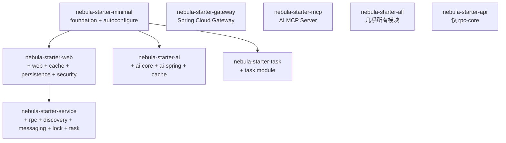

# Nebula Framework 全面审查报告

> 审查版本: 2.0.1-SNAPSHOT
> 审查日期: 2026-04-15
> 审查人: 架构审查 AI

---

## 1. 框架概述

### 1.1 基本信息

| 项目 | 信息 |
|------|------|
| 名称 | Nebula Framework |
| 版本 | 2.0.1-SNAPSHOT |
| 基础框架 | Spring Boot 3.5.8 |
| JDK | Java 21（启用 preview 特性） |
| 构建工具 | Maven（CI-Friendly 版本管理） |
| 包名空间 | `io.nebula` |
| Spring Cloud | 2025.0.0 |
| 许可证 | 未声明 |

### 1.2 架构层次

```
Nebula Framework 2.x
|
+-- 核心层 (Core)
|   +-- nebula-foundation          # 基础工具与异常处理
|   +-- nebula-security            # JWT/RBAC 安全认证
|
+-- 基础设施层 (Infrastructure)
|   +-- data/                      # 数据访问
|   |   +-- nebula-data-persistence  # MyBatis-Plus 持久化 + 读写分离 + 分库分表
|   |   +-- nebula-data-cache        # Caffeine/Redis 多级缓存
|   |   +-- nebula-data-neo4j        # Neo4j 图数据库
|   +-- messaging/                 # 消息传递
|   |   +-- nebula-messaging-core    # 消息抽象层
|   |   +-- nebula-messaging-rabbitmq # RabbitMQ 实现（含延迟消息）
|   |   +-- nebula-messaging-redis   # Redis Pub/Sub + Stream 实现
|   +-- websocket/                 # WebSocket
|   |   +-- nebula-websocket-core    # WebSocket 抽象层
|   |   +-- nebula-websocket-spring  # Spring WebSocket 实现
|   |   +-- nebula-websocket-netty   # Netty WebSocket 实现
|   +-- rpc/                       # 远程过程调用
|   |   +-- nebula-rpc-core          # RPC 抽象层（@RpcClient/@RpcService）
|   |   +-- nebula-rpc-http          # HTTP RPC 实现
|   |   +-- nebula-rpc-grpc          # gRPC 实现
|   |   +-- nebula-rpc-async         # 异步 RPC
|   +-- discovery/                 # 服务发现
|   |   +-- nebula-discovery-core    # 发现抽象层
|   |   +-- nebula-discovery-nacos   # Nacos 实现
|   +-- storage/                   # 对象存储
|   |   +-- nebula-storage-core      # 存储抽象层
|   |   +-- nebula-storage-minio     # MinIO 实现
|   |   +-- nebula-storage-aliyun-oss # 阿里云 OSS 实现
|   +-- search/                    # 搜索引擎
|   |   +-- nebula-search-core       # 搜索抽象层
|   |   +-- nebula-search-elasticsearch # Elasticsearch 实现
|   +-- lock/                      # 分布式锁
|   |   +-- nebula-lock-core         # 锁抽象层
|   |   +-- nebula-lock-redis        # Redis 锁实现（Redisson）
|   +-- gateway/                   # API 网关
|   |   +-- nebula-gateway-core      # Spring Cloud Gateway
|   +-- ai/                        # AI 模块
|   |   +-- nebula-ai-core           # AI 抽象层（Chat/Embedding/VectorStore/MCP）
|   |   +-- nebula-ai-spring         # Spring AI 集成 + RAG
|   +-- crawler/                   # 爬虫引擎
|       +-- nebula-crawler-core      # 爬虫抽象层
|       +-- nebula-crawler-http      # OkHttp 爬虫引擎
|       +-- nebula-crawler-browser   # Playwright 浏览器引擎
|       +-- nebula-crawler-proxy     # 代理 IP 池管理
|       +-- nebula-crawler-captcha   # 验证码识别（OCR/OpenCV/滑块）
|
+-- 应用层 (Application)
|   +-- nebula-web                 # Web 框架（拦截器/异常/限流/缓存/脱敏/监控）
|   +-- nebula-task                # 任务调度（XXL-JOB 集成）
|
+-- 集成层 (Integration)
|   +-- nebula-integration-payment      # 支付集成
|   +-- nebula-integration-notification # 通知集成（短信）
|
+-- 自动配置层 (Auto-Configuration)
|   +-- nebula-autoconfigure       # 统一自动配置入口
|
+-- 启动器 (Starter)
    +-- nebula-starter-minimal     # 最小化（仅 foundation + autoconfigure）
    +-- nebula-starter-web         # Web 应用（+ web + cache + persistence + security）
    +-- nebula-starter-service     # 微服务（+ rpc + discovery + messaging + lock + task）
    +-- nebula-starter-gateway     # API 网关
    +-- nebula-starter-ai          # AI 应用
    +-- nebula-starter-mcp         # MCP 服务
    +-- nebula-starter-task        # 任务调度
    +-- nebula-starter-all         # 全功能（单体应用）
    +-- nebula-starter-api         # API 契约（仅 rpc-core）
```

### 1.3 模块数量统计

| 层级 | 模块数 |
|------|--------|
| 核心层 | 2 |
| 基础设施层 | 22 |
| 应用层 | 2 |
| 集成层 | 2 |
| 自动配置层 | 1 |
| 启动器 | 9 |
| **总计** | **38** |

---

## 2. 核心模块审查

### 2.1 nebula-foundation

**职责**: 提供基础工具类、统一结果封装、异常体系、ID 生成器等。

**文件清单** (19 个 Java 文件):
- `Result<T>` - 统一响应封装（success/code/message/data/timestamp/requestId）
- `PageResult<T>` - 分页结果封装
- `BusinessException` / `SystemException` / `ValidationException` - 三层异常体系
- `ResultCode` - 响应码枚举
- `EnumBase` - 枚举基类
- `IdGenerator` - ID 生成器
- `JwtUtils` / `CryptoUtils` - 安全工具
- `JsonUtils` / `DateUtils` / `Strings` / `Collections` / `Beans` - 通用工具

**审查结论**:

| 维度 | 评分 | 说明 |
|------|------|------|
| 设计 | A | 职责清晰，接口完整 |
| 实现 | A- | Result 使用 `@Builder` 但未提供 `@NoArgsConstructor`，反序列化可能出问题 |
| 测试 | B- | 未发现单元测试文件 |

**发现的问题**:

1. **[中] Result 反序列化风险**: `Result` 类使用 `@Builder` 注解但缺少 `@NoArgsConstructor` 和 `@AllArgsConstructor`，Jackson 反序列化时可能失败（尤其在 RPC 场景中接收方反序列化）。
2. **[低] code 字段类型**: `Result.code` 为 `String` 类型（如 `"SUCCESS"`），与 `BusinessException.getErrorCode()` 返回值需保持一致，目前接口定义和实际用法存在轻微不匹配（GlobalExceptionHandler 中 `e.getErrorCode()` 直接作为 code 传入）。
3. **[低] JwtUtils 与 nebula-security 中的 JwtService 功能重叠**: `foundation` 和 `security` 都提供 JWT 处理能力，`nebula-web` 中还有独立的 `JwtUtils`，共三处 JWT 实现。

---

### 2.2 nebula-security

**职责**: JWT 认证、RBAC 授权、安全上下文管理。

**文件清单** (14 个 Java 文件):
- `@RequiresAuthentication` / `@RequiresRole` / `@RequiresPermission` - 安全注解
- `SecurityContext` / `UserPrincipal` / `Authentication` - 安全上下文
- `JwtService` / `DefaultJwtService` - JWT 服务
- `SecurityAspect` - AOP 切面
- `SecurityProperties` - 配置属性

**审查结论**:

| 维度 | 评分 | 说明 |
|------|------|------|
| 设计 | A | 轻量级安全框架，不依赖 Spring Security，适合内部系统 |
| 实现 | A | 注解 + AOP 切面方式灵活 |
| 配置 | A | 通过 `nebula.security.enabled` 控制 |

**发现的问题**:

1. **[中] JWT 实现分散**: `foundation.JwtUtils`、`security.JwtService`、`web.auth.JwtUtils` 三处 JWT 实现，应统一收敛到 `nebula-security` 模块。
2. **[低] SecurityContext 线程安全**: 基于 `ThreadLocal` 实现，在异步场景（如 `@Async`、WebSocket handler）中需注意上下文传递。

---

### 2.3 nebula-web

**职责**: Web 应用核心能力，包括认证拦截器、限流、响应缓存、性能监控、数据脱敏、健康检查、全局异常处理。

**文件清单** (53 个 Java 文件):

| 功能 | 关键类 | 配置前缀 |
|------|--------|---------|
| 认证 | `AuthInterceptor` / `AuthService` / `AuthContext` | `nebula.web.auth.*` |
| 限流 | `RateLimitInterceptor` / `MemoryRateLimiter` | `nebula.web.rate-limit.*` |
| 响应缓存 | `ResponseCacheInterceptor` / `MemoryResponseCache` | `nebula.web.cache.*` |
| 性能监控 | `PerformanceMonitorInterceptor` / `DefaultPerformanceMonitor` | `nebula.web.performance.*` |
| 数据脱敏 | `@SensitiveData` / `SensitiveDataSerializer` | 注解驱动 |
| 健康检查 | `HealthController` / `HealthCheckService` | 内置端点 |
| 全局异常 | `GlobalExceptionHandler` | 自动注册 |
| 请求日志 | `RequestLoggingFilter` / `RequestLoggingInterceptor` | `nebula.web.logging.*` |
| Jackson | `JacksonConfig` | 自动注册 |

**审查结论**:

| 维度 | 评分 | 说明 |
|------|------|------|
| 设计 | A | 功能全面，开关控制灵活 |
| 实现 | A- | 限流器仅有内存实现，分布式场景需扩展 |
| 脱敏 | A | 8 种脱敏策略覆盖常见场景 |

**发现的问题**:

1. **[中] 限流仅内存实现**: `MemoryRateLimiter` 基于 ConcurrentHashMap + 滑动窗口，单机有效但不支持分布式。Proud Day 如果多实例部署需考虑。
2. **[中] 响应缓存仅内存实现**: `MemoryResponseCache` 同上，不支持多实例共享缓存。
3. **[低] GlobalExceptionHandler 中 `Logger` 未使用**: 代码第 8 行导入了 `Logger`/`LoggerFactory`，但实际使用 `@Slf4j`（Lombok），存在 dead import。

---

### 2.4 nebula-data-persistence

**职责**: 数据持久化，基于 MyBatis-Plus，支持读写分离、分库分表。

**文件清单** (18 个 Java 文件 + 3 个测试文件):

| 功能 | 关键类 |
|------|--------|
| 基础配置 | `MyBatisPlusConfiguration` / `DataPersistenceAutoConfiguration` |
| 多数据源 | `DataSourceManager`（HikariCP 连接池管理） |
| 读写分离 | `DynamicDataSource` / `ReadWriteDataSourceAspect` / `@ReadDataSource` / `@WriteDataSource` |
| 分库分表 | `ShardingSphereManager` / `ShardingConfig` |
| 元数据填充 | `DefaultMetaObjectHandler`（自动填充 createTime/updateTime） |
| 事务管理 | `TransactionManager` / `DefaultTransactionManager` |
| 基类 | `BaseMapper` / `IService` / `ServiceImpl` |

**审查结论**:

| 维度 | 评分 | 说明 |
|------|------|------|
| 设计 | A | 功能完整，抽象合理 |
| 实现 | A | HikariCP 配置合理，DataSourceManager 有连接测试和销毁逻辑 |
| 测试 | B+ | 有 DataSourcePriority、ServiceImpl、ShardingSphere 测试 |

**发现的问题**:

1. **[低] MyBatis-Plus 版本**: 使用 3.5.9，建议关注新版更新（当前最新 3.5.x 系列稳定）。

---

### 2.5 nebula-data-cache

**职责**: 多级缓存（Caffeine 本地缓存 + Redis 分布式缓存）。

**文件清单** (7 个 Java 文件 + 1 个测试):
- `CacheManager` 接口
- `LocalCacheManager`（Caffeine）
- `DefaultCacheManager`（Redis）
- `MultiLevelCacheManager`（多级缓存组合）
- `MultiLevelCacheConfig` - 缓存配置

**审查结论**:

| 维度 | 评分 | 说明 |
|------|------|------|
| 设计 | A | 多级缓存架构合理 |
| 实现 | A- | 有 LocalCacheManager 测试 |
| 配置 | B+ | 配置属性类完整 |

---

### 2.6 nebula-websocket

**职责**: WebSocket 通信能力，支持 Spring WebSocket 和 Netty 两种实现。

**模块结构**:
- `nebula-websocket-core`: 抽象接口（`WebSocketMessageService`/`SessionRegistry`/`WebSocketMessage`）
- `nebula-websocket-spring`: Spring WebSocket 实现 + Redis 集群消息代理
- `nebula-websocket-netty`: Netty 高性能实现

**WebSocketMessageService 能力**:
- `sendToSession` / `sendToUser` / `sendToUsers` / `broadcast` - 多种发送模式
- `sendToTopic` - 发布/订阅模式
- `closeSession` / `closeUserSessions` - 会话管理
- `getOnlineSessionCount` / `getOnlineUserCount` / `isUserOnline` - 状态查询

**审查结论**:

| 维度 | 评分 | 说明 |
|------|------|------|
| 设计 | A | 核心 + 多实现架构，接口丰富 |
| 集群 | A | Redis 集群消息代理支持多实例广播 |
| 自动配置 | A | `nebula.websocket.enabled` 控制，支持 SockJS |

**发现的问题**:

1. **[中] WebSocket 不在 starter-web 中**: `nebula-starter-web` 未包含 WebSocket 依赖，使用时需额外引入。这对 Proud Day 项目有影响。
2. **[低] WebSocket 自动配置注册方式**: WebSocket 的 `AutoConfiguration` 在各自模块内声明，而非统一在 `nebula-autoconfigure` 中，与其他模块风格不一致。

---

### 2.7 nebula-lock (分布式锁)

**职责**: 基于 Redisson 的分布式锁。

**文件清单** (18 个 Java 文件 + 2 个测试):
- 核心接口: `LockManager` / `Lock` / `ReadWriteLock` / `LockCallback`
- 配置: `LockConfig` / `LockType`（REENTRANT / FAIR）/ `LockMode`
- Redis 实现: `RedisLockManager` / `RedisLock` / `RedisReadWriteLock`
- AOP: `LockedAspect` / `@Locked` 注解

**RedisLockManager 能力**:
- `getLock(key)` / `getLock(key, config)` - 获取锁（支持公平锁/可重入锁）
- `getReadWriteLock` - 读写锁
- `execute(key, callback)` - 锁回调执行
- `tryExecute(key, callback)` - 尝试锁回调
- `getRedLock` - 红锁支持

**审查结论**:

| 维度 | 评分 | 说明 |
|------|------|------|
| 设计 | A | 抽象清晰，回调模式易用 |
| 实现 | A- | 支持多种锁类型，红锁支持 |
| 测试 | B+ | 有 RedisLock 和 RedisLockManager 测试 |

**发现的问题**:

1. **[中] execute/tryExecute 方法未在接口中声明**: `execute` 和 `tryExecute` 是 `RedisLockManager` 类的方法，未在 `LockManager` 接口中声明。如果业务代码依赖接口编程，无法直接使用这两个便利方法。
2. **[低] lockCache 未实际使用**: `RedisLockManager` 中的 `lockCache` 字段在 `getLock` 方法中未进行缓存存储（每次创建新实例），但 `releaseLock` 方法尝试从中移除，逻辑不一致。

---

### 2.8 nebula-task (任务调度)

**职责**: 基于 XXL-JOB 的任务调度框架。

**文件清单** (18 个 Java 文件 + 5 个测试):
- 核心: `TaskEngine` / `TaskRegistry` / `TaskExecutor` / `@TaskHandler`
- 定时任务接口: `EveryMinuteExecute` / `EveryFiveMinuteExecute` / `EveryHourExecute` / `EveryDayExecute`
- XXL-JOB 集成: `XxlJobRegistryService` / `XxlJobTaskService` / `TimedTaskJobHandler`
- 自动配置: `TaskAutoConfiguration` / `XxlJobAutoConfiguration`

**审查结论**:

| 维度 | 评分 | 说明 |
|------|------|------|
| 设计 | A | 注解驱动，自动发现并注册 TaskExecutor |
| 实现 | A | XXL-JOB 集成完整，含注册服务 |
| 测试 | A- | 有 TaskEngine、TaskContext、ScheduledTask 等测试 |

---

### 2.9 nebula-messaging (消息队列)

**职责**: 消息队列抽象与实现。

**模块结构**:
- `nebula-messaging-core`: 抽象接口（`MessageProducer`/`MessageConsumer`/`MessageRouter`/`MessageSerializer`）
- `nebula-messaging-rabbitmq`: RabbitMQ 实现（含延迟消息 `DelayMessageProducer`/`DelayMessageConsumer`）
- `nebula-messaging-redis`: Redis Pub/Sub + Stream 实现

**审查结论**:

| 维度 | 评分 | 说明 |
|------|------|------|
| 设计 | A | 核心抽象 + 多实现，支持延迟消息 |
| 实现 | A | RabbitMQ 手动 ACK/NACK，Redis Stream 实现 |
| 注解 | A | `@MessageHandler` 注解驱动消费 |
| 测试 | B+ | RabbitMQ 模块有 5 个测试文件 |

---

### 2.10 nebula-rpc (远程过程调用)

**职责**: 服务间 RPC 通信。

**模块结构**:
- `nebula-rpc-core`: 核心注解（`@RpcClient`/`@RpcService`/`@RpcCall`/`@EnableRpcClients`）+ 动态代理扫描注册
- `nebula-rpc-http`: HTTP RPC 实现（基于 RestTemplate）
- `nebula-rpc-grpc`: gRPC 实现（基于 grpc-spring-boot-starter）
- `nebula-rpc-async`: 异步 RPC 执行

**审查结论**:

| 维度 | 评分 | 说明 |
|------|------|------|
| 设计 | A | 统一 RPC 接口定义，多协议透明切换 |
| 实现 | A- | HTTP/gRPC 双实现 |
| 服务发现集成 | A | `RpcDiscoveryAutoConfiguration` 整合 Nacos |
| 测试 | B+ | gRPC 模块有客户端/服务端/消息转换测试 |

**发现的问题**:

1. **[中] HTTP RPC 基于 RestTemplate**: Spring 官方推荐 `WebClient`（WebFlux）或 `RestClient`（Spring 6.1+），RestTemplate 在维护模式中。

---

### 2.11 nebula-storage (对象存储)

**职责**: 统一对象存储接口。

**StorageService 接口能力**: 上传/下载/删除/复制/预签名URL/对象列表/桶管理/元数据/对象存在性。

**审查结论**:

| 维度 | 评分 | 说明 |
|------|------|------|
| 设计 | A | 统一接口，实现可切换 |
| MinIO 实现 | A | 功能完整，有 6 个测试文件 |
| OSS 实现 | A | 阿里云 OSS 实现完整 |

---

### 2.12 nebula-discovery (服务发现)

**职责**: 基于 Nacos 的服务注册与发现。

**审查结论**:

| 维度 | 评分 | 说明 |
|------|------|------|
| 实现 | A | 启动注册 + 关闭注销，gRPC 端口写入 metadata |
| 自动配置 | A | Binder 绑定 `nebula.discovery.nacos.*` |

---

### 2.13 nebula-gateway (API 网关)

**职责**: 基于 Spring Cloud Gateway 的 HTTP 反向代理网关。

**文件清单** (6 个 Java 文件):
- `GatewayRoutesAutoConfiguration` - 路由自动配置
- `GatewayRedisAutoConfiguration` - Redis 限流配置
- `GatewayProperties` - 配置属性（日志/限流/HTTP代理/CORS）
- `LoggingGlobalFilter` - 请求日志过滤器（RequestId/慢请求标记）
- `RateLimitKeyResolverConfig` - IP/Path 限流策略
- `GatewayHealthController` - 健康检查

**审查结论**:

| 维度 | 评分 | 说明 |
|------|------|------|
| 设计 | A | 遵循微服务三原则，HTTP 反向代理 |
| 实现 | B+ | 功能完整但文件较少，JWT 认证已移至应用层 |

---

### 2.14 nebula-ai (AI 模块)

**职责**: 基于 Spring AI 的智能服务。

**模块结构**:
- `nebula-ai-core`: 抽象接口（`ChatService`/`EmbeddingService`/`VectorStoreService`/`McpClientService`/`McpServerService`）
- `nebula-ai-spring`: Spring AI 集成实现 + RAG 文档处理（Parser/Chunker）

**审查结论**:

| 维度 | 评分 | 说明 |
|------|------|------|
| 设计 | A | AI + MCP 双重支持 |
| 实现 | A | Spring AI 1.1.0 集成，含 RAG 处理链 |
| 测试 | B+ | Chat/Embedding/VectorStore/RAG 测试 |

---

### 2.15 nebula-crawler (爬虫引擎)

**职责**: 网页抓取/数据采集框架。

**模块结构** (5 个子模块):
- `nebula-crawler-core`: 抽象层（`CrawlerEngine`/`CrawlerRequest`/`CrawlerResponse`/`DataExtractor`/`ProxyProvider`/`CrawlerRateLimiter`/`CookieManager`）
- `nebula-crawler-http`: OkHttp 爬虫引擎（日志/重试/UA 拦截器）
- `nebula-crawler-browser`: Playwright 浏览器引擎（反爬 Stealth/验证码检测处理）
- `nebula-crawler-proxy`: 代理 IP 池（API/静态代理源/代理检查器/代理池）
- `nebula-crawler-captcha`: 验证码识别（OCR/OpenCV 滑块/2Captcha/腾讯验证码）

**审查结论**:

| 维度 | 评分 | 说明 |
|------|------|------|
| 设计 | A | 多引擎架构，抽象到位 |
| 反爬 | A | StealthHelper + 验证码自动处理 |
| 代理 | A | 代理池 + 代理校验 + 多源支持 |
| 验证码 | A | 5 种验证码类型（图片/滑块/点选/旋转/手势） |

**发现的问题**:

1. **[低] OpenCV 本地依赖**: `OpenCvService` 需要本地安装 OpenCV 库，部署时需确保容器镜像包含。Docker 目录下已有 `captcha-opencv/` 配置文件。

---

## 3. 自动配置体系审查

### 3.1 AutoConfiguration.imports 注册顺序

```
Discovery -> RPC (HTTP/gRPC) -> RpcDiscovery -> AsyncRpc
-> DataPersistence -> ReadWrite -> Sharding -> Cache
-> Security -> Lock -> Messaging -> Search
-> Storage (MinIO/OSS) -> Gateway -> AI/MCP -> Crawler -> Task
```

**评价**: 顺序合理，遵循了依赖关系。服务发现最先初始化，RPC 依赖服务发现，数据层独立，其余按需加载。

### 3.2 条件化加载

所有自动配置均使用 `@ConditionalOnClass` / `@ConditionalOnProperty` 控制，确保：
- 未引入模块不会报错
- 可通过配置开关禁用
- 按需加载，不浪费资源

### 3.3 WebSocket 自动配置特殊性

WebSocket 模块的自动配置（`WebSocketAutoConfiguration`）在各自模块内声明（`nebula-websocket-spring`/`nebula-websocket-netty`），而非在 `nebula-autoconfigure` 中统一管理。这是因为 WebSocket 的 `@EnableWebSocket` 注解和 `WebSocketConfigurer` 实现需要与具体实现类紧密耦合。

**发现的问题**:

1. **[低] 自动配置风格不统一**: 大部分模块的自动配置在 `nebula-autoconfigure` 中声明，但 WebSocket、Redis Lock 和 Task 在各自模块内声明。虽然功能正确，但增加了维护成本。

---

## 4. Starter 体系审查

### 4.1 Starter 依赖关系



### 4.2 各 Starter 适用场景

| Starter | 适用场景 | Proud Day 适用性 |
|---------|---------|-----------------|
| `nebula-starter-minimal` | CLI 工具、无 Web 应用 | 不适用 |
| `nebula-starter-web` | 单体 Web 应用 | **主要依赖** |
| `nebula-starter-service` | 微服务应用 | 不需要 |
| `nebula-starter-gateway` | API 网关 | 不需要 |
| `nebula-starter-ai` | AI 应用 | 不需要 |
| `nebula-starter-task` | 独立任务调度 | 需额外引入 |
| `nebula-starter-all` | 全功能单体 | 可选，但引入过多 |
| `nebula-starter-api` | API 契约定义 | 不需要 |

### 4.3 Proud Day 项目推荐依赖组合

```xml
<!-- 主 Starter: Web 应用 -->
<dependency>
    <groupId>io.nebula</groupId>
    <artifactId>nebula-starter-web</artifactId>
</dependency>

<!-- WebSocket: 游戏/抽奖实时通信 -->
<dependency>
    <groupId>io.nebula</groupId>
    <artifactId>nebula-websocket-spring</artifactId>
</dependency>

<!-- 分布式锁: 加入房间/抽奖防超发 -->
<dependency>
    <groupId>io.nebula</groupId>
    <artifactId>nebula-lock-redis</artifactId>
</dependency>

<!-- 任务调度: 抽奖轮次定时开启/关闭 -->
<dependency>
    <groupId>io.nebula</groupId>
    <artifactId>nebula-task</artifactId>
</dependency>

<!-- 对象存储: 头像/活动图片 -->
<dependency>
    <groupId>io.nebula</groupId>
    <artifactId>nebula-storage-minio</artifactId>
</dependency>

<!-- 消息队列(可选): 勋章触发/异步通知 -->
<dependency>
    <groupId>io.nebula</groupId>
    <artifactId>nebula-messaging-rabbitmq</artifactId>
</dependency>
```

---

## 5. 发现的问题和风险

### 5.1 问题汇总

| 编号 | 严重度 | 模块 | 问题描述 |
|------|--------|------|---------|
| P01 | 高 | foundation | `Result` 类缺少无参构造函数，可能导致 JSON 反序列化失败 |
| P02 | 中 | security/web | JWT 实现分散在 3 个模块中，维护困难 |
| P03 | 中 | web | `MemoryRateLimiter` 不支持分布式，多实例部署时限流失效 |
| P04 | 中 | web | `MemoryResponseCache` 不支持分布式，多实例缓存不一致 |
| P05 | 中 | lock | `execute`/`tryExecute` 未在 `LockManager` 接口声明 |
| P06 | 中 | lock | `lockCache` 字段使用逻辑不一致（写入与读取不对称） |
| P07 | 中 | rpc | HTTP RPC 基于 RestTemplate，已处于维护模式 |
| P08 | 中 | starter | `nebula-starter-web` 未包含 WebSocket，项目需额外引入 |
| P09 | 低 | autoconfigure | 自动配置注册风格不统一（集中式 vs 模块内） |
| P10 | 低 | web | `GlobalExceptionHandler` 有未使用的 import |
| P11 | 低 | crawler | OpenCV 需要本地库依赖 |
| P12 | 低 | 全局 | 框架版本 2.0.1-SNAPSHOT，尚未正式发布 |

### 5.2 风险评估

**对 Proud Day 项目的影响**:

| 风险 | 影响程度 | 应对措施 |
|------|---------|---------|
| P01 Result 反序列化 | **高** - 前后端交互核心 | 建议给 Result 类添加 `@NoArgsConstructor` `@AllArgsConstructor` |
| P03/P04 单机限流/缓存 | **低** - Proud Day 初期单实例 | 暂不影响，后期多实例需扩展 |
| P05 LockManager 接口 | **中** - 影响代码规范 | 业务代码直接注入 `RedisLockManager` 使用 |
| P08 WebSocket 未含 | **低** - 已知需额外引入 | 在 pom.xml 显式引入 |

---

## 6. 框架与 Proud Day 项目匹配度分析

### 6.1 需求覆盖矩阵

| 业务需求 | 框架模块 | 覆盖度 | 说明 |
|---------|---------|--------|------|
| JWT 认证（员工编码+验证码） | nebula-security + nebula-web (AuthInterceptor) | 完全覆盖 | 开箱即用 |
| 数据持久化（25+ 表） | nebula-data-persistence (MyBatis-Plus) | 完全覆盖 | BaseMapper + IService |
| 缓存（会议信息/排行榜） | nebula-data-cache (Caffeine + Redis) | 完全覆盖 | 多级缓存 |
| WebSocket（游戏/抽奖实时通信） | nebula-websocket-spring | 完全覆盖 | sendToTopic + broadcast |
| 分布式锁（加入房间/抽奖防超发） | nebula-lock-redis | 完全覆盖 | execute + tryExecute |
| 定时任务（抽奖轮次管理） | nebula-task (XXL-JOB) | 完全覆盖 | EveryMinuteExecute |
| 文件上传（头像/奖品图片） | nebula-storage-minio | 完全覆盖 | 预签名 URL |
| 消息队列（异步勋章/通知） | nebula-messaging-rabbitmq | 完全覆盖 | 可选 |
| 统一响应封装 | nebula-foundation (Result) | 完全覆盖 | 直接使用 |
| 全局异常处理 | nebula-web (GlobalExceptionHandler) | 完全覆盖 | 自动注册 |
| 数据脱敏（手机号等） | nebula-web (@SensitiveData) | 完全覆盖 | 注解驱动 |
| 健康检查 | nebula-web (HealthController) | 完全覆盖 | 内置端点 |
| 点赞并发控制 | nebula-lock-redis + DB 唯一索引 | 完全覆盖 | 双重保障 |
| 投票排行榜 | nebula-data-cache (Redis) | 部分覆盖 | Redis Sorted Set 需业务层实现 |

### 6.2 覆盖率评估

- **直接可用**: 13/14 = **93%**
- **需业务层补充**: 排行榜需基于 Redis Sorted Set 自行实现

### 6.3 不需要的模块

以下模块在 Proud Day 项目中**不需要引入**:
- `nebula-rpc-*` - 单体应用，无需 RPC
- `nebula-discovery-*` - 无需服务发现
- `nebula-gateway-*` - 无需 API 网关
- `nebula-ai-*` - 无 AI 需求
- `nebula-search-*` - 无搜索需求
- `nebula-crawler-*` - 无爬虫需求
- `nebula-data-neo4j` - 无图数据库需求

---

## 7. 优化建议

### 7.1 架构优化

1. **统一 JWT 实现**: 将 `foundation.JwtUtils` 和 `web.auth.JwtUtils` 移除或标记为 `@Deprecated`，统一使用 `nebula-security` 模块的 `JwtService`。
2. **补充 Starter**: 考虑创建 `nebula-starter-event`（面向活动类项目：web + websocket + lock + task + storage），简化类似 Proud Day 项目的依赖配置。
3. **限流器扩展**: 为 `RateLimiter` 接口增加 Redis 实现（`RedisRateLimiter`），支持分布式限流。

### 7.2 代码改进

1. **修复 Result 类**: 添加 `@NoArgsConstructor` 和 `@AllArgsConstructor` 确保 JSON 框架兼容。
2. **LockManager 接口补全**: 将 `execute`/`tryExecute` 方法声明到 `LockManager` 接口中。
3. **修复 lockCache 逻辑**: 在 `getLock` 方法中使用 `computeIfAbsent` 缓存锁实例，或移除无效的缓存字段。
4. **升级 HTTP RPC**: 考虑将 `RestTemplate` 替换为 `RestClient`（Spring 6.1+）。

### 7.3 文档完善

1. **模块使用指南**: 为每个模块补充独立的 README.md，包含快速上手示例。
2. **配置参考手册**: 整理所有 `nebula.*` 配置项，生成统一的配置参考文档。
3. **版本发布**: 建议在 Proud Day 项目启动前将框架版本从 SNAPSHOT 切换为正式版本。

---

## 8. 附录

### 8.1 完整配置前缀清单

| 配置前缀 | 模块 | 说明 |
|---------|------|------|
| `nebula.web.auth.*` | nebula-web | 认证配置 |
| `nebula.web.rate-limit.*` | nebula-web | 限流配置 |
| `nebula.web.cache.*` | nebula-web | 响应缓存配置 |
| `nebula.web.performance.*` | nebula-web | 性能监控配置 |
| `nebula.web.logging.*` | nebula-web | 请求日志配置 |
| `nebula.security.*` | nebula-security | 安全配置 |
| `nebula.data.persistence.*` | nebula-data-persistence | 持久化配置 |
| `nebula.data.cache.*` | nebula-data-cache | 缓存配置 |
| `nebula.websocket.*` | nebula-websocket-spring | WebSocket 配置 |
| `nebula.lock.redis.*` | nebula-lock-redis | Redis 锁配置 |
| `nebula.messaging.rabbitmq.*` | nebula-messaging-rabbitmq | RabbitMQ 配置 |
| `nebula.messaging.redis.*` | nebula-messaging-redis | Redis 消息配置 |
| `nebula.storage.minio.*` | nebula-storage-minio | MinIO 配置 |
| `nebula.storage.aliyun-oss.*` | nebula-storage-aliyun-oss | 阿里云 OSS 配置 |
| `nebula.search.elasticsearch.*` | nebula-search-elasticsearch | ES 配置 |
| `nebula.discovery.nacos.*` | nebula-discovery-nacos | Nacos 配置 |
| `nebula.rpc.http.*` | nebula-rpc-http | HTTP RPC 配置 |
| `nebula.rpc.grpc.*` | nebula-rpc-grpc | gRPC 配置 |
| `nebula.task.*` | nebula-task | 任务调度配置 |
| `nebula.ai.*` | nebula-ai-spring | AI 配置 |
| `nebula.gateway.*` | nebula-gateway-core | 网关配置 |
| `nebula.crawler.*` | nebula-crawler-* | 爬虫配置 |

### 8.2 技术栈版本清单

| 技术 | 版本 | 说明 |
|------|------|------|
| Spring Boot | 3.5.8 | 核心框架 |
| Spring Cloud | 2025.0.0 | 微服务框架 |
| Spring AI | 1.1.0 | AI 集成 |
| Java | 21 | 语言版本 |
| MyBatis-Plus | 3.5.9 | ORM |
| MySQL Connector | 9.1.0 | 数据库驱动 |
| Redisson | 3.39.0 | Redis 客户端 |
| RabbitMQ Client | 5.20.0 | MQ 客户端 |
| MinIO | 8.5.7 | 对象存储 |
| Nacos | 2.5.1 | 服务发现 |
| XXL-JOB | 3.2.0 | 任务调度 |
| gRPC | 1.68.1 | RPC 框架 |
| Elasticsearch | 8.11.1 | 搜索引擎 |
| JJWT | 0.12.3 | JWT 库 |
| Guava | 33.3.1-jre | 工具库 |
| JUnit | 5.11.3 | 测试框架 |

---

## 9. 优化路线图（已修复 & 待跟进）

### 9.1 已修复项（v2.0.1）

| 编号 | 问题 | 修复方式 | 涉及文件 |
|------|------|---------|---------|
| F-01 | Result 反序列化风险 | 添加 `@NoArgsConstructor` + `@AllArgsConstructor` | `nebula-foundation / Result.java` |
| F-02 | JWT 实现分散 | 对 `foundation.JwtUtils`、`web.auth.JwtUtils` 标记 `@Deprecated(forRemoval=true)`，引导迁移至 `nebula-security.JwtService` | `nebula-foundation / JwtUtils.java`、`nebula-web / JwtUtils.java` |
| F-03 | GlobalExceptionHandler 死导入 | 移除未使用的 `org.slf4j.Logger/LoggerFactory` | `nebula-web / GlobalExceptionHandler.java` |
| F-04 | LockManager 接口不完整 | 在 `LockManager` 接口补充 `execute`/`tryExecute` 及其重载 | `nebula-lock-core / LockManager.java` |
| F-05 | lockCache 逻辑不一致 | 移除无效的 `lockCache`/`rwLockCache`，`releaseLock` 改为通过 Redisson 直接查询锁状态 | `nebula-lock-redis / RedisLockManager.java` |
| F-06 | web.auth.JwtUtils 死导入 | 移除未使用的 `Logger/LoggerFactory` import | `nebula-web / JwtUtils.java` |

### 9.2 已完成的优化项（v2.0.1 后续批次）

#### P-01: WebSocket 自动配置风格统一（已完成）

**修复方式**:
1. 将 `nebula-websocket-spring` 和 `nebula-websocket-netty` 中的 `@AutoConfiguration` 降级为 `@Configuration`
2. 在 `nebula-autoconfigure` 新增代理类 `SpringWebSocketAutoConfiguration` 和 `NettyWebSocketAutoConfiguration`
3. 通过 `@ConditionalOnClass` + `@Import` 委托给模块内部配置
4. 统一在 `nebula-autoconfigure` 的 `AutoConfiguration.imports` 注册

**涉及文件**:
- `nebula-websocket-spring / WebSocketAutoConfiguration.java` (`@AutoConfiguration` -> `@Configuration`)
- `nebula-websocket-netty / NettyWebSocketAutoConfiguration.java` (`@AutoConfiguration` -> `@Configuration`)
- 新增 `nebula-autoconfigure / websocket/SpringWebSocketAutoConfiguration.java`
- 新增 `nebula-autoconfigure / websocket/NettyWebSocketAutoConfiguration.java`
- 更新 `nebula-autoconfigure / AutoConfiguration.imports`

---

#### P-02: HTTP RPC 从 RestTemplate 迁移至 RestClient（已完成）

**修复方式**: 直接将 `HttpRpcClient` 和 `HttpRpcAutoConfiguration` 中的 `RestTemplate` 替换为 Spring 6.1+ 的 `RestClient`。

**涉及文件**:
- `nebula-rpc-http / HttpRpcClient.java` (构造函数参数、`sendRequest` 方法)
- `nebula-autoconfigure / HttpRpcAutoConfiguration.java` (`rpcRestTemplate` Bean -> `rpcRestClient` Bean)
- `nebula-rpc-http / HttpRpcClientTest.java` (测试适配)

**兼容性说明**: `RestClient` 与 `RestTemplate` 共用 `ClientHttpRequestFactory`，连接池与超时配置完全复用。

---

#### P-03: 自动配置启用策略统一 -- matchIfMissing 代码实施（已完成）

**修复方式**:
1. 将所有 Level 2/Level 3 模块的 `@ConditionalOnProperty(matchIfMissing = true)` 改为 `matchIfMissing = false`
2. 在 `nebula-autoconfigure` 新增 `NebulaStarterDefaultsPostProcessor`（`EnvironmentPostProcessor`），扫描各 Starter 的 `META-INF/nebula-defaults.properties`，以最低优先级注入默认配置
3. 各 Starter 通过 `nebula-defaults.properties` 声明默认启用的模块
4. 同步修复 `RedisLockManagerTest` 中因 lockCache 移除导致的缓存语义测试

**涉及文件**:
- `nebula-autoconfigure / HttpRpcAutoConfiguration.java` (`matchIfMissing` true -> false)
- `nebula-autoconfigure / AsyncRpcAutoConfiguration.java` (`matchIfMissing` true -> false)
- `nebula-autoconfigure / RpcDiscoveryAutoConfiguration.java` (`matchIfMissing` true -> false)
- `nebula-autoconfigure / NacosDiscoveryAutoConfiguration.java` (`matchIfMissing` true -> false)
- `nebula-autoconfigure / GatewayAutoConfiguration.java` (`matchIfMissing` true -> false)
- `nebula-autoconfigure / RedisLockAutoConfiguration.java` (`matchIfMissing` true -> false)
- `nebula-autoconfigure / AIAutoConfiguration.java` (`matchIfMissing` true -> false)
- `nebula-autoconfigure / Neo4jAutoConfiguration.java` (`matchIfMissing` true -> false)
- 新增 `nebula-autoconfigure / env/NebulaStarterDefaultsPostProcessor.java`
- 新增 `nebula-autoconfigure / META-INF/spring/org.springframework.boot.env.EnvironmentPostProcessor.imports`
- 新增 各 Starter `META-INF/nebula-defaults.properties`（web/service/gateway/ai/all）
- `nebula-lock-redis / RedisLockManagerTest.java`（测试适配）

---

## 10. 自动配置启用策略统一设计

### 10.1 设计原则

**"有 jar 就准备好，有配置才启动"** -- classpath 决定能力边界，配置决定是否激活。

### 10.2 三级分类

| 级别 | 策略 | 含义 | 适用条件 |
|------|------|------|---------|
| Level 1 | `matchIfMissing = true` | 默认启用 | 纯内存组件，无外部服务依赖 |
| Level 2 | `matchIfMissing = false` | 默认禁用 | 需要连接外部基础设施（Redis/DB/MQ/ES 等） |
| Level 3 | `matchIfMissing = false` | 默认禁用 | 特定部署形态（微服务 RPC、网关、爬虫、AI） |

### 10.3 模块分类明细

#### Level 1 - 纯内存组件（默认启用）

| 模块 | 配置前缀 | matchIfMissing |
|------|---------|---------------|
| Security (JWT/RBAC) | `nebula.security.enabled` | `true` |

#### Level 2 - 需要外部服务（默认禁用）

| 模块 | 配置前缀 | matchIfMissing |
|------|---------|---------------|
| Data Persistence | `nebula.data.persistence.enabled` | `false` |
| Data Cache | `nebula.data.cache.enabled` | `false` |
| Redis Lock | `nebula.lock.enabled` | `false` |
| RabbitMQ | `nebula.messaging.rabbitmq.enabled` | `false` |
| Nacos Discovery | `nebula.discovery.nacos.enabled` | `false` |
| Elasticsearch | `nebula.search.elasticsearch.enabled` | `false` |
| MinIO | `nebula.storage.minio.enabled` | `false` |
| Aliyun OSS | `nebula.storage.aliyun.oss.enabled` | `false` |
| Neo4j | `nebula.data.neo4j.enabled` | `false` |

#### Level 3 - 特定部署形态（默认禁用）

| 模块 | 配置前缀 | matchIfMissing |
|------|---------|---------------|
| HTTP RPC | `nebula.rpc.http.enabled` | `false` |
| gRPC | `nebula.rpc.grpc.enabled` | `false` |
| Async RPC | `nebula.rpc.async.enabled` | `false` |
| RPC Discovery | `nebula.rpc.discovery.enabled` | `false` |
| Gateway | `nebula.gateway.enabled` | `false` |
| Crawler | `nebula.crawler.enabled` | `false` |
| AI | `nebula.ai.enabled` | `false` |

### 10.4 Starter 默认配置约定

各 Starter 通过 `META-INF/nebula-defaults.properties` 声明默认启用的模块，
由 `nebula-autoconfigure` 中的 `NebulaStarterDefaultsPostProcessor`（`EnvironmentPostProcessor`）
在启动时以 **最低优先级** 注入到 Environment。用户 `application.yml` 中的配置始终可以覆盖。

**工作原理**：
1. 各 Starter JAR 内放置 `META-INF/nebula-defaults.properties`
2. `NebulaStarterDefaultsPostProcessor` 扫描 `classpath*:META-INF/nebula-defaults.properties`
3. 将所有属性以 `addLast` 方式合并到 Environment（最低优先级）
4. 用户显式配置 > Starter 默认值

| Starter | 默认启用的模块 | 实现方式 |
|---------|---------------|---------|
| `nebula-starter-minimal` | (无额外启用，仅 Security 默认生效) | 无 defaults 文件 |
| `nebula-starter-web` | Data Persistence, Data Cache | `nebula-defaults.properties` |
| `nebula-starter-service` | Data Persistence, Data Cache, HTTP RPC, RPC Discovery, Nacos, Redis Lock | `nebula-defaults.properties` |
| `nebula-starter-gateway` | Gateway, Nacos | `nebula-defaults.properties` |
| `nebula-starter-ai` | AI, Data Cache | `nebula-defaults.properties` |
| `nebula-starter-all` | 几乎全部模块 | `nebula-defaults.properties` |

### 10.5 子级配置规则

当父级启用后，其子级配置默认跟随父级（`matchIfMissing = true`）：

```
nebula.rpc.http.enabled = true      # 父级开关
  ├─ nebula.rpc.http.client.enabled   # 默认 true（跟随父级）
  └─ nebula.rpc.http.server.enabled   # 默认 true（跟随父级）

nebula.gateway.enabled = true        # 父级开关
  └─ nebula.gateway.logging.enabled   # 默认 true（跟随父级）
```

### 10.6 配置示例

```yaml
# 最小配置（使用 nebula-starter-web，什么都不写也能运行）
# Security 默认启用，其他按需开启

# 需要 Redis 缓存和分布式锁的 Web 项目
nebula:
  data:
    cache:
      enabled: true
  lock:
    enabled: true

# 微服务项目（使用 nebula-starter-service，自带默认配置）
# Starter 已默认启用: data-persistence, cache, http-rpc, nacos, lock
# 只需配置具体连接信息
spring:
  datasource:
    url: jdbc:mysql://localhost:3306/mydb
nebula:
  discovery:
    nacos:
      server-addr: localhost:8848
```
