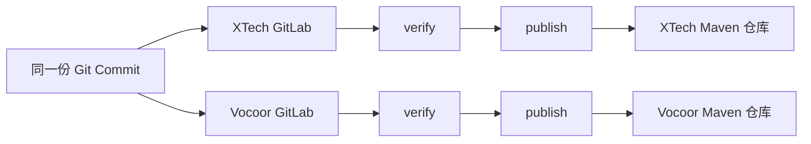

# 多 GitLab 隔离环境 CI/CD 设置指南

## 目标

Nebula 同时存在于多个无法互通的 GitLab 环境中。所有环境使用完全相同的代码和
`.gitlab-ci.yml`，环境差异通过各 GitLab 项目自身的 CI/CD Variables 注入。

本方案遵循以下原则：

- 不引用任何 GitLab 实例内的共享 CI 模板。
- 不在仓库中保存 Token、用户名、密码或环境专属地址。
- 每个 GitLab 使用自己可访问的构建镜像、Maven 仓库和 Runner。
- 每个环境都执行测试，并将制品发布到各自独立的 Maven 仓库。
- 两个 GitLab 仓库保持相同 Commit，禁止分别修改 `.gitlab-ci.yml`。

## CI/CD 流程



流水线包含两个阶段：

1. `verify`：所有分支运行测试和构建验证。
2. `publish`：仅默认分支和受保护的 Tag 运行，向当前环境自己的 Maven 仓库发布制品。

## GitLab 项目变量

分别进入两个 GitLab 项目：

`Settings` -> `CI/CD` -> `Variables`

在每个项目中配置以下变量。变量值必须是当前 GitLab Runner 所在环境可以访问的地址。

| 变量名 | 类型 | 必填 | 说明 |
| --- | --- | --- | --- |
| `NEBULA_CI_IMAGE` | Variable | 是 | 完整的 Maven + Java 21 构建镜像地址 |
| `NEBULA_RUNNER_TAG` | Variable | 是 | 当前环境用于 Java 构建的 GitLab Runner Tag |
| `MAVEN_VERIFY_SETTINGS_XML` | File | 是 | 用于所有分支构建的 Maven 只读配置 |
| `MAVEN_DEPLOY_SETTINGS_XML` | File | 是 | 用于默认分支和 Tag 发布的 Maven 配置 |
| `MAVEN_RELEASE_REPOSITORY_URL` | Variable | 是 | 当前环境 Maven Release 仓库部署地址 |
| `MAVEN_SNAPSHOT_REPOSITORY_URL` | Variable | 是 | 当前环境 Maven Snapshot 仓库部署地址 |

### File 类型变量如何工作

`MAVEN_VERIFY_SETTINGS_XML` 和 `MAVEN_DEPLOY_SETTINGS_XML` 不放在构建镜像中，也不提交到
Git 仓库。它们应分别配置在每个 GitLab 项目的 CI/CD Variables 中，变量类型选择
`File`。

Pipeline 运行时，GitLab Runner 会将 File 变量的 Value 写入任务工作目录中的临时文件，
并将变量值设置为该临时文件路径。例如：

```bash
# MAVEN_DEPLOY_SETTINGS_XML 的值是临时文件路径，而不是 XML 文本
mvn --settings "$MAVEN_DEPLOY_SETTINGS_XML" deploy
```

任务结束后，临时文件随任务环境一起清理。

不要把带有发布凭据的 `settings.xml` 放进 `NEBULA_CI_IMAGE`。镜像层可能被缓存、导出或被
其他有镜像读取权限的人员访问，无法满足凭据隔离要求。

建议：

- `MAVEN_VERIFY_SETTINGS_XML` 只配置读取依赖所需的最低权限凭据。
- `MAVEN_DEPLOY_SETTINGS_XML`、`MAVEN_RELEASE_REPOSITORY_URL` 和
  `MAVEN_SNAPSHOT_REPOSITORY_URL` 设置为 `Protected`，同时将默认分支和正式发布 Tag
  设置为 Protected。
- File 变量包含多行 XML 和空白字符，应设置为 `Visible`。不要在 CI 脚本中使用 `cat`、
  `echo` 或 `tee` 输出其内容。
- Maven 仓库用户名和密码只写入对应的 File 变量，不要单独提交到仓库。
- `NEBULA_CI_IMAGE` 必须在对应环境中存在，不能使用另一个隔离环境的镜像地址。
- `NEBULA_RUNNER_TAG` 必须指向支持容器镜像运行方式的 Java 构建 Runner，避免任务被
  Shell Runner 接走后忽略 `NEBULA_CI_IMAGE`。

## Maven Settings 配置

### 构建验证配置

在 GitLab 中创建 File 类型变量 `MAVEN_VERIFY_SETTINGS_XML`。如果依赖全部来自公共仓库，
可以使用以下最小配置：

```xml
<?xml version="1.0" encoding="UTF-8"?>
<settings xmlns="http://maven.apache.org/SETTINGS/1.2.0"
          xmlns:xsi="http://www.w3.org/2001/XMLSchema-instance"
          xsi:schemaLocation="http://maven.apache.org/SETTINGS/1.2.0 https://maven.apache.org/xsd/settings-1.2.0.xsd"/>
```

如果需要从私有 Maven 仓库读取依赖，应只配置只读账号。该变量需要供普通分支和
Merge Request 使用，因此不能包含发布权限。

### 制品发布配置

分别在 XTech 和 Vocoor GitLab 项目中执行以下操作：

1. 进入 `Settings` -> `CI/CD` -> `Variables`。
2. 点击 `Add variable`。
3. `Key` 填写 `MAVEN_DEPLOY_SETTINGS_XML`。
4. `Type` 选择 `File`。
5. `Visibility` 选择 `Visible`。
6. 开启 `Protect variable`。
7. 在 `Value` 中填写当前环境完整的 Maven `settings.xml` 内容。

该变量的 Value 示例：

```xml
<?xml version="1.0" encoding="UTF-8"?>
<settings xmlns="http://maven.apache.org/SETTINGS/1.2.0"
          xmlns:xsi="http://www.w3.org/2001/XMLSchema-instance"
          xsi:schemaLocation="http://maven.apache.org/SETTINGS/1.2.0 https://maven.apache.org/xsd/settings-1.2.0.xsd">
    <servers>
        <server>
            <id>nebula-release</id>
            <username>替换为当前环境的用户名</username>
            <password>替换为当前环境的密码或 Token</password>
        </server>
        <server>
            <id>nebula-snapshot</id>
            <username>替换为当前环境的用户名</username>
            <password>替换为当前环境的密码或 Token</password>
        </server>
    </servers>
</settings>
```

`server.id` 必须与根目录 `pom.xml` 中 `distributionManagement` 的 ID 保持一致：

- Release：`nebula-release`
- Snapshot：`nebula-snapshot`

两个 GitLab 环境必须分别配置自己的 `MAVEN_DEPLOY_SETTINGS_XML`，不能共享另一个隔离
环境的 Maven 地址或发布凭据。

## 两个环境的配置示例

以下地址仅用于说明，实际值以各环境的 Maven 仓库为准。

### XTech GitLab

| 变量名 | 示例值 |
| --- | --- |
| `NEBULA_CI_IMAGE` | `registry.gitlab.xtech.fun/devops/java-build:21` |
| `NEBULA_RUNNER_TAG` | `java-build` |
| `MAVEN_RELEASE_REPOSITORY_URL` | `https://nexus.xtech.example/repository/maven-releases/` |
| `MAVEN_SNAPSHOT_REPOSITORY_URL` | `https://nexus.xtech.example/repository/maven-snapshots/` |
| `MAVEN_VERIFY_SETTINGS_XML` | XTech Maven 仓库只读配置 |
| `MAVEN_DEPLOY_SETTINGS_XML` | XTech Maven 仓库发布配置 |

### Vocoor GitLab

| 变量名 | 示例值 |
| --- | --- |
| `NEBULA_CI_IMAGE` | `registry.gitlab.vocoor.com/devops/java-build:21` |
| `NEBULA_RUNNER_TAG` | `java-build` |
| `MAVEN_RELEASE_REPOSITORY_URL` | `https://nexus.vocoor.example/repository/maven-releases/` |
| `MAVEN_SNAPSHOT_REPOSITORY_URL` | `https://nexus.vocoor.example/repository/maven-snapshots/` |
| `MAVEN_VERIFY_SETTINGS_XML` | Vocoor Maven 仓库只读配置 |
| `MAVEN_DEPLOY_SETTINGS_XML` | Vocoor Maven 仓库发布配置 |

## 代码同步

由于两个 GitLab 环境无法互通，需要从能够同时访问两边的开发机或中转机推送相同
Commit。当前仓库已经配置了 `xtech` 和 `vocoor` Remote，可以分别推送：

```bash
git push xtech main
git push vocoor main

git push xtech --tags
git push vocoor --tags
```

推送后检查两个远端的默认分支 Commit 是否一致：

```bash
git ls-remote xtech refs/heads/main
git ls-remote vocoor refs/heads/main
```

本机环境变量 `XTech_GITLAB_TOKEN` 和 `VOCOOR_GITLAB_TOKEN` 仅用于本机访问对应 GitLab，
不应写入 `.gitlab-ci.yml`、`pom.xml` 或提交到仓库。

## 验证步骤

在两个 GitLab 环境中分别执行以下验证：

1. 推送一个非默认分支，确认只执行 `verify`。
2. 创建 Merge Request，确认 `verify` 成功。
3. 合并到默认分支，确认依次执行 `verify` 和 `publish`。
4. 确认 Snapshot 制品只发布到当前环境的 Snapshot 仓库。
5. 发布受保护的正式版本 Tag，确认制品发布到当前环境的 Release 仓库。
6. 对比两个 GitLab 默认分支的 Commit SHA，确认代码和 CI 配置一致。

## 常见问题

### Pipeline 创建后提示构建镜像为空

检查当前 GitLab 项目是否已配置 `NEBULA_CI_IMAGE`，并确认 Runner 可以访问该镜像仓库。

### Pipeline 使用 Shell Runner，未使用构建镜像

检查当前 GitLab 项目是否已配置 `NEBULA_RUNNER_TAG`，并确认该 Tag 对应支持容器镜像的
Java 构建 Runner。

### Maven 提示 settings.xml 不存在

确认 `MAVEN_VERIFY_SETTINGS_XML` 和 `MAVEN_DEPLOY_SETTINGS_XML` 的变量类型是 File，
而不是普通 Variable。如果发布任务中缺少变量，检查当前默认分支或 Tag 是否为
Protected。

### 是否需要把 settings.xml 放进构建镜像

不需要，也不应这样做。构建镜像只负责提供 Java、Maven 等构建工具；Maven 仓库配置和
凭据由 GitLab File 类型变量在任务运行时临时注入。

### Maven 返回 401 或 403

检查 `MAVEN_DEPLOY_SETTINGS_XML` 中的凭据，并确认 `server.id` 与
`nebula-release`、`nebula-snapshot` 完全一致。

### Maven 提示发布仓库地址无效

检查 `MAVEN_RELEASE_REPOSITORY_URL` 和 `MAVEN_SNAPSHOT_REPOSITORY_URL` 是否已配置，并
确认地址可以从 Runner 所在网络访问。

### 两个 GitLab 的 `.gitlab-ci.yml` 再次出现差异

禁止在 GitLab Web IDE 中针对单个环境修改 CI 文件。所有 CI 修改都应在本地完成，
提交后将同一个 Commit 分别推送到两个 GitLab。
