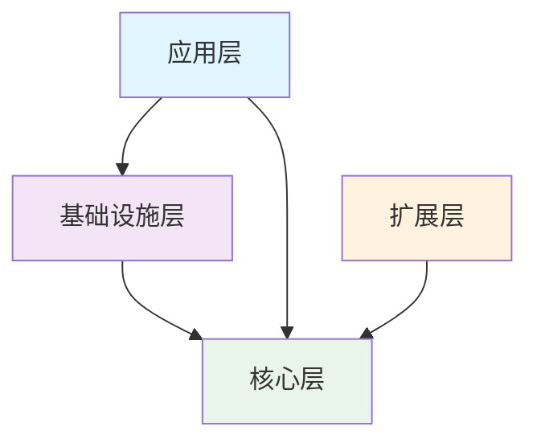

# Nebula 新架构设计详解

## 架构设计原则

### 设计理念

基于现代软件架构设计原则，全新的Nebula框架采用分层架构、领域驱动设计（DDD）和微服务架构的思想，构建一个高内聚、低耦合、易扩展的Java后端框架。如同星云中新星的诞生过程，Nebula的架构设计体现了从混沌到秩序、从简单到复杂的演进理念。

### 核心原则

#### 1. SOLID原则
- **单一职责原则（SRP）**：每个类只负责一个职责
- **开闭原则（OCP）**：对扩展开放，对修改关闭
- **里氏替换原则（LSP）**：子类可以替换父类
- **接口隔离原则（ISP）**：依赖于抽象而不是具体实现
- **依赖倒置原则（DIP）**：高层模块不依赖低层模块

#### 2. 分层架构原则


#### 3. 领域驱动设计
- **领域分离**：不同业务领域独立设计
- **聚合根**：确保数据一致性的边界
- **值对象**：不可变的业务概念
- **领域服务**：跨聚合的业务逻辑

## 整体架构概览

### 架构分层图

```mermaid
graph TB
    subgraph "应用层 (Application Layer)"
        direction TB
        WEB[nebula-web<br/>Web应用框架]
        SCHED[nebula-scheduling<br/>任务调度框架]
        BATCH[nebula-batch<br/>批处理框架]
    end
    
    subgraph "基础设施层 (Infrastructure Layer)"
        direction TB
        subgraph "数据访问"
            DATA_ABS[nebula-data-access<br/>数据访问抽象]
            DATA_PERSIST[nebula-data-persistence<br/>持久层实现(MyBatis-Plus)]
            DATA_NOSQL[nebula-data-nosql<br/>NoSQL实现]
            DATA_CACHE[nebula-data-cache<br/>缓存实现]
        end
        
        subgraph "消息传递"
            MSG_CORE[nebula-messaging-core<br/>消息抽象]
            MSG_IMPL[nebula-messaging-rabbitmq<br/>RabbitMQ实现]
        end
        
        subgraph "网络通讯"
            RPC_CORE[nebula-rpc-core<br/>RPC抽象]
            RPC_HTTP[nebula-rpc-http<br/>HTTP实现]
        end
        
        subgraph "服务发现"
            DISC_CORE[nebula-discovery-core<br/>服务发现抽象]
            DISC_NACOS[nebula-discovery-nacos<br/>Nacos实现]
        end
    end
    
    subgraph "核心层 (Core Layer)"
        direction TB
        COMMON[nebula-core-common<br/>通用组件]
        CONFIG[nebula-core-config<br/>配置管理]
        METRICS[nebula-core-metrics<br/>监控指标]
        SECURITY[nebula-core-security<br/>安全组件]
    end
    
    subgraph "扩展层 (Extensions Layer)"
        direction TB
        STORAGE[nebula-storage<br/>对象存储]
        SEARCH[nebula-search<br/>搜索引擎]
        INTEGRATION[nebula-integration<br/>第三方集成]
    end
    
    subgraph "自动配置层 (AutoConfiguration Layer)"
        direction TB
        AUTO_CONFIG[nebula-autoconfigure<br/>自动配置]
    end
    
    %% 依赖关系
    WEB --> DATA_ABS
    WEB --> MSG_CORE
    WEB --> RPC_CORE
    
    SCHED --> DATA_ABS
    SCHED --> MSG_CORE
    
    BATCH --> DATA_ABS
    
    DATA_ABS --> DATA_PERSIST
    DATA_ABS --> DATA_NOSQL
    DATA_ABS --> DATA_CACHE
    
    MSG_CORE --> MSG_IMPL
    RPC_CORE --> RPC_HTTP
    DISC_CORE --> DISC_NACOS
    
    DATA_PERSIST --> COMMON
    DATA_NOSQL --> COMMON
    MSG_CORE --> COMMON
    RPC_CORE --> COMMON
    
    COMMON --> CONFIG
    COMMON --> METRICS
    COMMON --> SECURITY
    
    STORAGE --> COMMON
    SEARCH --> COMMON
    INTEGRATION --> COMMON
    
    AUTO_CONFIG --> WEB
    AUTO_CONFIG --> DATA_ABS
    AUTO_CONFIG --> MSG_CORE
    AUTO_CONFIG --> RPC_CORE
```

### 模块依赖关系

#### 依赖规则
1. **单向依赖**：上层模块可以依赖下层模块，反之不可
2. **抽象依赖**：依赖接口而不是具体实现
3. **最小依赖**：只依赖必要的模块，避免过度依赖
4. **循环依赖检查**：通过Maven插件检查并禁止循环依赖

## 核心层设计

### nebula-core-common

#### 设计目标
提供框架的基础设施，包括通用工具类、异常体系、基础数据结构等。

#### 核心组件

##### 1. 异常体系
```java
/**
 * 框架基础异常
 */
public abstract class NebulaException extends RuntimeException {
    private final String errorCode;
    private final Object[] args;
    
    protected NebulaException(String errorCode, String message, Object... args) {
        super(message);
        this.errorCode = errorCode;
        this.args = args;
    }
    
    public String getErrorCode() { return errorCode; }
    public Object[] getArgs() { return args; }
}

/**
 * 业务异常
 */
public class BusinessException extends NebulaException {
    public BusinessException(String errorCode, String message, Object... args) {
        super(errorCode, message, args);
    }
}

/**
 * 系统异常
 */
public class SystemException extends NebulaException {
    public SystemException(String errorCode, String message, Throwable cause, Object... args) {
        super(errorCode, message, args);
        initCause(cause);
    }
}

/**
 * 验证异常
 */
public class ValidationException extends NebulaException {
    private final List<FieldError> fieldErrors;
    
    public ValidationException(List<FieldError> fieldErrors) {
        super("VALIDATION_FAILED", "Validation failed");
        this.fieldErrors = fieldErrors;
    }
}
```

##### 2. 统一响应格式
```java
/**
 * 统一响应结果
 */
@Data
@Builder
public class Result<T> {
    private boolean success;
    private String code;
    private String message;
    private T data;
    private long timestamp;
    
    public static <T> Result<T> success(T data) {
        return Result.<T>builder()
                .success(true)
                .code("SUCCESS")
                .data(data)
                .timestamp(System.currentTimeMillis())
                .build();
    }
    
    public static <T> Result<T> error(String code, String message) {
        return Result.<T>builder()
                .success(false)
                .code(code)
                .message(message)
                .timestamp(System.currentTimeMillis())
                .build();
    }
}

/**
 * 分页结果
 */
@Data
@EqualsAndHashCode(callSuper = true)
public class PageResult<T> extends Result<List<T>> {
    private PageInfo pageInfo;
    
    @Data
    @Builder
    public static class PageInfo {
        private int pageNumber;
        private int pageSize;
        private long totalElements;
        private int totalPages;
        private boolean hasNext;
        private boolean hasPrevious;
    }
}
```

##### 3. 工具类
```java
/**
 * 字符串工具类
 */
public final class Strings {
    public static boolean isEmpty(String str) {
        return str == null || str.trim().isEmpty();
    }
    
    public static String format(String template, Object... args) {
        // 使用占位符格式化字符串
    }
    
    public static String camelToSnake(String camelCase) {
        // 驼峰转下划线
    }
}

/**
 * 集合工具类
 */
public final class Collections {
    public static <T> List<T> emptyIfNull(List<T> list) {
        return list == null ? java.util.Collections.emptyList() : list;
    }
    
    public static <T> boolean isNotEmpty(Collection<T> collection) {
        return collection != null && !collection.isEmpty();
    }
}

/**
 * Bean工具类
 */
public final class Beans {
    public static <T> T copyProperties(Object source, Class<T> targetClass) {
        // 属性复制
    }
    
    public static Map<String, Object> toMap(Object bean) {
        // Bean转Map
    }
}
```

### nebula-core-config

#### 设计目标
提供统一的配置管理、验证和类型安全的配置访问。

#### 核心组件

##### 1. 配置抽象
```java
/**
 * 配置属性接口
 */
public interface ConfigurationProperties {
    /**
     * 配置前缀
     */
    String prefix();
    
    /**
     * 验证配置
     */
    default void validate() {
        // 默认验证逻辑
    }
}

/**
 * 配置验证器
 */
@Component
public class ConfigurationValidator {
    
    public <T extends ConfigurationProperties> ValidationResult validate(T config) {
        List<FieldError> errors = new ArrayList<>();
        
        // 使用JSR-303注解进行验证
        Set<ConstraintViolation<T>> violations = validator.validate(config);
        for (ConstraintViolation<T> violation : violations) {
            errors.add(new FieldError(
                violation.getPropertyPath().toString(),
                violation.getMessage(),
                violation.getInvalidValue()
            ));
        }
        
        // 自定义验证
        config.validate();
        
        return ValidationResult.builder()
                .success(errors.isEmpty())
                .errors(errors)
                .build();
    }
}
```

##### 2. 类型安全配置
```java
/**
 * 数据源配置
 */
@Data
@ConfigurationProperties(prefix = "nebula.data.sources")
public class DataSourcesConfiguration implements ConfigurationProperties {
    
    @Valid
    @NotEmpty
    private Map<String, DataSourceConfig> dataSources = new HashMap<>();
    
    @Data
    public static class DataSourceConfig {
        @NotBlank
        private String type;
        
        @NotBlank
        private String url;
        
        @Valid
        private CredentialsConfig credentials;
        
        @Valid
        private PoolConfig pool = new PoolConfig();
    }
    
    @Data
    public static class CredentialsConfig {
        @NotBlank
        private String username;
        
        @NotBlank
        private String password;
    }
    
    @Data
    public static class PoolConfig {
        @Min(1)
        private int minSize = 5;
        
        @Min(1)
        private int maxSize = 20;
        
        @Min(1000)
        private long connectionTimeout = 30000;
    }
    
    @Override
    public String prefix() {
        return "nebula.data.sources";
    }
    
    @Override
    public void validate() {
        // 自定义验证逻辑
        if (!dataSources.containsKey("primary")) {
            throw new ValidationException("Primary data source must be configured");
        }
    }
}
```

### nebula-core-metrics

#### 设计目标
提供统一的监控指标收集、存储和查询能力。

#### 核心组件

##### 1. 指标抽象
```java
/**
 * 指标收集器接口
 */
public interface MetricsCollector {
    
    /**
     * 计数器
     */
    Counter counter(String name, String... tags);
    
    /**
     * 计时器
     */
    Timer timer(String name, String... tags);
    
    /**
     * 仪表盘
     */
    Gauge gauge(String name, Supplier<Number> valueSupplier, String... tags);
    
    /**
     * 分布摘要
     */
    DistributionSummary summary(String name, String... tags);
}

/**
 * 业务指标
 */
@Component
public class BusinessMetrics {
    
    private final MetricsCollector metricsCollector;
    
    public void recordOrderCreated(String productType) {
        metricsCollector.counter("business.order.created", 
            "product.type", productType).increment();
    }
    
    public void recordPaymentTime(Duration duration, String paymentMethod) {
        metricsCollector.timer("business.payment.duration",
            "payment.method", paymentMethod).record(duration);
    }
}
```

##### 2. 性能监控
```java
/**
 * 性能监控切面
 */
@Aspect
@Component
public class PerformanceMonitoringAspect {
    
    private final MetricsCollector metricsCollector;
    
    @Around("@annotation(monitored)")
    public Object monitor(ProceedingJoinPoint joinPoint, Monitored monitored) throws Throwable {
        String operationName = monitored.value().isEmpty() ? 
            joinPoint.getSignature().getName() : monitored.value();
            
        Timer.Sample sample = Timer.start(metricsCollector);
        
        try {
            Object result = joinPoint.proceed();
            metricsCollector.counter("operation.success", "operation", operationName).increment();
            return result;
        } catch (Exception e) {
            metricsCollector.counter("operation.error", 
                "operation", operationName,
                "error.type", e.getClass().getSimpleName()).increment();
            throw e;
        } finally {
            sample.stop(Timer.builder("operation.duration")
                .tag("operation", operationName)
                .register(metricsCollector));
        }
    }
}

/**
 * 监控注解
 */
@Target(ElementType.METHOD)
@Retention(RetentionPolicy.RUNTIME)
public @interface Monitored {
    String value() default "";
}
```

## 基础设施层设计

### 数据访问模块

#### nebula-data-access（数据访问抽象）

##### 设计目标
提供统一的数据访问接口，屏蔽不同数据存储的差异。

##### 核心接口
```java
/**
 * 通用仓储接口
 */
public interface Repository<T, ID> {
    
    Optional<T> findById(ID id);
    
    List<T> findAll();
    
    List<T> findAll(Pageable pageable);
    
    <S extends T> S save(S entity);
    
    <S extends T> List<S> saveAll(Iterable<S> entities);
    
    void deleteById(ID id);
    
    void delete(T entity);
    
    void deleteAll();
    
    boolean existsById(ID id);
    
    long count();
}

/**
 * 查询构建器
 */
public interface QueryBuilder<T> {
    
    QueryBuilder<T> where(String field, Object value);
    
    QueryBuilder<T> where(String field, Operator operator, Object value);
    
    QueryBuilder<T> and(String field, Object value);
    
    QueryBuilder<T> or(String field, Object value);
    
    QueryBuilder<T> orderBy(String field, Direction direction);
    
    QueryBuilder<T> limit(int limit);
    
    QueryBuilder<T> offset(int offset);
    
    List<T> list();
    
    Optional<T> one();
    
    Page<T> page(Pageable pageable);
    
    long count();
}

/**
 * 事务管理器
 */
public interface TransactionManager {
    
    <T> T executeInTransaction(TransactionCallback<T> callback);
    
    void executeInTransaction(TransactionCallbackWithoutResult callback);
    
    <T> T executeInReadOnlyTransaction(TransactionCallback<T> callback);
}
```

#### nebula-data-persistence（MyBatis-Plus实现）

##### 设计目标
基于MyBatis-Plus提供高性能的数据访问实现，支持连接池管理、读写分离、分库分表，同时享受MyBatis-Plus的强大功能。

##### 核心组件
```java
/**
 * 数据源管理器
 */
@Component
public class DataSourceManager {
    
    private final Map<String, DataSource> dataSources = new ConcurrentHashMap<>();
    private final DataSourcesConfiguration config;
    
    @PostConstruct
    public void initializeDataSources() {
        config.getDataSources().forEach((name, dsConfig) -> {
            DataSource dataSource = createDataSource(dsConfig);
            dataSources.put(name, dataSource);
        });
    }
    
    public DataSource getDataSource(String name) {
        return dataSources.get(name);
    }
    
    public DataSource getPrimaryDataSource() {
        return getDataSource("primary");
    }
    
    private DataSource createDataSource(DataSourceConfig config) {
        return DataSourceBuilder.create()
                .type(HikariDataSource.class)
                .url(config.getUrl())
                .username(config.getCredentials().getUsername())
                .password(config.getCredentials().getPassword())
                .build();
    }
}

/**
 * 基础Mapper接口
 */
public interface BaseMapper<T> extends com.baomidou.mybatisplus.core.mapper.BaseMapper<T> {
    // 扩展自定义方法
}

/**
 * 基础服务接口
 */
public interface IService<T> extends com.baomidou.mybatisplus.extension.service.IService<T> {
    
    /**
     * 根据条件查询单个实体
     */
    default Optional<T> findOne(Wrapper<T> queryWrapper) {
        return Optional.ofNullable(getOne(queryWrapper));
    }
    
    /**
     * 分页查询
     */
    default Page<T> findPage(IPage<T> page, Wrapper<T> queryWrapper) {
        return page(page, queryWrapper);
    }
}

/**
 * 基础服务实现
 */
public class ServiceImpl<M extends BaseMapper<T>, T> 
    extends com.baomidou.mybatisplus.extension.service.impl.ServiceImpl<M, T> 
    implements IService<T> {
    
    @Override
    public Optional<T> findOne(Wrapper<T> queryWrapper) {
        return Optional.ofNullable(getOne(queryWrapper));
    }
    
    @Override
    public Page<T> findPage(IPage<T> page, Wrapper<T> queryWrapper) {
        return page(page, queryWrapper);
    }
}

/**
 * MyBatis-Plus配置
 */
@Configuration
@EnableTransactionManagement
@MapperScan("nebula.**.mapper")
public class MyBatisPlusConfiguration {
    
    /**
     * 分页插件
     */
    @Bean
    public MybatisPlusInterceptor mybatisPlusInterceptor() {
        MybatisPlusInterceptor interceptor = new MybatisPlusInterceptor();
        interceptor.addInnerInterceptor(new PaginationInnerInterceptor(DbType.MYSQL));
        interceptor.addInnerInterceptor(new OptimisticLockerInnerInterceptor());
        return interceptor;
    }
    
    /**
     * 元数据处理器
     */
    @Bean
    public MetaObjectHandler metaObjectHandler() {
        return new DefaultMetaObjectHandler();
    }
}

/**
 * 默认元数据处理器
 */
public class DefaultMetaObjectHandler implements MetaObjectHandler {
    
    @Override
    public void insertFill(MetaObject metaObject) {
        this.strictInsertFill(metaObject, "createTime", LocalDateTime.class, LocalDateTime.now());
        this.strictInsertFill(metaObject, "updateTime", LocalDateTime.class, LocalDateTime.now());
    }
    
    @Override
    public void updateFill(MetaObject metaObject) {
        this.strictUpdateFill(metaObject, "updateTime", LocalDateTime.class, LocalDateTime.now());
    }
}
```

### 消息传递模块

#### nebula-messaging-core（消息抽象）

##### 设计目标
提供统一的消息传递抽象，支持不同的消息中间件实现。

##### 核心接口
```java
/**
 * 消息生产者
 */
public interface MessageProducer<T> {
    
    /**
     * 发送消息
     */
    SendResult send(String topic, T message);
    
    /**
     * 发送消息到指定队列
     */
    SendResult send(String topic, String queue, T message);
    
    /**
     * 异步发送消息
     */
    CompletableFuture<SendResult> sendAsync(String topic, T message);
    
    /**
     * 发送事务消息
     */
    SendResult sendInTransaction(String topic, T message, TransactionCallback callback);
}

/**
 * 消息消费者
 */
public interface MessageConsumer<T> {
    
    /**
     * 订阅主题
     */
    void subscribe(String topic, MessageHandler<T> handler);
    
    /**
     * 订阅队列
     */
    void subscribe(String topic, String queue, MessageHandler<T> handler);
    
    /**
     * 取消订阅
     */
    void unsubscribe(String topic);
    
    /**
     * 启动消费
     */
    void start();
    
    /**
     * 停止消费
     */
    void stop();
}

/**
 * 消息处理器
 */
@FunctionalInterface
public interface MessageHandler<T> {
    
    /**
     * 处理消息
     */
    MessageHandleResult handle(Message<T> message);
}

/**
 * 消息
 */
@Data
@Builder
public class Message<T> {
    private String id;
    private String topic;
    private String queue;
    private T payload;
    private Map<String, String> headers;
    private long timestamp;
    private int retryCount;
}
```

##### 消息路由和过滤
```java
/**
 * 消息路由器
 */
@Component
public class MessageRouter {
    
    private final List<MessageRoute> routes = new ArrayList<>();
    
    public void addRoute(MessageRoute route) {
        routes.add(route);
    }
    
    public List<MessageHandler<?>> route(Message<?> message) {
        return routes.stream()
                .filter(route -> route.matches(message))
                .map(MessageRoute::getHandler)
                .collect(Collectors.toList());
    }
}

/**
 * 消息路由
 */
@Data
@Builder
public class MessageRoute {
    private String topic;
    private String queue;
    private MessageFilter filter;
    private MessageHandler<?> handler;
    
    public boolean matches(Message<?> message) {
        boolean topicMatch = topic == null || topic.equals(message.getTopic());
        boolean queueMatch = queue == null || queue.equals(message.getQueue());
        boolean filterMatch = filter == null || filter.accept(message);
        
        return topicMatch && queueMatch && filterMatch;
    }
}
```

#### nebula-messaging-rabbitmq（RabbitMQ实现）

##### 设计目标
基于RabbitMQ提供可靠的消息传递实现，支持各种消息模式和高级特性。

##### 核心组件
```java
/**
 * RabbitMQ生产者实现
 */
@Component
public class RabbitMQProducer implements MessageProducer<Object> {
    
    private final RabbitTemplate rabbitTemplate;
    private final RabbitMQConfiguration config;
    
    @Override
    public SendResult send(String exchange, Object message) {
        try {
            CorrelationData correlationData = new CorrelationData(UUID.randomUUID().toString());
            rabbitTemplate.convertAndSend(exchange, "", message, correlationData);
            
            return SendResult.builder()
                    .success(true)
                    .messageId(correlationData.getId())
                    .timestamp(System.currentTimeMillis())
                    .build();
        } catch (Exception e) {
            return SendResult.builder()
                    .success(false)
                    .errorMessage(e.getMessage())
                    .timestamp(System.currentTimeMillis())
                    .build();
        }
    }
    
    @Override
    public SendResult send(String exchange, String routingKey, Object message) {
        try {
            CorrelationData correlationData = new CorrelationData(UUID.randomUUID().toString());
            rabbitTemplate.convertAndSend(exchange, routingKey, message, correlationData);
            
            return SendResult.builder()
                    .success(true)
                    .messageId(correlationData.getId())
                    .timestamp(System.currentTimeMillis())
                    .build();
        } catch (Exception e) {
            return SendResult.builder()
                    .success(false)
                    .errorMessage(e.getMessage())
                    .timestamp(System.currentTimeMillis())
                    .build();
        }
    }
}

/**
 * RabbitMQ消费者实现
 */
@Component
public class RabbitMQConsumer implements MessageConsumer<Object> {
    
    private final SimpleRabbitListenerContainerFactory containerFactory;
    private final MessageRouter messageRouter;
    private final Map<String, SimpleMessageListenerContainer> containers = new ConcurrentHashMap<>();
    
    @Override
    public void subscribe(String exchange, MessageHandler<Object> handler) {
        subscribe(exchange, "", handler);
    }
    
    @Override
    public void subscribe(String exchange, String routingKey, MessageHandler<Object> handler) {
        String containerId = exchange + ":" + routingKey;
        
        if (containers.containsKey(containerId)) {
            return; // 已经订阅
        }
        
        SimpleMessageListenerContainer container = containerFactory.createListenerContainer();
        container.setQueueNames(exchange + "." + routingKey);
        container.setMessageListener(new ChannelAwareMessageListener() {
            @Override
            public void onMessage(org.springframework.amqp.core.Message message, Channel channel) throws Exception {
                try {
                    Message<Object> msg = convertMessage(message);
                    MessageHandleResult result = handler.handle(msg);
                    
                    if (result.isSuccess()) {
                        channel.basicAck(message.getMessageProperties().getDeliveryTag(), false);
                    } else {
                        channel.basicNack(message.getMessageProperties().getDeliveryTag(), false, true);
                    }
                } catch (Exception e) {
                    channel.basicNack(message.getMessageProperties().getDeliveryTag(), false, false);
                }
            }
        });
        
        containers.put(containerId, container);
        container.start();
    }
    
    private Message<Object> convertMessage(org.springframework.amqp.core.Message amqpMessage) {
        // 消息转换逻辑
        return Message.builder()
                .id(amqpMessage.getMessageProperties().getMessageId())
                .payload(amqpMessage.getBody())
                .headers(amqpMessage.getMessageProperties().getHeaders())
                .timestamp(System.currentTimeMillis())
                .build();
    }
}

/**
 * RabbitMQ配置
 */
@Configuration
@EnableRabbit
public class RabbitMQConfiguration {
    
    @Bean
    public ConnectionFactory connectionFactory() {
        CachingConnectionFactory factory = new CachingConnectionFactory();
        factory.setHost("localhost");
        factory.setPort(5672);
        factory.setUsername("guest");
        factory.setPassword("guest");
        factory.setVirtualHost("/");
        return factory;
    }
    
    @Bean
    public RabbitTemplate rabbitTemplate(ConnectionFactory connectionFactory) {
        RabbitTemplate template = new RabbitTemplate(connectionFactory);
        template.setMessageConverter(new Jackson2JsonMessageConverter());
        template.setConfirmCallback((correlationData, ack, cause) -> {
            if (!ack) {
                // 处理发送失败
            }
        });
        template.setReturnCallback((message, replyCode, replyText, exchange, routingKey) -> {
            // 处理消息被退回
        });
        return template;
    }
    
    @Bean
    public SimpleRabbitListenerContainerFactory containerFactory(ConnectionFactory connectionFactory) {
        SimpleRabbitListenerContainerFactory factory = new SimpleRabbitListenerContainerFactory();
        factory.setConnectionFactory(connectionFactory);
        factory.setMessageConverter(new Jackson2JsonMessageConverter());
        factory.setAcknowledgeMode(AcknowledgeMode.MANUAL);
        factory.setPrefetchCount(10);
        return factory;
    }
}
```

## 应用层设计

### nebula-web（Web应用框架）

#### 设计目标
提供现代化的Web开发支持，包括REST API、参数验证、异常处理等。

#### 核心组件

##### 1. 基础控制器
```java
/**
 * 基础控制器
 */
public abstract class BaseController {
    
    protected final Logger logger = LoggerFactory.getLogger(getClass());
    
    /**
     * 成功响应
     */
    protected <T> ResponseEntity<Result<T>> success(T data) {
        return ResponseEntity.ok(Result.success(data));
    }
    
    /**
     * 分页响应
     */
    protected <T> ResponseEntity<PageResult<T>> success(Page<T> page) {
        PageResult<T> result = new PageResult<>();
        result.setData(page.getContent());
        result.setPageInfo(PageResult.PageInfo.builder()
                .pageNumber(page.getNumber())
                .pageSize(page.getSize())
                .totalElements(page.getTotalElements())
                .totalPages(page.getTotalPages())
                .hasNext(page.hasNext())
                .hasPrevious(page.hasPrevious())
                .build());
        return ResponseEntity.ok(result);
    }
    
    /**
     * 错误响应
     */
    protected <T> ResponseEntity<Result<T>> error(String code, String message) {
        return ResponseEntity.badRequest().body(Result.error(code, message));
    }
}
```

##### 2. 全局异常处理
```java
/**
 * 全局异常处理器
 */
@RestControllerAdvice
public class GlobalExceptionHandler {
    
    private static final Logger logger = LoggerFactory.getLogger(GlobalExceptionHandler.class);
    
    @ExceptionHandler(BusinessException.class)
    public ResponseEntity<Result<Void>> handleBusinessException(BusinessException e) {
        logger.warn("Business exception: {}", e.getMessage());
        return ResponseEntity.badRequest()
                .body(Result.error(e.getErrorCode(), e.getMessage()));
    }
    
    @ExceptionHandler(ValidationException.class)
    public ResponseEntity<Result<Void>> handleValidationException(ValidationException e) {
        logger.warn("Validation exception: {}", e.getMessage());
        return ResponseEntity.badRequest()
                .body(Result.error("VALIDATION_FAILED", "参数验证失败"));
    }
    
    @ExceptionHandler(MethodArgumentNotValidException.class)
    public ResponseEntity<Result<Void>> handleValidationException(MethodArgumentNotValidException e) {
        List<String> errors = e.getBindingResult().getFieldErrors().stream()
                .map(error -> error.getField() + ": " + error.getDefaultMessage())
                .collect(Collectors.toList());
                
        return ResponseEntity.badRequest()
                .body(Result.error("VALIDATION_FAILED", String.join(", ", errors)));
    }
    
    @ExceptionHandler(Exception.class)
    public ResponseEntity<Result<Void>> handleException(Exception e) {
        logger.error("Unexpected exception", e);
        return ResponseEntity.status(HttpStatus.INTERNAL_SERVER_ERROR)
                .body(Result.error("INTERNAL_ERROR", "系统内部错误"));
    }
}
```

##### 3. 请求响应拦截器
```java
/**
 * API日志拦截器
 */
@Component
public class ApiLoggingInterceptor implements HandlerInterceptor {
    
    private static final Logger logger = LoggerFactory.getLogger(ApiLoggingInterceptor.class);
    
    @Override
    public boolean preHandle(HttpServletRequest request, HttpServletResponse response, Object handler) {
        String requestId = UUID.randomUUID().toString();
        request.setAttribute("requestId", requestId);
        
        logger.info("API Request [{}] {} {} from {}", 
            requestId, request.getMethod(), request.getRequestURI(), request.getRemoteAddr());
            
        return true;
    }
    
    @Override
    public void afterCompletion(HttpServletRequest request, HttpServletResponse response, 
                               Object handler, Exception ex) {
        String requestId = (String) request.getAttribute("requestId");
        long duration = System.currentTimeMillis() - (Long) request.getAttribute("startTime");
        
        logger.info("API Response [{}] {} {} in {}ms", 
            requestId, response.getStatus(), request.getRequestURI(), duration);
    }
}
```

这个新架构设计通过清晰的分层、明确的职责分离和统一的接口抽象，为Nebula框架提供了一个现代化、可扩展、易维护的技术基础。如同星云中物质的有序聚集，每个层次都有明确的边界和职责，便于独立开发、测试和维护，最终汇聚成一个强大而优雅的Java后端框架。
