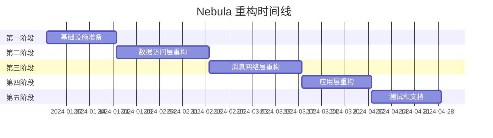

# Nebula 重构实施计划

## 总体时间规划

整个重构预计需要 **12-16周** 时间，分为5个主要阶段实施。每个阶段都有明确的目标、交付物和验收标准。



## 第一阶段：基础设施准备（2-3周）

### 目标
建立现代化的开发基础设施，为后续重构奠定基础。

### 主要任务

#### 1.1 环境升级（1周）
- [ ] **Java版本升级**
  - 升级到Java 21 LTS
  - 更新IDE和构建工具配置
  - 验证现有代码兼容性
  - 启用虚拟线程等新特性

- [ ] **Spring Boot升级**
  - 升级到Spring Boot 3.x最新稳定版
  - 解决jakarta命名空间迁移问题
  - 更新相关Spring依赖

- [ ] **Maven配置优化**
  - 更新Maven版本和插件
  - 优化构建配置和性能
  - 添加代码质量检查插件

#### 1.2 依赖库升级（1周）
- [ ] **核心依赖升级**
  ```xml
  <!-- 主要升级目标 -->
  Elasticsearch: 7.9.2 → 8.x
  RocketMQ: 4.8.0 → 5.x
  Redisson: 3.17.1 → 3.x最新
  MongoDB Driver: 3.11.1 → 4.x最新
  HikariCP: 4.0.1 → 5.x最新
  ```

- [ ] **兼容性测试**
  - 创建兼容性测试套件
  - 验证所有模块基本功能
  - 修复升级导致的问题

#### 1.3 核心模块创建（1周）
- [ ] **nebula-core-common模块**
  ```java
  // 新的异常体系
  public abstract class NebulaException extends RuntimeException
  public class BusinessException extends NebulaException
  public class SystemException extends NebulaException
  public class ValidationException extends NebulaException
  
  // 统一响应格式
  public class Result<T>
  public class PageResult<T> extends Result<List<T>>
  ```

- [ ] **nebula-core-config模块**
  ```java
  // 配置抽象
  public interface ConfigurationProperties
  public class ConfigurationValidator
  public class TypeSafeConfiguration
  ```

- [ ] **nebula-core-metrics模块**
  ```java
  // 监控抽象
  public interface MetricsCollector
  public class PerformanceMetrics
  public class BusinessMetrics
  ```

### 交付物
1. 升级后的项目环境
2. 新的核心模块框架
3. 基础设施测试套件
4. 升级兼容性报告

### 验收标准
- [ ] 所有现有测试通过
- [ ] 新环境编译构建成功
- [ ] 核心模块API设计评审通过
- [ ] 性能基准测试无退化

## 第二阶段：数据访问层重构（3-4周）

### 目标
重构数据访问层，建立统一的数据访问抽象，提升性能和可维护性。

### 主要任务

#### 2.1 数据访问抽象设计（1周）
- [ ] **统一接口设计**
  ```java
  // 数据访问抽象
  public interface DataAccessTemplate<T>
  public interface Repository<T, ID>
  public interface TransactionManager
  
  // 数据源抽象
  public interface DataSourceProvider
  public interface ConnectionPoolManager
  ```

- [ ] **查询构建器**
  ```java
  public class QueryBuilder
  public class CriteriaBuilder
  public class PageableQuery
  ```

#### 2.2 持久层重构（MyBatis-Plus）（1.5周）
- [ ] **引入MyBatis-Plus**
  ```java
  // 基础Mapper接口
  public interface BaseMapper<T> extends com.baomidou.mybatisplus.core.mapper.BaseMapper<T>
  
  // 服务层抽象
  public interface IService<T> extends com.baomidou.mybatisplus.extension.service.IService<T>
  public class ServiceImpl<M extends BaseMapper<T>, T> extends com.baomidou.mybatisplus.extension.service.impl.ServiceImpl<M, T>
  ```

- [ ] **数据源管理重构**
  ```java
  public class DataSourceManager        // 数据源管理
  public class ConnectionPoolService    // 连接池管理
  public class TransactionService       // 事务管理
  public class DatabaseHealthChecker    // 健康检查
  ```

- [ ] **分片功能重构**
  ```java
  public interface ShardingStrategy
  public class TableShardingService
  public class DatabaseShardingService
  public class ShardingRuleManager
  ```

#### 2.3 NoSQL模块重构（1.5周）
- [ ] **MongoDB支持重构**
  ```java
  public class MongoTemplate
  public class MongoRepository<T>
  public class MongoTransactionManager
  ```

- [ ] **Redis缓存重构**
  ```java
  public interface CacheManager
  public class RedisCacheProvider
  public class LocalCacheProvider
  public class MultiLevelCache
  ```

### 交付物
1. 新的数据访问API
2. 重构后的JDBC和NoSQL模块
3. 数据访问层测试套件
4. 性能优化报告

### 验收标准
- [ ] 数据访问性能提升20%
- [ ] 测试覆盖率达到85%
- [ ] API设计评审通过
- [ ] 向后兼容性保持

## 第三阶段：消息和网络层重构（3-4周）

### 目标
现代化消息处理和网络通讯模块，增强可靠性和性能。

### 主要任务

#### 3.1 消息系统重构（2周）
- [ ] **消息抽象层设计**
  ```java
  public interface MessageProducer<T>
  public interface MessageConsumer<T>
  public interface MessageRouter
  public interface MessageSerializer
  ```

- [ ] **RabbitMQ实现重构**
  ```java
  public class RabbitMQProducer implements MessageProducer
  public class RabbitMQConsumer implements MessageConsumer
  public class RabbitMQTransactionManager
  public class RabbitMQExchangeManager
  ```

- [ ] **消息可靠性保证**
  ```java
  public class MessageRetryHandler
  public class DeadLetterQueue
  public class MessageTracker
  ```

#### 3.2 RPC系统重构（2周）
- [ ] **RPC抽象层设计**
  ```java
  public interface RpcClient
  public interface RpcServer
  public interface ServiceRegistry
  public interface LoadBalancer
  ```

- [ ] **HTTP RPC实现**
  ```java
  public class HttpRpcClient
  public class HttpRpcServer
  public class RpcMethodInvoker
  ```

- [ ] **服务治理功能**
  ```java
  public class CircuitBreaker
  public class RateLimiter
  public class ServiceHealthChecker
  ```

### 交付物
1. 新的消息传递API
2. 重构后的RPC框架
3. 服务治理组件
4. 网络层测试套件

### 验收标准
- [ ] 消息吞吐量提升30%
- [ ] RPC调用延迟降低25%
- [ ] 服务可用性提升到99.9%
- [ ] 完整的监控和告警

## 第四阶段：应用层重构（2-3周）

### 目标
重构应用层服务，提供更好的开发体验和功能特性。

### 主要任务

#### 4.1 Web框架重构（1.5周）
- [ ] **API规范统一**
  ```java
  @RestController
  public abstract class BaseController
  public class ApiResponse<T>
  public class ApiException
  ```

- [ ] **请求响应处理**
  ```java
  public class GlobalExceptionHandler
  public class RequestInterceptor
  public class ResponseFormatter
  ```

#### 4.2 任务调度重构（1.5周）
- [ ] **TaskService重构**
  ```java
  // 职责分离
  public class TaskExecutor           // 任务执行
  public class TaskScheduler          // 任务调度
  public class TaskLogger            // 日志管理
  public class TaskMonitor           // 任务监控
  ```

- [ ] **线程池管理优化**
  ```java
  public class TaskThreadPoolManager
  public class ResourceIsolation
  public class TaskResourceMonitor
  ```

### 交付物
1. 重构后的Web框架
2. 新的任务调度系统
3. 应用层测试套件
4. 开发指南和最佳实践

### 验收标准
- [ ] API响应时间提升20%
- [ ] 任务执行效率提升25%
- [ ] 开发体验显著改善
- [ ] 完整的使用文档

## 第五阶段：测试和文档（2-3周）

### 目标
完善测试体系，编写完整文档，确保项目质量和可用性。

### 主要任务

#### 5.1 测试体系建设（1.5周）
- [ ] **单元测试**
  - 所有核心类单元测试
  - Mock测试和边界测试
  - 测试覆盖率达到80%以上

- [ ] **集成测试**
  - 模块间集成测试
  - 端到端测试场景
  - 性能基准测试

- [ ] **自动化测试**
  - CI/CD流水线配置
  - 自动化测试报告
  - 质量门禁设置

#### 5.2 文档编写（1.5周）
- [ ] **API文档**
  - 自动生成API文档
  - 接口使用示例
  - 错误码说明

- [ ] **使用指南**
  - 快速开始指南
  - 配置参考文档
  - 最佳实践指南

- [ ] **迁移指南**
  - 从旧版本迁移步骤
  - 兼容性说明
  - 常见问题解答

### 交付物
1. 完整的测试套件
2. 全面的项目文档
3. 示例项目和教程
4. 发布准备清单

### 验收标准
- [ ] 测试覆盖率达到80%
- [ ] 文档完整性100%
- [ ] 示例项目运行正常
- [ ] 社区反馈积极

## 质量保证措施

### 代码质量
- **代码审查**：所有代码必须经过peer review
- **静态分析**：使用SonarQube进行代码质量检查
- **代码规范**：统一的编码规范和格式化规则

### 性能保证
- **基准测试**：每个阶段都有性能基准测试
- **负载测试**：模拟真实负载场景测试
- **性能监控**：实时性能监控和告警

### 安全保证
- **安全扫描**：依赖库安全漏洞扫描
- **代码安全**：安全编码规范检查
- **渗透测试**：安全专家评估

## 风险管控

### 技术风险
- **回滚机制**：每个阶段都有明确的回滚方案
- **功能开关**：使用特性开关控制新功能发布
- **灰度发布**：逐步推广新版本

### 进度风险
- **里程碑检查**：每周进度检查和风险评估
- **资源调配**：根据进度灵活调配人力资源
- **计划调整**：必要时调整计划和优先级

### 质量风险
- **持续集成**：自动化构建和测试
- **质量门禁**：不满足质量要求不能发布
- **用户反馈**：及时收集和处理用户反馈

## 成功标准

### 技术指标
- 响应时间提升20%以上
- 吞吐量提升30%以上
- 内存使用降低15%以上
- 启动时间减少40%以上

### 质量指标
- 测试覆盖率80%以上
- 代码复杂度降低30%
- Bug数量减少50%
- 文档完整性100%

### 用户体验
- 学习成本降低50%
- 开发效率提升30%
- 社区满意度90%以上
- 迁移成本可控

这个重构计划将确保Nebula框架向现代化、高性能、易用的方向发展，为开发者提供更好的开发体验和更强大的功能支持。如同星云孕育新星，Nebula将成为Java后端开发的新选择。
