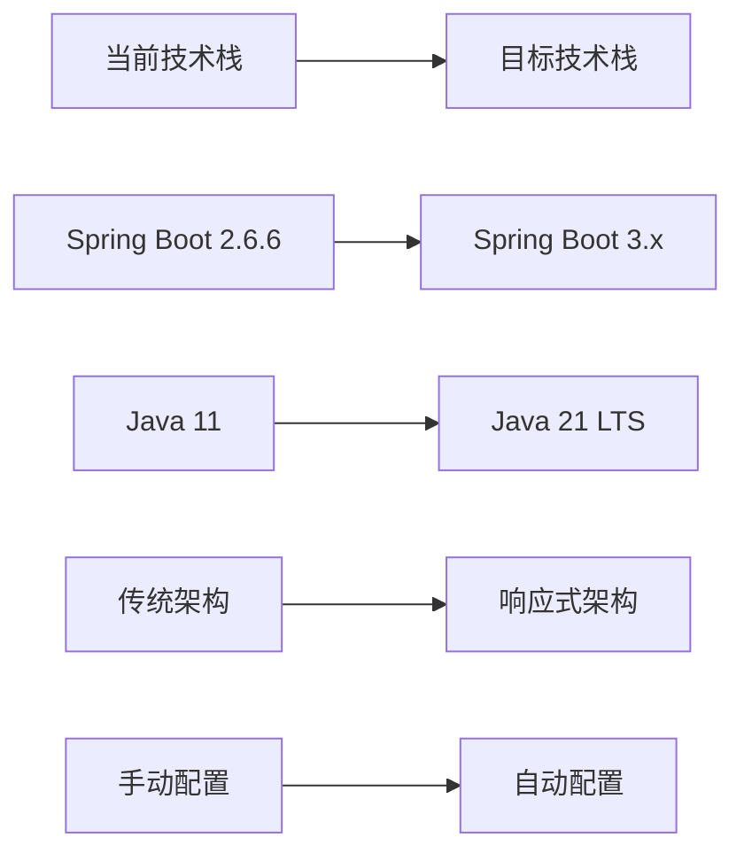

# Nebula 框架重构总体规划

## 概述

本文档详细描述了对 lark-parent Java后端框架的整体重构规划，重构后的框架将命名为 **Nebula**。通过深入分析现有架构和代码质量，我们制定了一个全面的重构方案，旨在提升框架的现代化程度、可维护性和开发体验。如同星云孕育新星一般，Nebula将从现有框架中诞生，成为一个更加现代化和强大的Java后端框架。

## 当前框架分析

### 项目现状
- **技术栈**：Spring Boot 2.6.6 + Java 11
- **模块结构**：11个子模块，包含核心、网络、数据库、消息、任务等功能
- **版本**：1.5.0-SNAPSHOT
- **依赖管理**：Maven多模块项目

### 主要集成组件
- 数据库：MySQL + MongoDB + HikariCP + ShardingSphere
- 消息队列：RocketMQ
- 缓存：Redis (Redisson)
- 服务发现：Nacos
- 任务调度：XXL-Job
- 搜索引擎：Elasticsearch
- 对象存储：MinIO + 阿里云OSS

## 发现的主要问题

### 1. 技术债务问题
- Spring Boot版本2.6.6相对较老，需要升级到3.x
- Java版本11，升级到21 LTS
- 部分依赖版本较老（如Elasticsearch 7.9.2）
- 缺乏现代化特性支持（如虚拟线程、原生镜像等）

### 2. 架构设计问题
- **模块职责不清**：lark-db模块包含MySQL、MongoDB、分片等多种职责
- **耦合度较高**：模块间依赖关系复杂，难以独立演进
- **配置分散**：各模块配置缺乏统一管理和验证
- **缺乏抽象层**：具体实现直接暴露，难以扩展和替换

### 3. 代码质量问题
- **单一职责违反**：如DatabaseService、TaskService类职责过重
- **错误处理不完善**：缺乏统一的异常处理和重试机制
- **测试覆盖不足**：缺少完整的单元测试和集成测试
- **文档缺失**：API文档和使用指南不完整

### 4. 功能完善度问题
- **监控缺失**：缺乏完整的监控和可观察性
- **高级特性缺失**：无负载均衡、熔断、限流等机制
- **性能优化空间**：线程池管理、资源优化等方面有提升空间

## 重构目标

### 1. 技术栈现代化


### 2. 架构重构目标
- **模块化重设计**：基于DDD重新划分模块边界
- **职责清晰化**：每个模块职责单一，降低耦合
- **接口标准化**：统一的API设计规范和返回格式
- **配置中心化**：统一的配置管理和验证机制

### 3. 质量提升目标
- **代码质量**：遵循SOLID原则，提高代码可读性和可维护性
- **测试覆盖**：单元测试覆盖率达到80%以上
- **性能优化**：响应时间提升20%，资源利用率优化
- **监控完善**：全面的性能监控和告警机制

### 4. 开发体验目标
- **文档完整**：完整的API文档、使用指南和最佳实践
- **开发工具**：提供开发脚手架和代码生成工具
- **示例丰富**：提供多场景的示例项目
- **社区友好**：开源协作和社区贡献机制

## 新架构设计

### 整体架构图
```mermaid
graph TB
    subgraph "应用层 (Application Layer)"
        WEB[nebula-web<br/>Web应用支持]
        SCHED[nebula-scheduling<br/>任务调度]
        BATCH[nebula-batch<br/>批处理支持]
    end
    
    subgraph "基础设施层 (Infrastructure Layer)"
        subgraph "数据访问"
            DATA[nebula-data-access<br/>数据访问抽象]
            JDBC[nebula-data-persistence<br/>持久层支持(MyBatis-Plus)]
            NOSQL[nebula-data-nosql<br/>NoSQL支持]
            CACHE[nebula-data-cache<br/>缓存支持]
        end
        
        subgraph "消息传递"
            MSG_CORE[nebula-messaging-core<br/>消息抽象]
            MSG_RABBIT[nebula-messaging-rabbitmq<br/>RabbitMQ实现]
        end
        
        subgraph "网络通讯"
            RPC_CORE[nebula-rpc-core<br/>RPC抽象]
            RPC_HTTP[nebula-rpc-http<br/>HTTP RPC]
        end
        
        subgraph "服务发现"
            DISC[nebula-discovery-nacos<br/>Nacos实现]
        end
    end
    
    subgraph "核心层 (Core Layer)"
        COMMON[nebula-core-common<br/>通用工具]
        CONFIG[nebula-core-config<br/>配置管理]
        METRICS[nebula-core-metrics<br/>监控指标]
        SECURITY[nebula-core-security<br/>安全组件]
    end
    
    subgraph "扩展层 (Extensions Layer)"
        STORAGE[nebula-storage<br/>对象存储]
        SEARCH[nebula-search<br/>搜索引擎]
        INTEGRATION[nebula-integration<br/>第三方集成]
    end
    
    WEB --> DATA
    WEB --> MSG_CORE
    WEB --> RPC_CORE
    SCHED --> DATA
    SCHED --> MSG_CORE
    BATCH --> DATA
    
    DATA --> JDBC
    DATA --> NOSQL
    DATA --> CACHE
    MSG_CORE --> MSG_RABBIT
    RPC_CORE --> RPC_HTTP
    
    JDBC --> COMMON
    NOSQL --> COMMON
    CACHE --> COMMON
    MSG_CORE --> COMMON
    RPC_CORE --> COMMON
    
    COMMON --> CONFIG
    COMMON --> METRICS
    COMMON --> SECURITY
```

### 模块分层说明

#### 1. 核心层 (Core Layer)
- **nebula-core-common**：基础工具类、异常定义、常量等
- **nebula-core-config**：统一配置管理、验证和类型安全
- **nebula-core-metrics**：监控指标收集、性能统计
- **nebula-core-security**：安全相关组件、加密解密等

#### 2. 基础设施层 (Infrastructure Layer)
- **数据访问模块**：
  - nebula-data-access：统一的数据访问抽象接口
  - nebula-data-persistence：基于MyBatis-Plus的持久层实现
  - nebula-data-nosql：NoSQL支持（MongoDB、Redis等）
  - nebula-data-cache：多级缓存抽象和实现

- **消息传递模块**：
  - nebula-messaging-core：消息传递抽象和路由
  - nebula-messaging-rabbitmq：RabbitMQ具体实现

- **网络通讯模块**：
  - nebula-rpc-core：RPC框架抽象
  - nebula-rpc-http：HTTP RPC实现

- **服务发现模块**：
  - nebula-discovery-nacos：Nacos服务发现实现

#### 3. 应用服务层 (Application Layer)
- **nebula-web**：Web应用框架支持、API规范
- **nebula-scheduling**：任务调度框架
- **nebula-batch**：批处理任务支持

#### 4. 扩展工具层 (Extensions Layer)
- **nebula-storage**：对象存储支持（OSS、S3等）
- **nebula-search**：搜索引擎支持（Elasticsearch等）
- **nebula-integration**：第三方系统集成

## 重构实施计划

详细的实施计划请参考：[重构实施计划](./重构实施计划.md)

## 风险管理

详细的风险管理策略请参考：[风险管理与兼容性策略](./风险管理与兼容性策略.md)

## 预期效果

### 技术指标
- **性能提升**：响应时间提升20%，吞吐量提升30%
- **资源优化**：内存使用降低15%，CPU利用率优化
- **启动速度**：应用启动时间减少40%

### 质量指标
- **代码质量**：圈复杂度降低30%，代码重复率低于5%
- **测试覆盖**：单元测试覆盖率80%以上
- **文档完整**：API文档覆盖率100%

### 开发体验
- **学习成本**：新手上手时间减少50%
- **开发效率**：常见功能开发时间减少30%
- **维护成本**：bug修复时间减少40%

## 总结

这次重构将全面提升框架的技术先进性、可维护性和开发体验。通过采用现代化的技术栈、清晰的模块架构和完善的质量保证体系，我们将打造一个真正现代化的Java后端框架 —— **Nebula**。

如同星云是新星诞生的摇篮，Nebula将从现有的lark-parent框架中重生，承载着更先进的技术理念和更完善的功能特性。整个重构过程预计需要12-16周时间，将分阶段实施，确保每个阶段都有明确的交付物和质量检查点。
