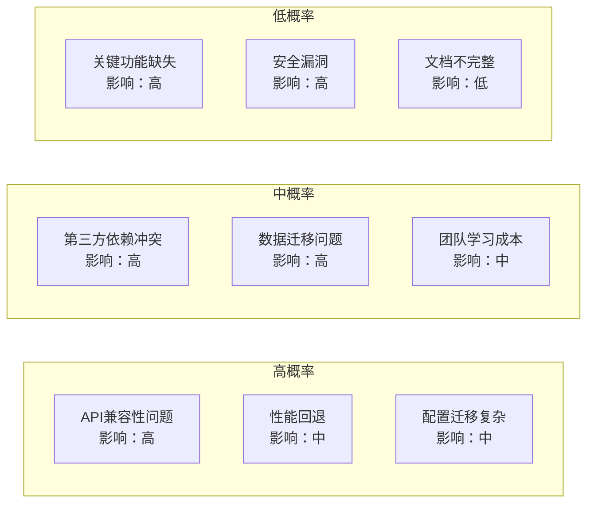
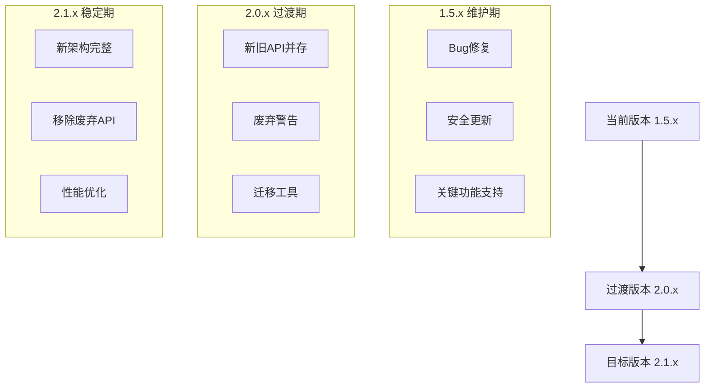
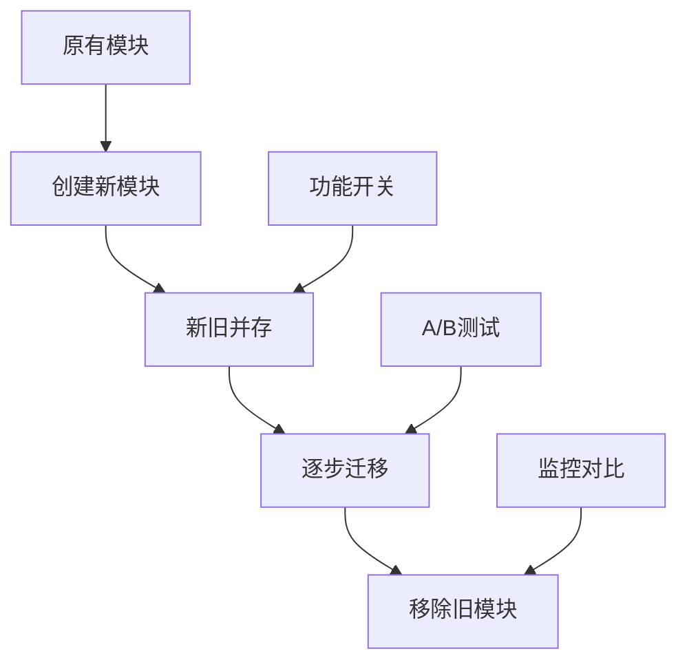
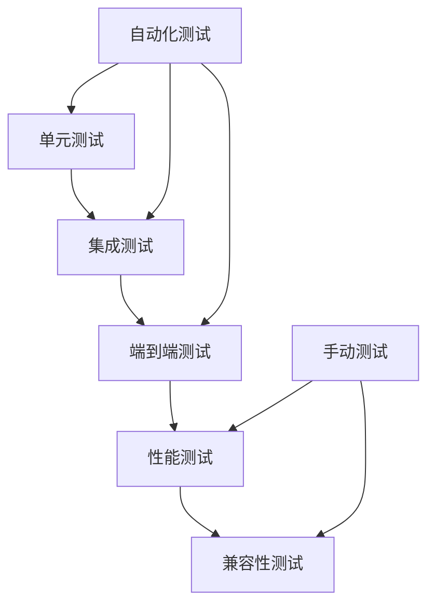

# 风险管理与兼容性策略

## 概述

大型框架重构面临诸多风险，包括技术风险、进度风险、质量风险和兼容性风险。本文档详细阐述了lark-parent重构为Nebula框架过程中的风险识别、评估和应对策略，确保重构顺利进行并保持系统稳定性。

## 风险识别与评估

### 风险矩阵



### 主要风险分类

#### 1. 技术风险
- **Spring Boot 3.x迁移**：命名空间从javax到jakarta的变更
- **Java版本升级**：新语法特性和API变化
- **依赖库冲突**：版本不兼容导致的运行时问题
- **性能回退**：重构可能引入的性能问题

#### 2. 兼容性风险
- **API破坏性变更**：现有用户代码无法正常工作
- **配置格式变化**：配置文件需要大量修改
- **行为变化**：相同API的行为发生变化
- **数据格式兼容**：存储格式的不兼容

#### 3. 进度风险
- **估时不准确**：重构复杂度超出预期
- **资源不足**：开发人员技能或时间不够
- **需求变更**：重构过程中的需求调整
- **质量门禁**：质量要求导致的进度延迟

#### 4. 质量风险
- **测试覆盖不足**：新功能缺乏充分测试
- **代码质量下降**：重构匆忙导致的技术债务
- **文档滞后**：文档更新不及时
- **用户体验下降**：新版本易用性问题

## 兼容性策略

### 版本策略



### 向后兼容性保证

#### 1. API兼容性策略
```java
// 保持旧API，内部桥接到新实现
@Deprecated(since = "2.0.0", forRemoval = true)
public class DatabaseService {
    private final DataSourceManager newDataSourceManager;
    
    // 旧方法保持签名不变，内部调用新实现
    public Database get(String dbName) {
        return newDataSourceManager.getDatabase(dbName);
    }
}

// 新API设计
public class DataSourceManager {
    public Database getDatabase(String dbName) {
        // 新的实现逻辑
    }
}
```

#### 2. 配置兼容性策略
```yaml
# 支持旧配置格式
lark:
  database:  # 旧格式，保持兼容
    url: jdbc:mysql://localhost:3306/test
    username: root
    password: password
    
# 推荐新配置格式
nebula:
  data:
    sources:
      primary:
        type: mysql
        url: jdbc:mysql://localhost:3306/test
        credentials:
          username: root
          password: password
```

#### 3. 行为兼容性策略
- **默认行为保持不变**：确保现有代码无需修改就能工作
- **新行为通过配置启用**：新特性默认关闭，通过配置开启
- **渐进式迁移**：提供迁移检查工具和建议

### 迁移支持工具

#### 1. 自动迁移工具
```java
// 配置迁移工具
public class ConfigurationMigrator {
    public void migrate(String oldConfigPath, String newConfigPath) {
        // 自动转换配置格式
    }
    
    public List<MigrationIssue> checkCompatibility(String configPath) {
        // 检查配置兼容性问题
    }
}

// 代码迁移助手
public class CodeMigrationHelper {
    public List<DeprecationWarning> scanDeprecatedUsage(String projectPath) {
        // 扫描项目中使用的废弃API
    }
    
    public void suggestMigration(String className, String methodName) {
        // 提供迁移建议
    }
}
```

#### 2. 兼容性检查工具
```java
public class CompatibilityChecker {
    public CompatibilityReport check(String projectPath) {
        return CompatibilityReport.builder()
            .apiCompatibility(checkApiCompatibility(projectPath))
            .configCompatibility(checkConfigCompatibility(projectPath))
            .dependencyCompatibility(checkDependencyCompatibility(projectPath))
            .build();
    }
}
```

## 风险应对策略

### 技术风险应对

#### 1. 渐进式重构


- **并行开发**：新模块和旧模块同时存在
- **功能开关**：通过配置控制新旧功能切换
- **灰度发布**：逐步将流量切换到新模块

#### 2. 回滚机制
```java
@Configuration
public class FeatureToggleConfiguration {
    
    @Value("${nebula.feature.new-database-service:false}")
    private boolean useNewDatabaseService;
    
    @Bean
    @ConditionalOnProperty(name = "nebula.feature.new-database-service", havingValue = "true")
    public DataSourceManager newDataSourceManager() {
        return new DataSourceManager();
    }
    
    @Bean
    @ConditionalOnProperty(name = "nebula.feature.new-database-service", havingValue = "false", matchIfMissing = true)
    public DatabaseService legacyDatabaseService() {
        return new DatabaseService();
    }
}
```

#### 3. 性能保证
- **基准测试**：每个重构阶段都进行性能基准测试
- **性能监控**：实时监控关键性能指标
- **性能预警**：设置性能阈值和告警机制

### 质量风险应对

#### 1. 测试策略


- **测试优先**：新功能开发前先写测试
- **回归测试**：确保重构不影响现有功能
- **兼容性测试**：专门测试新旧版本兼容性

#### 2. 代码质量保证
```java
// 代码质量检查配置
public class QualityGateConfiguration {
    // 代码覆盖率要求
    public static final double MIN_CODE_COVERAGE = 0.80;
    
    // 代码复杂度限制
    public static final int MAX_CYCLOMATIC_COMPLEXITY = 10;
    
    // 代码重复率限制
    public static final double MAX_DUPLICATION_RATIO = 0.05;
}
```

#### 3. 持续集成
- **自动化构建**：每次代码提交自动构建和测试
- **质量门禁**：不满足质量要求的代码不能合并
- **快速反馈**：及时发现和修复问题

### 进度风险应对

#### 1. 敏捷管理
- **迭代开发**：2周为一个迭代周期
- **每日站会**：及时发现和解决阻碍
- **回顾改进**：每个迭代后总结改进

#### 2. 资源调配
- **技能培训**：提前进行新技术培训
- **人员备份**：关键岗位有备份人员
- **外部支持**：必要时寻求外部专家支持

#### 3. 计划调整
- **优先级管理**：根据重要性调整功能优先级
- **范围调整**：必要时调整项目范围
- **时间缓冲**：预留20%的时间缓冲

## 监控和预警

### 关键指标监控

#### 1. 技术指标
```java
@Component
public class PerformanceMonitor {
    
    @EventListener
    public void handleDatabaseOperation(DatabaseOperationEvent event) {
        // 监控数据库操作性能
        meterRegistry.timer("database.operation", 
            "operation", event.getOperation(),
            "table", event.getTable())
            .record(event.getDuration(), TimeUnit.MILLISECONDS);
    }
    
    @EventListener
    public void handleRpcCall(RpcCallEvent event) {
        // 监控RPC调用性能
        meterRegistry.timer("rpc.call",
            "service", event.getService(),
            "method", event.getMethod())
            .record(event.getDuration(), TimeUnit.MILLISECONDS);
    }
}
```

#### 2. 业务指标
- **错误率**：系统错误率不超过0.1%
- **响应时间**：P99响应时间不超过100ms
- **吞吐量**：QPS相比重构前提升30%
- **可用性**：系统可用性达到99.9%

### 预警机制

#### 1. 实时预警
```yaml
# 预警配置
alerts:
  performance:
    response_time_p99: 100ms
    error_rate: 0.1%
    cpu_usage: 80%
    memory_usage: 85%
    
  business:
    transaction_success_rate: 99.9%
    message_processing_rate: 95%
```

#### 2. 趋势预警
- **性能趋势**：监控性能指标的变化趋势
- **容量预警**：预测资源使用趋势，提前扩容
- **质量趋势**：监控代码质量指标变化

## 应急响应

### 问题分级

#### 1. P0级别（紧急）
- **系统完全不可用**
- **数据丢失或损坏**
- **安全漏洞被利用**

**响应时间**：15分钟内响应，1小时内恢复

#### 2. P1级别（高）
- **核心功能不可用**
- **性能严重下降**
- **部分用户受影响**

**响应时间**：1小时内响应，4小时内恢复

#### 3. P2级别（中）
- **非核心功能问题**
- **性能轻微下降**
- **用户体验受影响**

**响应时间**：4小时内响应，24小时内恢复

### 应急预案

#### 1. 技术应急预案
```bash
# 快速回滚脚本
#!/bin/bash
echo "开始回滚到上一个稳定版本..."

# 停止新版本服务
kubectl scale deployment nebula-app --replicas=0

# 启动旧版本服务
kubectl scale deployment lark-app-legacy --replicas=3

# 切换流量
kubectl patch service nebula-service -p '{"spec":{"selector":{"version":"legacy"}}}'

echo "回滚完成，请验证系统状态"
```

#### 2. 数据应急预案
- **数据备份**：每小时自动备份关键数据
- **数据恢复**：提供一键数据恢复脚本
- **数据验证**：恢复后自动验证数据完整性

#### 3. 通信应急预案
- **内部通信**：建立应急沟通群组
- **外部通信**：准备用户通知模板
- **状态页面**：实时更新系统状态

## 成功标准

### 兼容性成功标准
- [ ] 95%以上的现有项目无需修改即可升级
- [ ] 提供完整的迁移工具和文档
- [ ] 旧版本API在2个大版本内保持支持
- [ ] 配置文件自动迁移成功率99%以上

### 风险控制成功标准
- [ ] 零生产事故
- [ ] 性能无回退
- [ ] 用户满意度95%以上
- [ ] 迁移成本在预期范围内

### 质量保证成功标准
- [ ] 测试覆盖率80%以上
- [ ] 代码质量评分A级
- [ ] 文档完整性100%
- [ ] 漏洞数量为0

通过这些全面的风险管理和兼容性策略，我们将确保lark-parent框架到Nebula框架的重构既能实现技术目标，又能保持系统的稳定性和用户的满意度。如同星云的演化过程需要精确的物理条件控制，框架的重构也需要细致的风险管控来确保成功。
