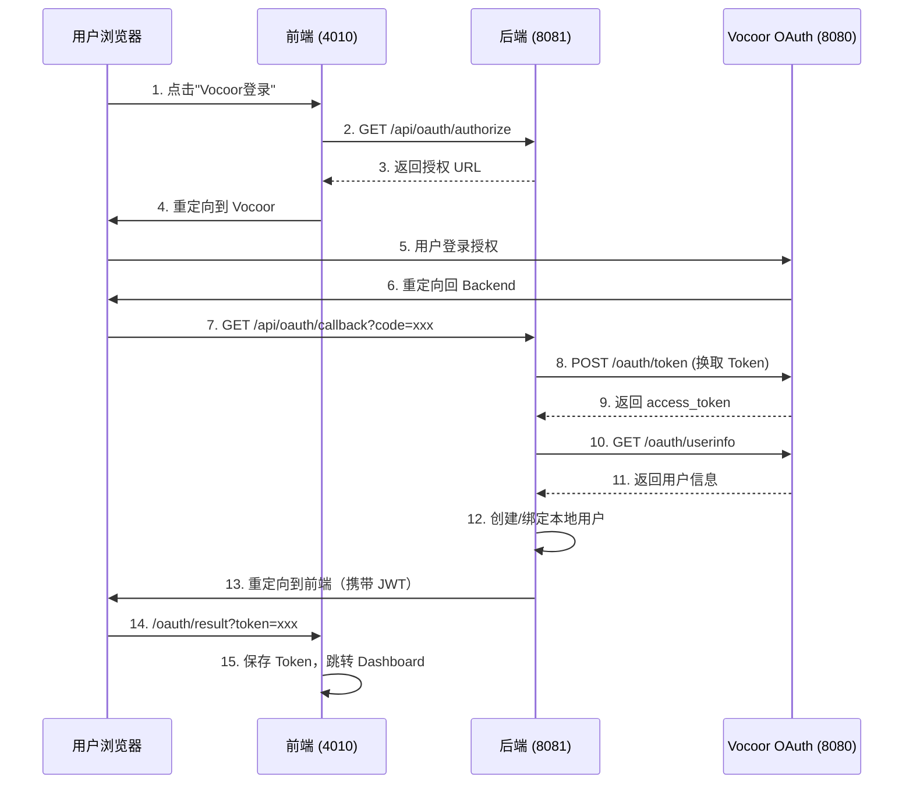

# Nebula OAuth Example

> Vocoor OAuth 2.0 客户端示例，演示前后端分离架构下的 OAuth 授权码登录流程

## 项目结构

```
oauth-example/
├── backend/          # 后端服务（基于 Nebula 框架）
│   ├── pom.xml
│   ├── src/
│   ├── sql/
│   └── README.md
├── frontend/         # 前端应用（基于 Vue 3）
│   ├── package.json
│   ├── src/
│   └── README.md
└── README.md         # 本文件
```

## 快速开始

### 1. 准备工作

确保已安装：
- JDK 21+
- Maven 3.6+
- Node.js 18+
- MySQL 8.x

### 2. 启动后端

```bash
# 1. 初始化数据库
mysql -u root -p -e "CREATE DATABASE oauth_client_demo DEFAULT CHARACTER SET utf8mb4 COLLATE utf8mb4_unicode_ci;"
mysql -u root -p oauth_client_demo < backend/sql/init.sql

# 2. 配置 application.yml（数据库连接、Vocoor OAuth 配置）

# 3. 安装 Nebula 依赖
cd /path/to/nebula
mvn install -DskipTests

# 4. 启动后端
mvn -q -f examples/oauth-example/backend spring-boot:run
```

后端将在 http://localhost:8081 启动

### 3. 启动前端

```bash
cd examples/oauth-example/frontend
npm install
npm run dev
```

前端将在 http://localhost:5173 启动

### 4. 访问应用

打开浏览器访问 http://localhost:5173，点击"使用 Vocoor 账号登录"开始体验。

## 核心功能

- **OAuth 2.0 授权码模式**：完整实现标准 OAuth 2.0 授权码流程
- **用户绑定**：自动将 Vocoor 用户与本地用户关联
- **JWT 认证**：使用 JWT 管理本地会话
- **前后端分离**：Vue 3 + Spring Boot 架构

## 技术栈

### 后端
- Java 21
- Spring Boot 3.x
- Nebula Framework
- MyBatis-Plus
- MySQL

### 前端
- Vue 3 (Composition API)
- TypeScript
- Vite
- Element Plus
- Pinia

## 配置说明

### Vocoor OAuth 配置

在 `backend/src/main/resources/application.yml` 中配置：

```yaml
vocoor:
  oauth:
    server-url: http://localhost:8080    # Vocoor OAuth 服务器
    client-id: your_client_id            # 客户端 ID
    client-secret: your_client_secret    # 客户端密钥
    redirect-uri: http://localhost:8081/api/oauth/callback
    frontend-url: http://localhost:4010
```

### 数据库配置

```yaml
spring:
  datasource:
    url: jdbc:mysql://localhost:3306/oauth_client_demo
    username: root
    password: your_password
```

## 授权流程



## 相关文档

- [Nebula Examples 总览](../README.md)
- [后端 README](backend/README.md)
- [前端 README](frontend/README.md)
- [Nebula 框架使用指南](../../docs/Nebula框架使用指南.md)

