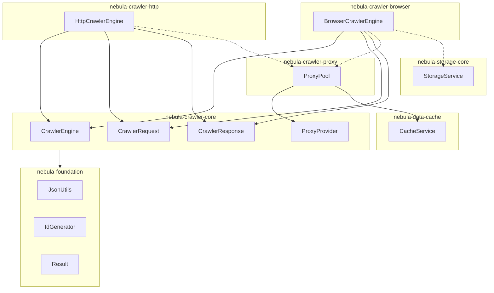

# Nebula Crawler 模块设计文档

## 文档信息
- 模块名称：Nebula Crawler（爬虫基础设施）
- 版本：V1.0
- 创建日期：2026-01-04
- 所属框架：Nebula Framework 2.0.1

---

## 1. 模块概述

### 1.1 设计目标

在Nebula框架中新增爬虫基础设施模块组，提供通用的网页爬取能力，支持：

1. **多种爬虫引擎**：HTTP爬虫、浏览器爬虫
2. **代理IP管理**：代理池、轮换、验证
3. **反爬应对**：User-Agent轮换、限流、Cookie管理
4. **高性能**：连接池复用、异步处理

### 1.2 设计原则

| 原则 | 说明 |
|-----|------|
| **统一抽象** | 定义统一的爬虫接口，不同实现透明切换 |
| **开箱即用** | 提供Spring Boot自动配置，零配置启动 |
| **可扩展** | 支持自定义爬虫引擎、代理提供者 |
| **与框架集成** | 复用Nebula现有基础设施（缓存、存储等）|

### 1.3 模块定位

```
+============================================================================+
|                          Nebula Framework                                   |
+============================================================================+
|                                                                              |
|  +-----------------+  +-----------------+  +-----------------+              |
|  |    core/        |  |  application/   |  |  starter/       |              |
|  |  nebula-        |  |  nebula-task    |  |  nebula-        |              |
|  |  foundation     |  |  nebula-web     |  |  starter-*      |              |
|  +-----------------+  +-----------------+  +-----------------+              |
|                                                                              |
|  +----------------------------------------------------------------------+   |
|  |                      infrastructure/                                  |   |
|  +----------------------------------------------------------------------+   |
|  |                                                                       |   |
|  |  +-----------+  +-----------+  +-----------+  +------------------+   |   |
|  |  | data/     |  | messaging/|  | rpc/      |  | crawler/ (NEW)   |   |   |
|  |  | - cache   |  | - rabbitmq|  | - http    |  | - core           |   |   |
|  |  | - persist |  |           |  | - grpc    |  | - http           |   |   |
|  |  +-----------+  +-----------+  +-----------+  | - browser        |   |   |
|  |                                               | - proxy          |   |   |
|  |  +-----------+  +-----------+  +-----------+  +------------------+   |   |
|  |  | storage/  |  | search/   |  | ai/       |                         |   |
|  |  | - minio   |  | - elastic |  | - spring  |                         |   |
|  |  | - oss     |  |           |  |           |                         |   |
|  |  +-----------+  +-----------+  +-----------+                         |   |
|  |                                                                       |   |
|  +----------------------------------------------------------------------+   |
|                                                                              |
+============================================================================+
```

---

## 2. 模块结构

### 2.1 目录结构

```
nebula/
└── infrastructure/
    └── crawler/
        ├── nebula-crawler-core/           # 核心抽象层
        │   ├── pom.xml
        │   ├── README.md
        │   └── src/main/java/io/nebula/crawler/core/
        │       ├── CrawlerEngine.java              # 爬虫引擎接口
        │       ├── CrawlerEngineType.java          # 引擎类型枚举
        │       ├── CrawlerRequest.java             # 请求封装
        │       ├── CrawlerResponse.java            # 响应封装
        │       ├── CrawlerContext.java             # 爬取上下文
        │       ├── CrawlerCallback.java            # 回调接口
        │       ├── HttpMethod.java                 # HTTP方法枚举
        │       ├── exception/
        │       │   ├── CrawlerException.java       # 爬虫基础异常
        │       │   └── CrawlerTimeoutException.java
        │       ├── parser/
        │       │   ├── PageParser.java             # 页面解析器接口
        │       │   └── DataExtractor.java          # 数据提取器接口
        │       ├── proxy/
        │       │   ├── Proxy.java                  # 代理对象
        │       │   ├── ProxyType.java              # 代理类型
        │       │   ├── ProxyProvider.java          # 代理提供者接口
        │       │   └── ProxyValidator.java         # 代理验证器接口
        │       ├── cookie/
        │       │   ├── CookieStore.java            # Cookie存储接口
        │       │   └── CookieManager.java          # Cookie管理器
        │       ├── config/
        │       │   └── CrawlerProperties.java      # 基础配置
        │       └── ratelimit/
        │           └── RateLimiter.java            # 限流器
        │
        ├── nebula-crawler-http/           # HTTP爬虫实现
        │   ├── pom.xml
        │   ├── README.md
        │   └── src/main/java/io/nebula/crawler/http/
        │       ├── HttpCrawlerEngine.java          # HTTP爬虫引擎
        │       ├── HttpCrawlerClient.java          # HTTP客户端封装
        │       ├── HttpRequestBuilder.java         # 请求构建器
        │       ├── HttpResponseHandler.java        # 响应处理器
        │       ├── interceptor/
        │       │   ├── ProxyInterceptor.java       # 代理拦截器
        │       │   ├── UserAgentInterceptor.java   # UA轮换拦截器
        │       │   └── RetryInterceptor.java       # 重试拦截器
        │       └── config/
        │           └── HttpCrawlerProperties.java  # HTTP爬虫配置
        │
        ├── nebula-crawler-browser/        # 浏览器爬虫实现
        │   ├── pom.xml
        │   ├── README.md
        │   └── src/main/java/io/nebula/crawler/browser/
        │       ├── BrowserCrawlerEngine.java       # 浏览器爬虫引擎
        │       ├── BrowserPool.java                # 浏览器实例池
        │       ├── PageAction.java                 # 页面操作封装
        │       ├── playwright/
        │       │   └── PlaywrightClient.java       # Playwright客户端
        │       └── config/
        │           └── BrowserCrawlerProperties.java
        │
        └── nebula-crawler-proxy/          # 代理池管理
            ├── pom.xml
            ├── README.md
            └── src/main/java/io/nebula/crawler/proxy/
                ├── ProxyPool.java                  # 代理池管理
                ├── ProxyChecker.java               # 代理检测器
                ├── ProxySelector.java              # 代理选择器
                ├── provider/
                │   ├── ProxySource.java            # 代理源接口
                │   ├── FileProxyProvider.java      # 文件代理源
                │   └── ApiProxyProvider.java       # API代理源
                └── config/
                    └── ProxyPoolProperties.java    # 代理池配置
```

### 2.2 模块依赖关系



---

## 3. 核心接口设计

### 3.1 CrawlerEngine（爬虫引擎接口）

```java
package io.nebula.crawler.core;

import java.util.List;
import java.util.concurrent.CompletableFuture;

/**
 * 爬虫引擎接口
 * 定义统一的爬取能力抽象，不同实现（HTTP/浏览器）遵循相同契约
 * 
 * @author Nebula Team
 * @since 2.0.1
 */
public interface CrawlerEngine {
    
    /**
     * 获取引擎类型
     * 
     * @return 引擎类型枚举
     */
    CrawlerEngineType getType();
    
    /**
     * 同步爬取
     * 阻塞直到请求完成或超时
     * 
     * @param request 爬取请求
     * @return 爬取响应
     */
    CrawlerResponse crawl(CrawlerRequest request);
    
    /**
     * 异步爬取
     * 立即返回Future，可用于并行处理
     * 
     * @param request 爬取请求
     * @return 异步响应Future
     */
    CompletableFuture<CrawlerResponse> crawlAsync(CrawlerRequest request);
    
    /**
     * 批量爬取
     * 内部可能并行执行，提高效率
     * 
     * @param requests 请求列表
     * @return 响应列表（顺序与请求对应）
     */
    List<CrawlerResponse> crawlBatch(List<CrawlerRequest> requests);
    
    /**
     * 带回调的爬取
     * 适用于流式处理场景
     * 
     * @param request 爬取请求
     * @param callback 回调处理器
     */
    default void crawlWithCallback(CrawlerRequest request, CrawlerCallback callback) {
        try {
            CrawlerResponse response = crawl(request);
            if (response.isSuccess()) {
                callback.onSuccess(response);
            } else {
                callback.onFailure(request, new CrawlerException(response.getErrorMessage()));
            }
        } catch (Exception e) {
            callback.onFailure(request, e);
        }
    }
    
    /**
     * 关闭引擎
     * 释放资源，关闭连接池
     */
    void shutdown();
    
    /**
     * 健康检查
     * 
     * @return 引擎是否健康可用
     */
    boolean isHealthy();
}
```

### 3.2 CrawlerRequest（请求封装）

```java
package io.nebula.crawler.core;

import io.nebula.crawler.core.proxy.Proxy;
import io.nebula.foundation.util.IdGenerator;
import lombok.Builder;
import lombok.Data;

import java.util.HashMap;
import java.util.Map;

/**
 * 爬虫请求封装
 * 统一封装各种爬取参数，支持HTTP和浏览器爬虫
 * 
 * @author Nebula Team
 * @since 2.0.1
 */
@Data
@Builder
public class CrawlerRequest {
    
    /**
     * 请求ID（用于追踪和日志关联）
     */
    @Builder.Default
    private String requestId = IdGenerator.uuid();
    
    /**
     * 目标URL
     */
    private String url;
    
    /**
     * HTTP方法
     */
    @Builder.Default
    private HttpMethod method = HttpMethod.GET;
    
    /**
     * 请求头
     */
    @Builder.Default
    private Map<String, String> headers = new HashMap<>();
    
    /**
     * URL参数
     */
    @Builder.Default
    private Map<String, String> params = new HashMap<>();
    
    /**
     * 请求体（POST/PUT时使用）
     */
    private String body;
    
    /**
     * 请求体类型
     */
    @Builder.Default
    private String contentType = "application/json";
    
    /**
     * 指定使用的代理（为null则由引擎自动选择）
     */
    private Proxy proxy;
    
    /**
     * 连接超时(ms)
     */
    @Builder.Default
    private int connectTimeout = 30000;
    
    /**
     * 读取超时(ms)
     */
    @Builder.Default
    private int readTimeout = 60000;
    
    /**
     * 重试次数
     */
    @Builder.Default
    private int retryCount = 3;
    
    /**
     * 重试间隔(ms)
     */
    @Builder.Default
    private int retryInterval = 1000;
    
    /**
     * 是否需要渲染JavaScript（浏览器爬虫使用）
     */
    @Builder.Default
    private boolean renderJs = false;
    
    /**
     * 等待选择器（浏览器爬虫使用，等待元素出现）
     */
    private String waitSelector;
    
    /**
     * 等待超时(ms)（浏览器爬虫使用）
     */
    @Builder.Default
    private int waitTimeout = 30000;
    
    /**
     * 是否截图（浏览器爬虫使用）
     */
    @Builder.Default
    private boolean screenshot = false;
    
    /**
     * 是否跟随重定向
     */
    @Builder.Default
    private boolean followRedirects = true;
    
    /**
     * 扩展属性（用于传递自定义参数）
     */
    @Builder.Default
    private Map<String, Object> extras = new HashMap<>();
    
    // ========== 静态工厂方法 ==========
    
    /**
     * 创建简单GET请求
     */
    public static CrawlerRequest get(String url) {
        return CrawlerRequest.builder()
            .url(url)
            .method(HttpMethod.GET)
            .build();
    }
    
    /**
     * 创建带参数的GET请求
     */
    public static CrawlerRequest get(String url, Map<String, String> params) {
        return CrawlerRequest.builder()
            .url(url)
            .method(HttpMethod.GET)
            .params(params)
            .build();
    }
    
    /**
     * 创建POST请求
     */
    public static CrawlerRequest post(String url, String body) {
        return CrawlerRequest.builder()
            .url(url)
            .method(HttpMethod.POST)
            .body(body)
            .build();
    }
    
    /**
     * 创建需要JS渲染的请求
     */
    public static CrawlerRequest renderPage(String url) {
        return CrawlerRequest.builder()
            .url(url)
            .method(HttpMethod.GET)
            .renderJs(true)
            .build();
    }
    
    /**
     * 创建需要JS渲染且等待元素的请求
     */
    public static CrawlerRequest renderPage(String url, String waitSelector) {
        return CrawlerRequest.builder()
            .url(url)
            .method(HttpMethod.GET)
            .renderJs(true)
            .waitSelector(waitSelector)
            .build();
    }
    
    // ========== 便捷方法 ==========
    
    /**
     * 添加请求头
     */
    public CrawlerRequest addHeader(String name, String value) {
        if (this.headers == null) {
            this.headers = new HashMap<>();
        }
        this.headers.put(name, value);
        return this;
    }
    
    /**
     * 添加URL参数
     */
    public CrawlerRequest addParam(String name, String value) {
        if (this.params == null) {
            this.params = new HashMap<>();
        }
        this.params.put(name, value);
        return this;
    }
    
    /**
     * 添加扩展属性
     */
    public CrawlerRequest addExtra(String key, Object value) {
        if (this.extras == null) {
            this.extras = new HashMap<>();
        }
        this.extras.put(key, value);
        return this;
    }
    
    /**
     * 获取扩展属性
     */
    @SuppressWarnings("unchecked")
    public <T> T getExtra(String key) {
        return extras != null ? (T) extras.get(key) : null;
    }
    
    /**
     * 获取扩展属性（带默认值）
     */
    @SuppressWarnings("unchecked")
    public <T> T getExtra(String key, T defaultValue) {
        if (extras == null) {
            return defaultValue;
        }
        T value = (T) extras.get(key);
        return value != null ? value : defaultValue;
    }
}
```

### 3.3 CrawlerResponse（响应封装）

```java
package io.nebula.crawler.core;

import io.nebula.crawler.core.proxy.Proxy;
import io.nebula.foundation.util.JsonUtils;
import lombok.Builder;
import lombok.Data;
import org.jsoup.Jsoup;
import org.jsoup.nodes.Document;

import java.nio.charset.StandardCharsets;
import java.util.HashMap;
import java.util.List;
import java.util.Map;

/**
 * 爬虫响应封装
 * 封装爬取结果，提供便捷的解析方法
 * 
 * @author Nebula Team
 * @since 2.0.1
 */
@Data
@Builder
public class CrawlerResponse {
    
    /**
     * 请求ID（与请求关联）
     */
    private String requestId;
    
    /**
     * 请求URL
     */
    private String url;
    
    /**
     * 最终URL（可能经过重定向）
     */
    private String finalUrl;
    
    /**
     * HTTP状态码
     */
    private int statusCode;
    
    /**
     * 响应头
     */
    @Builder.Default
    private Map<String, List<String>> headers = new HashMap<>();
    
    /**
     * 响应内容（字符串形式）
     */
    private String content;
    
    /**
     * 响应字节（二进制形式）
     */
    private byte[] bytes;
    
    /**
     * 内容类型
     */
    private String contentType;
    
    /**
     * 内容编码
     */
    @Builder.Default
    private String charset = "UTF-8";
    
    /**
     * 响应时间(ms)
     */
    private long responseTime;
    
    /**
     * 是否成功
     */
    private boolean success;
    
    /**
     * 错误信息
     */
    private String errorMessage;
    
    /**
     * 错误异常
     */
    private Throwable exception;
    
    /**
     * 使用的代理
     */
    private Proxy usedProxy;
    
    /**
     * 截图数据（浏览器爬虫）
     */
    private byte[] screenshot;
    
    /**
     * 扩展属性
     */
    @Builder.Default
    private Map<String, Object> extras = new HashMap<>();
    
    // ========== 静态工厂方法 ==========
    
    /**
     * 创建成功响应
     */
    public static CrawlerResponse success(String requestId, String url, 
            int statusCode, String content, long responseTime) {
        return CrawlerResponse.builder()
            .requestId(requestId)
            .url(url)
            .statusCode(statusCode)
            .content(content)
            .responseTime(responseTime)
            .success(true)
            .build();
    }
    
    /**
     * 创建失败响应
     */
    public static CrawlerResponse failure(String requestId, String url, 
            String errorMessage, Throwable exception) {
        return CrawlerResponse.builder()
            .requestId(requestId)
            .url(url)
            .success(false)
            .errorMessage(errorMessage)
            .exception(exception)
            .build();
    }
    
    // ========== 便捷方法 ==========
    
    /**
     * 判断是否成功（综合状态码）
     */
    public boolean isSuccess() {
        return success && statusCode >= 200 && statusCode < 300;
    }
    
    /**
     * 判断是否为重定向
     */
    public boolean isRedirect() {
        return statusCode >= 300 && statusCode < 400;
    }
    
    /**
     * 判断是否为客户端错误
     */
    public boolean isClientError() {
        return statusCode >= 400 && statusCode < 500;
    }
    
    /**
     * 判断是否为服务端错误
     */
    public boolean isServerError() {
        return statusCode >= 500;
    }
    
    /**
     * 解析为Jsoup Document
     */
    public Document asDocument() {
        if (content == null) {
            throw new IllegalStateException("响应内容为空");
        }
        return Jsoup.parse(content);
    }
    
    /**
     * 解析为指定类型的JSON对象
     */
    public <T> T asJson(Class<T> clazz) {
        if (content == null) {
            throw new IllegalStateException("响应内容为空");
        }
        return JsonUtils.fromJson(content, clazz);
    }
    
    /**
     * 解析为Map
     */
    public Map<String, Object> asMap() {
        if (content == null) {
            throw new IllegalStateException("响应内容为空");
        }
        return JsonUtils.toMap(content);
    }
    
    /**
     * 解析为List
     */
    public <T> List<T> asList(Class<T> clazz) {
        if (content == null) {
            throw new IllegalStateException("响应内容为空");
        }
        return JsonUtils.toList(content, clazz);
    }
    
    /**
     * 获取内容字节（如果没有直接存储则从字符串转换）
     */
    public byte[] getBytes() {
        if (bytes != null) {
            return bytes;
        }
        if (content != null) {
            return content.getBytes(StandardCharsets.UTF_8);
        }
        return new byte[0];
    }
    
    /**
     * 获取响应头（单值）
     */
    public String getHeader(String name) {
        if (headers == null) {
            return null;
        }
        List<String> values = headers.get(name);
        return values != null && !values.isEmpty() ? values.get(0) : null;
    }
    
    /**
     * 添加扩展属性
     */
    public CrawlerResponse addExtra(String key, Object value) {
        if (this.extras == null) {
            this.extras = new HashMap<>();
        }
        this.extras.put(key, value);
        return this;
    }
}
```

### 3.4 ProxyProvider（代理提供者接口）

```java
package io.nebula.crawler.core.proxy;

import java.util.List;

/**
 * 代理提供者接口
 * 定义代理获取、反馈的统一契约
 * 
 * @author Nebula Team
 * @since 2.0.1
 */
public interface ProxyProvider {
    
    /**
     * 获取一个可用代理
     * 实现应考虑负载均衡和可用性
     * 
     * @return 可用代理，无可用代理时返回null
     */
    Proxy getProxy();
    
    /**
     * 获取指定数量的代理
     * 
     * @param count 需要的代理数量
     * @return 代理列表（数量可能少于请求数量）
     */
    List<Proxy> getProxies(int count);
    
    /**
     * 获取指定类型的代理
     * 
     * @param type 代理类型
     * @return 可用代理，无可用代理时返回null
     */
    default Proxy getProxy(ProxyType type) {
        return getProxy();
    }
    
    /**
     * 报告代理使用成功
     * 用于更新代理的成功统计
     * 
     * @param proxy 使用成功的代理
     */
    void reportSuccess(Proxy proxy);
    
    /**
     * 报告代理使用成功（带响应时间）
     * 
     * @param proxy 使用成功的代理
     * @param responseTime 响应时间(ms)
     */
    default void reportSuccess(Proxy proxy, long responseTime) {
        proxy.setResponseTime(responseTime);
        reportSuccess(proxy);
    }
    
    /**
     * 报告代理使用失败
     * 用于更新代理的失败统计，可能触发代理下线
     * 
     * @param proxy 使用失败的代理
     * @param reason 失败原因
     */
    void reportFailure(Proxy proxy, String reason);
    
    /**
     * 获取可用代理数量
     * 
     * @return 当前可用代理数量
     */
    int getAvailableCount();
    
    /**
     * 刷新代理池
     * 从代理源获取新代理
     */
    void refresh();
    
    /**
     * 清空代理池
     */
    default void clear() {
        // 默认空实现
    }
}
```

### 3.5 Proxy（代理对象）

```java
package io.nebula.crawler.core.proxy;

import lombok.AllArgsConstructor;
import lombok.Builder;
import lombok.Data;
import lombok.NoArgsConstructor;

import java.util.Objects;

/**
 * 代理对象
 * 封装代理服务器信息和使用统计
 * 
 * @author Nebula Team
 * @since 2.0.1
 */
@Data
@Builder
@NoArgsConstructor
@AllArgsConstructor
public class Proxy {
    
    /**
     * 代理主机地址
     */
    private String host;
    
    /**
     * 代理端口
     */
    private int port;
    
    /**
     * 代理类型
     */
    @Builder.Default
    private ProxyType type = ProxyType.HTTP;
    
    /**
     * 认证用户名（可选）
     */
    private String username;
    
    /**
     * 认证密码（可选）
     */
    private String password;
    
    /**
     * 匿名级别
     */
    private AnonymityLevel anonymity;
    
    /**
     * 所在国家
     */
    private String country;
    
    /**
     * 成功使用次数
     */
    @Builder.Default
    private int successCount = 0;
    
    /**
     * 失败使用次数
     */
    @Builder.Default
    private int failCount = 0;
    
    /**
     * 平均响应时间(ms)
     */
    @Builder.Default
    private long responseTime = 0;
    
    /**
     * 最后使用时间
     */
    private long lastUseTime;
    
    /**
     * 最后检测时间
     */
    private long lastCheckTime;
    
    /**
     * 是否可用
     */
    @Builder.Default
    private boolean available = true;
    
    /**
     * 获取代理地址字符串
     */
    public String toAddress() {
        return host + ":" + port;
    }
    
    /**
     * 获取代理URL
     */
    public String toUrl() {
        String protocol = type.name().toLowerCase();
        if (username != null && password != null) {
            return String.format("%s://%s:%s@%s:%d", 
                protocol, username, password, host, port);
        }
        return String.format("%s://%s:%d", protocol, host, port);
    }
    
    /**
     * 是否需要认证
     */
    public boolean needAuth() {
        return username != null && !username.isEmpty();
    }
    
    /**
     * 计算成功率
     */
    public double getSuccessRate() {
        int total = successCount + failCount;
        return total > 0 ? (double) successCount / total : 0;
    }
    
    /**
     * 增加成功计数
     */
    public void incrementSuccess() {
        this.successCount++;
        this.lastUseTime = System.currentTimeMillis();
    }
    
    /**
     * 增加失败计数
     */
    public void incrementFail() {
        this.failCount++;
        this.lastUseTime = System.currentTimeMillis();
    }
    
    @Override
    public boolean equals(Object o) {
        if (this == o) return true;
        if (o == null || getClass() != o.getClass()) return false;
        Proxy proxy = (Proxy) o;
        return port == proxy.port && Objects.equals(host, proxy.host);
    }
    
    @Override
    public int hashCode() {
        return Objects.hash(host, port);
    }
    
    /**
     * 匿名级别枚举
     */
    public enum AnonymityLevel {
        TRANSPARENT,    // 透明代理
        ANONYMOUS,      // 匿名代理
        ELITE           // 高匿代理
    }
}
```

---

## 4. 配置设计

### 4.1 配置属性类

#### 4.1.1 CrawlerProperties（基础配置）

```java
package io.nebula.crawler.core.config;

import lombok.Data;
import org.springframework.boot.context.properties.ConfigurationProperties;

/**
 * 爬虫基础配置
 */
@Data
@ConfigurationProperties(prefix = "nebula.crawler")
public class CrawlerProperties {
    
    /**
     * 是否启用爬虫功能
     */
    private boolean enabled = false;
}
```

#### 4.1.2 HttpCrawlerProperties（HTTP爬虫配置）

```java
package io.nebula.crawler.http.config;

import lombok.Data;
import org.springframework.boot.context.properties.ConfigurationProperties;

import java.util.ArrayList;
import java.util.List;

/**
 * HTTP爬虫配置
 */
@Data
@ConfigurationProperties(prefix = "nebula.crawler.http")
public class HttpCrawlerProperties {
    
    /**
     * 是否启用HTTP爬虫
     */
    private boolean enabled = true;
    
    /**
     * 连接超时(ms)
     */
    private int connectTimeout = 30000;
    
    /**
     * 读取超时(ms)
     */
    private int readTimeout = 60000;
    
    /**
     * 写入超时(ms)
     */
    private int writeTimeout = 60000;
    
    /**
     * 最大连接数
     */
    private int maxConnections = 200;
    
    /**
     * 每主机最大连接数
     */
    private int maxConnectionsPerHost = 20;
    
    /**
     * 连接保活时间(ms)
     */
    private long keepAliveTime = 300000;
    
    /**
     * 默认重试次数
     */
    private int retryCount = 3;
    
    /**
     * 重试间隔(ms)
     */
    private int retryInterval = 1000;
    
    /**
     * 是否使用代理
     */
    private boolean useProxy = false;
    
    /**
     * 默认QPS限制
     */
    private double defaultQps = 5.0;
    
    /**
     * 是否跟随重定向
     */
    private boolean followRedirects = true;
    
    /**
     * User-Agent池
     */
    private List<String> userAgents = new ArrayList<>();
}
```

#### 4.1.3 BrowserCrawlerProperties（浏览器爬虫配置）

```java
package io.nebula.crawler.browser.config;

import lombok.Data;
import org.springframework.boot.context.properties.ConfigurationProperties;

/**
 * 浏览器爬虫配置
 */
@Data
@ConfigurationProperties(prefix = "nebula.crawler.browser")
public class BrowserCrawlerProperties {
    
    /**
     * 是否启用浏览器爬虫
     */
    private boolean enabled = true;
    
    /**
     * 浏览器类型: chromium, firefox, webkit
     */
    private String browserType = "chromium";
    
    /**
     * 是否无头模式
     */
    private boolean headless = true;
    
    /**
     * 浏览器实例池大小
     */
    private int poolSize = 5;
    
    /**
     * 页面加载超时(ms)
     */
    private int pageTimeout = 30000;
    
    /**
     * 错误时是否截图
     */
    private boolean screenshotOnError = true;
    
    /**
     * 是否使用代理
     */
    private boolean useProxy = false;
    
    /**
     * 视口宽度
     */
    private int viewportWidth = 1920;
    
    /**
     * 视口高度
     */
    private int viewportHeight = 1080;
    
    /**
     * 是否禁用图片加载（提高性能）
     */
    private boolean disableImages = false;
    
    /**
     * 是否禁用CSS（提高性能）
     */
    private boolean disableCss = false;
}
```

#### 4.1.4 ProxyPoolProperties（代理池配置）

```java
package io.nebula.crawler.proxy.config;

import lombok.Data;
import org.springframework.boot.context.properties.ConfigurationProperties;

import java.util.ArrayList;
import java.util.List;

/**
 * 代理池配置
 */
@Data
@ConfigurationProperties(prefix = "nebula.crawler.proxy")
public class ProxyPoolProperties {
    
    /**
     * 是否启用代理池
     */
    private boolean enabled = false;
    
    /**
     * 代理检测间隔(ms)
     */
    private long checkInterval = 300000;
    
    /**
     * 代理检测URL
     */
    private String checkUrl = "http://httpbin.org/ip";
    
    /**
     * 代理检测超时(ms)
     */
    private int checkTimeout = 10000;
    
    /**
     * 最小可用代理数
     */
    private int minAvailable = 50;
    
    /**
     * 最大失败次数（超过则下线）
     */
    private int maxFailCount = 3;
    
    /**
     * 代理黑名单过期时间（小时）
     */
    private int blacklistExpireHours = 24;
    
    /**
     * 代理源配置列表
     */
    private List<ProxySourceConfig> providers = new ArrayList<>();
    
    /**
     * 代理源配置
     */
    @Data
    public static class ProxySourceConfig {
        /**
         * 源类型: api, file
         */
        private String type;
        
        /**
         * 源名称
         */
        private String name;
        
        /**
         * API URL或文件路径
         */
        private String url;
        
        /**
         * 每次获取数量
         */
        private int count = 100;
        
        /**
         * API认证信息
         */
        private String apiKey;
    }
}
```

### 4.2 配置示例

```yaml
nebula:
  crawler:
    enabled: true
    
    # HTTP爬虫配置
    http:
      enabled: true
      connect-timeout: 30000
      read-timeout: 60000
      write-timeout: 60000
      max-connections: 200
      max-connections-per-host: 20
      keep-alive-time: 300000
      retry-count: 3
      retry-interval: 1000
      use-proxy: true
      default-qps: 5.0
      follow-redirects: true
      user-agents:
        - "Mozilla/5.0 (Windows NT 10.0; Win64; x64) AppleWebKit/537.36 (KHTML, like Gecko) Chrome/120.0.0.0 Safari/537.36"
        - "Mozilla/5.0 (Macintosh; Intel Mac OS X 10_15_7) AppleWebKit/537.36 (KHTML, like Gecko) Chrome/120.0.0.0 Safari/537.36"
        - "Mozilla/5.0 (Windows NT 10.0; Win64; x64; rv:121.0) Gecko/20100101 Firefox/121.0"
        - "Mozilla/5.0 (Macintosh; Intel Mac OS X 10_15_7) AppleWebKit/605.1.15 (KHTML, like Gecko) Version/17.2 Safari/605.1.15"
    
    # 浏览器爬虫配置
    browser:
      enabled: true
      browser-type: chromium
      headless: true
      pool-size: 5
      page-timeout: 30000
      screenshot-on-error: true
      use-proxy: true
      viewport-width: 1920
      viewport-height: 1080
      disable-images: false
      disable-css: false
    
    # 代理池配置
    proxy:
      enabled: true
      check-interval: 300000
      check-url: "http://httpbin.org/ip"
      check-timeout: 10000
      min-available: 50
      max-fail-count: 3
      blacklist-expire-hours: 24
      providers:
        - type: api
          name: proxy-api-1
          url: "${PROXY_API_URL}"
          count: 100
          api-key: "${PROXY_API_KEY}"
        - type: file
          name: proxy-file
          url: "classpath:proxy-list.txt"
```

---

## 5. 自动配置设计

### 5.1 自动配置类

在`nebula-autoconfigure`模块中添加爬虫自动配置：

```java
// 文件路径: nebula-autoconfigure/src/main/java/io/nebula/autoconfigure/crawler/CrawlerAutoConfiguration.java

package io.nebula.autoconfigure.crawler;

import io.nebula.crawler.browser.BrowserCrawlerEngine;
import io.nebula.crawler.browser.config.BrowserCrawlerProperties;
import io.nebula.crawler.core.config.CrawlerProperties;
import io.nebula.crawler.core.proxy.ProxyProvider;
import io.nebula.crawler.http.HttpCrawlerEngine;
import io.nebula.crawler.http.config.HttpCrawlerProperties;
import io.nebula.crawler.proxy.ProxyPool;
import io.nebula.crawler.proxy.config.ProxyPoolProperties;
import io.nebula.crawler.proxy.provider.ApiProxyProvider;
import io.nebula.crawler.proxy.provider.FileProxyProvider;
import io.nebula.crawler.proxy.provider.ProxySource;
import io.nebula.data.cache.CacheService;
import io.nebula.storage.StorageService;
import org.springframework.boot.autoconfigure.AutoConfiguration;
import org.springframework.boot.autoconfigure.condition.ConditionalOnClass;
import org.springframework.boot.autoconfigure.condition.ConditionalOnMissingBean;
import org.springframework.boot.autoconfigure.condition.ConditionalOnProperty;
import org.springframework.boot.context.properties.EnableConfigurationProperties;
import org.springframework.context.annotation.Bean;
import org.springframework.lang.Nullable;

import java.util.List;

/**
 * 爬虫模块自动配置
 * 
 * @author Nebula Team
 * @since 2.0.1
 */
@AutoConfiguration
@ConditionalOnProperty(prefix = "nebula.crawler", name = "enabled", havingValue = "true")
@EnableConfigurationProperties({
    CrawlerProperties.class,
    HttpCrawlerProperties.class,
    BrowserCrawlerProperties.class,
    ProxyPoolProperties.class
})
public class CrawlerAutoConfiguration {
    
    /**
     * HTTP爬虫引擎
     */
    @Bean
    @ConditionalOnMissingBean
    @ConditionalOnProperty(prefix = "nebula.crawler.http", name = "enabled", havingValue = "true", matchIfMissing = true)
    @ConditionalOnClass(name = "okhttp3.OkHttpClient")
    public HttpCrawlerEngine httpCrawlerEngine(
            HttpCrawlerProperties properties,
            @Nullable ProxyProvider proxyProvider) {
        return new HttpCrawlerEngine(properties, proxyProvider);
    }
    
    /**
     * 浏览器爬虫引擎
     */
    @Bean
    @ConditionalOnMissingBean
    @ConditionalOnProperty(prefix = "nebula.crawler.browser", name = "enabled", havingValue = "true")
    @ConditionalOnClass(name = "com.microsoft.playwright.Playwright")
    public BrowserCrawlerEngine browserCrawlerEngine(
            BrowserCrawlerProperties properties,
            @Nullable ProxyProvider proxyProvider,
            @Nullable StorageService storageService) {
        return new BrowserCrawlerEngine(properties, proxyProvider, storageService);
    }
    
    /**
     * 代理池
     */
    @Bean
    @ConditionalOnMissingBean(ProxyProvider.class)
    @ConditionalOnProperty(prefix = "nebula.crawler.proxy", name = "enabled", havingValue = "true")
    public ProxyPool proxyPool(
            ProxyPoolProperties properties,
            CacheService cacheService,
            List<ProxySource> proxySources) {
        return new ProxyPool(properties, cacheService, proxySources);
    }
    
    /**
     * API代理源
     */
    @Bean
    @ConditionalOnMissingBean(name = "apiProxyProvider")
    @ConditionalOnProperty(prefix = "nebula.crawler.proxy", name = "enabled", havingValue = "true")
    public ApiProxyProvider apiProxyProvider(ProxyPoolProperties properties) {
        List<ProxyPoolProperties.ProxySourceConfig> apiSources = properties.getProviders().stream()
            .filter(p -> "api".equalsIgnoreCase(p.getType()))
            .toList();
        return new ApiProxyProvider(apiSources);
    }
    
    /**
     * 文件代理源
     */
    @Bean
    @ConditionalOnMissingBean(name = "fileProxyProvider")
    @ConditionalOnProperty(prefix = "nebula.crawler.proxy", name = "enabled", havingValue = "true")
    public FileProxyProvider fileProxyProvider(ProxyPoolProperties properties) {
        List<ProxyPoolProperties.ProxySourceConfig> fileSources = properties.getProviders().stream()
            .filter(p -> "file".equalsIgnoreCase(p.getType()))
            .toList();
        return new FileProxyProvider(fileSources);
    }
}
```

### 5.2 注册自动配置

在`META-INF/spring/org.springframework.boot.autoconfigure.AutoConfiguration.imports`文件中添加：

```
io.nebula.autoconfigure.crawler.CrawlerAutoConfiguration
```

---

## 6. Maven依赖配置

### 6.1 nebula-crawler-core/pom.xml

```xml
<?xml version="1.0" encoding="UTF-8"?>
<project xmlns="http://maven.apache.org/POM/4.0.0"
         xmlns:xsi="http://www.w3.org/2001/XMLSchema-instance"
         xsi:schemaLocation="http://maven.apache.org/POM/4.0.0 
                             http://maven.apache.org/xsd/maven-4.0.0.xsd">
    <modelVersion>4.0.0</modelVersion>
    
    <parent>
        <groupId>io.nebula</groupId>
        <artifactId>nebula-parent</artifactId>
        <version>2.0.1-SNAPSHOT</version>
        <relativePath>../../../pom.xml</relativePath>
    </parent>
    
    <artifactId>nebula-crawler-core</artifactId>
    <name>Nebula Crawler Core</name>
    <description>Nebula Crawler核心抽象层，定义爬虫相关接口和基础类</description>
    
    <dependencies>
        <!-- Nebula Foundation -->
        <dependency>
            <groupId>io.nebula</groupId>
            <artifactId>nebula-foundation</artifactId>
        </dependency>
        
        <!-- Spring Boot -->
        <dependency>
            <groupId>org.springframework.boot</groupId>
            <artifactId>spring-boot-starter</artifactId>
        </dependency>
        
        <!-- Jsoup HTML解析（可选） -->
        <dependency>
            <groupId>org.jsoup</groupId>
            <artifactId>jsoup</artifactId>
            <version>1.17.2</version>
            <optional>true</optional>
        </dependency>
        
        <!-- Guava（限流） -->
        <dependency>
            <groupId>com.google.guava</groupId>
            <artifactId>guava</artifactId>
        </dependency>
        
        <!-- Lombok -->
        <dependency>
            <groupId>org.projectlombok</groupId>
            <artifactId>lombok</artifactId>
            <optional>true</optional>
        </dependency>
    </dependencies>
</project>
```

### 6.2 nebula-crawler-http/pom.xml

```xml
<?xml version="1.0" encoding="UTF-8"?>
<project xmlns="http://maven.apache.org/POM/4.0.0"
         xmlns:xsi="http://www.w3.org/2001/XMLSchema-instance"
         xsi:schemaLocation="http://maven.apache.org/POM/4.0.0 
                             http://maven.apache.org/xsd/maven-4.0.0.xsd">
    <modelVersion>4.0.0</modelVersion>
    
    <parent>
        <groupId>io.nebula</groupId>
        <artifactId>nebula-parent</artifactId>
        <version>2.0.1-SNAPSHOT</version>
        <relativePath>../../../pom.xml</relativePath>
    </parent>
    
    <artifactId>nebula-crawler-http</artifactId>
    <name>Nebula Crawler HTTP</name>
    <description>基于OkHttp的HTTP爬虫实现</description>
    
    <dependencies>
        <!-- Nebula Crawler Core -->
        <dependency>
            <groupId>io.nebula</groupId>
            <artifactId>nebula-crawler-core</artifactId>
            <version>${project.version}</version>
        </dependency>
        
        <!-- OkHttp -->
        <dependency>
            <groupId>com.squareup.okhttp3</groupId>
            <artifactId>okhttp</artifactId>
            <version>4.12.0</version>
        </dependency>
        
        <!-- Jsoup HTML解析 -->
        <dependency>
            <groupId>org.jsoup</groupId>
            <artifactId>jsoup</artifactId>
            <version>1.17.2</version>
        </dependency>
        
        <!-- Lombok -->
        <dependency>
            <groupId>org.projectlombok</groupId>
            <artifactId>lombok</artifactId>
            <optional>true</optional>
        </dependency>
    </dependencies>
</project>
```

### 6.3 nebula-crawler-browser/pom.xml

```xml
<?xml version="1.0" encoding="UTF-8"?>
<project xmlns="http://maven.apache.org/POM/4.0.0"
         xmlns:xsi="http://www.w3.org/2001/XMLSchema-instance"
         xsi:schemaLocation="http://maven.apache.org/POM/4.0.0 
                             http://maven.apache.org/xsd/maven-4.0.0.xsd">
    <modelVersion>4.0.0</modelVersion>
    
    <parent>
        <groupId>io.nebula</groupId>
        <artifactId>nebula-parent</artifactId>
        <version>2.0.1-SNAPSHOT</version>
        <relativePath>../../../pom.xml</relativePath>
    </parent>
    
    <artifactId>nebula-crawler-browser</artifactId>
    <name>Nebula Crawler Browser</name>
    <description>基于Playwright的浏览器爬虫实现</description>
    
    <dependencies>
        <!-- Nebula Crawler Core -->
        <dependency>
            <groupId>io.nebula</groupId>
            <artifactId>nebula-crawler-core</artifactId>
            <version>${project.version}</version>
        </dependency>
        
        <!-- Nebula Storage Core（用于保存截图，可选） -->
        <dependency>
            <groupId>io.nebula</groupId>
            <artifactId>nebula-storage-core</artifactId>
            <version>${project.version}</version>
            <optional>true</optional>
        </dependency>
        
        <!-- Playwright -->
        <dependency>
            <groupId>com.microsoft.playwright</groupId>
            <artifactId>playwright</artifactId>
            <version>1.41.0</version>
        </dependency>
        
        <!-- Lombok -->
        <dependency>
            <groupId>org.projectlombok</groupId>
            <artifactId>lombok</artifactId>
            <optional>true</optional>
        </dependency>
    </dependencies>
</project>
```

### 6.4 nebula-crawler-proxy/pom.xml

```xml
<?xml version="1.0" encoding="UTF-8"?>
<project xmlns="http://maven.apache.org/POM/4.0.0"
         xmlns:xsi="http://www.w3.org/2001/XMLSchema-instance"
         xsi:schemaLocation="http://maven.apache.org/POM/4.0.0 
                             http://maven.apache.org/xsd/maven-4.0.0.xsd">
    <modelVersion>4.0.0</modelVersion>
    
    <parent>
        <groupId>io.nebula</groupId>
        <artifactId>nebula-parent</artifactId>
        <version>2.0.1-SNAPSHOT</version>
        <relativePath>../../../pom.xml</relativePath>
    </parent>
    
    <artifactId>nebula-crawler-proxy</artifactId>
    <name>Nebula Crawler Proxy</name>
    <description>代理IP池管理模块</description>
    
    <dependencies>
        <!-- Nebula Crawler Core -->
        <dependency>
            <groupId>io.nebula</groupId>
            <artifactId>nebula-crawler-core</artifactId>
            <version>${project.version}</version>
        </dependency>
        
        <!-- Nebula Data Cache（Redis缓存） -->
        <dependency>
            <groupId>io.nebula</groupId>
            <artifactId>nebula-data-cache</artifactId>
            <version>${project.version}</version>
        </dependency>
        
        <!-- OkHttp（用于代理检测） -->
        <dependency>
            <groupId>com.squareup.okhttp3</groupId>
            <artifactId>okhttp</artifactId>
            <version>4.12.0</version>
        </dependency>
        
        <!-- Lombok -->
        <dependency>
            <groupId>org.projectlombok</groupId>
            <artifactId>lombok</artifactId>
            <optional>true</optional>
        </dependency>
    </dependencies>
</project>
```

---

## 7. 使用示例

### 7.1 基本使用

```java
@Service
@RequiredArgsConstructor
public class CrawlerService {
    
    private final HttpCrawlerEngine httpCrawlerEngine;
    private final BrowserCrawlerEngine browserCrawlerEngine;
    
    /**
     * HTTP爬取示例
     */
    public String crawlWithHttp(String url) {
        CrawlerRequest request = CrawlerRequest.get(url);
        CrawlerResponse response = httpCrawlerEngine.crawl(request);
        
        if (response.isSuccess()) {
            return response.getContent();
        } else {
            throw new RuntimeException("爬取失败: " + response.getErrorMessage());
        }
    }
    
    /**
     * 浏览器爬取示例（需要JS渲染）
     */
    public String crawlWithBrowser(String url, String waitSelector) {
        CrawlerRequest request = CrawlerRequest.renderPage(url, waitSelector);
        CrawlerResponse response = browserCrawlerEngine.crawl(request);
        
        if (response.isSuccess()) {
            return response.getContent();
        } else {
            throw new RuntimeException("爬取失败: " + response.getErrorMessage());
        }
    }
    
    /**
     * 异步批量爬取
     */
    public List<CrawlerResponse> crawlBatch(List<String> urls) {
        List<CompletableFuture<CrawlerResponse>> futures = urls.stream()
            .map(url -> httpCrawlerEngine.crawlAsync(CrawlerRequest.get(url)))
            .toList();
        
        return futures.stream()
            .map(CompletableFuture::join)
            .toList();
    }
}
```

### 7.2 自定义代理源

```java
@Component
public class CustomProxyProvider implements ProxySource {
    
    @Override
    public String getName() {
        return "custom-proxy";
    }
    
    @Override
    public List<Proxy> fetch() {
        // 从自定义来源获取代理
        List<Proxy> proxies = new ArrayList<>();
        // ... 获取逻辑
        return proxies;
    }
}
```

---

## 8. 测试策略

### 8.1 单元测试

```java
@SpringBootTest
class HttpCrawlerEngineTest {
    
    @Autowired
    private HttpCrawlerEngine httpCrawlerEngine;
    
    @Test
    void shouldCrawlSuccessfully() {
        CrawlerRequest request = CrawlerRequest.get("https://httpbin.org/get");
        CrawlerResponse response = httpCrawlerEngine.crawl(request);
        
        assertThat(response.isSuccess()).isTrue();
        assertThat(response.getStatusCode()).isEqualTo(200);
        assertThat(response.getContent()).isNotEmpty();
    }
    
    @Test
    void shouldHandleTimeout() {
        CrawlerRequest request = CrawlerRequest.builder()
            .url("https://httpbin.org/delay/10")
            .readTimeout(1000)
            .build();
        
        CrawlerResponse response = httpCrawlerEngine.crawl(request);
        
        assertThat(response.isSuccess()).isFalse();
        assertThat(response.getErrorMessage()).contains("timeout");
    }
}
```

---

## 9. 附录

### 9.1 模块版本

| 模块 | 版本 | 说明 |
|------|------|------|
| nebula-crawler-core | 2.0.1-SNAPSHOT | 核心抽象层 |
| nebula-crawler-http | 2.0.1-SNAPSHOT | HTTP爬虫 |
| nebula-crawler-browser | 2.0.1-SNAPSHOT | 浏览器爬虫 |
| nebula-crawler-proxy | 2.0.1-SNAPSHOT | 代理池 |

### 9.2 第三方依赖

| 依赖 | 版本 | 用途 |
|------|------|------|
| OkHttp | 4.12.0 | HTTP客户端 |
| Playwright | 1.41.0 | 浏览器自动化 |
| Jsoup | 1.17.2 | HTML解析 |

---

**文档版本历史**

| 版本 | 日期 | 作者 | 说明 |
|------|------|------|------|
| V1.0 | 2026-01-04 | AI Assistant | 初始设计 |

