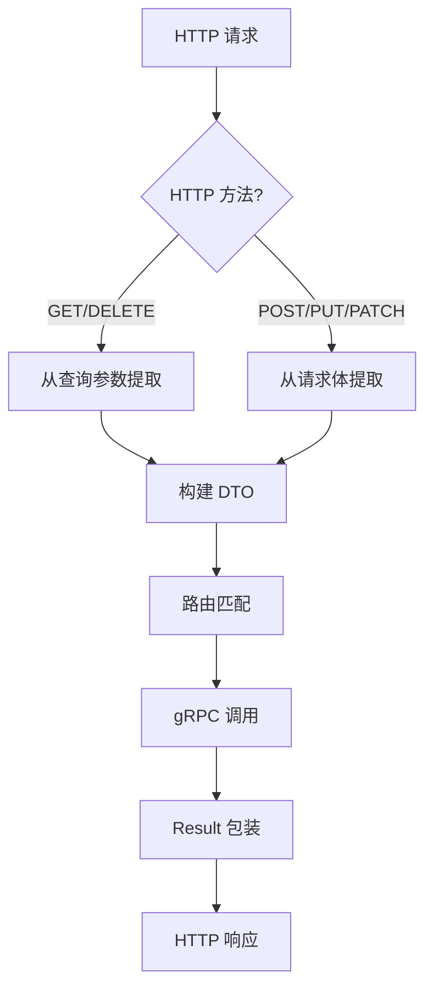

# Nebula Gateway Core

API网关核心模块，提供构建API网关的基础设施组件。

## 概述

nebula-gateway-core 是 Nebula 框架的网关核心模块，基于 Spring Cloud Gateway 构建，提供以下核心能力：

- **JWT认证** - 统一的Token验证和用户信息提取
- **请求日志** - 全局请求追踪、耗时统计、慢请求标记
- **gRPC桥接** - HTTP到gRPC的协议转换，支持多HTTP方法
- **智能参数提取** - 根据HTTP方法自动从不同来源提取参数
- **路径映射** - 支持 `/api/*` 到 `/rpc/*` 的自动路径转换
- **限流支持** - 多种限流策略（IP、用户、路径）

## 设计理念

### RPC 与 HTTP 解耦

Gateway 作为 **协议转换层**，负责将 HTTP 语义转换为 RPC 调用：

- **RPC 服务** 只关心 "调用什么方法"，不关心 HTTP 动词
- **Gateway** 负责处理 HTTP 语义（方法、参数、响应）
- `@RpcCall` 注解默认 `method = "*"`，接受所有 HTTP 方法

```
HTTP 语义层                    RPC 语义层
===========                    ===========
GET /users/1                   getUserById(1)
POST /users {"name":"test"}    createUser(dto)
PUT /users/1 {...}             updateUser(dto)
DELETE /users/1                deleteUser(1)
```

## 模块结构

```
nebula-gateway-core
  +-- config/
  |   +-- GatewayProperties.java         # 网关配置属性
  |   +-- GatewayRoutesAutoConfiguration # 路由自动配置
  |   +-- GatewayRedisAutoConfiguration  # Redis限流自动配置
  |   +-- RateLimitKeyResolverConfig     # 限流Key解析器
  +-- filter/
  |   +-- JwtAuthGatewayFilterFactory    # JWT认证过滤器
  |   +-- LoggingGlobalFilter            # 日志过滤器
  +-- grpc/
      +-- AbstractGrpcServiceRouter      # gRPC路由器抽象基类
      +-- AutoDiscoveryGrpcServiceRouter # 自动发现路由器（推荐）
      +-- GrpcClientAutoRegistrar        # gRPC客户端自动注册
      +-- GrpcGatewayFilter              # gRPC网关过滤器
      +-- GrpcGatewayFilterFactory       # gRPC过滤器工厂
```

## 组件说明

### 1. JwtAuthGatewayFilterFactory

JWT认证网关过滤器，用于验证请求中的JWT Token并提取用户信息。

特性：
- 支持白名单配置
- 自动将用户信息注入请求头
- 支持自定义Claims映射

路由配置使用：
```yaml
filters:
  - JwtAuth
```

### 2. LoggingGlobalFilter

全局日志过滤器，为每个请求生成唯一的RequestId，记录请求开始/结束日志。

特性：
- RequestId生成与追踪
- 请求耗时统计
- 慢请求标记

### 3. AutoDiscoveryGrpcServiceRouter（推荐）

自动发现 gRPC 服务路由器，根据 `@RpcClient` 接口自动注册路由。

**核心特性**：
- 自动扫描 `@RpcClient` 接口
- 支持多 HTTP 方法（`method = "*"` 时注册 GET/POST/PUT/DELETE/PATCH）
- 智能参数提取（根据 HTTP 方法选择参数来源）
- 自动路径映射（`/rpc/*` -> `/api/*`）
- Header 传递（自动将 `X-User-Id` 等注入到请求中）

**参数提取策略**：

```java
// GET/DELETE 请求：从查询参数构建 DTO
GET /api/v1/users?name=test&age=20
    -> UserQueryDto { name: "test", age: 20 }

// POST/PUT/PATCH 请求：从请求体解析 DTO  
POST /api/v1/users
Body: {"name": "test", "age": 20}
    -> UserCreateDto { name: "test", age: 20 }

// 路径变量：始终从 URL 提取
GET /api/v1/users/123
    -> @PathVariable("id") Long id = 123
```

**配置示例**：

```yaml
nebula:
  gateway:
    grpc:
      enabled: true
      auto-scan: true  # 启用自动扫描
      services:
        user-service:
          enabled: true
          address: "localhost:5001"
          api-packages:
            - "io.nebula.example.user.api"
      path-mapping:
        enabled: true
        rpc-prefix: "/rpc"
        api-prefix: "/api/v1"
      header-propagation:
        enabled: true
        user-id-header: "X-User-Id"
        user-id-field: "userId"
```

### 4. AbstractGrpcServiceRouter

gRPC服务路由器抽象基类，用于手动注册HTTP到gRPC的路由映射。

使用示例：
```java
@Component
public class MyGrpcServiceRouter extends AbstractGrpcServiceRouter {
    
    private final UserRpcClient userRpcClient;
    
    public MyGrpcServiceRouter(ObjectMapper objectMapper, UserRpcClient userRpcClient) {
        super(objectMapper);
        this.userRpcClient = userRpcClient;
    }
    
    @Override
    protected void registerRoutes() {
        // 支持多方法的路由
        registerRoute("*", "/api/v1/users/{id}", "user", "getUserById",
            (body, exchange) -> {
                Long userId = extractPathVariableLong(exchange, "id");
                return userRpcClient.getUserById(userId);
            });
            
        // 指定单一方法的路由
        registerRoute("POST", "/api/v1/users/login", "user", "login",
            (body, exchange) -> userRpcClient.login(parseBody(body, LoginDto.Request.class)));
    }
}
```

### 5. GrpcGatewayFilter

gRPC网关过滤器，将HTTP请求转换为gRPC调用。

路由配置使用：
```yaml
filters:
  - Grpc
```

**功能**：
- HTTP请求转gRPC调用
- 多HTTP方法支持（GET/POST/PUT/DELETE/PATCH）
- 智能参数提取
- 自动路由匹配
- 统一响应格式包装（Result 结构）

**处理流程**：



## 配置说明

完整配置示例：

```yaml
nebula:
  gateway:
    enabled: true
    
    # JWT配置
    jwt:
      enabled: true
      secret: your-secret-key-at-least-32-characters-long
      header: Authorization
      prefix: "Bearer "
      user-id-header: X-User-Id
      username-header: X-Username
      whitelist:
        - /api/v1/public/**
        - /api/v1/users/login
        - /api/v1/users/register
      claim-headers:
        - phone:X-User-Phone
        - role:X-User-Role
    
    # 日志配置
    logging:
      enabled: true
      request-id-header: X-Request-Id
      log-request-body: false
      log-response-body: false
      slow-request-threshold: 3000
    
    # 限流配置
    rate-limit:
      enabled: true
      strategy: ip  # ip, user, path
```

## 依赖

- Spring Cloud Gateway
- Jackson (JSON处理)
- JJWT (JWT验证)
- Spring Boot WebFlux

## 版本要求

- Java 21+
- Spring Boot 3.5+
- Spring Cloud 2025.0+

## 相关模块

- [nebula-starter-gateway](../../starter/nebula-starter-gateway) - Gateway启动器
- [nebula-rpc-grpc](../rpc/nebula-rpc-grpc) - gRPC RPC实现

