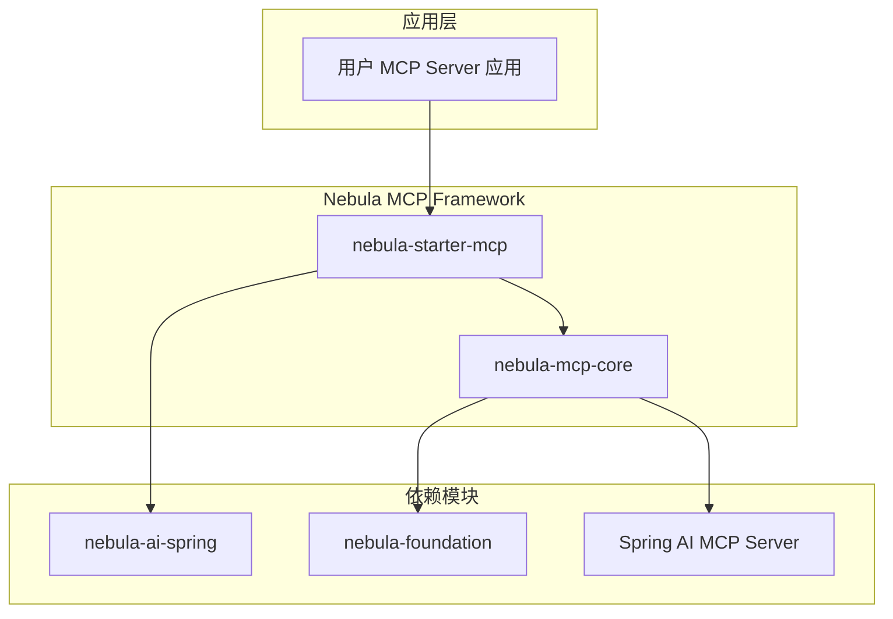

# Nebula MCP 框架设计文档

## 概述

Nebula MCP 框架从 `nebula-dev-assistant` 项目中抽取，提供构建 MCP (Model Context Protocol) Server 的通用基础设施。

## 设计目标

1. **可复用性** - 提供通用的 MCP Server 基础组件
2. **可扩展性** - 易于扩展和自定义
3. **开箱即用** - 基于 Spring Boot 自动配置

## 架构设计



## 模块说明

### nebula-mcp-core

核心模块，提供：
- `DocumentSearchService` - 文档搜索接口
- `DocumentIndexer` - 文档索引接口
- `McpProperties` - 配置属性
- `McpAutoConfiguration` - 自动配置

### nebula-starter-mcp

启动器模块，一站式依赖：
- 包含 MCP Core
- 包含 AI 能力（向量搜索）
- 包含 MCP Server 实现
- 自动配置所有组件

## 核心接口

### DocumentSearchService

```java
public interface DocumentSearchService {
    List<SearchResult> search(String query, int topK);
    List<SearchResult> search(String query, int topK, Map<String, String> filters);
}
```

### DocumentIndexer

```java
public interface DocumentIndexer {
    IndexResult indexDocument(Path filePath);
    List<IndexResult> indexDirectory(Path directory);
    boolean deleteDocument(String documentId);
    void clearAll();
    IndexStats getStats();
}
```

## 从 nebula-dev-assistant 迁移

### 迁移前

```xml
<!-- nebula-dev-assistant 原有依赖 -->
<dependency>
    <groupId>io.nebula</groupId>
    <artifactId>nebula-starter-ai</artifactId>
</dependency>
<dependency>
    <groupId>org.springframework.ai</groupId>
    <artifactId>spring-ai-starter-mcp-server-webmvc</artifactId>
</dependency>
```

### 迁移后

```xml
<!-- 使用 nebula-starter-mcp -->
<dependency>
    <groupId>io.nebula</groupId>
    <artifactId>nebula-starter-mcp</artifactId>
</dependency>
```

## 扩展指南

### 自定义搜索服务

```java
@Service
public class ChromaDocumentSearchService implements DocumentSearchService {
    
    private final VectorStoreService vectorStoreService;
    
    @Override
    public List<SearchResult> search(String query, int topK) {
        var results = vectorStoreService.search(query, topK);
        return results.stream()
                .map(r -> new SearchResult(r.getContent(), r.getScore(), r.getMetadata()))
                .toList();
    }
}
```

### 自定义索引器

```java
@Service  
public class MarkdownDocumentIndexer implements DocumentIndexer {
    
    private final VectorStoreService vectorStoreService;
    private final DocumentChunker chunker;
    
    @Override
    public IndexResult indexDocument(Path filePath) {
        // 1. 解析 Markdown
        String content = Files.readString(filePath);
        
        // 2. 分块
        List<Chunk> chunks = chunker.chunk(content);
        
        // 3. 索引到向量库
        vectorStoreService.add(chunks);
        
        return new IndexResult(...);
    }
}
```

## 最佳实践

### 1. 工具设计

- 参数简化（1-3 个）
- 描述清晰
- 返回完整内容

### 2. 性能优化

- 启用搜索缓存
- 批量索引
- 异步处理

### 3. 安全考虑

- API Key 认证
- 速率限制
- 输入验证

