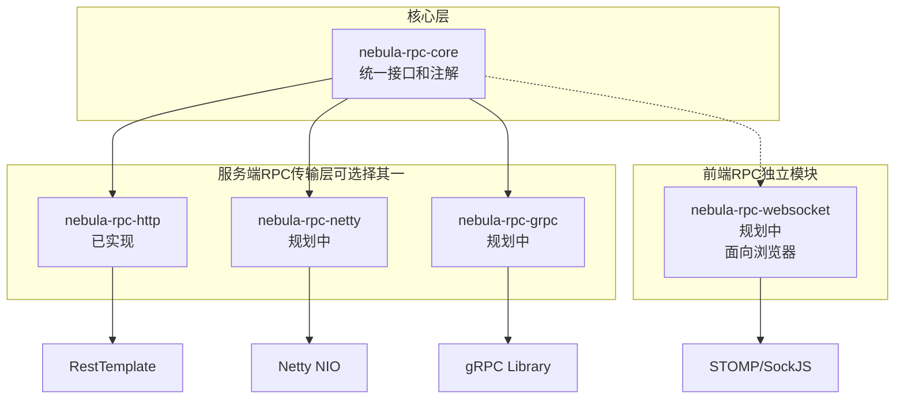
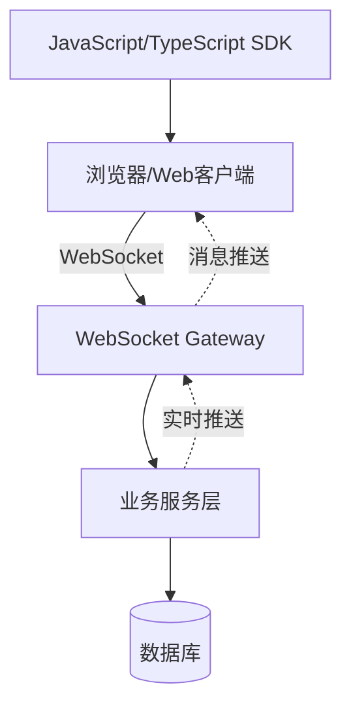
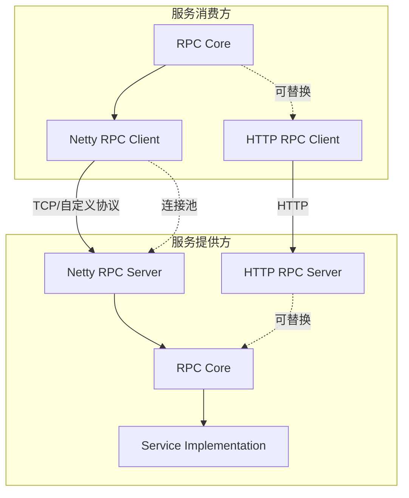
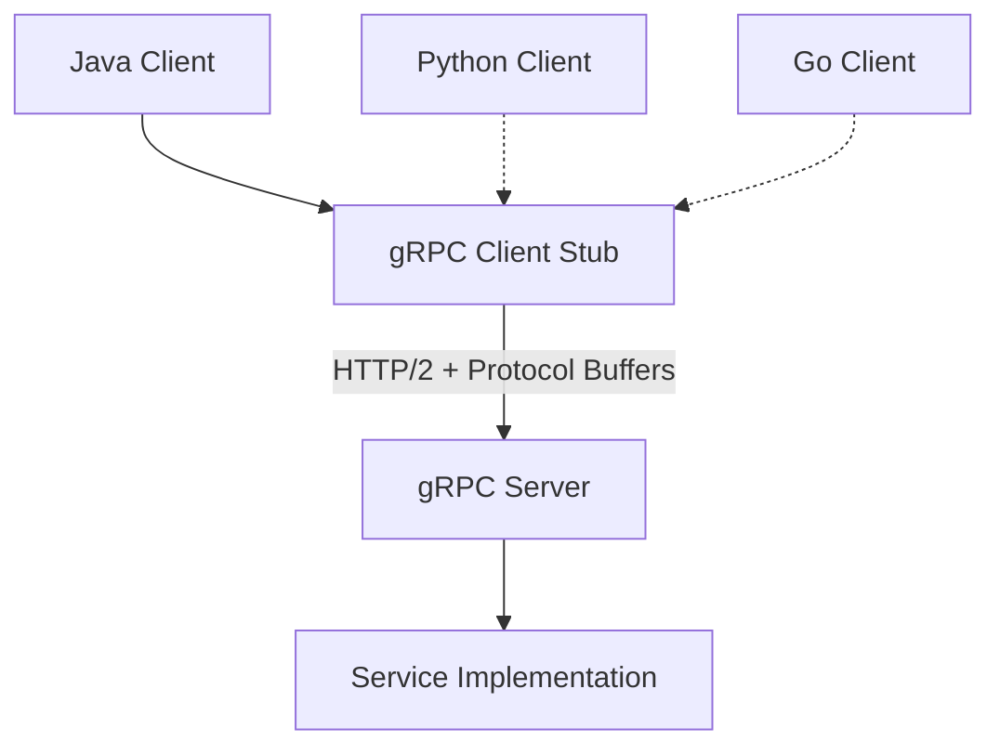

# Nebula RPC 扩展规划

## 概述

本文档规划了 Nebula RPC 模块的未来扩展方向，包括新协议支持、性能增强、功能扩展等。

## 模块定位说明

Nebula RPC 框架包含多个传输层实现,各有不同的定位和应用场景:

### 服务端到服务端(微服务间通信)
这些模块用于后端微服务之间的 RPC 调用,**彼此是平行替换关系**:

1. **nebula-rpc-http** (已实现)
   - 基于 HTTP/RestTemplate 的 RPC 实现
   - 适合中低并发场景(QPS < 5000)
   - 易于调试,兼容性好
   
2. **nebula-rpc-netty** (规划中)
   - 基于 Netty 的高性能 RPC 实现
   - 适合高并发场景(QPS > 10000)
   - 自定义协议,零拷贝传输
   
3. **nebula-rpc-grpc** (规划中)
   - 基于 gRPC 的 RPC 实现
   - 跨语言支持,流式传输
   - Protocol Buffers 序列化

### 前端到后端(客户端到服务器通信)
这些模块用于浏览器/移动端与服务器的通信,**与服务端 RPC 并行**:

1. **nebula-rpc-websocket** (规划中)
   - 面向 Web 客户端(JavaScript/TypeScript)的 WebSocket 接口
   - 支持双向实时通信
   - 主要用于浏览器推送、实时聊天等场景

## 当前架构



## 选型指南

### 服务端 RPC 选型(三选一)

| 场景 | 推荐模块 | 原因 |
|------|---------|------|
| 中小型项目,QPS < 5000 | `nebula-rpc-http` | 简单易用,调试方便,生态成熟 |
| 高并发项目,QPS > 10000 | `nebula-rpc-netty` | 高性能,低延迟,零拷贝 |
| 跨语言调用,需要流式传输 | `nebula-rpc-grpc` | 标准化协议,跨语言支持 |
| 遗留系统集成 | `nebula-rpc-http` | 兼容性最好,可与REST共存 |

### 前端 RPC 选型

| 场景 | 推荐模块 | 原因 |
|------|---------|------|
| 需要服务器主动推送 | `nebula-rpc-websocket` | 双向通信,实时性好 |
| 普通的前后端交互 | REST API(非RPC) | 标准化,工具链完善 |

### 模块组合示例

**示例1: 普通Web应用**
```
前端 → REST API → nebula-rpc-http → 其他微服务
```

**示例2: 实时应用**
```
前端 → WebSocket(nebula-rpc-websocket) → 服务器
服务器 → nebula-rpc-http → 其他微服务
```

**示例3: 高性能微服务**
```
前端 → REST API → 网关服务
网关服务 → nebula-rpc-netty → 后端微服务集群
```

## 扩展方向

### 1. WebSocket 支持

#### 目标
提供面向 Web 客户端(JavaScript/TypeScript)的 WebSocket RPC 接口，支持浏览器与服务端的双向通信和实时消息推送。

**定位**: 前后端通信协议，主要面向浏览器客户端，而非服务端到服务端的 RPC 通信。

#### 应用场景
- 实时聊天系统(Web端)
- 实时通知推送(浏览器推送)
- 在线协作工具(多人实时编辑)
- 实时数据监控(Dashboard实时更新)
- Web 游戏(实时交互)

#### 技术架构



**与服务端 RPC 的区别**:
- WebSocket RPC: 浏览器 ↔ 服务器(前后端通信)
- HTTP/Netty/gRPC RPC: 服务器 ↔ 服务器(微服务间通信)

#### 核心特性
- 双向通信支持
- 心跳检测和自动重连
- 消息确认机制
- 会话管理
- 广播和单播支持

#### 实现计划

**模块**: `nebula-rpc-websocket`

**依赖**:
```xml
<dependency>
    <groupId>org.springframework.boot</groupId>
    <artifactId>spring-boot-starter-websocket</artifactId>
</dependency>
```

**核心类**:
```java
// WebSocket RPC 客户端
public class WebSocketRpcClient implements RpcClient {
    private WebSocketSession session;
    private StompSessionHandler sessionHandler;
    
    @Override
    public <T> CompletableFuture<T> callAsync(Class<T> serviceClass, String methodName, Object... args) {
        // 通过 WebSocket 发送 RPC 请求
        return sendRequest(buildRequest(serviceClass, methodName, args));
    }
}

// WebSocket RPC 服务器
@Configuration
@EnableWebSocketMessageBroker
public class WebSocketRpcServer implements WebSocketMessageBrokerConfigurer {
    @Override
    public void configureMessageBroker(MessageBrokerRegistry registry) {
        registry.enableSimpleBroker("/topic", "/queue");
        registry.setApplicationDestinationPrefixes("/app");
    }
}
```

**配置示例**:
```yaml
nebula:
  rpc:
    websocket:
      enabled: true
      endpoint: /rpc-ws
      allowed-origins: ["*"]
      heartbeat-interval: 10000
      max-sessions: 10000
      max-message-size: 1048576  # 1MB
```

### 2. Netty RPC 传输层

#### 目标
基于 Netty 构建高性能 RPC 传输层实现，作为 HTTP 模块的平行替换选项，支持自定义协议和零拷贝传输。

**定位**: 服务端到服务端的高性能 RPC 通信，可完全替代 `nebula-rpc-http` 模块，共享相同的 RPC Core 接口和注解。

#### 应用场景
- 高并发微服务调用(QPS > 10000)
- 低延迟要求场景(延迟 < 5ms)
- 大数据量传输(单次传输 > 10MB)
- 长连接场景(连接复用)

#### 技术架构



**模块替换示例**:
```xml
<!-- 方案1: 使用 HTTP 传输层(适合中低并发) -->
<dependency>
    <groupId>io.nebula</groupId>
    <artifactId>nebula-rpc-http</artifactId>
</dependency>

<!-- 方案2: 使用 Netty 传输层(适合高并发) -->
<dependency>
    <groupId>io.nebula</groupId>
    <artifactId>nebula-rpc-netty</artifactId>
</dependency>
```

**注意**: 两个模块不能同时使用,需根据性能需求选择其一。

#### 核心特性
- 基于 Netty 的高性能网络 I/O
- 自定义二进制协议
- 零拷贝数据传输
- 连接池管理
- 请求管道化
- 流式传输支持

#### 实现计划

**模块**: `nebula-rpc-netty`

**依赖**:
```xml
<dependency>
    <groupId>io.netty</groupId>
    <artifactId>netty-all</artifactId>
    <version>4.1.108.Final</version>
</dependency>
```

**核心类**:
```java
// Netty RPC 客户端
public class NettyRpcClient implements RpcClient {
    private EventLoopGroup workerGroup;
    private Bootstrap bootstrap;
    private ChannelPool channelPool;
    
    @Override
    public <T> T call(Class<T> serviceClass, String methodName, Object... args) {
        // 从连接池获取 Channel
        Channel channel = channelPool.acquire().sync().get();
        try {
            // 发送请求并等待响应
            return sendAndWait(channel, buildRequest(serviceClass, methodName, args));
        } finally {
            channelPool.release(channel);
        }
    }
}

// Netty RPC 服务器
public class NettyRpcServer implements RpcServer {
    private EventLoopGroup bossGroup;
    private EventLoopGroup workerGroup;
    private ServerBootstrap bootstrap;
    
    @Override
    public void start(int port) {
        bootstrap.group(bossGroup, workerGroup)
            .channel(NioServerSocketChannel.class)
            .childHandler(new ChannelInitializer<SocketChannel>() {
                @Override
                protected void initChannel(SocketChannel ch) {
                    ch.pipeline()
                        .addLast(new RpcDecoder())
                        .addLast(new RpcEncoder())
                        .addLast(new RpcServerHandler());
                }
            })
            .bind(port).sync();
    }
}
```

**配置示例**:
```yaml
nebula:
  rpc:
    netty:
      enabled: true
      port: 9000
      boss-threads: 1
      worker-threads: 8
      max-frame-length: 10485760  # 10MB
      connection-pool:
        max-connections: 200
        max-connections-per-route: 50
        keep-alive-time: 60000
      performance:
        enable-zero-copy: true
        enable-pipeline: true
        send-buffer-size: 65536
        receive-buffer-size: 65536
```

#### 协议设计

```
+-------+--------+----------+----------+--------+
| Magic | Type   | ID       | Length   | Data   |
+-------+--------+----------+----------+--------+
| 2B    | 1B     | 8B       | 4B       | ...    |
+-------+--------+----------+----------+--------+

Magic: 0xCAFE (协议魔数)
Type: 0x01=Request, 0x02=Response, 0x03=Heartbeat
ID: 请求唯一标识
Length: 数据长度
Data: 序列化后的数据
```

### 3. gRPC 集成

#### 目标
集成 gRPC 协议，支持跨语言、高性能的 RPC 调用。

#### 应用场景
- 微服务间通信
- 跨语言服务调用
- 流式数据传输
- 移动端与服务端通信

#### 技术架构



#### 核心特性
- Protocol Buffers 序列化
- HTTP/2 传输
- 双向流式传输
- 负载均衡和服务发现
- 拦截器和中间件
- 跨语言支持

#### 实现计划

**模块**: `nebula-rpc-grpc`

**依赖**:
```xml
<dependency>
    <groupId>net.devh</groupId>
    <artifactId>grpc-spring-boot-starter</artifactId>
    <version>2.15.0.RELEASE</version>
</dependency>
```

**.proto 文件定义**:
```protobuf
syntax = "proto3";

package io.nebula.rpc.grpc;

option java_package = "io.nebula.rpc.grpc";
option java_outer_classname = "UserServiceProto";

service UserService {
  rpc GetUser(GetUserRequest) returns (GetUserResponse);
  rpc CreateUser(CreateUserRequest) returns (CreateUserResponse);
  rpc ListUsers(ListUsersRequest) returns (stream UserMessage);
}

message GetUserRequest {
  int64 id = 1;
}

message GetUserResponse {
  UserMessage user = 1;
}

message UserMessage {
  int64 id = 1;
  string username = 2;
  string name = 3;
  string email = 4;
}
```

**核心类**:
```java
// gRPC 服务实现
@GrpcService
public class UserGrpcService extends UserServiceGrpc.UserServiceImplBase {
    @Autowired
    private UserService userService;
    
    @Override
    public void getUser(GetUserRequest request, StreamObserver<GetUserResponse> responseObserver) {
        User user = userService.getUserById(request.getId());
        GetUserResponse response = buildResponse(user);
        responseObserver.onNext(response);
        responseObserver.onCompleted();
    }
}

// gRPC 客户端
@Component
public class UserGrpcClient {
    @GrpcClient("user-service")
    private UserServiceGrpc.UserServiceBlockingStub userServiceStub;
    
    public User getUser(Long id) {
        GetUserRequest request = GetUserRequest.newBuilder()
            .setId(id)
            .build();
        GetUserResponse response = userServiceStub.getUser(request);
        return convertToUser(response.getUser());
    }
}
```

**配置示例**:
```yaml
nebula:
  rpc:
    grpc:
      enabled: true
      server:
        port: 9090
        max-inbound-message-size: 10485760  # 10MB
        keep-alive-time: 30s
        keep-alive-timeout: 10s
        permit-keep-alive-without-calls: true
      client:
        user-service:
          address: static://localhost:9090
          negotiation-type: plaintext
          load-balancing-policy: round_robin
```

### 4. 其他扩展

#### 4.1 消息队列 RPC

基于消息队列（RabbitMQ/Kafka）的异步 RPC：

```yaml
nebula:
  rpc:
    mq:
      enabled: true
      type: rabbitmq
      request-queue: rpc-requests
      response-queue: rpc-responses
      timeout: 30000
```

#### 4.2 REST 增强

基于 Spring Cloud OpenFeign 的增强实现：

```java
@RpcClient(name = "user-service", fallback = UserServiceFallback.class)
@FeignClient(name = "user-service")
public interface UserRpcService {
    @RpcCall("/api/users/{id}")
    @GetMapping("/api/users/{id}")
    User getUserById(@PathVariable Long id);
}
```

#### 4.3 协议适配器

支持多协议混合使用：

```yaml
nebula:
  rpc:
    protocol-adapter:
      enabled: true
      protocols:
        - name: http
          weight: 50
        - name: grpc
          weight: 30
        - name: websocket
          weight: 20
      strategy: weighted-random
```

## 实施路线图

### 第一阶段（Q1 2025）
- ✅ HTTP RPC 基础实现
- ✅ 声明式注解支持
- ✅ 服务发现集成
- [ ] 性能优化和压测

### 第二阶段（Q2 2025）
- [ ] WebSocket RPC 实现
- [ ] Netty RPC 基础版本
- [ ] 性能监控和指标

### 第三阶段（Q3 2025）
- [ ] gRPC 集成
- [ ] Netty RPC 增强版本
- [ ] 流式传输支持

### 第四阶段（Q4 2025）
- [ ] 消息队列 RPC
- [ ] 协议适配器
- [ ] 完整的生态工具链

## 技术决策

### 序列化方案
- HTTP: JSON (Jackson)
- WebSocket: JSON/MessagePack
- Netty: Protocol Buffers/Hessian
- gRPC: Protocol Buffers

### 通信协议
- HTTP: HTTP/1.1, HTTP/2
- WebSocket: WebSocket
- Netty: 自定义二进制协议
- gRPC: HTTP/2 + Protocol Buffers

### 负载均衡
- Round Robin（轮询）
- Random（随机）
- Weighted（加权）
- Least Connections（最少连接）
- Consistent Hashing（一致性哈希）

## 性能目标

| 协议 | 延迟 | 吞吐量 | 并发数 |
|------|------|--------|--------|
| HTTP | < 10ms | 5000 QPS | 1000 |
| WebSocket | < 5ms | 10000 QPS | 10000 |
| Netty | < 2ms | 50000 QPS | 50000 |
| gRPC | < 3ms | 30000 QPS | 30000 |

## 贡献指南

欢迎社区贡献以下内容：
1. 新协议实现
2. 性能优化建议
3. 功能特性建议
4. 文档和示例
5. Bug 修复

## 参考资料

- [gRPC 官方文档](https://grpc.io/docs/)
- [Netty 用户指南](https://netty.io/wiki/user-guide.html)
- [WebSocket RFC 6455](https://tools.ietf.org/html/rfc6455)
- [Spring Cloud OpenFeign](https://spring.io/projects/spring-cloud-openfeign)

