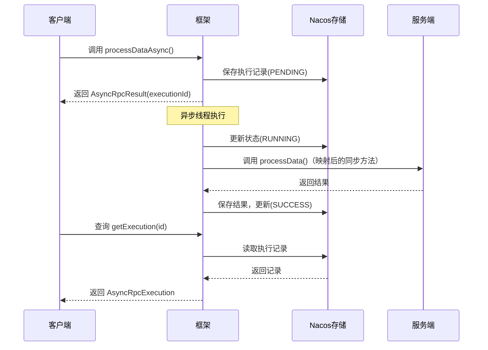

# Nebula RPC Async - 异步RPC执行框架

Nebula RPC 异步执行框架，提供声明式的异步RPC调用能力。

## 核心特性

- **@AsyncRpc注解** - 声明式标记异步方法
- **自动方法映射** - 异步方法自动映射到同步方法（服务端无需感知异步）
- **零配置存储** - 默认使用Nacos，复用已有连接
- **执行追踪** - 完整的执行状态和结果追踪
- **协议无关** - 同时支持HTTP和gRPC
- **多存储后端** - 支持Nacos/Redis/Database

## 快速开始

### 1. 添加依赖

```xml
<dependency>
    <groupId>io.nebula</groupId>
    <artifactId>nebula-rpc-async</artifactId>
</dependency>
```

### 2. 定义接口

**服务端接口（纯业务）：**

```java
// 服务端只需实现同步方法
public interface DataProcessService {
    ProcessResult processData(ProcessRequest request);
}
```

**客户端RPC接口（继承 + 异步增强）：**

```java
@RpcClient("data-service")
public interface DataProcessRpcClient extends DataProcessService {
    
    // 同步方法继承自 DataProcessService
    
    // 异步方法：框架自动映射到 processData()
    @AsyncRpc(timeout = 600)  // 10分钟超时
    AsyncRpcResult<ProcessResult> processDataAsync(ProcessRequest request);
}
```

**服务端实现：**

```java
@RpcService(DataProcessRpcClient.class)
public class DataProcessServiceImpl implements DataProcessService {
    
    @Override
    public ProcessResult processData(ProcessRequest request) {
        // 只需实现同步逻辑，异步包装由框架处理
        return doProcess(request);
    }
}
```

### 3. 调用异步方法

```java
@Service
@RequiredArgsConstructor
public class TaskService {
    
    private final DataProcessRpcClient dataProcessRpcClient;
    private final AsyncRpcExecutionManager executionManager;
    
    public String submitTask(ProcessRequest request) {
        // 提交异步执行，立即返回
        AsyncRpcResult<ProcessResult> result = 
            dataProcessRpcClient.processDataAsync(request);
        
        // 返回执行ID给调用方
        return result.getExecutionId();
    }
    
    public ProcessResult getResult(String executionId) {
        // 查询执行状态
        AsyncRpcExecution execution = executionManager.getExecution(executionId);
        
        if (execution == null) {
            return null; // 不存在
        }
        
        if (execution.getStatus() == ExecutionStatus.SUCCESS) {
            // 反序列化结果
            return objectMapper.readValue(
                execution.getResult(), ProcessResult.class);
        }
        
        return null; // 未完成或失败
    }
}
```

## 方法映射规则

框架支持自动将异步方法映射到同步方法：

| 客户端异步方法 | 服务端同步方法 |
|---------------|---------------|
| `processDataAsync()` | `processData()` |
| `batchProcessAsync()` | `batchProcess()` |
| `xxxAsync()` | `xxx()` |

**规则**：如果方法名以 `Async` 结尾，框架会自动查找去掉后缀的同步方法。

## 执行流程



## 配置

### 零配置模式（推荐）

使用Nacos存储，无需任何额外配置：

```yaml
# 只需要已有的Nacos配置即可
nebula:
  discovery:
    nacos:
      server-addr: localhost:8848
      
  rpc:
    async:
      enabled: true  # 默认使用Nacos存储
```

### 完整配置

```yaml
nebula:
  rpc:
    async:
      enabled: true
      
      # 存储配置
      storage:
        type: nacos  # nacos(默认) / redis / database
        
      # 执行器配置
      executor:
        core-pool-size: 10
        max-pool-size: 50
        queue-capacity: 200
        
      # 清理策略
      cleanup:
        enabled: true
        retention-days: 7
```

## 存储方案

### Nacos（默认/推荐）

✅ 零配置 - 复用已有连接  
✅ 分布式 - 集群高可用  
✅ 简单 - 无需额外部署

### Redis（高性能）

```yaml
nebula.rpc.async.storage:
  type: redis
  redis:
    host: localhost
    port: 6379
```

### Database（持久化）

```yaml
nebula.rpc.async.storage:
  type: database
  # 使用项目已有数据源
```

## 架构设计

```
业务代码
  ↓
@AsyncRpc 注解检测 (RpcClientFactoryBean)
  ↓  
AsyncRpcExecutionManager
  ↓
协议层 (HttpRpcClient / GrpcRpcClient)
  ↓
网络传输
```

## 执行状态说明

| 状态 | 说明 |
|------|------|
| `PENDING` | 已提交，等待执行 |
| `RUNNING` | 正在执行 |
| `SUCCESS` | 执行成功 |
| `FAILED` | 执行失败 |
| `CANCELLED` | 已取消 |
| `TIMEOUT` | 超时 |

## 注意事项

1. **Nacos 依赖**：异步存储默认使用 Nacos，需确保 Nacos 已启动并配置
2. **超时设置**：`@AsyncRpc(timeout = 600)` 指定超时秒数（0表示不限制）
3. **方法命名**：异步方法名建议以 `Async` 结尾，框架自动映射到同步方法
4. **结果获取**：通过 `executionId` 轮询查询结果
5. **序列化**：结果以 JSON 格式存储

## 更多信息

- [设计文档](./docs/DESIGN.md)
- [API文档](./docs/API.md)
- [示例项目](../../../nebula-example/nebula-rpc-async/) - 完整的客户端和服务端示例
