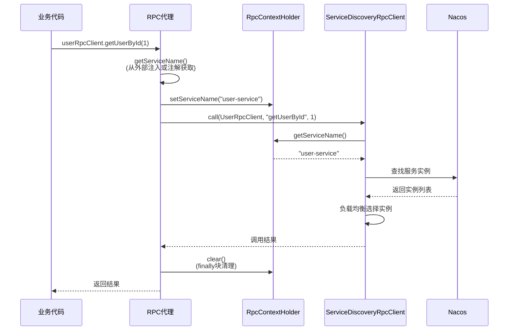

# Nebula RPC Core

Nebula RPC 框架的核心模块，提供零配置、声明式的远程过程调用能力。

## 🎯 核心特性

### 零配置 RPC（Nebula 2.0 重大创新）

```java
// API 配置（仅3行）
@AutoConfiguration
@EnableRpcClients("nebula-example-user-service")
public class UserApiAutoConfiguration {
}

// RPC 客户端（零配置）
@RpcClient
public interface UserRpcClient {
    UserDto getUserById(Long id);
}

// 服务实现（零配置）
@RpcService
@RequiredArgsConstructor
public class OrderServiceImpl {
    private final UserRpcClient userRpcClient;  // 无需 @Qualifier
}
```

### 主要优势

- ✅ **极致简化**：从18个注解减少到3个（减少83%）
- ✅ **零配置**：无需指定服务名、Bean名称
- ✅ **自动推导**：服务名、Bean名称、接口类全自动
- ✅ **类型安全**：编译时类型检查
- ✅ **向后兼容**：完全兼容旧版本代码

## 📦 核心组件

### 1. `@RpcClient` - RPC 客户端注解

标记 RPC 客户端接口，无需任何参数。

```java
@RpcClient
public interface UserRpcClient {
    // 方法签名即是RPC契约
    CreateUserDto.Response createUser(CreateUserDto.Request request);
    GetUserDto.Response getUserById(Long id);
}
```

**特性**：
- 零配置：无需指定 `value`、`contextId`
- 自动推导 Bean 名称：`UserRpcClient` → `userRpcClient`
- 支持所有 Java 接口特性

### 2. `@RpcService` - RPC 服务注解

标记 RPC 服务实现，自动注册到 HTTP/gRPC 服务器。

```java
@RpcService  // 无需指定接口类
@RequiredArgsConstructor
public class UserRpcClientImpl implements UserRpcClient {
    
    @Override
    public CreateUserDto.Response createUser(CreateUserDto.Request request) {
        // 实现逻辑
    }
}
```

**特性**：
- 自动推导实现的接口（必须标注 `@RpcClient`）
- 自动注册到 HTTP 和 gRPC 服务器
- 支持多协议（HTTP、gRPC）

### 3. `@EnableRpcClients` - 启用 RPC 客户端扫描

在 API 模块的自动配置类上使用，启用 RPC 客户端自动发现。

```java
@AutoConfiguration
@EnableRpcClients("nebula-example-user-service")  // 默认服务名
public class UserApiAutoConfiguration {
}
```

**参数说明**：
- `value`: 默认服务名（用于服务发现）
- `basePackages`: 扫描的包路径（可选，默认为当前包及子包）

**工作原理**：
1. 扫描当前包及子包下的所有 `@RpcClient` 接口
2. 为每个接口创建 `RpcClientFactoryBean`
3. 注入默认服务名（用于服务发现）
4. 注册为 Spring Bean（Bean名称为接口简单名首字母小写）

## 🏗️ 核心架构

### 整体架构

```mermaid
flowchart TD
    subgraph API模块
        A[@EnableRpcClients] -->|扫描| B[RpcClientScannerRegistrar]
        B -->|发现| C[@RpcClient 接口]
        C -->|创建| D[RpcClientFactoryBean]
    end
    
    subgraph 客户端
        D -->|生成| E[动态代理]
        E -->|设置服务名| F[RpcContextHolder<br/>ThreadLocal]
        F -->|调用| G[ServiceDiscoveryRpcClient]
        G -->|查找| H[Nacos 服务发现]
    end
    
    subgraph 服务端
        I[@RpcService] -->|扫描| J[RpcServiceRegistrationProcessor]
        J -->|注册| K[HttpRpcServer / GrpcRpcServer]
        K -->|处理请求| L[服务实现]
    end
    
    H -->|路由| K
```

### 服务名传递机制（ThreadLocal）

为了让 `ServiceDiscoveryRpcClient` 能够获取外部注入的服务名，使用 ThreadLocal 在调用链中传递：



**关键类**：

```java
public class RpcContextHolder {
    private static final ThreadLocal<String> SERVICE_NAME_HOLDER = new ThreadLocal<>();
    
    public static void setServiceName(String serviceName);
    public static String getServiceName();
    public static void clear();  // 防止内存泄漏
}
```

### RpcClientFactoryBean 工作流程

```java
public class RpcClientFactoryBean implements FactoryBean<Object> {
    
    private Class<?> type;          // RPC接口类
    private String name;            // 外部注入的服务名
    
    @Override
    public Object getObject() {
        // 创建动态代理
        return Proxy.newProxyInstance(
            type.getClassLoader(),
            new Class<?>[]{type},
            new RpcInvocationHandler(type, annotation)
        );
    }
    
    private class RpcInvocationHandler implements InvocationHandler {
        @Override
        public Object invoke(Object proxy, Method method, Object[] args) {
            // 1. 获取服务名（优先使用外部注入的name）
            String serviceName = getServiceName();
            
            // 2. 设置到ThreadLocal
            try {
                RpcContextHolder.setServiceName(serviceName);
                
                // 3. 执行RPC调用
                return client.call(interfaceClass, method.getName(), args);
            } finally {
                // 4. 清理ThreadLocal（防止内存泄漏）
                RpcContextHolder.clear();
            }
        }
        
        private String getServiceName() {
            // 优先级：外部注入 > 注解name > 注解value > 接口全限定名
            if (StringUtils.hasText(RpcClientFactoryBean.this.name)) {
                return RpcClientFactoryBean.this.name;
            }
            // ... 其他逻辑
        }
    }
}
```

## 🔄 完整的调用链路

### 客户端调用流程

1. **编译时**：
   - `@EnableRpcClients` 触发 `RpcClientScannerRegistrar`
   - 扫描并注册所有 `@RpcClient` 接口

2. **启动时**：
   - Spring 创建 `RpcClientFactoryBean` 实例
   - 注入默认服务名（如 `"nebula-example-user-service"`）
   - 生成动态代理对象

3. **运行时**：
   - 调用接口方法 → 动态代理拦截
   - 获取服务名 → 设置到 ThreadLocal
   - 执行 RPC 调用 → 服务发现 → 负载均衡
   - 清理 ThreadLocal → 返回结果

### 服务端注册流程

1. **编译时**：
   - `@RpcService` 标记服务实现

2. **启动时**：
   - `RpcServiceRegistrationProcessor` 扫描 `@RpcService` Bean
   - 自动推导实现的 RPC 接口（查找标注 `@RpcClient` 的接口）
   - 注册到 `HttpRpcServer` 和 `GrpcRpcServer`

3. **运行时**：
   - HTTP/gRPC 服务器接收请求
   - 根据服务名和方法名查找服务实现
   - 反射调用方法 → 返回结果

## 📋 使用示例

### 完整示例：Order Service 调用 User Service

#### 1. User API 模块（nebula-example-user-api）

**RPC 客户端接口**：
```java
package io.nebula.example.api.rpc;

@RpcClient
public interface UserRpcClient {
    CreateUserDto.Response createUser(CreateUserDto.Request request);
    GetUserDto.Response getUserById(Long id);
}

@RpcClient
public interface AuthRpcClient {
    AuthDto.Response auth(AuthDto.Request request);
}
```

**自动配置**：
```java
package io.nebula.example.api;

@AutoConfiguration
@EnableRpcClients("nebula-example-user-service")  // 目标服务名
public class UserApiAutoConfiguration {
}
```

**注册到 Spring Boot**（`META-INF/spring/org.springframework.boot.autoconfigure.AutoConfiguration.imports`）：
```
io.nebula.example.api.UserApiAutoConfiguration
```

#### 2. User Service 模块（nebula-example-user-service）

**RPC 服务实现**：
```java
package io.nebula.example.service.rpc;

@RpcService  // 无需指定接口类，自动推导
@RequiredArgsConstructor
public class UserRpcClientImpl implements UserRpcClient {
    
    private final UserService userService;
    
    @Override
    public CreateUserDto.Response createUser(CreateUserDto.Request request) {
        User user = userService.create(request);
        return CreateUserDto.Response.builder()
                .id(user.getId())
                .build();
    }
    
    @Override
    public GetUserDto.Response getUserById(Long id) {
        User user = userService.getById(id);
        return GetUserDto.Response.builder()
                .user(convertToVo(user))
                .build();
    }
}
```

**应用主类**：
```java
@SpringBootApplication  // 无需 @EnableRpcClients
public class UserServiceApplication {
    public static void main(String[] args) {
        SpringApplication.run(UserServiceApplication.class, args);
    }
}
```

#### 3. Order Service 模块（nebula-example-order-service）

**依赖 User API**：
```xml
<dependency>
    <groupId>io.nebula</groupId>
    <artifactId>nebula-example-user-api</artifactId>
</dependency>
```

**使用 RPC 客户端**：
```java
package io.nebula.example.order.service.rpc;

@RpcService  // 无需指定接口类
@RequiredArgsConstructor
public class OrderRpcClientImpl implements OrderRpcClient {
    
    // ✅ 无需 @Qualifier，直接注入
    private final UserRpcClient userRpcClient;
    private final AuthRpcClient authRpcClient;
    
    @Override
    public CreateOrderDto.Response createOrder(CreateOrderDto.Request request) {
        // 1. 认证
        AuthDto.Response authResponse = authRpcClient.auth(...);
        
        // 2. 获取用户信息
        GetUserDto.Response userResponse = userRpcClient.getUserById(request.getUserId());
        
        // 3. 创建订单
        // ...
    }
}
```

## 🎓 设计原理

### 1. 约定优于配置

**约定**：
- RPC 客户端接口必须标注 `@RpcClient`
- RPC 服务实现必须标注 `@RpcService`
- API 模块必须提供自动配置类
- 服务名遵循命名约定：`{project}-service`

**优势**：
- 减少配置代码量
- 统一的编码风格
- 降低学习成本

### 2. 自动推导机制

#### Bean 名称推导

```java
// 接口简单名首字母小写
UserRpcClient → userRpcClient
AuthRpcClient → authRpcClient
```

#### 服务接口推导

```java
// 查找实现类实现的标注 @RpcClient 的接口
@RpcService
public class UserRpcClientImpl implements UserRpcClient {
    // 自动推导出 UserRpcClient 接口
}
```

#### 服务名推导

```java
// 从 @EnableRpcClients 的 value 获取
@EnableRpcClients("nebula-example-user-service")
// → 所有客户端默认使用此服务名
```

### 3. Spring Boot 自动配置集成

利用 Spring Boot 的自动配置机制，在 API 模块中自动注册 RPC 客户端：

```
API 模块
└── src/main/resources/META-INF/spring/
    └── org.springframework.boot.autoconfigure.AutoConfiguration.imports
        └── io.nebula.example.api.UserApiAutoConfiguration
```

**效果**：
- 依赖 API 模块 → 自动扫描 RPC 客户端
- 无需在主应用类添加 `@EnableRpcClients`
- 完全零配置

## 🔧 高级特性

### 1. 服务名覆盖

如果需要为特定客户端指定不同的服务名：

```java
@RpcClient("special-service")  // 覆盖默认服务名
public interface SpecialRpcClient {
}
```

### 2. 自定义 Bean 名称

如果需要自定义 Bean 名称：

```java
@RpcClient(contextId = "myCustomClient")  // 自定义 Bean 名称
public interface UserRpcClient {
}

// 注入时使用自定义名称
@Qualifier("myCustomClient")
private final UserRpcClient userRpcClient;
```

### 3. 多服务调用

一个应用可以调用多个服务：

```java
// 依赖多个 API 模块
<dependency>
    <groupId>io.nebula</groupId>
    <artifactId>nebula-example-user-api</artifactId>
</dependency>
<dependency>
    <groupId>io.nebula</groupId>
    <artifactId>nebula-example-order-api</artifactId>
</dependency>
```

每个 API 模块都有自己的自动配置类，互不干扰。

### 4. 异步调用场景

在异步调用时，需要手动传递 ThreadLocal 上下文：

```java
String serviceName = RpcContextHolder.getServiceName();

CompletableFuture.runAsync(() -> {
    try {
        RpcContextHolder.setServiceName(serviceName);  // 传递上下文
        // 执行异步 RPC 调用
    } finally {
        RpcContextHolder.clear();  // 清理
    }
});
```

## ⚠️ 注意事项

### 1. 内存泄漏风险

ThreadLocal 必须正确清理，否则可能导致内存泄漏：

```java
// ✅ 正确：使用 finally 清理
try {
    RpcContextHolder.setServiceName(serviceName);
    return rpcCall();
} finally {
    RpcContextHolder.clear();
}

// ❌ 错误：异常时不会清理
RpcContextHolder.setServiceName(serviceName);
return rpcCall();
RpcContextHolder.clear();
```

### 2. 线程池场景

线程池复用线程时，ThreadLocal 可能残留旧值。框架已在 `finally` 块中自动清理，无需担心。

### 3. 接口约定

RPC 服务接口必须遵循约定：
- 使用 DTO 模式（Request/Response）
- DTO 必须可序列化（支持 JSON）
- 方法签名在客户端和服务端必须一致

## 📊 向后兼容性

完全兼容旧版本代码：

```java
// ✅ 旧版本代码仍然有效
@RpcClient(value = "user-service", contextId = "userRpcClient")
public interface UserRpcClient {
    @RpcCall(value = "/rpc/users", method = "POST")
    UserDto createUser(@RequestBody CreateUserDto.Request request);
}

@EnableRpcClients(basePackageClasses = {UserRpcClient.class})
public class OrderServiceApplication {
}

@RpcService(UserRpcClient.class)
public class UserRpcClientImpl implements UserRpcClient {
}

@Qualifier("userRpcClient")
private final UserRpcClient userRpcClient;
```

新旧代码可以共存，逐步迁移。

## 📚 相关文档

- [HTTP RPC 实现](../nebula-rpc-http/)
- [gRPC RPC 实现](../nebula-rpc-grpc/)
- [RPC 优化汇总](../../../docs/rpc/RPC_ALL_OPTIMIZATIONS_COMPLETED.md)
- [EnableRpcClients 增强](../../../docs/rpc/RPC_ENABLE_CLIENTS_VALUE_ENHANCEMENT.md)

## 🎉 总结

Nebula RPC Core 2.0 实现了：

1. ✅ **零配置**：3 行代码完成 API 配置
2. ✅ **自动推导**：服务名、Bean 名称、接口类全自动
3. ✅ **类型安全**：编译时类型检查
4. ✅ **高性能**：ThreadLocal 传递，零性能损耗
5. ✅ **向后兼容**：完全兼容旧版本代码

**这是一次完美的框架设计！** 🎉

