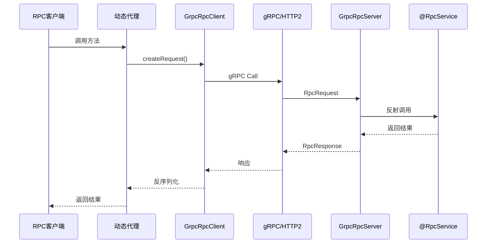

# Nebula RPC gRPC

基于 gRPC 的高性能 RPC 实现模块

## 功能特性

-  基于 Protocol Buffers 序列化
-  HTTP/2 传输协议
-  通用 RPC 调用接口
-  Spring Boot 自动配置
-  与 `@RpcService` 注解无缝集成
-  支持连接复用和流式传输
-  高性能(QPS > 10000)
-  低延迟(< 5ms)

## 快速开始

### 1. 添加依赖

```xml
<dependency>
    <groupId>io.nebula</groupId>
    <artifactId>nebula-rpc-grpc</artifactId>
</dependency>
```

### 2. 配置 gRPC

```yaml
nebula:
  rpc:
    grpc:
      enabled: true
      # 服务器配置
      server:
        enabled: true
        port: 9090
        max-inbound-message-size: 10485760  # 10MB
        keep-alive-time: 30
        keep-alive-timeout: 10
        permit-keep-alive-without-calls: true
        max-concurrent-calls: 1000
      # 客户端配置
      client:
        enabled: true
        target: localhost:9090
        negotiation-type: plaintext
        load-balancing-policy: round_robin
        max-inbound-message-size: 10485760  # 10MB
        connect-timeout: 30000
        request-timeout: 60000
        retry-count: 3
        retry-interval: 1000
```

### 3. 定义 RPC 服务接口

```java
@RpcClient(value = "nebula-example", contextId = "userRpcClient")
public interface UserRpcService {
    
    // method 默认为 "*"，Gateway 支持 GET/POST/PUT/DELETE/PATCH
    @RpcCall("/rpc/users/{id}")
    GetUserDto.Response getUserById(@PathVariable("id") Long id);
    
    // 也可以指定特定 HTTP 方法
    @RpcCall(value = "/rpc/users", method = "POST")
    CreateUserDto.Response createUser(@RequestBody CreateUserDto.Request request);
}
```

**设计说明**：
- `@RpcCall` 的 `method` 默认为 `"*"`，表示接受所有 HTTP 方法
- RPC 服务只关心 "调用什么方法"，不关心 HTTP 语义
- Gateway 负责 HTTP 语义处理和参数提取

### 4. 实现 RPC 服务

```java
@Service
@RpcService  // 同时支持 HTTP 和 gRPC
public class UserRpcServiceImpl implements UserRpcService {
    
    @Autowired
    private UserService userService;
    
    @Override
    public CreateUserDto.Response createUser(CreateUserDto.Request request) {
        // 实现逻辑
        User user = userService.create(request);
        return CreateUserDto.Response.builder()
                .success(true)
                .user(convertToVo(user))
                .build();
    }
    
    @Override
    public GetUserDto.Response getUserById(Long id) {
        User user = userService.getById(id);
        return GetUserDto.Response.builder()
                .success(true)
                .user(convertToVo(user))
                .build();
    }
}
```

### 5. 使用 RPC 客户端

#### 方式 1: 直接注入(推荐)

```java
@RestController
@RequestMapping("/grpc-client")
public class GrpcClientDemoController {
    
    @Autowired
    @Qualifier("userRpcClient")  // 使用 contextId
    private UserRpcService userRpcService;
    
    @PostMapping("/users")
    public CreateUserDto.Response createUser(@RequestBody CreateUserDto.Request request) {
        return userRpcService.createUser(request);
    }
}
```

#### 方式 2: 手动创建代理

```java
@Autowired
private GrpcRpcClient grpcRpcClient;

UserRpcService userRpcService = grpcRpcClient.createProxy(UserRpcService.class);
CreateUserDto.Response response = userRpcService.createUser(request);
```

## 设计架构

### 整体架构

```mermaid
graph TB
    subgraph 客户端应用
        A[UserRpcService<br/>接口] --> B[@RpcClient注解]
        B --> C[RpcClientFactoryBean]
        C --> D[GrpcRpcClient]
    end
    
    subgraph 网络传输
        D -->|gRPC/HTTP2| E[Protocol Buffers]
        E -->|序列化| F[RpcRequest]
        F -->|网络传输| G[RpcResponse]
        G -->|反序列化| E
    end
    
    subgraph 服务端应用
        H[GrpcRpcServer] --> I[@RpcService扫描]
        I --> J[UserRpcServiceImpl]
        J --> K[业务逻辑]
    end
    
    E -->|HTTP/2| H
```

### 通信协议

使用 Protocol Buffers 定义通用 RPC 消息:

```protobuf
message RpcRequest {
  string request_id = 1;
  string service_name = 2;
  string method_name = 3;
  repeated string parameter_types = 4;
  repeated string parameters = 5;  // JSON序列化
  map<string, string> metadata = 6;
  int64 timestamp = 7;
}

message RpcResponse {
  string request_id = 1;
  bool success = 2;
  string result = 3;  // JSON序列化
  string error_code = 4;
  string error_message = 5;
  map<string, string> metadata = 7;
  int64 timestamp = 8;
}
```

### 调用流程



## 配置详解

### 服务器配置

| 配置项 | 类型 | 默认值 | 说明 |
|-------|------|--------|------|
| `nebula.rpc.grpc.server.enabled` | Boolean | `true` | 是否启用服务器 |
| `nebula.rpc.grpc.server.port` | Integer | `9090` | 服务器端口 |
| `nebula.rpc.grpc.server.max-inbound-message-size` | Integer | `10485760` | 最大入站消息大小(10MB) |
| `nebula.rpc.grpc.server.keep-alive-time` | Long | `30` | Keep-Alive 时间(秒) |
| `nebula.rpc.grpc.server.keep-alive-timeout` | Long | `10` | Keep-Alive 超时(秒) |
| `nebula.rpc.grpc.server.permit-keep-alive-without-calls` | Boolean | `true` | 允许无调用时 Keep-Alive |
| `nebula.rpc.grpc.server.max-concurrent-calls` | Integer | `1000` | 最大并发调用数 |

### 客户端配置

| 配置项 | 类型 | 默认值 | 说明 |
|-------|------|--------|------|
| `nebula.rpc.grpc.client.enabled` | Boolean | `true` | 是否启用客户端 |
| `nebula.rpc.grpc.client.target` | String | `localhost:9090` | 目标地址 |
| `nebula.rpc.grpc.client.negotiation-type` | String | `plaintext` | 协商类型(plaintext/tls) |
| `nebula.rpc.grpc.client.load-balancing-policy` | String | `round_robin` | 负载均衡策略 |
| `nebula.rpc.grpc.client.max-inbound-message-size` | Integer | `10485760` | 最大入站消息大小(10MB) |
| `nebula.rpc.grpc.client.connect-timeout` | Long | `30000` | 连接超时(毫秒) |
| `nebula.rpc.grpc.client.request-timeout` | Long | `60000` | 请求超时(毫秒) |
| `nebula.rpc.grpc.client.retry-count` | Integer | `3` | 重试次数 |
| `nebula.rpc.grpc.client.retry-interval` | Long | `1000` | 重试间隔(毫秒) |
| `nebula.rpc.grpc.client.compression-enabled` | Boolean | `false` | 是否启用压缩 |
| `nebula.rpc.grpc.client.logging-enabled` | Boolean | `true` | 是否启用日志 |

## 与 HTTP RPC 对比

| 特性 | gRPC RPC | HTTP RPC |
|------|----------|----------|
| 协议 | HTTP/2 + Protobuf | HTTP/1.1 + JSON |
| 性能 | 高(QPS > 10000) | 中(QPS < 5000) |
| 延迟 | 低(< 5ms) | 中(< 10ms) |
| 序列化 | Protocol Buffers | JSON |
| 流式传输 | 支持 | 不支持 |
| 浏览器支持 | 需要 gRPC-Web | 原生支持 |
| 调试工具 | gRPCurl, Postman | curl, Postman |
| 学习曲线 | 陡峭 | 平缓 |
| 适用场景 | 高并发微服务 | 中低并发微服务 |

## 性能优化

### 1. 连接复用

gRPC 默认使用连接池,自动复用连接:

```yaml
nebula:
  rpc:
    grpc:
      client:
        load-balancing-policy: round_robin  # 负载均衡
```

### 2. 消息压缩

启用 gzip 压缩(适合大消息):

```yaml
nebula:
  rpc:
    grpc:
      client:
        compression-enabled: true
```

### 3. 并发控制

限制服务器并发调用数:

```yaml
nebula:
  rpc:
    grpc:
      server:
        max-concurrent-calls: 1000
```

### 4. 消息大小限制

根据实际需求调整消息大小限制:

```yaml
nebula:
  rpc:
    grpc:
      server:
        max-inbound-message-size: 52428800  # 50MB
      client:
        max-inbound-message-size: 52428800  # 50MB
```

## 故障排查

### 1. 连接失败

**症状**: `UNAVAILABLE: io exception`

**可能原因**:
- 服务器未启动
- 端口被占用
- 防火墙拦截

**解决方案**:
```bash
# 检查端口
lsof -i :9090

# 检查服务器日志
tail -f logs/application.log | grep "gRPC"
```

### 2. 方法未找到

**症状**: `方法未找到: methodName`

**可能原因**:
- 服务未注册
- `@RpcService` 注解缺失
- 方法签名不匹配

**解决方案**:
- 确保实现类添加了 `@RpcService` 注解
- 检查方法名和参数类型是否一致

### 3. 序列化失败

**症状**: `Cannot deserialize`

**可能原因**:
- DTO 缺少 `@NoArgsConstructor`
- JSON 格式不兼容

**解决方案**:
- 确保 DTO 使用 Lombok 的 `@Data`, `@Builder`, `@NoArgsConstructor`, `@AllArgsConstructor`

## 最佳实践

### 1. DTO 设计

```java
@Data
@Builder
@NoArgsConstructor
@AllArgsConstructor
public class CreateUserDto {
    
    @Data
    @Builder
    @NoArgsConstructor
    @AllArgsConstructor
    public static class Request {
        @NotBlank(message = "用户名不能为空")
        private String username;
        
        @NotBlank(message = "姓名不能为空")
        private String name;
    }
    
    @Data
    @Builder
    @NoArgsConstructor
    @AllArgsConstructor
    public static class Response {
        private Boolean success;
        private UserVo user;
    }
}
```

### 2. 错误处理

```java
try {
    response = userRpcService.createUser(request);
} catch (Exception e) {
    log.error("gRPC调用失败", e);
    // 降级处理
    return fallbackResponse();
}
```

### 3. 超时设置

根据业务场景设置合理的超时时间:

```yaml
nebula:
  rpc:
    grpc:
      client:
        request-timeout: 10000  # 10秒
        connect-timeout: 5000   # 5秒
```

## 高级特性

### 1. 流式传输

gRPC 支持四种流式模式(需自定义 proto):

- 一元调用(Unary)
- 服务器流式(Server Streaming)
- 客户端流式(Client Streaming)
- 双向流式(Bidirectional Streaming)

### 2. 拦截器

可自定义 gRPC 拦截器:

```java
@Component
public class LoggingInterceptor implements ServerInterceptor {
    @Override
    public <ReqT, RespT> ServerCall.Listener<ReqT> interceptCall(
            ServerCall<ReqT, RespT> call,
            Metadata headers,
            ServerCallHandler<ReqT, RespT> next) {
        log.info("gRPC Call: {}", call.getMethodDescriptor().getFullMethodName());
        return next.startCall(call, headers);
    }
}
```

### 3. 负载均衡

支持多种负载均衡策略:

- `round_robin`: 轮询
- `pick_first`: 第一个可用
- 自定义策略

## 参考资料

- [gRPC 官方文档](https://grpc.io/docs/)
- [Protocol Buffers](https://protobuf.dev/)
- [gRPC Spring Boot Starter](https://yidongnan.github.io/grpc-spring-boot-starter/)


## 🧪 测试

本模块提供完整的单元测试文档和示例，详见 [TESTING.md](./TESTING.md)

