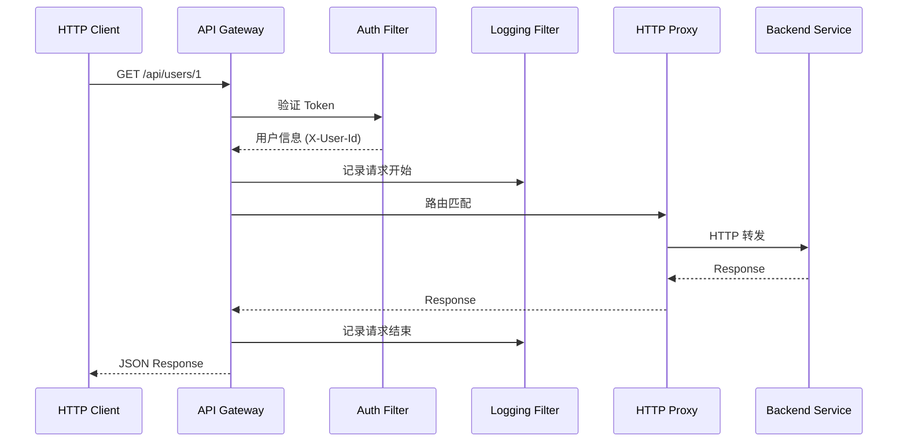

# Nebula Example - API Gateway

> Nebula Framework API 网关示例，演示 HTTP 反向代理、JWT 认证、限流功能

## 功能特性

- HTTP 反向代理 - 将请求转发到后端服务的 Controller
- JWT 认证 - 统一的用户身份验证
- 请求限流 - 基于 IP 的令牌桶限流
- 熔断降级 - 基于 Resilience4j 的熔断保护
- 请求日志 - 请求追踪与慢请求标记
- CORS 处理 - 跨域请求支持

## 架构设计

```
                      +------------------+
                      |   HTTP Client    |
                      |  (Browser/App)   |
                      +------------------+
                              |
                    GET/POST/PUT/DELETE
                              |
                    +------------------+
                    |   API Gateway    |
                    |   (端口: 8000)    |
                    +------------------+
                              |
         +-------------------+-------------------+
         |                   |                   |
    +---------+        +---------+        +---------+
    |  Auth   |        | Logging |        | Rate    |
    | Filter  |        | Filter  |        | Limiter |
    +---------+        +---------+        +---------+
         |                   |                   |
         +-------------------+-------------------+
                              |
                    +------------------+
                    | HTTP 反向代理     |
                    | (服务发现)        |
                    +------------------+
                              |
              +---------------+---------------+
              |                               |
         +--------+                      +--------+
         | User   |                      | Order  |
         | Service|                      | Service|
         | (8001) |                      | (8002) |
         +--------+                      +--------+
```

## 路由规则

| 路径 | 目标服务 | 说明 |
|------|----------|------|
| /api/users/** | user-service | 用户相关 API |
| /api/orders/** | order-service | 订单相关 API |

## 快速开始

### 前置条件

- JDK 21+
- Maven 3.8+
- Nacos 2.x（localhost:8848）
- Redis（localhost:6379，用于限流）
- user-service 和 order-service 已启动

### 启动步骤

```bash
# 1. 确保 Nacos 和 Redis 已启动

# 2. 启动 user-service（端口 8001）
cd nebula-example-microservice/user-service
java -jar target/user-service-1.0.0-SNAPSHOT.jar

# 3. 启动 order-service（端口 8002）
cd nebula-example-microservice/order-service
java -jar target/order-service-1.0.0-SNAPSHOT.jar

# 4. 编译网关
cd nebula-example-gateway
mvn clean package -DskipTests

# 5. 启动网关（端口 8000）
java -jar target/nebula-example-gateway-1.0.0-SNAPSHOT.jar
```

### 测试

```bash
# 1. 通过网关访问用户列表（白名单，无需认证）
curl http://localhost:8000/api/users

# 2. 通过网关访问订单列表（白名单，无需认证）
curl http://localhost:8000/api/orders

# 3. 需要认证的接口（返回 401）
curl http://localhost:8000/api/users/1

# 4. 带 Token 访问（需要有效的 JWT）
curl -H "Authorization: Bearer <your-jwt-token>" \
  http://localhost:8000/api/users/1
```

## 配置说明

### JWT 认证配置

```yaml
nebula:
  gateway:
    auth:
      jwt:
        enabled: true
        secret: your-secret-key-at-least-32-bytes
        header: Authorization
        prefix: "Bearer "
        whitelist:
          - /api/users/login
          - /api/users/register
          - /actuator/**
```

### 路由配置

```yaml
nebula:
  gateway:
    http:
      enabled: true
      use-discovery: true  # 从 Nacos 获取服务地址
      services:
        user-service:
          api-paths:
            - /api/users/**
        order-service:
          api-paths:
            - /api/orders/**
```

### 限流配置

```yaml
nebula:
  gateway:
    rate-limit:
      enabled: true
      strategy: ip              # 按 IP 限流
      replenish-rate: 100       # 每秒补充 100 个令牌
      burst-capacity: 200       # 桶容量 200
```

## 配置复杂度

| 配置项 | 行数 |
|--------|------|
| application.yml | ~100 行 |

## 请求处理流程



## 用户信息传递

认证成功后，网关会将用户信息注入请求头传递给后端服务：

| 请求头 | 说明 |
|--------|------|
| X-User-Id | 用户 ID |
| X-User-Name | 用户名 |

后端服务可以从请求头获取用户信息：

```java
@RestController
public class UserController {
    @GetMapping("/api/users/me")
    public UserDto getCurrentUser(
            @RequestHeader("X-User-Id") Long userId,
            @RequestHeader(value = "X-User-Name", required = false) String username) {
        return userService.getUserById(userId);
    }
}
```

## 相关文档

- [nebula-starter-gateway 文档](../../starter/nebula-starter-gateway/README.md)
- [nebula-example-microservice 文档](../nebula-example-microservice/README.md)

---

**版本**: 1.0.0-SNAPSHOT
