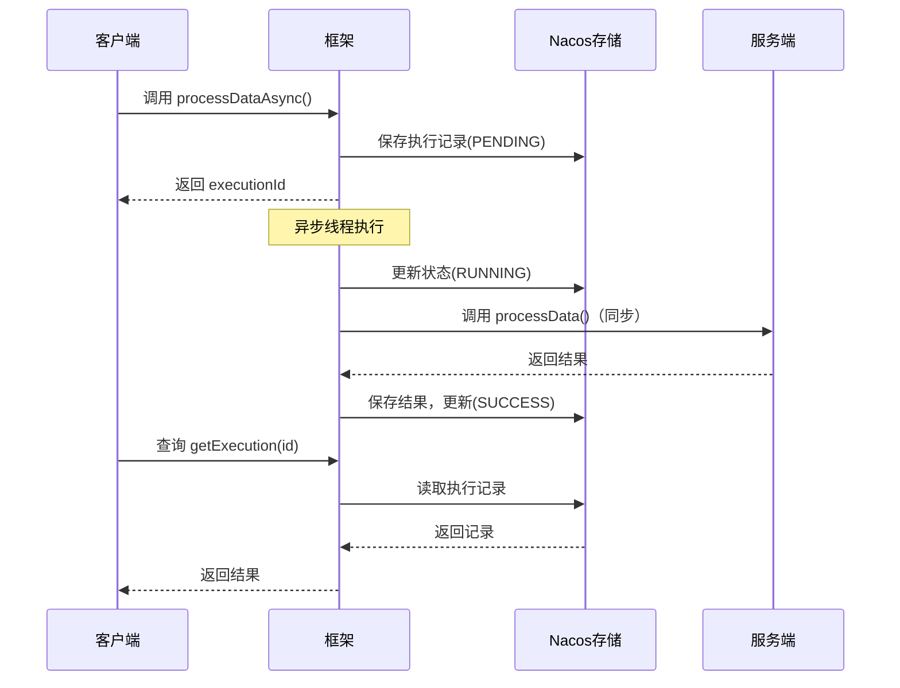

# Nebula RPC Async 示例项目

演示 Nebula 框架的异步 RPC 调用能力。

## 项目结构

```
nebula-rpc-async/
├── api/                    # 共享 API 定义模块
│   └── src/main/java/.../
│       ├── DataProcessService.java       # 服务端同步接口
│       ├── DataProcessRpcClient.java     # 客户端 RPC 接口（含异步方法）
│       └── dto/
│           ├── ProcessRequest.java       # 请求 DTO
│           ├── ProcessResult.java        # 响应 DTO
│           └── ProcessType.java          # 处理类型枚举
│
├── service/                # 服务提供方（端口 8081）
│   └── src/main/java/.../
│       ├── DataProcessServiceApplication.java
│       └── impl/
│           └── DataProcessServiceImpl.java
│
└── client/                 # 服务消费方（端口 8082）
    └── src/main/java/.../
        ├── AsyncRpcClientApplication.java
        ├── controller/
        │   └── TaskController.java       # REST API
        └── service/
            └── TaskService.java
```

## 核心概念

### 异步方法映射

框架支持自动将异步方法映射到同步方法：

```java
// 客户端接口
@RpcClient("data-process-service")
public interface DataProcessRpcClient extends DataProcessService {
    
    // 异步方法：processDataAsync -> 自动映射到 processData
    @AsyncRpc(timeout = 600)
    AsyncRpcResult<ProcessResult> processDataAsync(ProcessRequest request);
}

// 服务端只需实现同步方法
public interface DataProcessService {
    ProcessResult processData(ProcessRequest request);
}
```

### 执行流程



## 快速开始

### 1. 前置条件

确保以下服务已启动：
- Nacos：`localhost:8848`

### 2. 编译项目

```bash
# 在 nebula-example/nebula-rpc-async 目录下
cd api && mvn clean install
cd ../service && mvn clean package
cd ../client && mvn clean package
```

### 3. 启动服务

**启动服务端（端口 8081）：**

```bash
cd service
java -jar target/nebula-rpc-async-service-1.0.0-SNAPSHOT.jar
```

**启动客户端（端口 8082）：**

```bash
cd client
java -jar target/nebula-rpc-async-client-1.0.0-SNAPSHOT.jar
```

### 4. 测试接口

#### 快速测试

```bash
# 提交一个 5 秒延迟的异步任务
curl http://localhost:8082/api/tasks/test?delay=5&type=DATA_IMPORT
```

响应：
```json
{
    "executionId": "abc123def456...",
    "taskId": "test-1234567890",
    "status": "PENDING",
    "message": "任务已提交，正在后台处理",
    "queryUrl": "/api/tasks/status/abc123def456...",
    "resultUrl": "/api/tasks/result/abc123def456..."
}
```

#### 查询执行状态

```bash
curl http://localhost:8082/api/tasks/status/{executionId}
```

响应：
```json
{
    "executionId": "abc123def456...",
    "status": "SUCCESS",
    "interfaceName": "io.nebula.example.rpc.async.api.DataProcessRpcClient",
    "methodName": "processDataAsync",
    "createTime": "2025-01-20T10:00:00",
    "startTime": "2025-01-20T10:00:00",
    "finishTime": "2025-01-20T10:00:05"
}
```

#### 获取执行结果

```bash
curl http://localhost:8082/api/tasks/result/{executionId}
```

响应：
```json
{
    "taskId": "test-1234567890",
    "success": true,
    "message": "数据处理完成: 数据导入",
    "data": {
        "importedRecords": 5678,
        "skippedRecords": 23
    },
    "processTime": "2025-01-20T10:00:05",
    "durationMs": 5012,
    "processedCount": 5678
}
```

#### 提交自定义任务

```bash
curl -X POST http://localhost:8082/api/tasks/async \
  -H "Content-Type: application/json" \
  -d '{
    "taskId": "my-task-001",
    "dataSource": "mysql-prod",
    "type": "DATA_EXPORT",
    "delaySeconds": 10,
    "params": {
      "tableName": "users",
      "format": "csv"
    }
  }'
```

#### 批量提交任务

```bash
curl -X POST http://localhost:8082/api/tasks/batch \
  -H "Content-Type: application/json" \
  -d '{
    "requests": [
      {"taskId": "batch-1", "type": "DATA_IMPORT", "delaySeconds": 3},
      {"taskId": "batch-2", "type": "DATA_EXPORT", "delaySeconds": 2},
      {"taskId": "batch-3", "type": "BATCH_CALCULATION", "delaySeconds": 4}
    ]
  }'
```

#### 同步调用（对比测试）

```bash
curl -X POST http://localhost:8082/api/tasks/sync \
  -H "Content-Type: application/json" \
  -d '{
    "taskId": "sync-task",
    "type": "DATA_IMPORT",
    "delaySeconds": 3
  }'
```

## API 列表

| 方法 | 路径 | 说明 |
|------|------|------|
| POST | /api/tasks/async | 提交异步任务 |
| POST | /api/tasks/batch | 提交批量异步任务 |
| GET | /api/tasks/status/{id} | 查询执行状态 |
| GET | /api/tasks/result/{id} | 获取执行结果 |
| GET | /api/tasks/result/batch/{id} | 获取批量结果 |
| DELETE | /api/tasks/{id} | 取消执行 |
| POST | /api/tasks/sync | 同步调用 |
| GET | /api/tasks/test | 快速测试 |

## 执行状态说明

| 状态 | 说明 |
|------|------|
| PENDING | 已提交，等待执行 |
| RUNNING | 正在执行 |
| SUCCESS | 执行成功 |
| FAILED | 执行失败 |
| CANCELLED | 已取消 |
| TIMEOUT | 超时 |

## 配置说明

### 客户端配置

```yaml
nebula:
  rpc:
    async:
      enabled: true
      storage:
        type: nacos           # 存储类型：nacos/redis/database
      executor:
        core-pool-size: 10    # 核心线程数
        max-pool-size: 50     # 最大线程数
        queue-capacity: 200   # 队列容量
```

### 服务端配置

服务端无需特殊配置，只需实现同步接口即可。

## 注意事项

1. **Nacos 依赖**：异步存储默认使用 Nacos，需确保 Nacos 已启动
2. **超时设置**：`@AsyncRpc(timeout = 600)` 指定超时秒数
3. **方法命名**：异步方法名以 `Async` 结尾，框架自动映射到同步方法
4. **结果获取**：通过 `executionId` 轮询查询结果
5. **序列化**：结果以 JSON 格式存储在 Nacos 中

## 架构设计

详见框架文档：[nebula-rpc-async/README.md](../../nebula/infrastructure/rpc/nebula-rpc-async/README.md)
