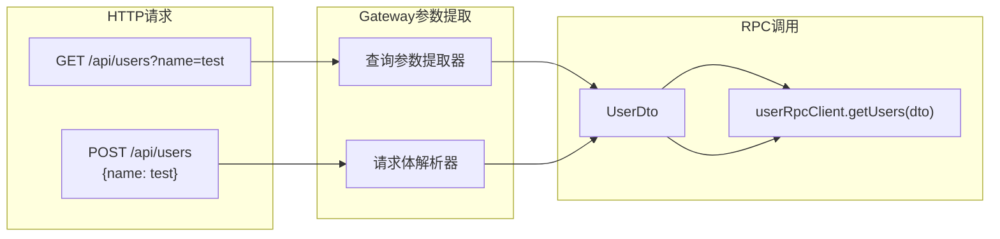
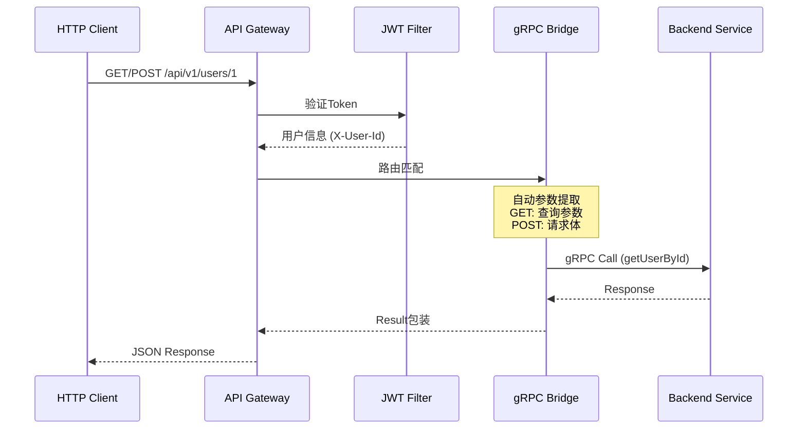

# Nebula Starter Gateway

API网关启动器，提供快速构建企业级API网关的能力。

## 功能特性

- **JWT认证过滤器** - 统一认证，白名单配置
- **请求日志过滤器** - RequestId追踪，耗时统计，慢请求标记
- **gRPC桥接过滤器** - HTTP到gRPC的协议转换
- **多HTTP方法支持** - 单一路由同时支持 GET/POST/PUT/DELETE/PATCH
- **智能参数提取** - 根据HTTP方法自动从不同来源提取参数
- **限流支持** - IP/用户/路径多种限流策略
- **熔断降级** - 基于Resilience4j的熔断保护

## 设计理念

### RPC 与 HTTP 方法解耦

Nebula Gateway 采用 **RPC 语义与 HTTP 语义分离** 的设计：

```
+------------------+     +------------------+     +------------------+
|   HTTP Client    | --> |   API Gateway    | --> |   RPC Service    |
|   (语义层)        |     |   (协议转换)      |     |   (方法层)        |
+------------------+     +------------------+     +------------------+
| GET /api/users/1 |     | 参数提取         |     | getUserById(1)   |
| POST /api/users  |     | 方法路由         |     | createUser(dto)  |
| PUT /api/users/1 |     | Header传递       |     | updateUser(dto)  |
+------------------+     +------------------+     +------------------+
```

**核心原则**：
- **RPC 服务** 只关心 "调用什么方法"，不关心 HTTP 语义
- **API Gateway** 负责 HTTP 语义处理和协议转换
- `@RpcCall` 注解默认 `method = "*"`，表示接受所有 HTTP 方法

## 快速开始

### 1. 添加依赖

```xml
<dependency>
    <groupId>io.nebula</groupId>
    <artifactId>nebula-starter-gateway</artifactId>
</dependency>
```

### 2. 配置文件

```yaml
server:
  port: 8080

spring:
  application:
    name: my-gateway
  cloud:
    gateway:
      routes:
        - id: user-service
          uri: lb://user-service
          predicates:
            - Path=/api/v1/users/**
          filters:
            - JwtAuth
            - Grpc

nebula:
  gateway:
    enabled: true
    jwt:
      enabled: true
      secret: your-jwt-secret-key-at-least-32-characters
      whitelist:
        - /api/v1/users/login
        - /api/v1/users/register
        - /api/v1/public/**
      claim-headers:
        - phone:X-User-Phone
        - role:X-User-Role
    logging:
      enabled: true
      slow-request-threshold: 3000
    rate-limit:
      enabled: true
      strategy: ip  # ip, user, path
```

### 3. 自动扫描模式（推荐）

启用自动扫描模式后，Gateway 会自动发现 `@RpcClient` 接口并注册路由，无需手动编写路由器：

```yaml
nebula:
  gateway:
    grpc:
      enabled: true
      auto-scan: true  # 启用自动扫描
      services:
        user-service:
          enabled: true
          address: "localhost:5001"
          api-packages:
            - "io.nebula.example.user.api"
        order-service:
          enabled: true
          address: "localhost:5002"
          api-packages:
            - "io.nebula.example.order.api"
```

**自动扫描的工作原理**：
1. 扫描配置的 `api-packages` 下的所有 `@RpcClient` 接口
2. 解析每个方法的 `@RpcCall` 注解
3. 自动注册路由，支持多 HTTP 方法

### 4. 多HTTP方法支持

当 `@RpcCall` 的 `method` 为 `"*"` 或 `"ANY"` 时，Gateway 会为该路由注册所有常用 HTTP 方法：

```java
@RpcClient
public interface UserRpcClient {
    
    // method 默认为 "*"，同时支持 GET/POST/PUT/DELETE/PATCH
    @RpcCall("/rpc/users/{id}")
    UserVo getUserById(@PathVariable("id") Long id);
    
    // 也可以指定特定方法
    @RpcCall(value = "/rpc/users", method = "POST")
    CreateUserDto.Response createUser(@RequestBody CreateUserDto.Request request);
}
```

**参数提取策略**：

| HTTP 方法 | 参数来源 | 说明 |
|-----------|----------|------|
| GET | 查询参数 + 路径变量 | `?name=xxx` -> DTO 字段 |
| DELETE | 查询参数 + 路径变量 | 同 GET |
| POST | 请求体 | JSON Body -> DTO |
| PUT | 请求体 | JSON Body -> DTO |
| PATCH | 请求体 | JSON Body -> DTO |



### 5. 手动路由器（可选）

如果需要自定义路由逻辑，可以实现 `AbstractGrpcServiceRouter`：

```java
@Component
@RequiredArgsConstructor
public class MyGrpcServiceRouter extends AbstractGrpcServiceRouter {
    
    private final UserRpcClient userRpcClient;
    private final OrderRpcClient orderRpcClient;
    
    public MyGrpcServiceRouter(ObjectMapper objectMapper,
                               UserRpcClient userRpcClient,
                               OrderRpcClient orderRpcClient) {
        super(objectMapper);
        this.userRpcClient = userRpcClient;
        this.orderRpcClient = orderRpcClient;
    }
    
    @Override
    protected void registerRoutes() {
        // 用户服务路由 - 支持多方法
        registerRoute("*", "/api/v1/users/{id}", "user", "getUserById",
            (body, exchange) -> {
                Long userId = extractPathVariableLong(exchange, "id");
                return userRpcClient.getUserById(userId);
            });
        
        // 订单服务路由 - 指定单一方法
        registerRoute("POST", "/api/v1/orders", "order", "createOrder",
            (body, exchange) -> orderRpcClient.createOrder(parseBody(body, CreateOrderDto.Request.class)));
    }
}
```

### 4. 配置gRPC客户端

```java
@Configuration
public class GrpcClientConfig {
    
    @Bean
    public UserRpcClient userRpcClient(GrpcClientProxyFactory proxyFactory) {
        return proxyFactory.createClient(UserRpcClient.class, "user-service", 9090);
    }
    
    @Bean
    public OrderRpcClient orderRpcClient(GrpcClientProxyFactory proxyFactory) {
        return proxyFactory.createClient(OrderRpcClient.class, "order-service", 9090);
    }
}
```

## 配置说明

### JWT配置

| 配置项 | 说明 | 默认值 |
|--------|------|--------|
| `nebula.gateway.jwt.enabled` | 是否启用JWT认证 | `true` |
| `nebula.gateway.jwt.secret` | JWT密钥（至少32字符） | - |
| `nebula.gateway.jwt.header` | JWT请求头名称 | `Authorization` |
| `nebula.gateway.jwt.prefix` | Token前缀 | `Bearer ` |
| `nebula.gateway.jwt.whitelist` | 白名单路径列表 | `[]` |
| `nebula.gateway.jwt.user-id-header` | 用户ID请求头 | `X-User-Id` |
| `nebula.gateway.jwt.claim-headers` | Claims映射到请求头 | `[]` |

### 日志配置

| 配置项 | 说明 | 默认值 |
|--------|------|--------|
| `nebula.gateway.logging.enabled` | 是否启用日志 | `true` |
| `nebula.gateway.logging.request-id-header` | RequestId请求头 | `X-Request-Id` |
| `nebula.gateway.logging.slow-request-threshold` | 慢请求阈值(ms) | `3000` |

### 限流配置

| 配置项 | 说明 | 默认值 |
|--------|------|--------|
| `nebula.gateway.rate-limit.enabled` | 是否启用限流 | `true` |
| `nebula.gateway.rate-limit.strategy` | 限流策略 | `ip` |

## 过滤器说明

### JwtAuth过滤器

在路由配置中使用：

```yaml
filters:
  - JwtAuth
```

功能：
- 验证JWT Token
- 将用户信息注入请求头
- 支持白名单配置

### Grpc过滤器

在路由配置中使用：

```yaml
filters:
  - Grpc
```

功能：
- HTTP请求转gRPC调用
- 自动路由匹配
- 统一响应格式包装

## 架构图

### 整体架构

```
                      +------------------+
                      |   HTTP Client    |
                      |  (Browser/App)   |
                      +------------------+
                              |
                    GET/POST/PUT/DELETE
                              |
                    +------------------+
                    |   API Gateway    |
                    +------------------+
                              |
         +-------------------+-------------------+
         |                   |                   |
    +---------+        +---------+        +---------+
    |  JWT    |        | Logging |        |  gRPC   |
    | Filter  |        | Filter  |        | Bridge  |
    +---------+        +---------+        +---------+
         |                   |                   |
         +-------------------+-------------------+
                              |
                    +------------------+
                    | 自动路由发现      |
                    | (AutoDiscovery)  |
                    +------------------+
                              |
              +---------------+---------------+
              |               |               |
         +--------+      +--------+      +--------+
         | User   |      | Order  |      | Other  |
         | Service|      | Service|      | Service|
         | (gRPC) |      | (gRPC) |      | (gRPC) |
         +--------+      +--------+      +--------+
```

### 请求处理流程



## 版本要求

- Java 21+
- Spring Boot 3.5+
- Spring Cloud 2025.0+

## 相关文档

- [Nebula框架文档](../../docs/README.md)
- [Spring Cloud Gateway文档](https://docs.spring.io/spring-cloud-gateway/docs/current/reference/html/)

