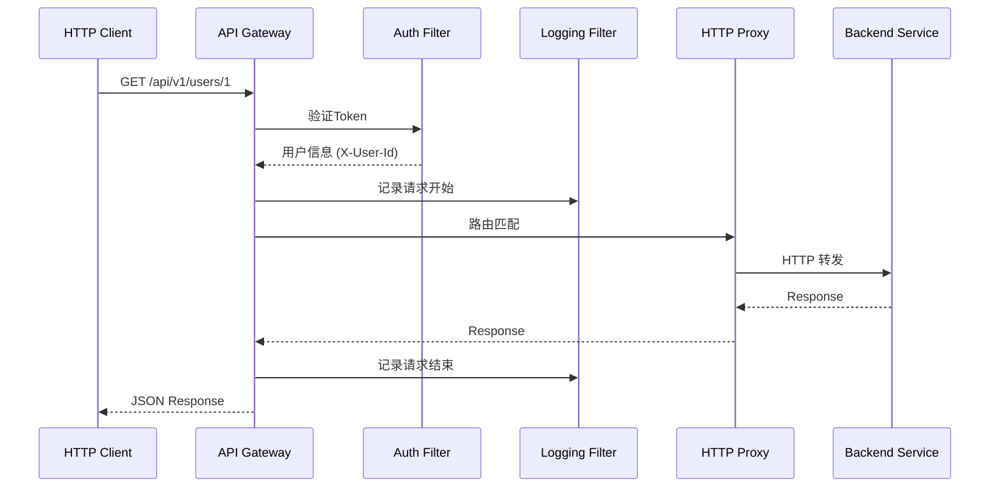

# Nebula Starter Gateway

API网关启动器，提供快速构建企业级API网关的能力。

## 功能特性

- **HTTP 反向代理** - 将请求转发到后端服务的 Controller
- **请求日志过滤器** - RequestId追踪，耗时统计，慢请求标记
- **限流支持** - IP/路径多种限流策略
- **熔断降级** - 基于Resilience4j的熔断保护
- **CORS 处理** - 跨域请求配置

## 设计理念

### 微服务三原则

```
+------------------+     +------------------+     +------------------+
|   HTTP Client    | --> |   API Gateway    | --> | Backend Service  |
|  (Browser/App)   |     | (HTTP反向代理)    |     |  (Controller)    |
+------------------+     +------------------+     +------------------+

1. 前端接口通过 Controller 暴露（HTTP 代理）
2. 服务间接口通过 RpcClient 暴露（纯 RPC，无 HTTP 路径）
3. 服务间直接调用（不经过 Gateway）
```

Gateway 职责简化为：
- HTTP 反向代理
- 认证（应用层实现）
- 限流/熔断
- 请求日志

## 快速开始

### 1. 添加依赖

```xml
<dependency>
    <groupId>io.nebula</groupId>
    <artifactId>nebula-starter-gateway</artifactId>
</dependency>
```

### 2. 配置文件

```yaml
server:
  port: 8080

spring:
  application:
    name: my-gateway

nebula:
  gateway:
    enabled: true
    
    # 日志配置
    logging:
      enabled: true
      slow-request-threshold: 3000
    
    # 限流配置
    rate-limit:
      enabled: true
      strategy: ip
      replenish-rate: 100
      burst-capacity: 200
    
    # HTTP 代理配置
    http:
      enabled: true
      use-discovery: true
      services:
        user-service:
          api-paths:
            - /api/v1/users/**
        order-service:
          api-paths:
            - /api/v1/orders/**
    
    # CORS 配置
    cors:
      enabled: true
      allowed-origins:
        - "*"
```

### 3. 启动类

```java
@SpringBootApplication
public class GatewayApplication {
    public static void main(String[] args) {
        SpringApplication.run(GatewayApplication.class, args);
    }
}
```

### 4. 自定义认证（应用层实现）

```java
@Component
@RequiredArgsConstructor
public class JwtAuthFilter implements GlobalFilter, Ordered {
    
    private final JwtProperties jwtProperties;
    
    @Override
    public Mono<Void> filter(ServerWebExchange exchange, GatewayFilterChain chain) {
        // 1. 检查白名单
        if (isWhitelisted(exchange.getRequest().getPath().value())) {
            return chain.filter(exchange);
        }
        
        // 2. 验证 Token
        String token = extractToken(exchange.getRequest());
        if (token == null) {
            return unauthorized(exchange);
        }
        
        // 3. 解析用户信息并注入请求头
        Claims claims = validateToken(token);
        ServerHttpRequest request = exchange.getRequest().mutate()
                .header("X-User-Id", claims.getSubject())
                .build();
        
        return chain.filter(exchange.mutate().request(request).build());
    }
    
    @Override
    public int getOrder() {
        return -100;  // 最先执行
    }
}
```

## 配置说明

### 日志配置

| 配置项 | 说明 | 默认值 |
|--------|------|--------|
| `nebula.gateway.logging.enabled` | 是否启用日志 | `true` |
| `nebula.gateway.logging.request-id-header` | RequestId请求头 | `X-Request-Id` |
| `nebula.gateway.logging.slow-request-threshold` | 慢请求阈值(ms) | `3000` |

### 限流配置

| 配置项 | 说明 | 默认值 |
|--------|------|--------|
| `nebula.gateway.rate-limit.enabled` | 是否启用限流 | `true` |
| `nebula.gateway.rate-limit.strategy` | 限流策略 (ip/path) | `ip` |
| `nebula.gateway.rate-limit.replenish-rate` | 每秒补充令牌数 | `100` |
| `nebula.gateway.rate-limit.burst-capacity` | 桶容量 | `200` |

### HTTP 代理配置

| 配置项 | 说明 | 默认值 |
|--------|------|--------|
| `nebula.gateway.http.enabled` | 是否启用HTTP代理 | `true` |
| `nebula.gateway.http.use-discovery` | 是否使用服务发现 | `true` |
| `nebula.gateway.http.services.<name>.api-paths` | 服务的API路径列表 | `[]` |
| `nebula.gateway.http.services.<name>.address` | 静态服务地址 | - |

### CORS 配置

| 配置项 | 说明 | 默认值 |
|--------|------|--------|
| `nebula.gateway.cors.enabled` | 是否启用CORS | `true` |
| `nebula.gateway.cors.allowed-origins` | 允许的来源 | `["*"]` |
| `nebula.gateway.cors.allowed-methods` | 允许的方法 | `[GET,POST,PUT,DELETE,OPTIONS]` |

## 架构图

```
                      +------------------+
                      |   HTTP Client    |
                      |  (Browser/App)   |
                      +------------------+
                              |
                    GET/POST/PUT/DELETE
                              |
                    +------------------+
                    |   API Gateway    |
                    +------------------+
                              |
         +-------------------+-------------------+
         |                   |                   |
    +---------+        +---------+        +---------+
    |  Auth   |        | Logging |        | Rate    |
    | Filter  |        | Filter  |        | Limiter |
    +---------+        +---------+        +---------+
         |                   |                   |
         +-------------------+-------------------+
                              |
                    +------------------+
                    | HTTP 反向代理     |
                    | (服务发现)        |
                    +------------------+
                              |
              +---------------+---------------+
              |               |               |
         +--------+      +--------+      +--------+
         | User   |      | Order  |      | Other  |
         | Service|      | Service|      | Service|
         | (HTTP) |      | (HTTP) |      | (HTTP) |
         +--------+      +--------+      +--------+
```

## 请求处理流程



## 版本要求

- Java 21+
- Spring Boot 3.5+
- Spring Cloud 2025.0+

## 依赖说明

| 依赖 | 说明 | 可选 |
|------|------|------|
| nebula-gateway-core | 网关核心 | 必需 |
| nebula-autoconfigure | 自动配置 | 必需 |
| spring-cloud-starter-gateway | Gateway核心 | 必需 |
| spring-cloud-starter-circuitbreaker-reactor-resilience4j | 熔断 | 必需 |
| spring-boot-starter-data-redis-reactive | 限流 | 可选 |
| nebula-discovery-nacos | 服务发现 | 可选 |

## 相关文档

- [Nebula框架文档](../../docs/README.md)
- [Spring Cloud Gateway文档](https://docs.spring.io/spring-cloud-gateway/docs/current/reference/html/)
