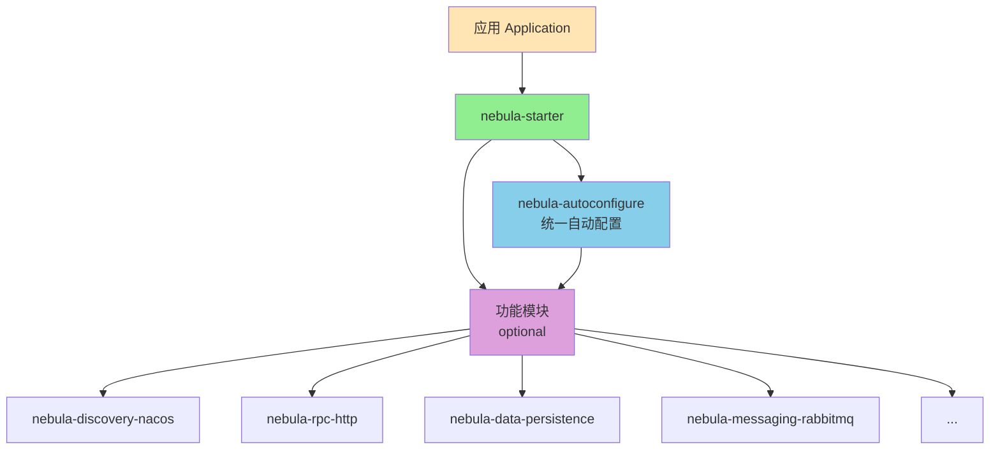

# Nebula Starter

##  模块简介

`nebula-starter` 是 Nebula 框架的便捷启动器模块，提供"一站式"依赖管理，简化应用的依赖配置

##  核心价值

### 简化依赖管理
- **一键引入**：应用只需引入 `nebula-starter` 一个依赖即可获得所有 Nebula 功能
- **自动配置**：自动依赖 `nebula-autoconfigure` 模块，获得完整的自动配置能力
- **按需加载**：所有功能模块都标记为 `optional`，根据实际需求自动激活

### 架构清晰
- **职责明确**：专注于依赖管理，不包含任何自动配置逻辑
- **依赖传递**：合理利用 Maven 依赖传递机制，简化应用配置
- **版本统一**：确保所有模块版本一致，避免版本冲突

## ️ 架构说明

### 与 nebula-autoconfigure 的关系



### 模块职责

| 模块 | 职责 | 包含内容 |
|------|------|----------|
| **nebula-autoconfigure** | 统一自动配置管理 | 所有自动配置类条件注解初始化顺序 |
| **nebula-starter** | 便捷依赖管理 | 依赖声明版本管理（不包含配置代码） |
| **功能模块** | 核心功能实现 | 业务逻辑Properties 类Service 类 |

##  快速开始

### 方式一：使用 nebula-starter（推荐）

适合需要完整功能的应用

**1. 添加依赖**

```xml
<dependency>
    <groupId>io.nebula</groupId>
    <artifactId>nebula-starter</artifactId>
    <version>2.0.1-SNAPSHOT</version>
</dependency>
```

**2. 配置应用**

```yaml
spring:
  application:
    name: my-nebula-app

nebula:
  # 启用需要的功能
  discovery:
    nacos:
      enabled: true
      server-addr: localhost:8848
  
  rpc:
    http:
      enabled: true
  
  data:
    persistence:
      enabled: true
```

### 方式二：使用 nebula-autoconfigure

适合需要精确控制依赖的应用

**1. 添加依赖**

```xml
<!-- 统一自动配置 -->
<dependency>
    <groupId>io.nebula</groupId>
    <artifactId>nebula-autoconfigure</artifactId>
    <version>2.0.1-SNAPSHOT</version>
</dependency>

<!-- 按需添加功能模块 -->
<dependency>
    <groupId>io.nebula</groupId>
    <artifactId>nebula-discovery-nacos</artifactId>
    <version>2.0.1-SNAPSHOT</version>
</dependency>

<dependency>
    <groupId>io.nebula</groupId>
    <artifactId>nebula-rpc-http</artifactId>
    <version>2.0.1-SNAPSHOT</version>
</dependency>
```

**2. 配置与方式一相同**

##  包含的模块

nebula-starter 依赖以下模块（所有功能模块均为 optional）：

### 核心模块
- `nebula-foundation` - 核心基础组件
- `nebula-autoconfigure` - 统一自动配置

### 数据访问模块
- `nebula-data-persistence` - 数据持久化（MyBatis-Plus）
- `nebula-data-cache` - 缓存管理

### 消息传递模块
- `nebula-messaging-core` - 消息抽象
- `nebula-messaging-rabbitmq` - RabbitMQ 实现

### RPC 模块
- `nebula-rpc-core` - RPC 抽象
- `nebula-rpc-http` - HTTP RPC 实现

### 服务发现模块
- `nebula-discovery-core` - 服务发现抽象
- `nebula-discovery-nacos` - Nacos 实现

### 存储模块
- `nebula-storage-core` - 存储抽象
- `nebula-storage-minio` - MinIO 实现
- `nebula-storage-aliyun-oss` - 阿里云 OSS 实现

### 搜索模块
- `nebula-search-core` - 搜索抽象
- `nebula-search-elasticsearch` - Elasticsearch 实现

### 集成模块
- `nebula-integration-payment` - 支付集成

### AI 模块
- `nebula-ai-core` - AI 抽象
- `nebula-ai-spring` - Spring AI 实现

### 应用层模块
- `nebula-web` - Web 应用支持
- `nebula-task` - 任务调度支持

##  迁移指南

### 从 2.0.0 迁移到 2.0.1+

在 2.0.1 版本中，我们进行了自动配置架构的重大优化：

**变化：**
1. 创建了统一的 `nebula-autoconfigure` 模块
2. `nebula-starter` 不再包含自动配置代码
3. 所有自动配置类集中在 `nebula-autoconfigure` 中管理

**迁移步骤：**

1. **如果使用 nebula-starter**：无需任何改动，保持原有依赖即可

2. **如果直接依赖功能模块**：建议改为依赖 `nebula-autoconfigure` + 功能模块

   ```xml
   <!-- 添加 -->
   <dependency>
       <groupId>io.nebula</groupId>
       <artifactId>nebula-autoconfigure</artifactId>
       <version>2.0.1-SNAPSHOT</version>
   </dependency>
   ```

3. **配置文件**：无需改动，所有配置项保持兼容

##  使用建议

### 何时使用 nebula-starter？

 **推荐使用的场景：**
- 新建项目，希望快速开始
- 需要使用多个 Nebula 功能模块
- 不想手动管理各个模块的依赖关系
- 希望获得完整的 Nebula 功能集

### 何时使用 nebula-autoconfigure？

 **推荐使用的场景：**
- 只需要部分 Nebula 功能
- 需要精确控制依赖的版本和范围
- 应用对依赖大小有严格要求
- 需要自定义模块组合

##  常见问题

### Q1: nebula-starter 和 nebula-autoconfigure 有什么区别？

**A**: 
- `nebula-autoconfigure`：核心模块，包含所有自动配置类，负责功能的自动装配
- `nebula-starter`：便捷启动器，依赖 `nebula-autoconfigure` 和所有功能模块，简化依赖管理

简单来说：`nebula-starter` = `nebula-autoconfigure` + 所有功能模块的依赖声明

### Q2: 使用 nebula-starter 会不会引入不需要的依赖？

**A**: 不会所有功能模块都标记为 `optional`，只有在你的配置中启用（`enabled: true`）且 classpath 中存在相关依赖时才会激活

### Q3: 可以混合使用 nebula-starter 和直接依赖功能模块吗？

**A**: 可以，但不推荐建议选择一种方式：
- 要么全部使用 `nebula-starter`
- 要么使用 `nebula-autoconfigure` + 按需引入功能模块

### Q4: nebula-starter 是否包含 Spring Boot Starter？

**A**: 是的，nebula-starter 已经依赖了必要的 Spring Boot Starter，你不需要额外添加

##  相关文档

- [Nebula AutoConfiguration 模块说明](../../autoconfigure/nebula-autoconfigure/README.md)
- [Nebula 框架使用指南](../../docs/Nebula框架使用指南.md)
- [迁移计划文档](../../autoconfigure/nebula-autoconfigure/MIGRATION_PLAN.md)
- [实施状态文档](../../autoconfigure/nebula-autoconfigure/IMPLEMENTATION_STATUS.md)

##  许可证

本项目基于 Apache 2.0 许可证开源

---

**版本**: 2.0.1-SNAPSHOT  
**最后更新**: 2025-10-11

